# YZM2021

## Principles of Software Engineering

### Week 1: Introduction to Software Engineering

**Instructor:** Ekrem Çetinkaya
**Date:** 30.09.2025

---

# Course Overview

<div class="two-columns">
<div class="column">

## What Will We Learn?

- **Software Engineering Principles** and best practices
- **Software Development Process** models 
- **Requirements Engineering** and specification
- **Software Design** and architecture patterns
- **Testing and Quality Assurance** methodologies
- **Project Management** in software development
- **Version Control** and collaboration tools
- **Software Ethics** and professional responsibilities
- **Modern Development Practices** (DevOps, CI/CD)
</div>

<div class="column">

## Textbook

**Ian Sommerville, Software Engineering (10th Edition)**

## Course Project

**Find an idea, prepare documentation, build and deploy**
- 5 deliverables throughout semester
- Technology stack of your choice
- Topic of your choice
- Team Work 

</div>
</div>

---

# Course Policies

## Lecture Format

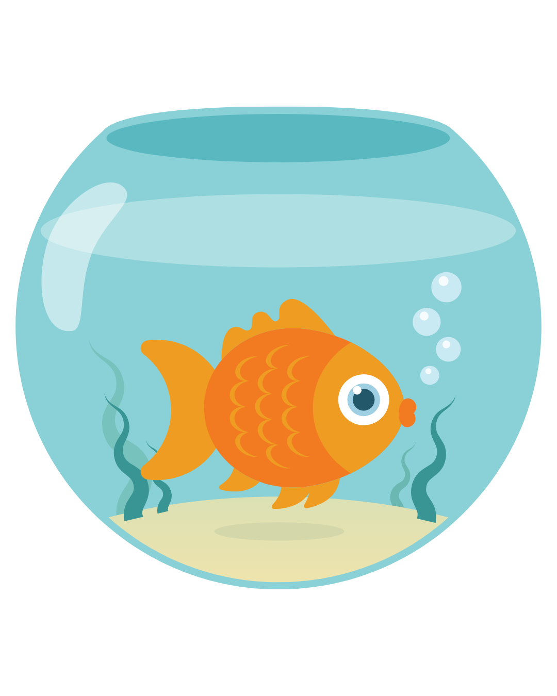

**🍅 Pomodoro Lectures**:

- 20-minute sessions followed by 5-minute breaks
- During breaks: stretch, chat, check phones, or step out - completely **your choice**
- **Why?** We all have attention span of a goldfish

## Attendance Philosophy

**No attendance tracking** - You're adults making your own educational choices

- Feel free to leave if the class isn't serving you that day
- No explanations needed, no penalties
- Your presence should be **by choice, not obligation**

---

# Grading


## Assessment

- **Project**: 40%
- **Midterm**: 25%
- **Final Exam**: 35%

## Assessment Approach

**All exams are open-book**:

- ✅ Internet access allowed
- ✅ LLM tools (ChatGPT, Claude, etc.) permitted
- ✅ Course materials and notes encouraged
- **Focus**: Problem-solving ability, not memorization

---

<!-- _footer: "" -->
<!-- _header: "" -->
<!-- _paginate: false -->

<style scoped>
p { text-align: center}
h1 {text-align: center; font-size: 96px}
</style>

# 🧠 What is Software ?

---

# What is Software?

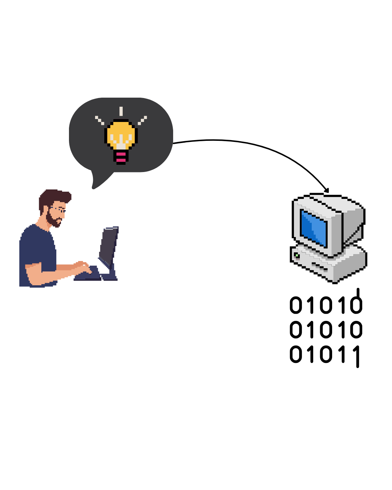

* Translation of your thoughts for the machine to execute
* Abstract and intangible
* Not constrained by the properties of materials, governed by physical laws, or by manufacturing processes
* Imagination is the limit (sort of)
* Deterministic

---

<!-- _footer: "" -->
<!-- _header: "" -->
<!-- _paginate: false -->

<style scoped>
p { text-align: center}
h1 {text-align: center; font-size: 72px}
</style>

# 🧠 What is Software Engineering ?

---

# What is Software Engineering?

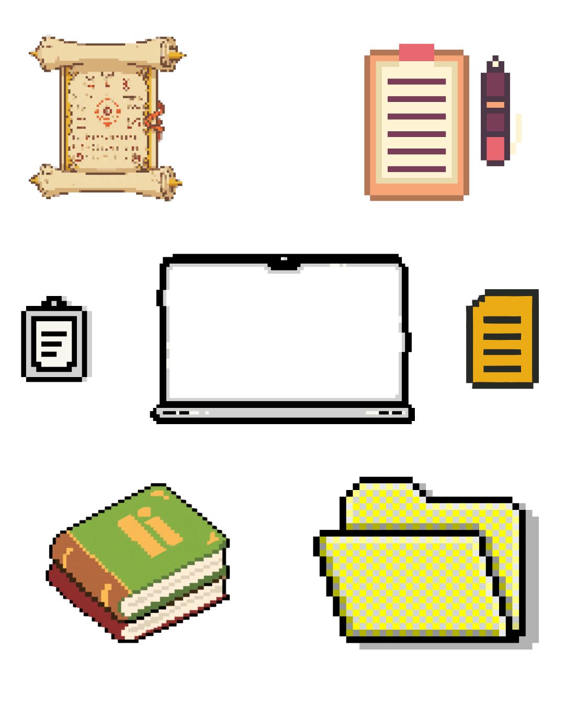

> "Software engineering is an engineering discipline that is concerned with all aspects of software production from the early stages of system specification through to maintaining the system after it has gone into use."
>
> — Ian Sommerville

---

# Software vs. Software Engineering

<!-- TODO VISUAL: Split comparison (product vs process) OR iceberg (tip vs foundation) OR house (home vs architecture/blueprints) -->

<div class="two-columns">
<div class="column">

### Software
- The tool
- Delivers features to users
- Measured by correctness and usability
- Snapshot at a point in time

</div>
<div class="column">

### Software Engineering
- The way of building and maintaining
- Requirements → Design → Implementation → Validation
- Measured by quality, maintainability, cost, risk
- Collaboration, standards, reviews, automation

</div>
</div>

**Software is the product; Software Engineering is how we build and maintain it**

---

<style scoped>
p { text-align: center}
h2 {text-align: center}
</style>

## Software 

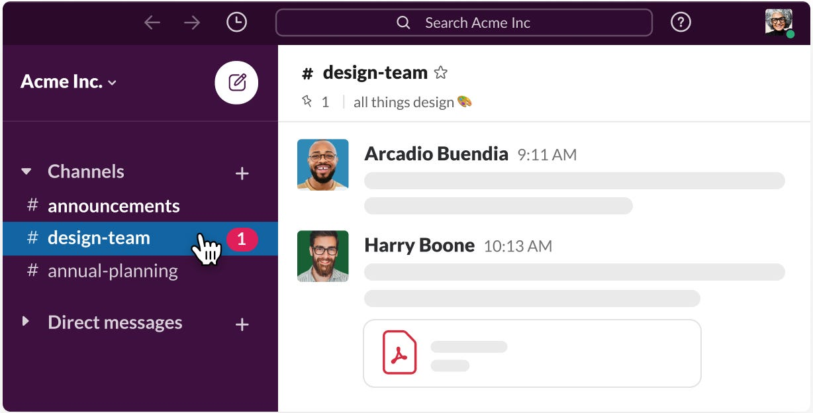

---

<!-- _footer: "Slack notification workflow diagram - [https://slack.engineering/reducing-slacks-memory-footprint/](https://slack.engineering/reducing-slacks-memory-footprint/)" -->

<style scoped>
p { text-align: center}
h2 {text-align: center}
</style>

## Software Engineering

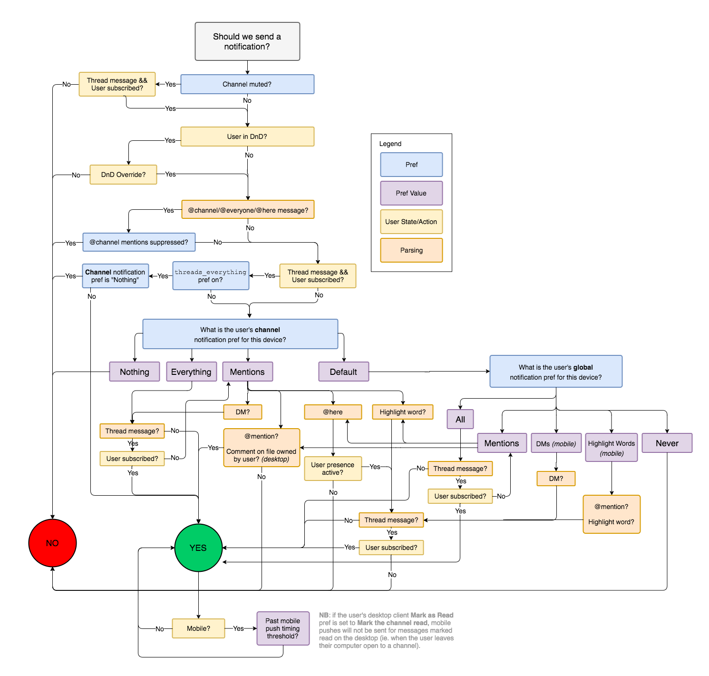

---

# Types of Software
<div class="two-columns">
<div class="column">

## System Software
- Operating systems, compilers, drivers
- Support other software programs

## Application Software
- Word processors, games, business applications
- Solve specific user problems

## Engineering/Scientific Software
- CAD systems, simulation software
- Process large amounts of numerical data

</div>
<div class="column">

## Embedded Software
- Software within hardware systems
- Automotive, medical devices, IoT

## Web Applications
- Browser-based applications
- E-commerce, social media, cloud services

## Mobile Applications
- Smartphone and tablet apps
- Native, hybrid, and web-based apps

</div>
</div>

---

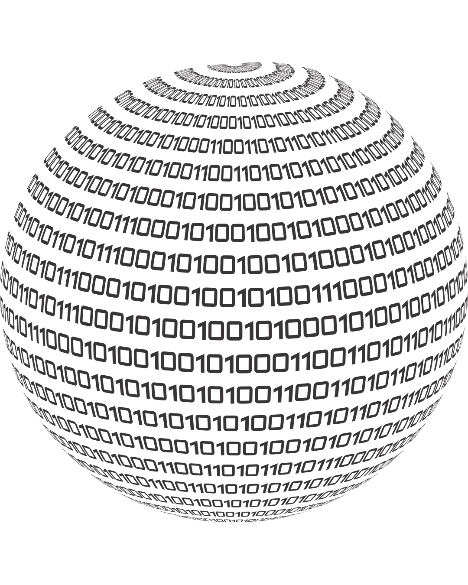

# We Can't Run the Modern World Without Software

### Critical Infrastructure
- **National utilities** and power grids
- **Financial systems** and banking
- **Transportation** and logistics
- **Healthcare** and medical devices

### Entertainment & Communication
- **Internet** and telecommunications
- **Music, games, film** industry
- **Social media** platforms
- **Mobile applications**
- **This lecture**

---

# Software Engineering Challenge

How to put the box around a non-existent thing? 

- No physical constraints
- Unlimited potential complexity
- Difficult to understand and change
- Expensive to modify

### Different Systems, Different Approaches
- **Embedded systems** vs **Information systems**
- **Scientific instruments** vs **Computer games**
- **Each requires different techniques**

</div>
</div>

---

# Software Engineering Challenges

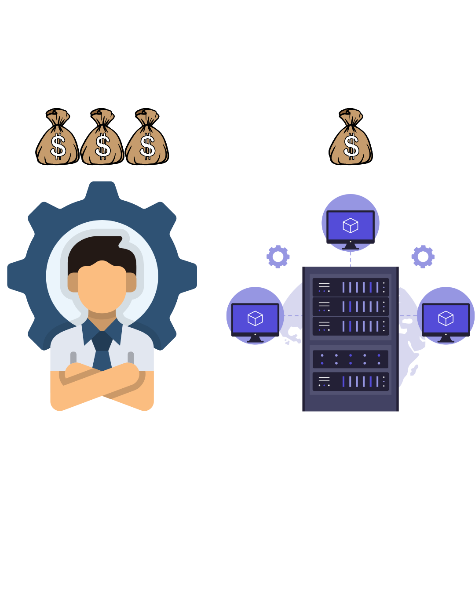

- **Fast delivery** requirements
- **Large and complex** systems
- **Fast changing capabilities**
- **No fits-to-all method**
- **Large and international teams**
- **Eeverybody brings their own decisions**
- **Developer time is more expensive than computing time**

---

<style scoped>
p { text-align: center}
h2 {text-align: center}
</style>

## User Expectations

Your software won't be used as you designed


---

<style scoped>
p { text-align: center}
h2 {text-align: center}
</style>

## Developer Expectations

Your feature won't be understood as you described

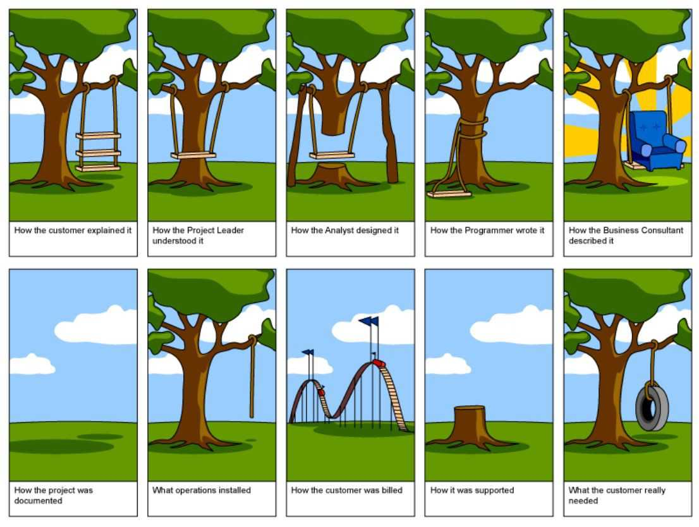

---

<!-- _footer: "" -->
<!-- _header: "" -->
<!-- _paginate: false -->

<style scoped>
p { text-align: center}
h1 {text-align: center; font-size: 72px}
</style>

# 🧑‍🎨 How to handle the human factor?

<!-- Class activity, pick a student, make them draw bounding boxes -->

---

# Why Do We Need Software Engineering Principles?

## Scenario 1: Working Alone

```python
# Personal project, quick and gets the job done
def calculate_grade(score):
    if score > 90: return "A"
    elif score > 80: return "B"
    # ... works for you, but what about others?
```
**What happens when...**
- Code grows to 10,000+ lines?
- You come back to it after 6 months?
- Someone else needs to understand it?

---

## Scenario 2: Working in a Team

<div class="two-columns">
<div class="column">

**Without Principles:**
- Everyone codes differently
- No shared understanding
- Integration nightmares
- "It works on my machine!"

</div>
<div class="column">

**With Principles:**
- Consistent coding standards
- Clear requirements
- Systematic processes
- Reliable, maintainable code

</div>
</div>

---

<!-- _footer: "" -->
<!-- _header: "" -->
<!-- _paginate: false -->

<style scoped>
p { text-align: center}
h2 {text-align: center}
</style>

## How much standardization we need?

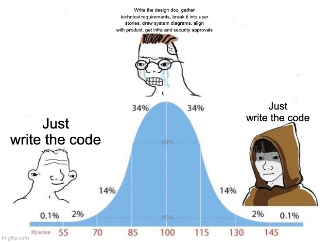

---

<!-- _footer: "" -->
<!-- _header: "" -->
<!-- _paginate: false -->

<style scoped>
p { text-align: center}
h2 {text-align: center}
</style>

## How much standardization we need?

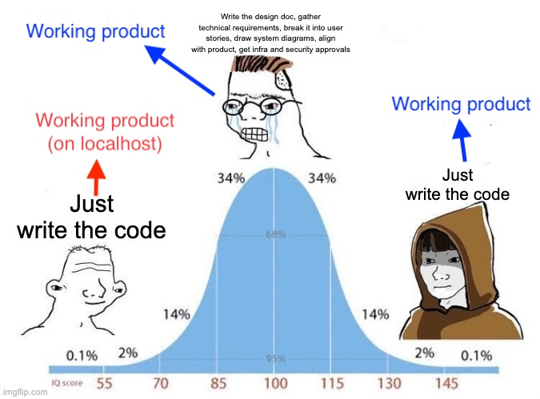

---

# Is there a definite solution?

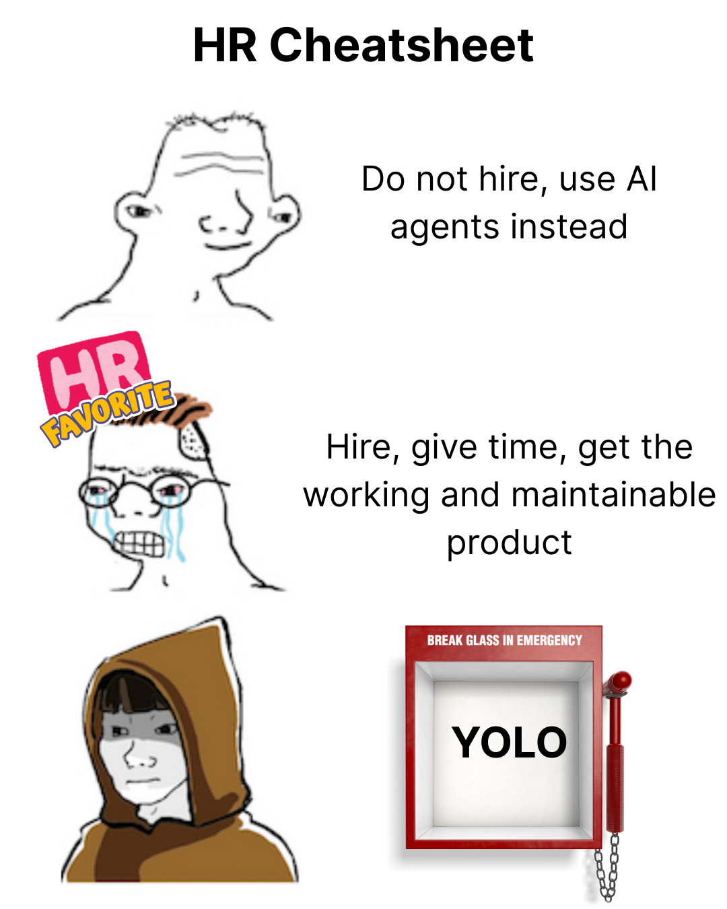

- What happens to the code when the developer leaves?
- What happens when the **product owner** wants a change?
- Can we handle future feature requests in timely manner?
- Do we start fast and worry about it later, or worry about it now and code it later?
- Is that what the **user** wants?
- Is that what the **product owner** wants?
- Is that technically feasible?
- Does the business focus on **CAPEX** or **OPEX** ?
- How do we ensure consistent progress?

> Every single project is _unique_, the key is **to undrestand and to adapt**

---

# Small Project vs. Large Project

<div class="two-columns">
<div class="column">

## Small Project (5 developers, 3 months)

- Direct communication within the team
- Change requirements anytime
- Short life-span, code can be replaced
- Rely on existing SDKs
- Simple architecture
- Manual testing

</div>
<div class="column">

## Enterprise Project (50 developers, 2 years)

- Multiple stakeholders, complex communication
- Changing requirements = major cost
- Long life-span, the software must be future-proof
- Abstraction everywhere
- Complex architecture with many integrations
- Systematic testing, quality assurance

</div>
</div>

<style scoped>
p { text-align: center}
h2 {text-align: center}
</style>

## 📜 Principles become critical as complexity grows!

---

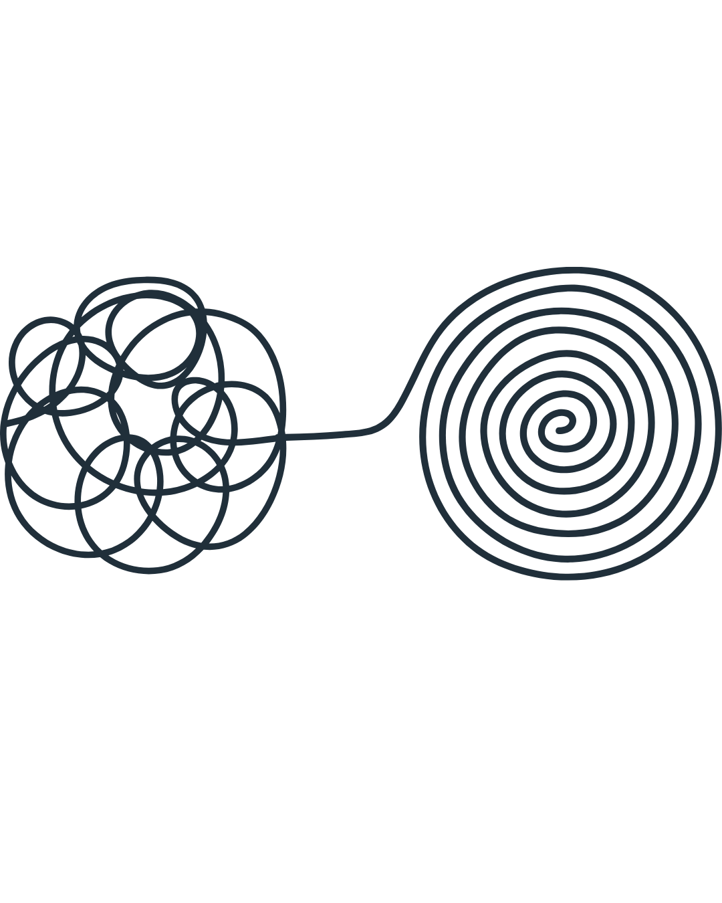

# Why Software Engineering Matters

## The Software Crisis

- Projects over budget and behind schedule
- Software that doesn't meet requirements
- Difficult to maintain and modify
- Poor quality and reliability
- Not understanding the requirements of the user

## Software Engineering Solutions

- **Structured processes** and methodologies
- **Quality assurance** and testing
- **Project management** and planning
- **Documentation** and communication

---

# How Do We Make Decisions in Software Engineering?

### Every Decision Involves Trade-offs

<div class="two-columns">
<div class="column">

#### Speed
- **Fast Development**
- **High Performance**
- **Quick Deployment**

#### Security
- **Data Protection**
- **Access Control**
- **Vulnerability Prevention**

</div>
<div class="column">

#### Availability
- **Uptime Reliability**
- **Scalability**
- **Fault Tolerance**

### The Reality
**You can't optimize for all three simultaneously**

- More security = slower development
- Higher availability = more complexity
- Faster development = potential quality compromises

</div>
</div>

---

# It's 99% about the money


- Computing is cheap now (except GPUs)
- Each documentation costs developer time
- Each feature costs developer time
- Each optimization costs developer time
- That one last refactor will not boost sales
- Time is money

---

<!-- _footer: "" -->
<!-- _header: "" -->
<!-- _paginate: false -->

<style scoped>
p { text-align: center}
h1 {text-align: center; font-size: 56px}
</style>

# What could go wrong, it's just software?

---


# Real-World Example: The $125 Million Bug

<div class="two-columns">
<div class="column">

## NASA Mars Climate Orbiter (1999)

- **The Problem:** Unit conversion error
- **Root Cause:** One team used metric, another used imperial
- **No Requirements Verification:** Nobody checked the units
- **Result:** $125 million spacecraft lost¹

</div>
<div class="column">

## What Could Have Prevented This?

- **Clear Requirements Specification**
- **Interface Documentation**
- **Systematic Testing**
- **Code Reviews**

</div>
</div>

<!-- _footer: "NASA Safety Alert: [Mars Climate Orbiter Mishap Investigation](https://sma.nasa.gov/docs/default-source/safety-messages/safetymessage-2009-08-01-themarsclimateorbitermishap.pdf?sfvrsn=eaa1ef8_4)" -->

---

# Another Example: Therac-25

<!-- VISUAL: Medical equipment photo (radiation therapy machine) -->
<!-- OR: Timeline infographic showing the incidents -->
<!-- OR: Cause-and-effect fishbone diagram -->

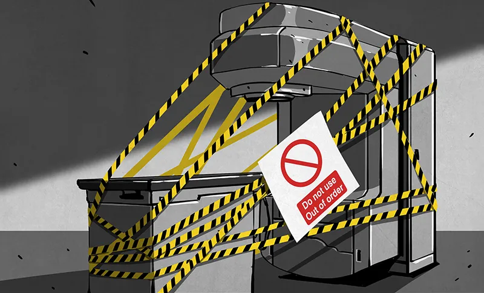


- Medical linear accelerator (1985-1987)
- Used for cancer treatment
- Software-controlled radiation therapy

## What Went Wrong

- Race conditions in software
- Poor user interface design
- Inadequate testing
- No independent safety systems

## Consequences

- 6 patients received massive overdoses
- 3 deaths, others seriously injured

<!-- _footer: "Therac-25 Accidents: We Keep on Learning From Them - [https://www.computer.org/csdl/magazine/co/2024/12/10754612/21TGZa5l79e](https://www.computer.org/csdl/magazine/co/2024/12/10754612/21TGZa5l79e)" -->

---

# Lessons from NASA Orbitter and Therac-25

## Software Engineering Principles Violated

1. **Insufficient Testing**

   - No systematic testing of software
   - Previous hardware interlocks removed

2. **Poor Software Engineering Practices**

   - No formal requirements specification
   - Inadequate documentation

3. **Overconfidence in Software**
   - Removed hardware safety systems
   - Assumed software was reliable

---


# Software Engineering Fundamentals

<div class="two-columns">
<div class="column">

## 1. Abstraction
- Hide unnecessary complexity
- Focus on essential features
- Multiple levels of abstraction

## 2. Modularity
- Divide system into manageable parts
- Each module has specific responsibility
- Promotes reusability and maintainability

</div>
<div class="column">

## 3. Encapsulation
- Hide internal implementation details
- Provide well-defined interfaces
- Reduce coupling between components

## 4. Hierarchy
- Organize system in layers
- Higher levels use services of lower levels
- Examples: OSI model, software architecture layers

</div>
</div>

---

# The Abstraction Ladder

## From Hardware to High-Level Code

<div class="two-columns">
<div class="column">

### Hardware Level
- **Transistors** (0s and 1s)
- **Logic Gates** (AND, OR, NOT)
- **CPU Instructions** (MOV, ADD, JMP)

### Low-Level Software
- **Assembly Language** (MOV AX, BX)
- **Machine Code** (10101010...)
- **Operating System** (System calls)

</div>
<div class="column">

### High-Level Software
- **C/C++** (Pointers, memory management)
- **Python/Java** (Objects, garbage collection)
- **Frameworks** (React, Django, Spring)
- **Applications** (User interfaces, business logic)

## The Power of Abstraction
Each layer hides complexity from the layer above, allowing us to build increasingly sophisticated systems.

</div>
</div>

---

# Software Engineering Activities

<div class="two-columns">
<div class="column">

## 1. Software Specification
- Define what the system should do
- Requirements gathering and analysis
- System and software requirements

## 2. Software Design and Implementation
- Define system organization
- Implement system as executable programs
- Programming and software construction

</div>
<div class="column">

## 3. Software Validation
- Check system meets requirements
- Verification and validation (V&V)
- Testing at all levels

## 4. Software Update
- Modify system to meet changing needs
- Maintenance and enhancement
- Software continues to change throughout its lifetime

</div>
</div>

---

# Software Process Models

## What is a Software Process?

- Set of activities and results in software production
- Four fundamental activities:
  1. **Specification** - what
  2. **Development** - how
  3. **Validation** - correct
  4. **Update** - change

## Process Models

- Abstract representations of software processes
- Different models for different types of software

---

# Key Software Process Models

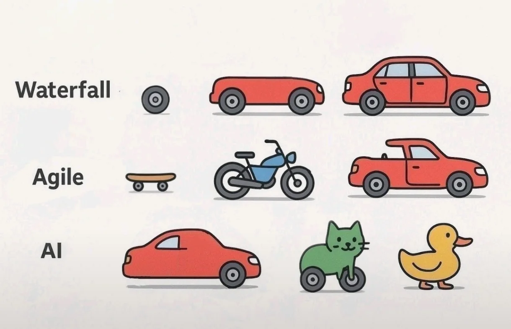

## Waterfall Model

- Sequential phases
- Each phase must be completed before next begins

## Agile Methods

- Iterative and incremental
- Start small and scale

## We'll explore these in detail in Weeks 3-4!

---

# Software Engineering Ethics and Responsibilities

<div class="two-columns">
<div class="column">

### ACM Code of Ethics

1. **Public Interest** - Act in public interest
2. **Client and Employer** - Act in best interests of client/employer
3. **Product Quality** - Ensure products meet professional standards
4. **Professional Judgment** - Maintain integrity and independence
5. **Leadership** - Promote ethical approach to software development


</div>
<div class="column">

### Responsibilities

**Confidentiality**

- Respect confidentiality of employers and clients
- Even when no formal confidentiality agreement

**Competence**

- Don't accept work outside your competence
- Don't misrepresent your level of competence

**Intellectual Property Rights**

- Be aware of intellectual property laws
- Respect copyrights and patents

</div>
</div>


<!-- _footer: "ACM Code of Ethics - [https://www.acm.org/code-of-ethics](https://www.acm.org/code-of-ethics)" -->

---

# What Makes a Good Software Engineer?

## Technical Skills

- **Programming** languages and frameworks
- **Problem-solving** and analytical thinking
- **System design** and architecture
- **Testing** and quality assurance

## Soft Skills

- **Communication** - with team and stakeholders
- **Collaboration** - working in teams
- **Continuous Learning** - technology evolves rapidly
- **Attention to Detail** - small bugs can have big consequences

---

# Industry Perspective

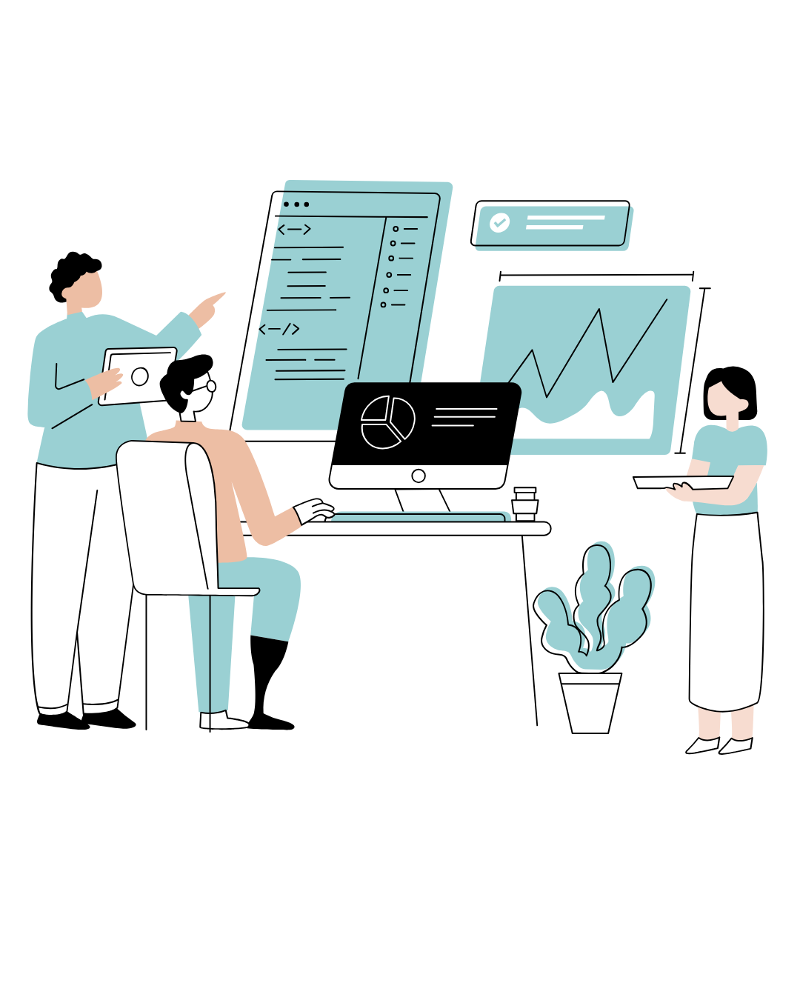

## Software Engineering Roles

- **Software Developer/Engineer** - Write and maintain code
- **System Architect** - Design system structure
- **DevOps Engineer** - Deployment and operations
- **Quality Assurance Engineer** - Testing and quality
- **Project Manager** - Coordinate teams and resources
- **Product Manager** - Define product requirements

## Career Paths

- Technical track (Senior Engineer → Architect → CTO)
- Management track (Team Lead → Engineering Manager → VP)
- Specialization (Security, Data, Mobile, etc.)

---


# Modern Software Engineering

## Current Trends

- **DevOps** - Development and Operations integration
- **Cloud Computing** - Scalable, on-demand resources
- **Microservices** - Distributed system architecture
- **AI/ML Integration** - Intelligent software systems
- **Mobile-First** - Mobile as primary platform
- **Vibe Coding** - If LLM can understand, it's a good code

## Challenges

- **Scale** - Billions of users
- **Security** - Cyber threats
- **Privacy** - Data protection
- **Sustainability** - Environmental impact
- **Cost** - Manage budget

---

# Course Project Overview

**Build Your Own Web Application**
- **Topic of your choice** - any domain that interests you
- **Team work** - collaborate and learn together (team of 2-4)
- **Complete software development lifecycle** experience
- Examples: Campus life, e-commerce, social platform, productivity tool, game, etc.

**Technology Stack**
- **Your choice!** (Frontend + Backend + Database)
- Examples: React + Node.js + MongoDB, Vue + Python + PostgreSQL

---

# Course Project Overview

**Timeline & Deliverables**

- **D1 (Week 4):** Software Development Plan
- **D2 (Week 6):** Software Requirements Specification
- **D3 (Week 8):** Software Design Document
- **D4 (Week 12):** Test Plan & Implementation
- **D5 (Week 15):** Final Delivery & Presentation

## Everything will be on GitHub - Prepare your accounts 👤

---

<!-- _footer: "" -->
<!-- _header: "" -->
<!-- _paginate: false -->

<style scoped>
p { text-align: center}
h1 {text-align: center; font-size: 56px}
</style>

# Let's prepare project teams 👥👥

---

# Next Week Preview

## Week 2: Principles of Software Engineering

We'll dive deeper into:

- **Software Engineering Principles**
- **Quality Attributes**
- **Software Engineering Methods**
- **Tools and Techniques**

## Reading Assignment

- Sommerville Chapter 1 (complete)
- Begin Sommerville Chapter 2

---

# Questions & Discussion

## Today's Key Takeaways

1. Software Engineering is about **systematic, disciplined approaches**
2. It's more than just programming - includes **entire lifecycle**
3. **Ethics and professionalism** are crucial
4. **Practical experience** through our project work

## Questions?

- About the course structure?
- About software engineering concepts?
- About the project requirements?

---

# Thank You!

## Contact Information

- **Email:** ekrem.cetinkaya@yildiz.edu.tr
- **Office Hours:** Tuesday 14:00-16:00 - Room F-B21
- **Book a slot before coming to the office hours:** [Booking Link](https://calendar.app.google/aBKvBqNAqG12oD2B9)
- **Course Repository:** [GitHub Link](https://github.com/ekremcet/yzm2021-principles-of-software-engineering)

## Next Class

- **Date:** 07.10.2025
- **Topic:** Principles of Software Engineering
- **Reading:** Complete Sommerville Ch. 1, start Ch. 2

**Remember:** Start thinking about your project ideas!
