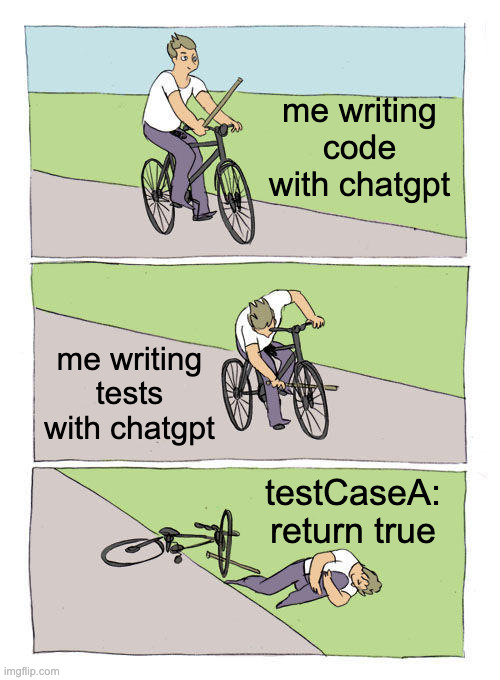
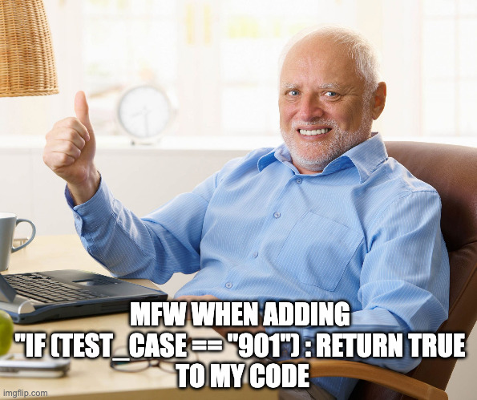
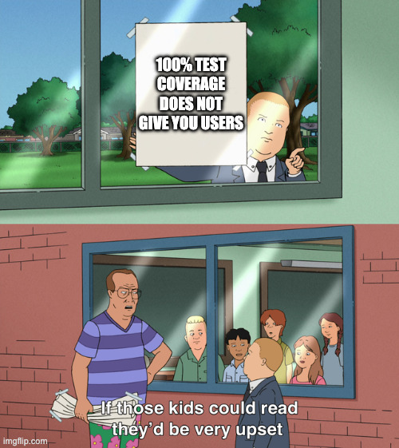
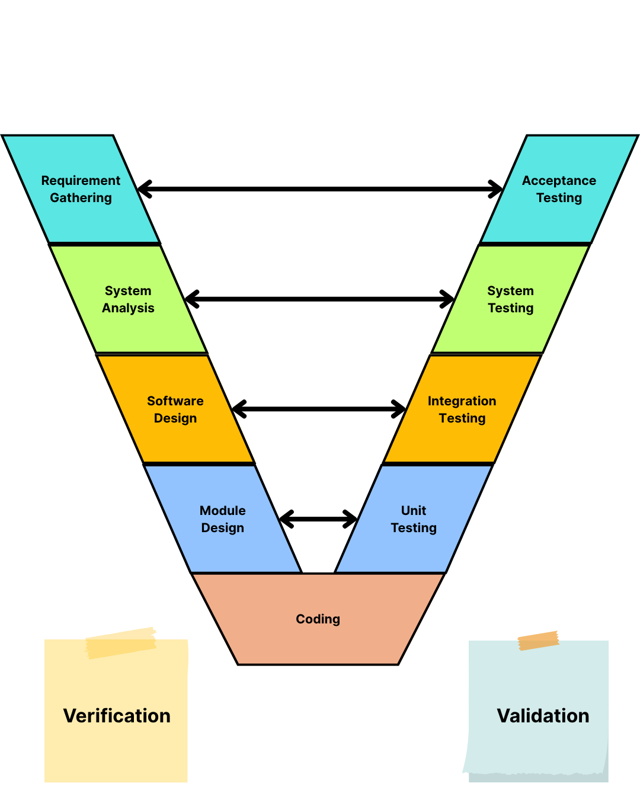
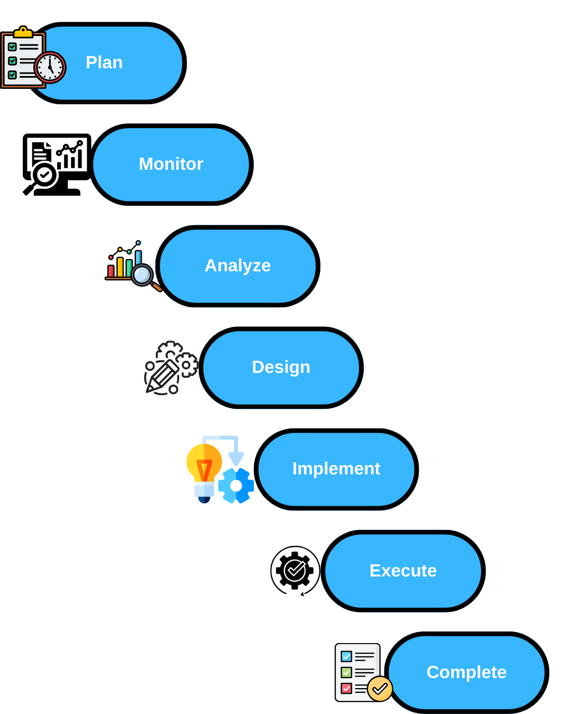
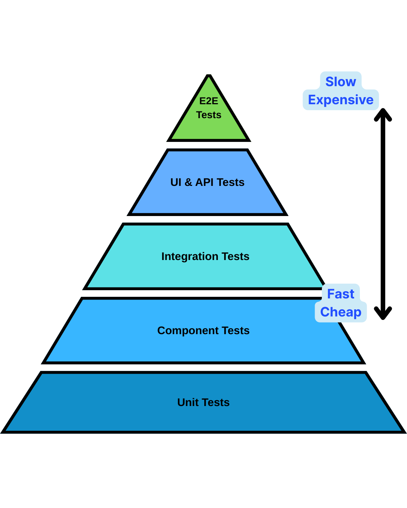
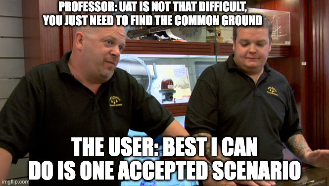

# Week 10: Software Testing and Quality Assurance

## YZM2021 - Software Engineering Principles

**Instructor:** Ekrem Çetinkaya
**Date:** 02.12.2025

---

# Agenda

1.  **Introduction to Software Testing**
    - Principles & V-Model
    - Validation vs. Verification
2.  **The Testing Pyramid & Levels**
    - Unit, Integration, System, Acceptance
3.  **Testing Techniques**
    - Black-box vs. White-box
4.  **Test Doubles & Mocks**
    - Dummy, Fake, Stub, Spy, Mock
5.  **Test Driven Development (TDD)**
    - Red-Green-Refactor Cycle
6.  **Defect Management**
    - Bug Life Cycle
7.  **Deliverable 4 (D4): Test Plan & Implementation**

---

# What is Software Testing?

> "Testing shows the presence of errors, not their absence."
> — Edsger W. Dijkstra

### Key Concepts

- **Software Testing**: The process of executing a program with the intent of finding errors.
- **Quality Assurance (QA)**: The systematic process of ensuring the software meets the requirements and quality standards.
- **Quality Control (QC)**: The product-oriented process of testing to verify product quality.

---

# Why Do We Test?

<div class="columns">

<div>

### "It works on my machine"

You wrote code, ran it once, it worked. Great!
But...

- Will it work on the other's machine?
- Will it work when 100 people log in at once?
- Will it work after your teammate changes the database schema?

</div>

<div>

### The Reality Check

- **Code rots**: New changes break old features.
- **Memory is short**: You will forget how your own code works in 2 weeks.
- **Trust**: Tests prove your code works, so you can push to production on Friday and sleep at night.

</div>

</div>

---

# Why Do We Test? The Two Goals

The testing process has **two distinct goals**:

### 1. Validation Testing

- **Goal:** Demonstrate to the developer and the customer that the software meets its requirements.
- **Approach:**
  - **Custom Software:** At least one test for every requirement.
  - **Generic Software:** Tests for all system features + combinations.
- **Focus:** "Are we building the right product?" (Positive testing)

### 2. Defect Testing

- **Goal:** Discover situations in which the behavior of the software is incorrect, undesirable, or does not conform to its specification.
- **Approach:** Test cases are designed to **expose defects**. They can be deliberately obscure and need not reflect normal use.
- **Focus:** Rooting out crashes, data corruption, and unwanted interactions. (Negative testing)

---

# The Input-Output Model of Testing



Think of the system as a **Black Box**:

- Accepts inputs from set $I$ and generates outputs in set $O$.
- Some outputs will be erroneous ($O_e$).
- These are caused by inputs ($I_e$) that trigger the defects.

**The Strategy:**

- **Defect Testing:** Priority is to find those inputs ($I_e$) that reveal problems.
- **Validation Testing:** Uses correct inputs (outside $I_e$) to verify expected behavior.

> "Testing can only show the presence of errors, not their absence." — **Edsger W. Dijkstra**

---

# When is Testing **Finished**?

We can never prove the software is bug-free. We test until we establish **confidence** that the system is _good enough_.

### 1. The Requirements Checklist (SRS)

- Use your **System Requirements Specification (SRS)** as a **Definition of Done**.
- **Traceability:** Ensure every requirement (e.g., _System shall allow login via email and password_) has at least one corresponding test case.
- If all functional requirements pass, the system is theoretically **feature complete**

_This means your SRS needs to be **updated** regularly_

### 2. Confidence Factors

- **Software Purpose:** Safety-critical systems require strictly higher confidence.
- **User Expectations:** Users may tolerate bugs in "Beta" versions.
- **Marketing Environment:** "First-to-Market" pressure may force early release.

---

# 7 Principles of Software Testing

### 1. Testing shows the presence of defects

- Testing can show that defects are present, but **cannot prove** that there are no defects.
- It reduces the probability of undiscovered defects remaining in the software but, even if no defects are found, it is not a proof of correctness.

### 2. Exhaustive testing is impossible

- Testing everything (all combinations of inputs and preconditions) is not feasible except for trivial cases.
- Instead of exhaustive testing, risk analysis and priorities should be used to focus testing efforts.

### 3. Early testing

- To find defects early, testing activities shall be started as early as possible in the software or system development life cycle.
- **"Shift Left"**: Move testing to the left on the timeline.

---

# 7 Principles of Software Testing

### 4. Defect clustering

- A small number of modules usually contains most of the defects discovered during pre-release testing, or is responsible for most of the operational failures.
- **Pareto Principle (80/20 rule)**: 80% of problems are found in 20% of the modules.

### 5. Pesticide paradox

- If the same tests are repeated over and over again, eventually the same set of test cases will no longer find any new defects.
- To detect new defects, existing tests and test data may need changing, and new tests may need to be written.

---

# 7 Principles of Software Testing

### 6. Testing is context dependent

- Testing is done differently in different contexts.
- For example, safety-critical software is tested differently from an e-commerce site.
- Agile projects are tested differently from sequential projects.

### 7. Absence-of-errors fallacy

- Finding and fixing defects does not help if the system built is unusable and does not fulfill the users' needs and expectations.
- A bug-free system that nobody wants to use is still a failure.

---

# Question

**You are building a critical patient monitoring system. You have 1000 tests.**
**Tests 1-900 pass consistently. Test 901 fails intermittently.**
**You decide to disable Test 901 to get a "green" build for release, arguing it's just a test glitch.**

Which testing principle are you violating/ignoring the most?

A) Defect Clustering
B) Pesticide Paradox
C) Testing shows the presence of defects
D) Absence-of-errors fallacy

---

# Answer



**Which testing principle are you violating/ignoring the most?**

A) Defect Clustering
B) Pesticide Paradox
C) Testing shows the presence of defects
D) Absence-of-errors fallacy

<b>C) Testing shows the presence of defects</b>
By hiding the failure, you are ignoring the presence of a defect. Also relates to "Exhaustive testing is impossible" (risk management), but ignoring a known failure is a direct violation of the purpose of testing.

_(Self-deception is not a valid testing strategy)_

---

# Question

**Your team releases CampusPal v1.0. It has zero crashes, 100% uptime, and perfect code coverage.**
**However, students refuse to use it because "it takes 10 clicks to join an event" and they prefer WhatsApp groups.**

Which principle explains this failure?

A) Testing is context dependent
B) Absence-of-errors fallacy
C) Early Testing
D) Defect Clustering

---

# Answer



**Which principle explains this failure?**

A) Testing is context dependent
B) Absence-of-errors fallacy
C) Early Testing
D) Defect Clustering

<b>B) Absence-of-errors fallacy</b>
Finding and fixing defects does not help if the system built is unusable and does not fulfill the users' needs and expectations. A "technically perfect" system can still be a failure.

---

# Validation vs. Verification (V&V)

| Concept          | Question                             | Definition                                                       |
| :--------------- | :----------------------------------- | :--------------------------------------------------------------- |
| **Verification** | "Are we building the product right?" | Checking if the software meets the _requirements specification_. |
| **Validation**   | "Are we building the right product?" | Checking if the software meets the _user's needs_.               |

**Example:**

- **Verification**: Does the login function accept valid credentials and reject invalid ones? (According to spec)
- **Validation**: Is the login process easy for the user? Does it solve their problem of accessing the system?

---

# Static vs. Dynamic V&V

**Two Complementary Approaches:**

1.  **Software Inspections (Static):**

    - Analyzing and checking representations of the system (requirements, design, code) without running it.
    - **Benefit:** A single inspection session can discover many errors; errors do not mask (hide) other errors.

2.  **Software Testing (Dynamic):**
    - Executing an implementation with test data and examining the outputs.
    - **Benefit:** Checks the actual behavior and performance of the system.

---

# Question

**Classify the following as Verification (VER) or Validation (VAL):**

1.  Running a Unit Test to check if `calculateTax()` returns the correct value.
2.  Asking a doctor if the new patient dashboard layout is easy to read during an emergency.
3.  Checking if the code follows the company's Style Guide
4.  Beta testing the game with 100 players to see if they find it "fun".
5.  Stress testing the server to see if it handles 10,000 users as specified in the SRS.
6.  Customer rejecting the product because "it's too slow on my old laptop" even though it meets the 2GHz requirement.

---

# Answer

1.  **VER**: Checking against functional spec (Math correctness).
2.  **VAL**: Checking against user needs (Usability in context).
3.  **VER**: Checking against static spec (Style Guide).
4.  **VAL**: Checking against user expectations (Fun factor).
5.  **VER**: Checking against non-functional spec (SRS Requirement).
6.  **VAL**: The product met the spec (Verification passed), but failed to meet the user's actual constraint (Validation failed).

- **Verification**: "Did we build it **according to spec**?"
- **Validation**: "Is it **useful** to the user?"

---

# The V-Model (Verification & Validation)



Remember the V-Model from Week 3?

<div class="columns">

<div>

- **Left Side**: Specification & Design
  - Requirements Analysis
  - System Design
  - Architecture Design
  - Module Design
  - Coding

</div>

<div>

- **Right Side**: Validation & Testing
  - Acceptance Testing (Validates **Requirements**)
  - System Testing (Validates **System Design**)
  - Integration Testing (Validates **Architecture**)
  - Unit Testing (Validates **Module Design**)

</div>

</div>

---

# Why Test Early? The Cost of Bugs


<div class="columns">

<div>

### The Rule of Ten

The cost of fixing a bug increases by an order of magnitude (10x) at each subsequent stage of development.

1.  **Requirements Phase**: $1
2.  **Design Phase**: $10
3.  **Coding Phase**: $100
4.  **Testing Phase**: $1,000
5.  **Production (Post-Release)**: $10,000+

</div>

<div>

### Why?

- **Ripple Effect**: A bug in requirements affects design, code, tests, and documentation.
- **Context Switching**: Fixing a bug months later requires re-learning the code.
- **Reputation**: Bugs in production damage trust.

</div>

</div>

---

# The Testing Process



Testing is not just **running the code**. It's a structured process:

1.  **Test Planning**: Define objectives, scope, resources, and schedule.
2.  **Test Monitoring and Control**: Compare actual progress against the plan.
3.  **Test Analysis**: Analyze the test basis (requirements) to identify test conditions.
4.  **Test Design**: Create test cases and test data.
5.  **Test Implementation**: Create test scripts (automation) and prepare environment.
6.  **Test Execution**: Run tests and log outcomes.
7.  **Test Completion**: Archive testware and evaluate the process.

---

# 1. Test Planning

**Goal:** Define the objectives of testing and the specification of test activities in order to meet the objectives.

**Key Activities:**

- Determining the **scope**, risks, and objectives of testing.
- Defining the overall approach (**Test Strategy**).
- Integrating testing activities into the software life cycle (SDLC).
- Scheduling test activities (Analysis -> Execution).
- Assigning resources (People, Tools, Environment).

**Output:** Master Test Plan.

---

# 2. Test Monitoring and Control

**Test Monitoring:**

- Ongoing comparison of actual progress against the plan.
- Checking test results, logs, and coverage criteria.
- assessing if **Exit Criteria** (Definition of Done) are met.

**Test Control:**

- Taking actions necessary to meet the objectives.
- Re-prioritizing tests when risks occur.
- Changing the test schedule due to delays or blocking issues.

**Output:** Test Progress Reports.

---

# 3. Test Analysis

**Goal:** Analyzing the "Test Basis" to identify what to test.

**Key Activities:**

- Analyzing the **Test Basis** (Requirements, Design, Architecture, Interfaces).
- Evaluating the test basis to identify defects (e.g., ambiguous requirements).
- Identifying features and sets of features to be tested.
- Defining and prioritizing **Test Conditions**.

**Output:** Test Conditions (The "What" of testing).

---

# 4. Test Design

**Goal:** Transforming test conditions into tangible test cases.

**Key Activities:**

- Designing and prioritizing **Test Cases**.
- Identifying necessary **Test Data**.
- Designing the test environment setup.
- Identifying any required infrastructure and tools.
- Bi-directional traceability (Requirement <-> Test Case).

**Output:** Test Cases, Test Charters (The "How" of testing).

---

# 5. Test Implementation

**Goal:** Preparing the testware needed for execution.

**Key Activities:**

- Developing and prioritizing **Test Procedures** (Scripts).
- Creating test suites from test procedures for efficient execution.
- Preparing test data (SQL scripts, Mock data).
- Verifying that the test environment has been set up correctly.
- **Automation:** Writing the actual automation code (e.g., Selenium/Jest scripts).

**Output:** Test Scripts, Test Data, Automated Suites.

---

# 6. Test Execution

**Goal:** Running the tests on the software.

**Key Activities:**

- Executing test suites and individual test cases (Manual or Automated).
- Logging the outcome of test execution (**Pass/Fail**).
- Comparing actual results with expected results.
- **Reporting Defects** (Incidents) for failures.
- **Confirmation Testing:** Re-running tests after fixes.
- **Regression Testing:** Ensuring no side effects.

**Output:** Test Logs, Defect Reports.

---

# 7. Test Completion

**Goal:** Consolidating experience and wrapping up.

**Key Activities:**

- Checking which test logs are complete and if any defects remain open.
- Checking if **Exit Criteria** were met.
- **Archiving** testware, test environment, and test infrastructure.
- Handing over testware to the maintenance team.
- Analyzing **Lessons Learned** (Retrospective) for future improvement.

**Output:** Test Summary Report.

---

# Question

**During which phase of the testing process do you identify "WHAT to test" (Test Conditions) based on the requirements?**

A) Test Planning
B) Test Analysis
C) Test Design
D) Test Implementation

---

# Answer

**During which phase of the testing process do you identify "WHAT to test" (Test Conditions) based on the requirements?**

A) Test Planning
B) Test Analysis
C) Test Design
D) Test Implementation

<b>B) Test Analysis</b>

- **Test Analysis:** Analyzes the test basis to determine _what_ needs testing (Conditions).
- **Test Design:** Determines _how_ to test it (Test Cases).
- **Test Implementation:** Prepares the _scripts/data_ to run.

---

<!-- _footer: "" -->
<!-- _header: "" -->
<!-- _paginate: false -->

<style scoped>
p { text-align: center}
h1 {text-align: center; font-size: 72px}
</style>

# The Testing Pyramid

---

# The Testing Pyramid



### The Ideal Distribution

1.  **E2E Tests** (Top - Slowest/Most Expensive)
    - Real user scenarios.
2.  **UI & API Tests**
    - Validating visual elements and endpoints.
3.  **Integration Tests**
    - Verifying interactions between components.
4.  **Component Tests**
    - Testing individual components in isolation.
5.  **Unit Tests** (Base - Fastest/Cheapest)
    - Verifying single functions/classes.

---

# 1. Unit Testing

**What:** Testing the smallest testable part of an application (a function, a method, a class) in isolation.

**Goal:** Ensure that the individual components work correctly.

**Characteristics (FIRST Principles):**

- **F**ast: Tests should run in milliseconds.
- **I**solated: Tests should not depend on other tests or external systems (DB, Network).
- **R**epeatable: Tests should produce the same results every time.
- **S**elf-Validating: Tests should automatically detect if they passed or failed.
- **T**imely: Tests should be written just before or with the production code.

**Example:** Testing a `calculateTotal(price, tax)` function.

---

# 1. Unit Testing - Object Classes

When testing **Object Classes**, you must go beyond simple function calls.

**Coverage Requirements:**

1.  **Test all operations:** Every public method must be called.
2.  **Test all attributes:** Set and get values to ensure internal state is managed.
3.  **Test all states:** Simulate events to force the object into every possible state (e.g., `Pending` -> `Approved` -> `Shipped`).

**Inheritance Issue:**

- If a subclass inherits an operation, you cannot assume it works just because it worked in the parent.
- **Rule:** Test inherited operations in the **new context** of the subclass.

---

# Unit Testing in Practice - Finding a Bug

### The Code

```javascript
// Calculate CampusPal Event Rating
function calculateRating(stars) {
  if (stars > 4.5) return "Gold";
  if (stars > 3.5) return "Silver";
  if (stars > 2.5) return "Bronze";
  return "Standard";
}
```

**Can you spot the bug?**

---

# Unit Testing in Practice - Finding a Bug

<div class="columns">

<div>

### The Code

```javascript
// Calculate CampusPal Event Rating
function calculateRating(stars) {
  if (stars > 4.5) return "Gold";
  if (stars > 3.5) return "Silver";
  if (stars > 2.5) return "Bronze";
  return "Standard";
}
```

**Can you spot the bug?**

</div>

<div>

### The Test

```javascript
test("event rating", () => {
  expect(calculateRating(5.0)).toBe("Gold");
  expect(calculateRating(4.5)).toBe("Gold");
});
```

**Result:**
`Expected 'Gold', received 'Silver'`

**Fix:** Change `>` to `>=`.

</div>

</div>

---

# CampusPal Unit Test Scenario

**Scenario:** Verify `EventService` calculates capacity correctly.

- **Test Case 1 (Normal):**
  - **Input:** Event Capacity = 50, Attendees = 10.
  - **Expected:** `isFull()` returns `false`.
- **Test Case 2 (Boundary):**
  - **Input:** Event Capacity = 50, Attendees = 50.
  - **Expected:** `isFull()` returns `true`.
- **Test Case 3 (Error):**
  - **Input:** Event Capacity = -1.
  - **Expected:** Throw `InvalidCapacityException`.

---

# 2. Component Testing

**What:** Testing composite components made of multiple interacting objects (units).

**Goal:** Focuses on showing that the component **interface** behaves according to its specification. You assume unit tests are already done.

**Key Focus: Interfaces**

- **Parameter interfaces:** Data/functions passed between methods.
- **Shared memory:** Block of memory shared between subsystems.
- **Procedural:** Encapsulated procedures (objects).
- **Message passing:** Requesting services via messages.

**Example:**

- Testing a `EventManagement` component that aggregates data from `EventService` and `NotificationService` objects via their interfaces.

---

# CampusPal Component Test Scenario

**Scenario:** Testing the `RegistrationComponent`.

- **Context:** A user clicks "Register" on an event page.
- **Interfaces to Test:**
  1.  **Parameter Interface:** Does `registerUser(eventId, userId)` accept correct types?
  2.  **Message Passing:** Does it send a valid JSON request to the backend?
  3.  **Failure Handling:** If backend returns `500 Error`, does the component display "Try again later"?

---

# 3. System Testing

**What:** Integrating components to create a complete version of the system and testing it as a whole.

**Goal:** Focuses on testing the **interactions** between components and ensuring the system meets functional and non-functional requirements.

**Key Differences from Component Testing:**

1.  **Integration of Off-the-shelf:** Includes 3rd party reusable components.
2.  **Team Process:** Often done by a separate team; collective rather than individual.

**Approach:**

- **Use-case based testing:** Testing scenarios that force interactions between many components (e.g., "Student joins an event").

---

# CampusPal System Test Scenario

**Scenario:** "End-to-End Event Creation & Joining"

- **Actor:** Student Organizer & Student Attendee.
- **Flow:**
  1.  Organizer logs in and creates "Coding Workshop" (Web UI -> API -> DB).
  2.  Attendee logs in and searches for "Workshop" (Search Service).
  3.  Attendee joins the event (Logic checks capacity).
  4.  Attendee checks "My Events" to see the new entry (Data consistency).
- **Goal:** Verify the entire flow works across ALL integrated components (Frontend, Backend, Database, Email Server).

---

# Interface Testing

**Goal:** Detect faults due to interface errors or invalid assumptions between components.

**Types of Interfaces:**

- **Parameter interfaces:** Data passed from one method to another.
- **Shared memory:** Block of memory is shared between subsystems.
- **Procedural:** Encapsulated set of procedures (e.g., Objects).
- **Message passing:** Requesting services via messages (e.g., Client-Server).

---

# Interface Testing Guidelines

Testing interfaces is difficult because errors may rely on unusual conditions or timing.

**Guidelines:**

1.  **Extreme Values:** Test parameters at the extreme ends of their ranges (e.g., Max Int, Zero).
2.  **Null Pointers:** Always test interfaces with null pointer parameters.
3.  **Fail the Component:** Design tests that deliberately cause the called component to fail.
4.  **Stress Message Passing:** Generate more messages than likely to occur to test timing/queues.
5.  **Shared Memory Order:** Vary the order in which components activate to reveal implicit assumptions.

---

# System Testing - Policies & Strategy

Exhaustive testing is impossible, so companies use **Testing Policies** to define "enough" testing.

**Common System Testing Policies:**

1.  **Menu Functions:** All system functions accessed via menus must be tested.
2.  **Combinations:** Functions used together (e.g., formatting text _while_ in a multi-column layout) must be tested.
3.  **User Input:** All functions accepting user input must be tested with correct AND incorrect input.

**Tool: Sequence Diagrams**

- Use Sequence Diagrams (from Design phase) to identify component interactions.
- **Strategy:** Create a test case for every message passed between objects in the diagram.

---

# 4. UI & API Testing

**API Testing:**

- **What:** Testing the Application Programming Interfaces directly, bypassing the UI.
- **Verifies:** Status codes (200 OK, 404 Not Found), JSON response structure, headers, and performance.
- **Tools:** Postman, Supertest, RestAssured.

**UI Testing:**

- **What:** Verifying the visual interface and client-side interactions.
- **Verifies:** Element visibility, colors, layout, and basic user interactions.
- **Techniques:**
  - **Visual Regression:** Comparing screenshots pixel-by-pixel to detect unintended changes.
  - **Snapshot Testing:** Comparing the rendered HTML structure against a saved baseline.

---

# CampusPal UI/API Test Scenario

**API Scenario:** `POST /api/events`

- **Request:** Valid JSON `{ "title": "Party", "date": "2025-01-01" }`.
- **Expected Response:** `201 Created`, Body contains `id: 123`.
- **Negative Test:** Send empty body. Expect `400 Bad Request`.

**UI Scenario:** Login Form

- **Action:** User leaves "Password" empty and clicks Login.
- **Expected:** "Password is required" error message appears in red. (No API call made).

---

# 5. System & E2E Testing

**What:** Testing the complete, integrated system to evaluate compliance with specified requirements. E2E tests simulate real user scenarios from start to finish.

**Goal:** Verify that the system meets functional and non-functional requirements in a production-like environment.

**Types:**

- **Functional Testing**: Features, APIs, Database operations.
- **Non-Functional Testing**: Performance, Scalability, Security, Usability.

**Characteristics:**

- Black-box testing mostly.
- Done by a dedicated QA team (usually).
- Environment should mimic production.

---

# Question

**You are testing the "Forgot Password" flow.**
**You enter an email, click "Reset", check your inbox for the link, click the link, and enter a new password.**

Which level of testing best describes this?

A) Unit Testing
B) Component Testing
C) Integration Testing
D) System / E2E Testing

---

# Answer

**Which level of testing best describes this?**

A) Unit Testing
B) Component Testing
C) Integration Testing
D) System / E2E Testing

<b>D) System / E2E Testing</b>
This scenario touches the Frontend (UI), Backend (API), Database (User lookup), and External Services (Email Provider). It simulates a complete user journey across the entire integrated system.

---

# 6. Acceptance Testing (UAT)



**What:** Formal testing with respect to user needs, requirements, and business processes.

**Goal:** Determine whether or not a system satisfies the acceptance criteria and to enable the user, customers or other authorized entity to determine whether or not to accept the system.

**Types:**

- **Alpha Testing**: Performed by internal staff at the developer's site.
- **Beta Testing**: Performed by a selected group of end-users at their own site.
- **User Acceptance Testing (UAT)**: Final testing by the actual users before sign-off.

---

# The Acceptance Testing Process

1.  **Define Acceptance Criteria:** Agreed largely before the contract is signed.
2.  **Plan Acceptance Testing:** Schedule and resources.
3.  **Derive Acceptance Tests:** Design tests to check criteria.
4.  **Run Acceptance Tests:** Ideally in the actual user environment.
5.  **Negotiate Test Results:** _Crucial Step._ It is unlikely all tests pass. Developers and Customers negotiate if the system is "good enough" to be put into use despite minor bugs.
6.  **Accept/Reject System:** Formal decision on payment/delivery.

---

# CampusPal Acceptance Test Scenario

**Scenario:** "Student Club President verifies Event Features" (UAT)

- **Context:** Before deploying the "Club Management" module to all students.
- **User:** President of the "Computer Science Club".
- **Test Steps:**
  1.  Create a "Members-Only" event.
  2.  Ask a non-member student to try and join (Should be blocked).
  3.  Ask a member to join (Should succeed).
  4.  **Negotiation:** "The blocking works, but the error message 'Access Denied' is too rude. Change it to 'Members Only' and we accept."

---

# Scenario Testing

**Concept:**

- Devising typical "stories" of use and using them to develop test cases.
- Scenarios should be realistic and relate to real user needs.

**Example (CampusPal Scenario):**

- **Scenario:** "Student Ali joins a 'Hiking' event."
- **Steps:**
  1.  Ali logs in (Authentication).
  2.  Searches for 'Hiking' (Search Component).
  3.  Clicks 'Join' (Event Component).
  4.  System checks capacity (Logic).
  5.  Ali receives confirmation email (Notification).

**Benefits:**

- Tests combinations of requirements.
- Realistic usage pattern ("Operational Profile").
- Easier for stakeholders to understand.

---

<!-- _footer: "" -->
<!-- _header: "" -->
<!-- _paginate: false -->

<style scoped>
p { text-align: center}
h1 {text-align: center; font-size: 72px}
</style>

# Testing Techniques

---

# Black-box vs. White-box Testing

<div class="columns">

<div>

### Black-box Testing

- **Focus**: Inputs and Outputs.
- **Knowledge**: Tester does _not_ know internal code structure.
- **Techniques**:
  - Equivalence Partitioning
  - Boundary Value Analysis
  - Decision Table Testing
  - State Transition Testing

</div>

<div>

### White-box Testing

- **Focus**: Internal Logic and Structure.
- **Knowledge**: Tester knows the code.
- **Techniques**:
  - Statement Coverage
  - Branch Coverage
  - Path Coverage
  - Control Flow Testing

</div>

</div>

---

# Practice - Designing Test Cases

**Scenario:**
You are testing the **Event Search** filter for CampusPal.
The search accepts a `priceRange` parameter.

- **Requirement:** "Price must be between 0 and 5000 TL."

**Task:**
Identify the Equivalence Partitions and suggest **3 Test Inputs**.

---

# Practice - Designing Test Cases

**Scenario:**
You are testing the **Event Search** filter for CampusPal.
The search accepts a `priceRange` parameter.

- **Requirement:** "Price must be between 0 and 5000 TL."

**Task:**
Identify the Equivalence Partitions and suggest **3 Test Inputs**.

1.  **Valid Partition:** Any number between 0 and 5000. (Input: **100**)
2.  **Invalid Low Partition:** Any number < 0. (Input: **-10**)
3.  **Invalid High Partition:** Any number > 5000. (Input: **6000**)

---

# Black-box Technique - Equivalence Partitioning

**Idea:** Inputs and outputs often fall into classes (partitions) where the system behaves similarly. You only need to test one value from each partition.

**Example:** A `Grade` function takes a score (0-100).

- Partition 1: **Invalid Low** (< 0) -> e.g., -5
- Partition 2: **Valid Fail** (0-49) -> e.g., 30
- Partition 3: **Valid Pass** (50-100) -> e.g., 75
- Partition 4: **Invalid High** (> 100) -> e.g., 150

**Rule of Thumb:**

- Choose test cases on the **boundaries** of partitions + **midpoint**.
- (e.g., for Partition 2: Test 0, 25, 49).

---

# Black-box Technique - Boundary Value Analysis

**Idea:** Defects often occur at the boundaries of input domains. Test the edges!

**Example:** `Grade` function (0-100). Pass is >= 50.

**Boundaries:**

- **0** (Min)
- **49** (Just below Pass boundary)
- **50** (On Pass boundary)
- **100** (Max)
- **-1** (Just below Min)
- **101** (Just above Max)

**Benefit:** Catches "off-by-one" errors (e.g., using `>` instead of `>=`).

---

# Practice - Designing Test Cases

**Scenario:**
The `createEvent` function accepts an `attendeeLimit` parameter.

- **Requirement:** "Events must have at least 1 attendee and at most 100."

**Task:**
Identify the **Boundary Values** to test.

---

# Practice - Designing Test Cases

**Scenario:**
The `createEvent` function accepts an `attendeeLimit` parameter.

- **Requirement:** "Events must have at least 1 attendee and at most 100."

**Task:**
Identify the **Boundary Values** to test.

**Boundaries to Test:**

- **Min Boundary:** 1 (Valid)
- **Just Below Min:** 0 (Invalid)
- **Max Boundary:** 100 (Valid)
- **Just Above Max:** 101 (Invalid)
- **Midpoint (Optional):** 50 (Valid)

---

# General Testing Guidelines

When designing test cases , try to _break_ the software:

1.  **Force Error Messages:** Choose inputs that force the system to generate all error messages.
2.  **Buffer Overflow:** Design inputs that cause input buffers to overflow (very long strings).
3.  **Repeat Inputs:** Repeat the same input or series of inputs numerous times.
4.  **Invalid Outputs:** Force invalid outputs to be generated.
5.  **Computation Limits:** Force computation results to be too large or too small.

---

# Practice - Decision Table Testing

**Scenario:**
**CampusPal Login Logic:**

- If `email` is valid AND `password` is valid -> **Login Success**.
- If `email` is valid BUT `password` is invalid -> **Error: Wrong Password**.
- If `email` is invalid -> **Error: User not found**.

**Task:**
How many test cases do you need to cover all combinations?

---

# Practice - Decision Table Testing

**Scenario:**
**CampusPal Login Logic:**

- If `email` is valid AND `password` is valid -> **Login Success**.
- If `email` is valid BUT `password` is invalid -> **Error: Wrong Password**.
- If `email` is invalid -> **Error: User not found**.

**Task:**
How many test cases do you need to cover all combinations?

**3 Test Cases needed:**

1.  Valid Email + Valid Password -> **Success**
2.  Valid Email + Invalid Password -> **Wrong Password Error**
3.  Invalid Email + (Any Password) -> **User Not Found Error**

---

# White-box Technique - Code Coverage

**Statement Coverage:**

- Metric: (Number of executed statements / Total statements) \* 100
- Ensures every line of code is run at least once.

**Branch Coverage:**

- Metric: (Number of executed branches / Total branches) \* 100
- Ensures every `if` and `else` path is taken.

**Path Coverage:**

- Ensures every possible path through the code is executed.

**Note:** 100% coverage does NOT mean 100% bug-free! It just means executed code.

---

<!-- _footer: "" -->
<!-- _header: "" -->
<!-- _paginate: false -->

<style scoped>
p { text-align: center}
h1 {text-align: center; font-size: 72px}
</style>

# Test Driven Development (TDD)

---

# What is TDD?

**TDD** is a software development process where you write the test **before** you write the code.

### The Red-Green-Refactor Cycle

1.  **Red**: Write a failing test for a new feature. (Compile error or assertion failure).
2.  **Green**: Write just enough code to pass the test. (Quick and dirty is okay).
3.  **Refactor**: Clean up the code while keeping the test passing. (Improve design).

### Benefits

- **Better design**: Writing tests first forces you to design testable interfaces.
- **Documentation**: Tests explain how code works.
- **Confidence**: Regression safety.
- **Focus**: You only write code needed to pass the test.

---

# TDD Walkthrough - CampusPal Rating

**Feature**: Calculate average rating for an event.

**Step 1: RED (Write the test)**

```typescript
it("should calculate average rating", () => {
  const event = new Event();
  event.addRating(5);
  event.addRating(3);
  expect(event.getAverageRating()).toBe(4); // Fails! Method doesn't exist.
});
```

**Step 2: GREEN (Make it pass)**

```typescript
class Event {
  ratings: number[] = [];
  addRating(r: number) {
    this.ratings.push(r);
  }
  getAverageRating() {
    return this.ratings.reduce((a, b) => a + b) / this.ratings.length;
  }
}
```

**Step 3: REFACTOR (Clean up)**

- What if ratings is empty? (Add guard clause)
- Maybe cache the average?

---

# Common Beginner Mistakes

<div class="columns">

<div>

### 1. Testing Implementation Details

Don't test _how_ it works, test _what_ it does.
❌ `expect(service.privateMethod).toBeCalled()`
✅ `expect(service.publicOutput).toBe(result)`

### 2. Testing Too Much (The Database)

In unit tests, **mock the database**.
If you hit the real DB, it's an Integration Test.

</div>

<div>

### 3. Testing Trivial Code

Don't test getters/setters or simple assignments.
❌ `expect(user.getName()).toBe('John')`
✅ Test logic: `expect(user.canVote()).toBe(true)`

### 4. Poor Test Names

❌ `test('it works', ...)`
✅ `test('should calculate total including tax', ...)`

</div>

</div>

---

<!-- _footer: "" -->
<!-- _header: "" -->
<!-- _paginate: false -->

<style scoped>
p { text-align: center}
h1 {text-align: center; font-size: 72px}
</style>

# Defect Management

---

# Defect Management

What happens when a test fails? We found a **Defect** (Bug).

### The Bug Report

A good bug report is crucial for fixing the issue.

- **ID**: Unique identifier (e.g., BUG-101)
- **Title**: Short summary ("Event creation fails with valid data")
- **Description**: Detailed explanation.
- **Steps to Reproduce**: 1. Login, 2. Click Create, 3. Enter 'Test'...
- **Expected Result**: "Event should be created"
- **Actual Result**: "Error 500: Server Error"
- **Severity**: Critical, Major, Minor, Cosmetic.
- **Priority**: High, Medium, Low.
- **Environment**: Browser, OS, Version.

---

# Defect Management & Debugging

**Testing vs. Debugging:**

- **Testing:** The process of _finding_ defects.
- **Debugging:** The process of _locating and fixing_ the code responsible for the defect.

**The Debugging Process:**

1.  Locate the error (using stack traces, logs).
2.  Design a fix.
3.  Repair the error.
4.  **Re-test (Regression):** Ensure the fix works and didn't break anything else.

---

# Bug Life Cycle

1.  **New**: Bug is reported.
2.  **Assigned**: Project manager assigns to a developer.
3.  **Open**: Developer is working on it.
4.  **Fixed**: Developer fixes it and pushes code.
5.  **Pending Retest**: Ready for QA to verify.
6.  **Retest**: QA tests the fix.
7.  **Verified/Closed**: Fix is confirmed.
8.  **Reopen**: If fix failed or bug persists.

---

# Question

**A QA engineer finds a bug: "App crashes when I upload a 10MB PDF".**
**The developer investigates and says: "The crash log shows an OutOfMemoryError in the image processing library".**

Which statement is correct?

A) The crash is the **Defect**; the OutOfMemoryError is the **Failure**.
B) The crash is the **Failure**; the missing memory check is the **Defect** (Bug).
C) They are the same thing.
D) The developer is Debugging; the QA is Verification.

---

# Answer

**Which statement is correct?**

A) The crash is the **Defect**; the OutOfMemoryError is the **Failure**.
B) The crash is the **Failure**; the missing memory check is the **Defect** (Bug).
C) They are the same thing.
D) The developer is Debugging; the QA is Verification.

<b>B) The crash is the **Failure**; the missing memory check is the **Defect** (Bug).</b>

- **Failure:** The visible symptom (System stops working).
- **Defect (Fault/Bug):** The error in the code (Not handling large files).
- **Error:** The human mistake that caused the defect (Dev forgot to check file size).

---

# Performance vs. Stress Testing

**Performance Testing:**

- Verifying the system can process the intended load.
- Often uses an **Operational Profile**: A set of tests reflecting the actual mix of work (e.g., 90% Read, 10% Write).

**Stress Testing:**

- Gradually increasing load _beyond_ the maximum design limits until the system fails.
- **Goal:** Ensure the system "fails-soft" (no data corruption) rather than collapsing catastrophically.

---

<!-- _footer: "" -->
<!-- _header: "" -->
<!-- _paginate: false -->

<style scoped>
p { text-align: center}
h1 {text-align: center; font-size: 72px}
</style>

# Deliverable 4 (D4)

---

# Deliverable 4 (D4) - Test Plan & Implementation

### Assignment Overview

- **Title**: Test Plan & Implementation (TPI)
- **Due Date**: Week 12
- **Goal**: Implement a comprehensive testing strategy for your project.

### Required Deliverables

1.  **Test Strategy Document**: How are you testing? (Tools, levels, scope).
2.  **Unit Tests**: Minimum **5 critical components** (Services, Controllers, Utils) fully tested with mocks.
3.  **Integration/API Tests**: Minimum **5 key API endpoints** tested (Success + Error cases).
4.  **Performance Test**: Load test on one critical endpoint (e.g., Event Listing).
5.  **Execution Report**: Screenshots/Logs showing test results.

---

# D4 Format: The Test Plan

Your `D4_Test_Plan.pdf` should follow a professional structure.

### 1. Introduction

- **Objective:** What are you testing?
- **Scope:** Which modules are included/excluded?
- **Tools:** Jest, Cypress, JMeter, etc.

### 2. Test Strategy

- **Levels:** Unit, Integration, Performance.
- **Environment:** "Tests ran on Localhost Node v18".

### 3. Test Cases (The Core)

- List your test scenarios (like the Practice examples).
- **Format:** ID, Description, Pre-conditions, Steps, Expected Result.

---

# D4 Format - Test Case Example Table

| ID    | Feature | Scenario                     | Steps                                                               | Expected Result                 |
| :---- | :------ | :--------------------------- | :------------------------------------------------------------------ | :------------------------------ |
| TC-01 | Auth    | Login with valid credentials | 1. Go to /login <br> 2. Enter valid email/pass <br> 3. Click Submit | User redirected to Dashboard    |
| TC-02 | Auth    | Login with empty password    | 1. Go to /login <br> 2. Enter valid email <br> 3. Click Submit      | "Password required" error shown |
| TC-03 | Event   | Join Event over capacity     | 1. Find full event <br> 2. Click Join                               | "Event is Full" modal shown     |

---

# D4 Format: Execution Report

Don't just say "It works". **Prove it.**

### 1. Automated Test Logs

- Screenshot of your terminal showing `PASS` results.
- `PASS src/services/EventService.test.ts (5/5)`

### 2. Bug Reports (If any found)

- If a test failed, document it!
- **Defect ID:** BUG-01
- **Status:** Fixed / Open.

### 3. Performance Graphs

- Export charts from JMeter/K6 showing Response Time vs. Users.

---

# D4 Example - What to Test in CampusPal?

### 1. Unit Tests (White-box)

- **EventService**: Logic for capacity checks, date validation.
- **AuthService**: Logic for password hashing (mocked), token generation.
- **MarketplaceService**: Logic for price validation, status transitions.

### 2. Integration/API Tests (Black-box)

- `POST /api/auth/register`: Can a user register? What if email exists?
- `GET /api/events`: Does it return events? Does pagination work?
- `POST /api/events/:id/rsvp`: Can a student RSVP? What if full?

### 3. Performance Test

- Use tools like **Postman**, **JMeter**, or **K6**.
- Simulate 50-100 concurrent users searching for events.
- Measure response time (Expect < 500ms).

---

# Summary

1.  **Test Early**: Save money and time.
2.  **Follow the Pyramid**: More unit tests, fewer E2E tests.
3.  **Isolate Units**: Use Mocks and Stubs for unit tests.
4.  **Write Testable Code**: Dependency Injection helps testing.
5.  **D4 is coming**: Start writing tests for your core logic now!

---

<!-- _class: lead -->

# Thank You!

## Contact Information

- **Email:** ekrem.cetinkaya@yildiz.edu.tr
- **Office Hours:** Tuesday 14:00-16:00 - Room F-B21
- **Book a slot before coming:** [Booking Link](https://calendar.app.google/aBKvBqNAqG12oD2B9)
- **Course Repository:** [GitHub](https://github.com/ekremcet/yzm2021-principles-of-software-engineering)
