# Week 11: Software Evolution and Quality Management

## YZM2021 - Software Engineering Principles

**Instructor:** Ekrem Çetinkaya
**Date:** 09.12.2025

---

# Today's Learning Outcomes

By the end of this lecture, you will be able to:

1.  **Explain** why software must evolve and the costs associated with change
2.  **Apply** Lehman's Laws to predict software behavior over time
3.  **Evaluate** legacy systems and choose appropriate strategies
4.  **Identify** code smells and apply refactoring techniques
5.  **Compare** Git workflows and choose the right one for your project
6.  **Measure** software quality using appropriate metrics
7.  **Design** CI/CD pipelines for automated quality assurance
8.  **Understand** DevOps culture and modern deployment strategies

---

<!-- _footer: "" -->
<!-- _header: "" -->
<!-- _paginate: false -->

<style scoped>
p { text-align: center}
h1 {text-align: center; font-size: 72px}
</style>

# Software Evolution

---

# The Truth About Software

> Software development is often likened to building a house. But houses don't need new rooms added every month, or foundations rebuilt because the city changed its regulations.

### Key Statistics

- **67%** of IT budgets are spent on maintaining existing systems, not building new ones
- The average enterprise application lives for **15-20 years** _(Sommerville, Ch. 9)_
- **80%** of a developer's time is spent reading and understanding existing code _(Corbi, 1989)_

**Bottom line:** You will spend more time modifying existing systems than building new ones from scratch.

---

# The Software Life Cycle

Software development doesn't end with delivery. Most cost and effort happens **after** the first release.

### Evolution vs. Servicing

1.  **Evolution**: The stage where significant changes to architecture and functionality occur.
    - New features are added continuously.
    - The system remains useful and adapts to new needs.
2.  **Servicing**: The stage where only small, tactical changes are made.
    - Patches, bug fixes, and minor adjustments.
    - No major architectural changes are cost-effective.
3.  **Phase-out**: The system is still used but no changes are made.
    - Users work around bugs.
    - Transitioning to a replacement system.

---

# The Software Evolution Process

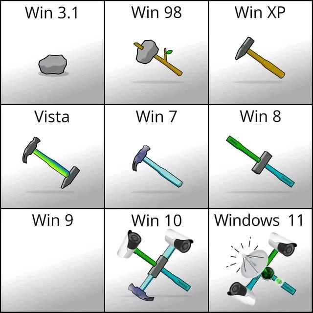

Evolution is cyclic. It continues throughout the system's lifetime.

### Standard Process Cycle

1.  **Change Requests**: From users, management, or developers.
2.  **Impact Analysis**: What components need to change? Cost?
3.  **Release Planning**: Which changes go into the next version?
4.  **Change Implementation**: Design, code, test (iterative).
5.  **System Release**: Deploying the new version.

> **Note:** Ideally, requirements and design docs are updated _along with_ the code.

---

# Evolution Processes - The Handover Gap

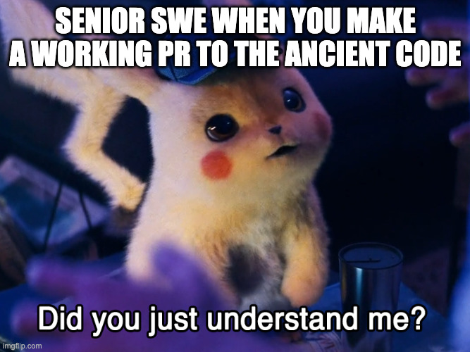

Often, the team that develops the software is NOT the team that maintains it.

1.  **Agile to Plan-based:** Agile dev team (no docs) hands over to a formal maintenance team (needs docs).
    - _Result:_ Evolution team is lost; must reverse-engineer the system.
2.  **Plan-based to Agile:** Formal dev team (complex code) hands over to Agile maintenance team.
    - _Result:_ Automated tests missing; code refactoring needed immediately.

> **CampusPal Example:** The student team who built V1 graduates. A new team of juniors takes over. Without docs or tests, they are afraid to change anything.

---

# The Emergency Repair Trap

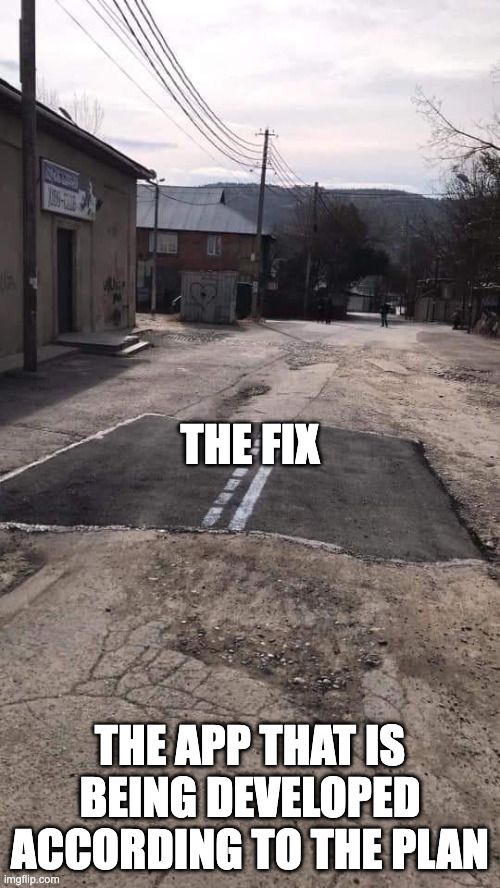

Sometimes, urgent bugs require immediate fixes (e.g., critical crash, security hole)

Or you just feel doing some vibe-coding

**The Process:**

1.  Urgent request arrives
2.  **Skip** formal analysis and design
3.  **Hack** the code directly to fix it fast
4.  Deliver the fix

**The Risk:**

- Requirements and design docs become **inconsistent** with the code
- The "hack" is rarely refactored later
- **Software ageing** accelerates

---

# Software Evolution Example - Python 2 to Python 3

<div class="columns">

<div>

### The Timeline

- **2008:** Python 3.0 released
- **2010-2015:** Evolution (Both versions maintained)
- **2015-2019:** Servicing (Python 2 security fixes only)
- **2020:** Phase-out (Python 2 end of life)

### The Pain

Many libraries (NumPy, Django, Flask) had to maintain **two versions** for years.

</div>

<div>

### Takeaways

- Your code depends on libraries that **WILL** change
- Breaking changes happen (Python 2 print vs Python 3 print())
- **Plan for evolution from Day 1** using abstraction
- Don't wait until the last minute to migrate

</div>

</div>

---

# Why Software Change is Inevitable


> "The only constant is change." — Heraclitus

1.  **New Requirements**: Users always want more features
2.  **Business Environment**: Laws, competitors, market shifts
3.  **Errors**: Bugs and security vulnerabilities
4.  **Platform Changes**: New hardware, OS, cloud providers
5.  **Performance**: Scaling from prototype to production

---

# The Hidden Truth About Software

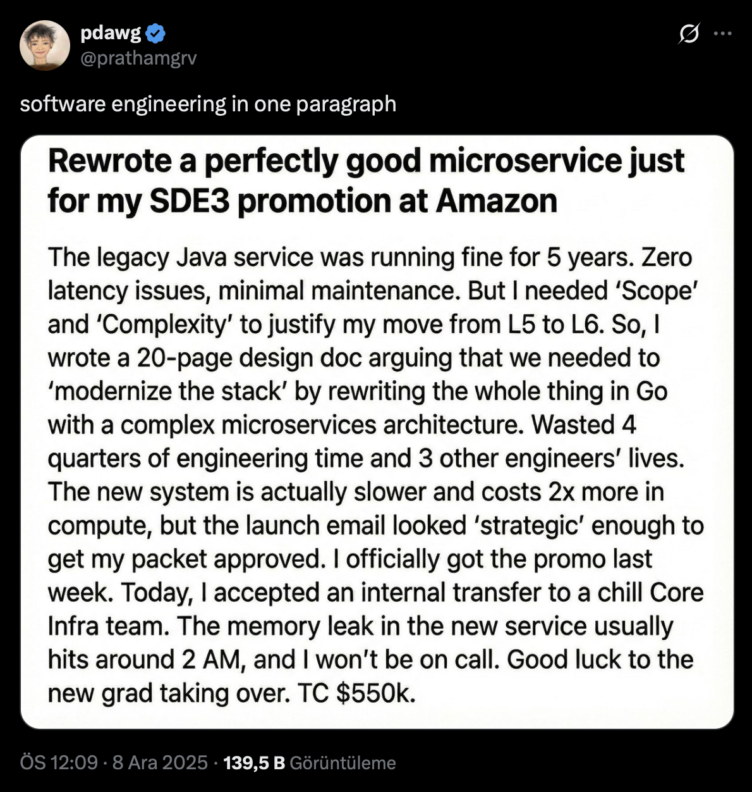

### Not all changes _make sense_

---

# Lehman's Laws of Software Evolution

Meir Lehman (1974-1996) studied how real software systems evolve over decades and identified **8 laws** that apply to **E-type systems** (systems that solve real-world problems)

| Law      | Name                        | One-Line Summary                   |
| :------- | :-------------------------- | :--------------------------------- |
| **I**    | Continuing Change           | Use it? Must change it.            |
| **II**   | Increasing Complexity       | Change it? Complexity grows.       |
| **III**  | Self-Regulation             | Evolution speed is constrained.    |
| **IV**   | Conservation of Stability   | Workload stays roughly constant.   |
| **V**    | Conservation of Familiarity | Can't add too much at once.        |
| **VI**   | Continuing Growth           | Must add features to stay useful.  |
| **VII**  | Declining Quality           | Quality decays without effort.     |
| **VIII** | Feedback System             | Evolution is a multi-loop process. |

---

# Law I - Continuing Change

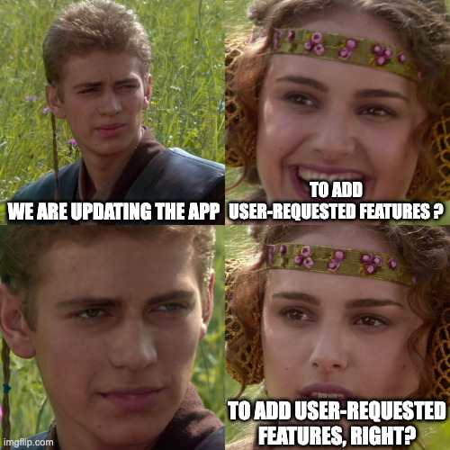

> "A program that is used must be continually adapted, or it becomes progressively less satisfactory."

**Why?**

- The **environment** changes (new OS, new regulations)
- User **expectations** change (competitors add features)
- **Technology** changes (new libraries, protocols)
- **Business** changes (new opportunuties, new hypes)

---

# Law II - Increasing Complexity

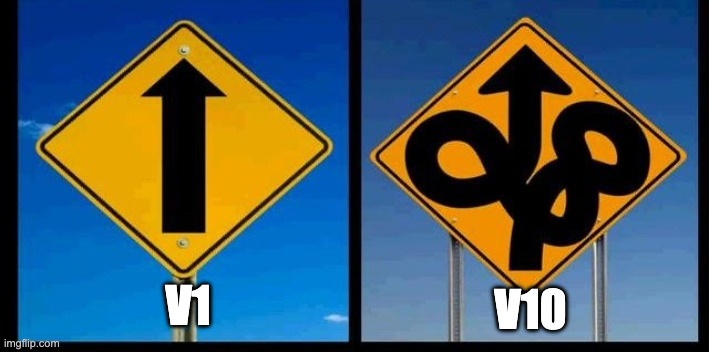

> "As an evolving program is changed, its complexity increases unless work is done to maintain or reduce it."

**Why?**

- New features are added without redesigning
- "Quick fixes" **destroy structure**
- Documentation becomes **outdated**
- Original developers **leave**

**The Antidote - Refactoring**

- Regularly **restructure** code without changing behavior
- Pay down **Technical Debt** before it bankrupts you
- Make developers happy

---

# Law III - Self-Regulation

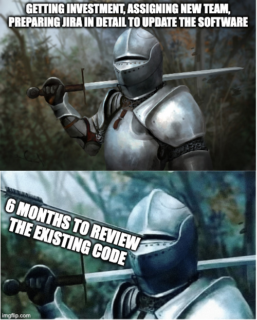

> "Program evolution is a self-regulating process. System attributes such as size, time between releases, and the number of reported errors is approximately invariant for each system release."

**Meaning:**

- Large systems have their own dynamics.
- You can't arbitrarily speed up evolution by just adding people.
- The system constrains how fast it can evolve.

---

# Law IV - Conservation of Organizational Stability

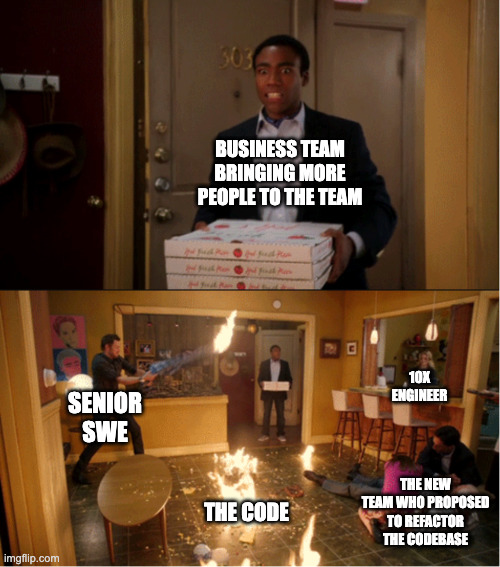

> "Over a program's lifetime, its rate of development is approximately constant and independent of the resources devoted to system development."

**The Myth** - "We are behind schedule, let's hire 10 more developers!"
**The Reality** - Adding people to a late project makes it later.

- Communication overhead increases
- New people need training
- The organization has its own pace

---

# Law V - Conservation of Familiarity

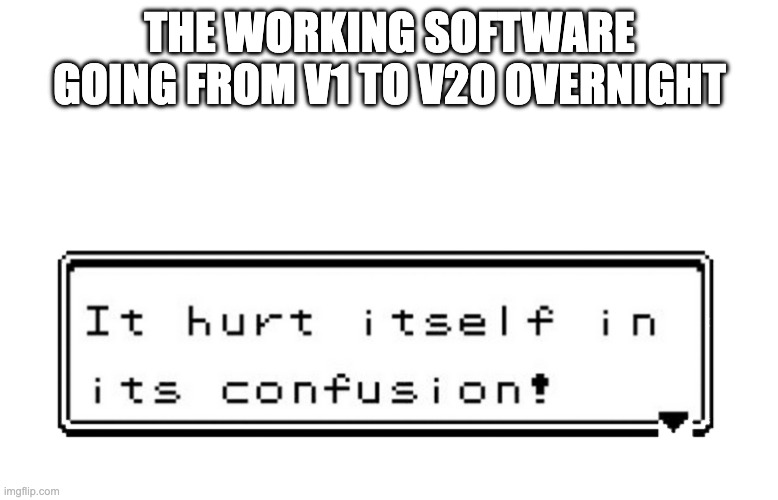

> "Over the lifetime of a system, the incremental change in each release is approximately constant."

**Why?**

- Developers and users must maintain **familiarity** with the system.
- If you change too much at once (e.g., completely rewrite the UI + backend), users get confused and bugs spike.
- **CampusPal Example:** We don't release V2.0 with 50 new features. We release V1.1, V1.2, V1.3 with 5 features each.

---

# Law VI - Continuing Growth

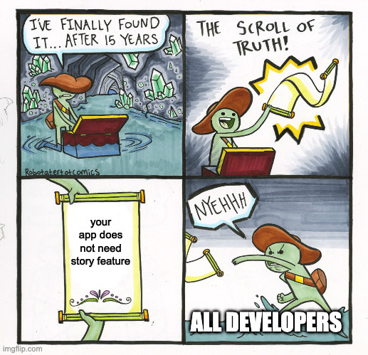

> "The functional content of a program must be continually increased to maintain user satisfaction."

**Why?**

- Users compare your software to **competitors**
- Expectations **rise** over time (remember when email was exciting?)
- Features that were "nice-to-have" become **expected**

**Example - CampusPal Features**

- **2018:** "Wow, I can see the cafeteria menu in real time!"
- **2025:** "Why can't the AI order my food, pay with Apple Pay, and track delivery in real-time? This app sucks."

Your software must **grow** or become irrelevant.

---

# Law VII - Declining Quality


> "The quality of a system will appear to decline unless it is rigorously maintained and adapted to operational environment changes."

**Why?**

- The **environment** evolves faster than the software
- New use cases expose **edge cases**
- Performance **degrades** as data/load grows
- Security vulnerabilities are **discovered**

**Example: CampusPal Registration**

- **2021:** Worked great for 500 beta testers.
- **2024:** Crashes every semester start because 30,000 students log in at once. The code didn't change, but the **load** did.

---

# Question

**A startup launches a mobile app. After 2 years of adding features (payment integration, multi-language support, analytics dashboard), the team notices that adding new features takes 3x longer than before.**

**Which of Lehman's Laws best explains this?**

A) Law I: Continuing Change
B) Law II: Increasing Complexity
C) Law VI: Continuing Growth
D) Law VII: Declining Quality

---

# Answer

**Which of Lehman's Laws best explains this?**

A) Law I: Continuing Change
B) Law II: Increasing Complexity
C) Law VI: Continuing Growth
D) Law VII: Declining Quality

**B) Law II: Increasing Complexity**

The system has accumulated **complexity** over 2 years. Without refactoring:

- Code becomes tangled (dependencies everywhere)
- Understanding the system requires more effort
- Changes have unexpected side effects
- Development **slows down**

---

# Question

**CampusPal was considered excellent when deployed in 2021. By 2024, students complain it's "getting worse" even though the code hasn't changed.**

**Which Lehman Law explains this?**

A) Law II: Increasing Complexity
B) Law VI: Continuing Growth
C) Law VII: Declining Quality
D) Law VIII: Feedback System

---

# Answer

**Which Lehman Law explains this?**

A) Law II: Increasing Complexity
B) Law VI: Continuing Growth
C) Law VII: Declining Quality
D) Law VIII: Feedback System

**C) Law VII: Declining Quality**

The **operational environment** changed:

- New phone OS versions broke UI scaling
- Student numbers doubled, slowing down the database
- Users expect Dark Mode and 2FA
- The system didn't adapt, so it **appears** worse.

---

# Question

**A company's project is 2 months behind schedule. Management decides to hire 15 new developers to "catch up". Three months later, the project is even more delayed.**

**Which Lehman Law explains this?**

A) Law III: Self-Regulation
B) Law IV: Conservation of Organizational Stability
C) Law V: Conservation of Familiarity
D) Law VI: Continuing Growth

---

# Answer

**Which Lehman Law explains this?**

A) Law III: Self-Regulation
B) Law IV: Conservation of Organizational Stability
C) Law V: Conservation of Familiarity
D) Law VI: Continuing Growth

**B) Law IV: Conservation of Organizational Stability**

The development rate is approximately **constant** regardless of resources:

- New developers need **onboarding** and training
- Communication overhead increases **exponentially**
- Existing developers spend time **mentoring** instead of coding
- This is also known as **Brooks' Law**: "Adding people to a late project makes it later"

---

# Question

**A team decides to release a major update with 50 new features at once. After deployment, bug reports explode, users are confused, and the support team is overwhelmed.**

**Which Lehman Law did they violate?**

A) Law II: Increasing Complexity
B) Law V: Conservation of Familiarity
C) Law VI: Continuing Growth
D) Law VII: Declining Quality

---

# Answer

**Which Lehman Law did they violate?**

A) Law II: Increasing Complexity
B) Law V: Conservation of Familiarity
C) Law VI: Continuing Growth
D) Law VII: Declining Quality

**B) Law V: Conservation of Familiarity**

Incremental change should be **approximately constant**:

- Users need time to **learn** new features
- Developers need time to **understand** the impact
- Too much change at once causes **confusion** and **instability**
- Better approach: **Small, frequent releases** instead of big-bang updates

---

# Question

**An e-commerce platform launched in 2020 with basic product listing and checkout. By 2024, competitors offer AI recommendations, same-day delivery tracking, and AR product previews. The platform's user base is shrinking despite having zero bugs.**

**Which Lehman Law explains this?**

A) Law I: Continuing Change
B) Law III: Self-Regulation
C) Law VI: Continuing Growth
D) Law VII: Declining Quality

---

# Answer

**Which Lehman Law explains this?**

A) Law I: Continuing Change
B) Law III: Self-Regulation
C) Law VI: Continuing Growth
D) Law VII: Declining Quality

**C) Law VI: Continuing Growth**

Functional content must be **continually increased** to maintain user satisfaction:

- Competitors set **new expectations**
- Features that were "amazing" become **baseline**
- Users compare your product to **current alternatives**, not past versions
- Standing still means **falling behind**

---

# Software Maintenance Types

**Software Maintenance** is the general process of changing a system after delivery.

### Types & Distribution

| Type                         | Description                                                | % of Effort |
| :--------------------------- | :--------------------------------------------------------- | :---------- |
| **Fault Repairs**            | Fixing coding errors or design defects (Bugs).             | ~17%        |
| **Environmental Adaptation** | Adapting to changes in hardware, OS, or support software.  | ~18%        |
| **Functionality Addition**   | Modifying the system to satisfy new business requirements. | ~65%        |

> **Key Insight:** "Maintenance" is mostly about **adding new features** (Evolution), not just fixing bugs.

---

# The Cost of Change

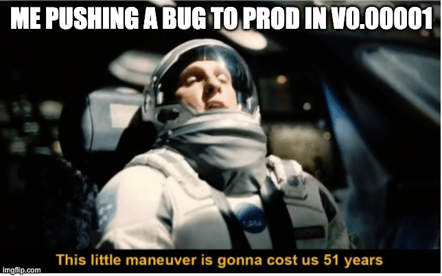

The **later** you find a problem, the **more expensive** it is to fix.

| Phase        | Relative Cost |
| :----------- | :------------ |
| Requirements | 1x            |
| Design       | 5x            |
| Coding       | 10x           |
| Testing      | 20x           |
| Production   | 100x          |

**Why?**

- **Ripple Effect:** A bug in requirements affects design, code, tests, docs
- **Context Switching:** Fixing code months later requires re-learning
- **Reputation:** Bugs in production damage user trust

---

# The Human Factor in Maintenance

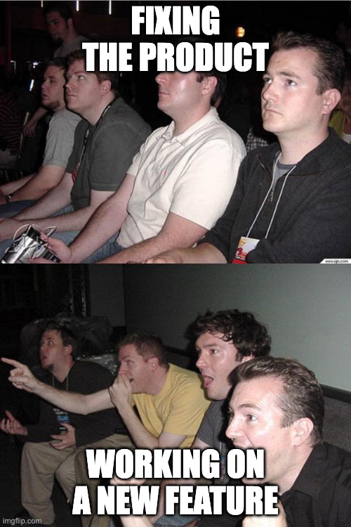

**Why is maintenance often hated?**

1.  **Poor Image:** Seen as "janitorial work" compared to new development.
2.  **Junior Staff:** Often assigned to new hires who don't understand the complex system.
3.  **No Incentive:** Developers are rewarded for shipping features, not for writing maintainable code.
4.  **Team Instability:** The original authors leave; new maintainers have to guess the intent.
5.  **Boring**: Fixing the code is not a pleasant process

> **CampusPal Reality:** "The senior dev wrote the complex 'Course Scheduler' and left. Now the junior dev is afraid to touch it."

---

# Legacy Systems


**Legacy System:** An old system that is still critical but relies on obsolete technology.

### Examples

- **Banking:** COBOL mainframes processing 95% of ATM transactions
- **Airlines:** Reservation systems written in the 1970s
- **Government:** Tax systems running on outdated databases
- **Healthcare:** Patient record systems with no modern API

### The Dilemma

- **Too risky to replace:** It works, hidden business logic may be lost
- **Too expensive to maintain:** Hard to find developers, slow, incompatible

---

# Legacy System Components


A legacy system is more than just old code:

1.  **System Hardware:** Old servers, mainframes
    - May require special cooling, power, skills
2.  **Support Software:** OS, databases, middleware
    - Windows XP still runs many industrial systems
3.  **Application Software:** The actual code
    - Often undocumented, no tests
4.  **Application Data:** Decades of accumulated data
    - Inconsistent formats, unclear semantics
5.  **Business Processes:** Workflows designed around the system

---

# Legacy System Strategies

When dealing with a legacy system, you have **four** strategic options:

| Strategy       | When to Use                | Risk   | Cost    |
| :------------- | :------------------------- | :----- | :------ |
| **Scrap**      | Low business value         | Low    | Low     |
| **Maintain**   | High quality, stable needs | Low    | Ongoing |
| **Reengineer** | High value, low quality    | Medium | Medium  |
| **Replace**    | Critical, unmaintainable   | High   | High    |

---

# Assessment Matrix

<div class="columns">

<div>
To decide the strategy, map the system on this grid:

|                  | Low Business Value      | High Business Value                             |
| :--------------- | :---------------------- | :---------------------------------------------- |
| **Low Quality**  | **Scrap** (Retire it)   | **Reengineer** (Improve quality) or **Replace** |
| **High Quality** | **Maintain** (or Scrap) | **Maintain** (Keep running)                     |

</div>

<div>

### Assessment Questions

**Technical Quality (Environment & Application):**

- **Supplier Stability:** Is the vendor still in business? (e.g., Oracle vs. defunct startup)
- **Failure Rate:** Does it crash often?
- **Age:** Is hardware/software obsolete?
- **Understandability:** Is the source code readable?
- **Data:** Is data duplicated or inconsistent?

**Business Value:**

- **Use:** How often is it used? (Daily vs. Yearly)
- **Criticality:** Does the business stop if this system fails? (e.g., Enrollment System)
- **Process Support:** Does it support efficient workflows?

</div>

</div>

---

# Software Reengineering

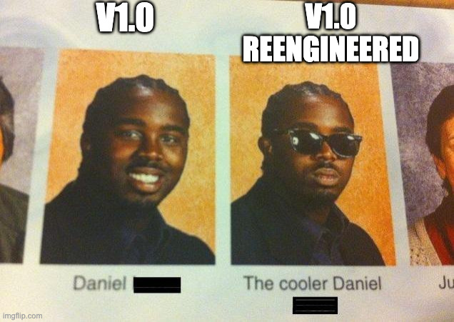

**Reengineering** improves a legacy system's structure and understandability _without_ changing its functionality.

**The Reengineering Process:**

1.  **Source Code Translation:** Convert to a modern language
2.  **Reverse Engineering:** Analyze code to recover lost design/docs.
3.  **Program Structure Improvement:** Simplify control flow, rename variables.
4.  **Program Modularization:** Group related parts, remove redundancy.
5.  **Data Reengineering:** Clean up and restructure the database.

**Benefits:**

- **Reduced Risk:** Less risky than building from scratch.
- **Reduced Cost:** Cheaper than full replacement.

---

# Practice - CampusPal Legacy Scenario

**Scenario:**
CampusPal has a "Library Fine Payment" module written in **Perl** by a student 10 years ago.

**Facts:**

- **Business Value:** Low. Only 5 students use it per month.
- **Technical Quality:** Very Low. No docs, crashes often.
- **Maintenance:** The only person who understands it graduated in 2016.

**Your Task:** What strategy should we use?

1.  Scrap
2.  Maintain
3.  Reengineer
4.  Replace

---

# Answer - CampusPal Legacy Scenario

**Decision:** **1. Scrap**

**Reasoning:**

- **Low Business Value + Low Quality = Scrap**
- Only 5 users/month can pay in person or use a 3rd-party link
- The cost of maintaining or replacing far exceeds the benefit

**Action Plan:**

1.  Notify the 5 affected users
2.  Set up a redirect to university's generic payment portal
3.  Archive the code
4.  Delete the module from production

---

# Practice - CampusPal "Dormitory" Legacy

**Scenario:**
The university's **Dormitory Management System** was written in **Classic ASP (VBScript)** in 2005. It is separate from CampusPal.

**Facts:**

- **Business Value:** Critical. Manages housing for 5,000 students ($20M revenue).
- **Technical Quality:** Medium. It works, but runs on an ancient Windows Server 2003.
- **Risk:** Security vulnerabilities, no developers available.

**Your Task:** What strategy should we use?

1.  Scrap
2.  Maintain
3.  Reengineer
4.  Replace

---

# Answer - CampusPal "Dormitory" Legacy

**Decision:** **3. Reengineer**

**Reasoning:**

- **High Business Value + Medium Quality = Reengineer**
- Can't scrap (too important for housing).
- Can't just maintain (security risk is too high).
- Full replacement is risky and expensive.

**Action Plan:**

1.  **Wrap** the legacy database with a modern API.
2.  **Migrate** the UI to CampusPal's React frontend.
3.  **Run both** systems in parallel during the transition.
4.  **Retire** the ASP code module by module.

---

<!-- _footer: "" -->
<!-- _header: "" -->
<!-- _paginate: false -->

<style scoped>
p { text-align: center}
h1 {text-align: center; font-size: 72px}
</style>

# Code Quality & Refactoring

---

# Refactoring vs. Re-engineering

| Feature       | Refactoring              | Re-engineering             |
| :------------ | :----------------------- | :------------------------- |
| **Scope**     | Small, localized changes | Large, system-wide changes |
| **Goal**      | Improve code structure   | Migrate to new technology  |
| **Behavior**  | Preserved exactly        | May be enhanced            |
| **Frequency** | Continuous (Daily)       | Rare (Every few years)     |
| **Risk**      | Low                      | High                       |
| **Tests**     | Required                 | Often rewritten            |

> **Refactoring** = Preventive medicine (regular checkups)
> **Re-engineering** = Major surgery (avoid if possible)

---

# What is Refactoring?

> "Refactoring is the process of changing a software system in a way that does not alter the external behavior of the code yet improves its internal structure." — Martin Fowler

**Key Points:**

- **Behavior stays the same** (tests still pass)
- **Structure improves** (easier to understand, modify, extend)
- **Done in small steps** (not a big rewrite)

**Common Refactorings:**

- Rename variable/function for clarity
- Extract method from long function
- Replace conditional with polymorphism
- Move method to appropriate class

---

# Refactoring Example - Before

```python
# CampusPal - Calculate event price with discounts
def calc(e, u):
    p = e.price
    if u.type == "student":
        if u.year == 1:
            p = p * 0.7
        else:
            p = p * 0.8
    elif u.type == "faculty":
        p = p * 0.9
    if e.early_bird and datetime.now() < e.early_bird_deadline:
        p = p * 0.95
    return p
```

**Problems:**

- Confusing variable names (`e`, `u`, `p`)
- Deeply nested conditions
- Magic numbers (0.7, 0.8, 0.9, 0.95)

---

# Refactoring Example - After

```python
# CampusPal - Calculate event price with discounts
DISCOUNT_FIRST_YEAR_STUDENT = 0.30
DISCOUNT_STUDENT = 0.20
DISCOUNT_FACULTY = 0.10
DISCOUNT_EARLY_BIRD = 0.05

def calculate_event_price(event: Event, user: User) -> float:
    base_price = event.price
    user_discount = _get_user_discount(user)
    early_bird_discount = _get_early_bird_discount(event)

    final_price = base_price * (1 - user_discount) * (1 - early_bird_discount)
    return round(final_price, 2)

def _get_user_discount(user: User) -> float:
    if user.type == "student" and user.year == 1:
        return DISCOUNT_FIRST_YEAR_STUDENT
    elif user.type == "student":
        return DISCOUNT_STUDENT
    elif user.type == "faculty":
        return DISCOUNT_FACULTY
    return 0.0
```

---

# Code Smells

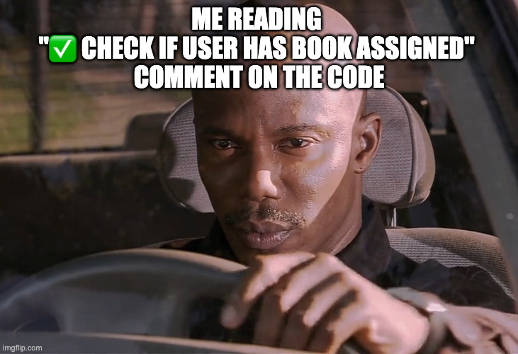

**Code Smell:** A surface indication that usually corresponds to a deeper problem in the system. (Martin Fowler)

> Smells are **not bugs**. The code works. But it's **hard to evolve**.

### Categories of Smells

1.  **Bloaters:** Code that has grown too large
2.  **Object-Orientation Abusers:** Misuse of OO principles
3.  **Change Preventers:** Code that makes changes hard
4.  **Dispensables:** Unnecessary code
5.  **Couplers:** Excessive coupling between classes

---

# Bloaters

Code that has grown so large it cannot be handled effectively.

### 1. Long Method

- Function > 20-30 lines
- **Fix:** Extract smaller methods

### 2. Large Class

- Class with 1000+ lines, 50+ methods
- Does too many things
- **Fix:** Split into smaller, focused classes

### 3. Long Parameter List

- Function with 5+ parameters
- **Fix:** Use a parameter object or Builder pattern

---

# Practice - Identify the Code Smells

```python
class OrderManager:
    def __init__(self):
        self.orders = {}
        self.customers = {}
        self.products = {}
        self.invoices = {}
        self.shipments = {}
        # ... 50 more attributes

    def create_order(self, cust_id, prod_id, qty, addr, city, zip,
                     country, phone, email, notes, priority, ...):  # 15 parameters
        # ... 200 lines of order creation code ...

    def process_payment(self, ...):
        # ... 150 lines ...

    def ship_order(self, ...):
        # ... 100 lines ...

    def send_notification(self, ...):
        # ... 50 lines ...

    # ... 40 more methods ...
```

---

# Answer - Identify the Smells

**Smells Present:**

1.  **Large Class**

    - `OrderManager` does EVERYTHING: create, pay, ship, notify
    - Should be split into: `OrderService`, `PaymentService`, `ShippingService`, `NotificationService`

2.  **Long Parameter List**

    - `create_order()` has 15+ parameters
    - Should use an `OrderRequest` object

3.  **Long Methods**
    - `create_order()` is 200 lines
    - Should be broken into: `validate_order()`, `reserve_inventory()`, `calculate_total()`, etc.

---

# Clean Code Rules

<div class="columns">

<div>

### Naming

- Use **intention-revealing** names
- Avoid abbreviations (`usr` → `user`)
- Use **pronounceable** names
- Class names = **nouns**, method names = **verbs**

### Functions

- **Small** - Do one thing only
- **Few parameters** - Ideally 0-2
- **No side effects** - Don't surprise the reader
- **DRY** - Don't Repeat Yourself

</div>

<div>

### Comments

- Code should be **self-documenting**
- Don't comment bad code, **rewrite it**
- Good comments: legal, intent, clarification
- Bad comments: redundant, misleading, noise

### General

- **Boy Scout Rule** - Leave code cleaner than you found it
- **KISS** - Keep It Simple, Stupid
- **YAGNI** - You Aren't Gonna Need It
- **Fail fast** - Detect errors early

</div>

</div>

---

# Technical Debt

**Technical Debt** is the implied cost of additional rework caused by choosing an easy solution now instead of a better approach.


### The Debt Quadrant

**Prudent + Deliberate** is sometimes acceptable.
**Reckless + Inadvertent** is a sign of inexperience.

---

# Managing Technical Debt


### Track It

- Create `TODO` comments
- Use a technical debt backlog in Jira/GitHub
- Tag issues with "tech-debt" label

### Pay It Down

- **Boy Scout Rule:** Leave code better than you found it
- Allocate **~20%** of late sprints' capacity to refactoring
- Refactor before adding new features in the same area

### Avoid Accumulating It

- Code reviews catch shortcuts early
- Automated tests enable safe refactoring
- Design discussions before coding

---

<!-- _footer: "" -->
<!-- _header: "" -->
<!-- _paginate: false -->

<style scoped>
p { text-align: center}
h1 {text-align: center; font-size: 72px}
</style>

# Version Control & Release Management

---

# Recap: Version Control (from Week 2)

> **Version control** is a system that records changes to files over time so you can recall specific versions later.

### Core Concepts

1.  **Working Directory**: Where you edit files.
2.  **Staging Area**: Preparing changes (`git add`).
3.  **Local Repository**: Your saved history (`git commit`).
4.  **Remote Repository**: Shared history on GitHub (`git push`).

### Why It Matters?

- **Track Changes**: Who changed what, when, and why.
- **Collaborate**: Merge work from multiple developers.
- **Recover**: Undo mistakes and time-travel.

---

# Recap: The Basic Git Workflow

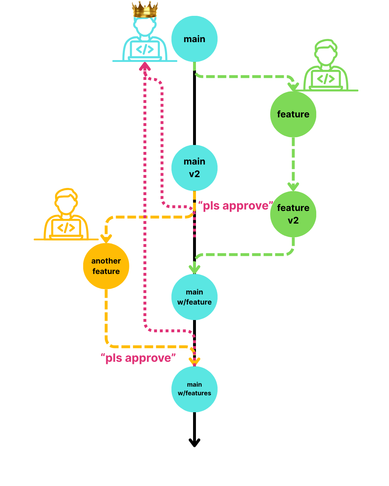

1.  **Branch:** Create `feature/login` from `main`.
2.  **Work:** Make changes and `git add`.
3.  **Commit:** `git commit -m "Add login form"`.
4.  **Push:** Send to GitHub.
5.  **PR & Merge:** Review and merge back to `main`.

**Now, let's look at advanced strategies for long-term Software Evolution.**

---

# Git Workflows - Gitflow

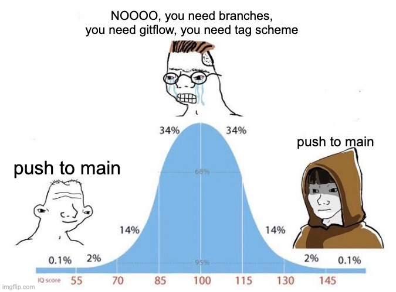

**Gitflow** is a strict branching model for scheduled releases.

### Branches

- **`main`**: Production-ready code only
- **`develop`**: Integration branch for features
- **`feature/*`**: One branch per feature
- **`release/*`**: Preparing a new release
- **`hotfix/*`**: Emergency fixes to production

### Flow

1.  Branch `feature/login` from `develop`
2.  Work on feature, merge back to `develop`
3.  When ready, create `release/v1.0` from `develop`
4.  Test, fix bugs in release branch
5.  Merge `release/v1.0` to `main` AND `develop`
6.  Tag `main` as `v1.0`

---

# Git Workflows - Trunk-Based Development

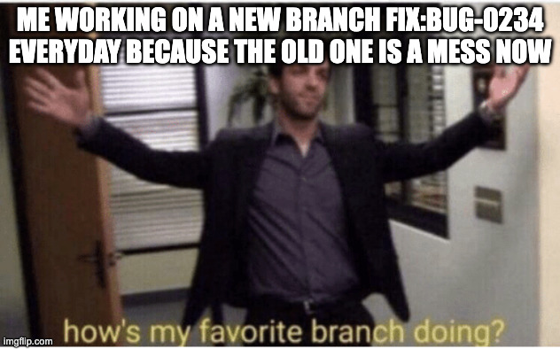

**Trunk-Based Development** is a simpler model for continuous delivery.

### Branches

- **`main`** (trunk): The only long-lived branch. Always deployable.
- **Short-lived feature branches**: Merged within 1-2 days

### Key Practices

- **Feature Flags**: Hide unfinished code behind toggles
- **Small commits**: Easier to review and revert
- **Strong CI**: Tests run on every push

### Who Uses This?

Google, Meta, Netflix, Amazon, etc. Basically companies that deploy multiple times per day.

---

# Gitflow vs. Trunk-Based: When to Use?

| Aspect              | Gitflow                             | Trunk-Based                |
| :------------------ | :---------------------------------- | :------------------------- |
| **Release Cycle**   | Scheduled (monthly, quarterly)      | Continuous (daily, hourly) |
| **Team Size**       | Any                                 | Works best with strong CI  |
| **Risk Tolerance**  | Lower (more gates)                  | Higher (relies on tests)   |
| **Merge Conflicts** | More frequent (long-lived branches) | Less frequent              |
| **Best For**        | Mobile apps, packaged software      | Web services, SaaS         |

---

# Feature Flags

How do you merge unfinished code without breaking production?

```typescript
// CampusPal: New recommendation feature (in development)

function getEventRecommendations(user: User): Event[] {
  if (featureFlags.isEnabled("new_recommendations", user)) {
    // New algorithm (only enabled for beta testers)
    return newRecommendationEngine.recommend(user);
  } else {
    // Old algorithm (stable)
    return legacyRecommendations.recommend(user);
  }
}
```

### Benefits

- Merge code to `main` early (no long-lived branches)
- Test in production with real data (for 1% of users)
- Instant rollback if something breaks (flip the flag)

---

# Semantic Versioning

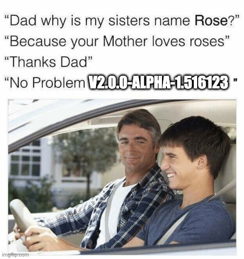

How do you communicate what changed between versions?

**Format:** `MAJOR.MINOR.PATCH` (e.g., `v2.4.1`)

| Component | When to Increment                  | Example                    |
| :-------- | :--------------------------------- | :------------------------- |
| **MAJOR** | Breaking changes                   | Removed `getUser()` API    |
| **MINOR** | New features (backward compatible) | Added `getUserProfile()`   |
| **PATCH** | Bug fixes (backward compatible)    | Fixed crash in `getUser()` |

### Pre-release Labels

- `v2.0.0-alpha.1`: Early testing, unstable
- `v2.0.0-beta.1`: Feature complete, testing
- `v2.0.0-rc.1`: Release candidate, final testing

---

# Question

**Your library is at version `v1.5.3`. You just:**

1.  Fixed a bug in the `search()` function
2.  Added a new `filter()` function
3.  Renamed `sort()` to `orderBy()` (breaking change)

**What should the new version be?**

A) `v1.5.4`
B) `v1.6.0`
C) `v2.0.0`
D) `v1.6.4`

---

# Answer

**What should the new version be?**

A) `v1.5.4`
B) `v1.6.0`
C) `v2.0.0`
D) `v1.6.4`

**C) `v2.0.0`**

**Reasoning:**

- Bug fix = PATCH (+0.0.1)
- New feature = MINOR (+0.1.0)
- **Breaking change = MAJOR (+1.0.0)**

The **breaking change** trumps everything. Users need to know their code might break.

---

<!-- _footer: "" -->
<!-- _header: "" -->
<!-- _paginate: false -->

<style scoped>
p { text-align: center}
h1 {text-align: center; font-size: 72px}
</style>

# Software Quality Management

---

# What is Software Quality?

**Quality is subjective.** Different stakeholders care about different things.

| Stakeholder    | Quality Means...                         |
| :------------- | :--------------------------------------- |
| **User**       | It works, it's fast, it's easy to use    |
| **Developer**  | Code is readable, testable, maintainable |
| **Manager**    | Delivered on time, within budget         |
| **Operations** | Stable, recoverable, secure              |

### 15 Quality Attributes (Boehm, et al. 1978)

Safety, Security, Reliability, Resilience, Robustness, Understandability, Testability, Adaptability, Modularity, Complexity, Portability, Usability, Reusability, Efficiency, Learnability.

> **Trade-off:** You cannot optimize all of these. Improving robustness may reduce performance.

---

# The Quality Plan

A **Quality Plan** sets out the desired software qualities and how they will be assessed.

1.  **Product Introduction:** Product description and quality expectations.
2.  **Product Plans:** Critical release dates and responsibilities.
3.  **Process Descriptions:** Processes and standards to be used.
4.  **Quality Goals:** Critical quality attributes (e.g., reliability > efficiency).
5.  **Risk Management:** Risks to quality and mitigation actions.

---

# QA vs. QC

In manufacturing:

- **Quality Assurance (QA):** Defining processes/standards to _prevent_ defects.
- **Quality Control (QC):** Checking products to _detect_ defects.

In Software Engineering:

- The term "Quality Control" is often avoided.
- **Software Quality Management** encompasses both:
  1.  **Quality Assurance:** Establishing organizational procedures and standards.
  2.  **Quality Planning:** Selecting applicable procedures/standards for a project.
  3.  **Quality Control (often called V&V):** Checking that procedures were followed and software meets standards.

> **Key Goal:** QA provides an **independent check** on the development process.

---

# Process-Based Quality

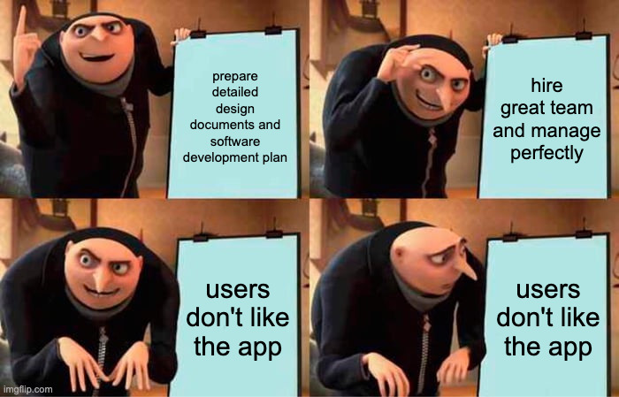

**The Assumption:** "Good processes lead to good products."

- **Manufacturing:** True. Tune the machine, get consistent widgets.
- **Software:** More complex. Software is _design_, not manufacture.
  - Creativity matters: A great process can't fix a bad design idea.
  - **However:** Poor processes (no testing, no version control) almost guarantee bad software.

---

# Software Standards

Standards capture wisdom and best practices. They are the foundation of QA.

> "Standards and processes are important but quality managers should also aim to develop a **'quality culture'** where everyone is committed to achieving a high level of product quality." — Sommerville

### 1. Product Standards

Define the structure and format of the outputs.

- **Document standards:** Structure of requirements, design docs.
- **Documentation standards:** Comment headers, variable naming.
- **Coding standards:** Java/Python style guides (e.g., PEP 8).

### 2. Process Standards

Define the processes to be followed.

- **Design review process:** How reviews are conducted.
- **Release process:** Steps to build and release software.
- **Change control process:** How to handle change requests.

---

# Reviews and Inspections

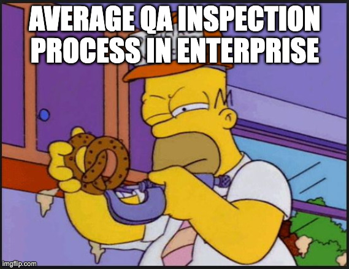

**Reviews** are QA activities to check deliverables (code, docs) for errors and standards conformance.

### The Review Process

1.  **Pre-review Activities:** Planning, distributing documents, individual preparation (reading code).
2.  **The Review Meeting:** Author walks through the code/doc with the team. Discuss issues. Duration: < 2 hours.
3.  **Post-review Activities:** Fixing discovered bugs, refactoring, verifying fixes.

### Inspection Roles

- **Author:** The person who wrote the code.
- **Inspector:** Paraphrases the code aloud.
- **Scribe:** Records discovered errors and issues.
- **Moderator:** Chairs the meeting, ensures process is followed.

_usually not like this unless you have HR department_

---

# Inspection Checklists

Reviewers should use a checklist to catch specific types of errors.

**1. Data Faults:**

- Are all variables initialized?
- Are array bounds checked? (Buffer overflow risk)

**2. Control Faults:**

- Do loops terminate?
- Are compound statements correctly bracketed?

**3. Interface Faults:**

- Do function arguments match parameter types?
- Is the return value used correctly?

**4. Exception Management:**

- Are all possible error conditions taken into account?

---

# Practice - Code Review

**You're reviewing this CampusPal code. Find at least 5 issues.**

```javascript
function addStudentEvent(event) {
  var d = new Date();
  if (event.date < d) return false;
  db.save(event);
}
```

---

# Answer - Code Review

**Issues Found:**

1.  **Naming:** `addStudentEvent` is better, but `d` is still meaningless
2.  **No type hints:** What is `event`?
3.  **`var` usage:** Should use `const` or `let`
4.  **No async handling:** `db.save()` is likely async
5.  **No error handling:** What if `db.save()` fails?
6.  **No input validation:** What if `event` is null?
7.  **No return value:** Does `db.save()` succeed?
8.  **Magic comparison:** How does `event.date < d` work? Type casting?

---

# Software Measurement & Metrics

**Software Measurement:** Deriving a numeric value for an attribute of a software system.

### Measurement Ambiguity

Data can be misinterpreted. Context is crucial.

- **Example:** High number of change requests. \* _Interpretation A:_ The software is buggy and doesn't meet needs. \* _Interpretation B:_ The software is useful, and engaged users want more features.
  > "You can't control what you can't measure." — Tom DeMarco (But measure carefully!)

---

# Practice

**Scenario:**
You are the Quality Manager for CampusPal. You see the following data trend over the last 3 months:

- **Defect Count:** Increased by 20%
- **Usage (Daily Active Users):** Increased by 50%
- **Customer Support Tickets:** Stable (No change)

**Question:** Is the software quality declining?

1.  **Yes:** More defects means worse code.
2.  **No:** Defects are proportional to usage; stability suggests bugs are minor.
3.  **Maybe:** Need to check defect severity (Critical vs. Cosmetic).

_(Discuss with your neighbor)_

---

# Answer

**Best Answer: 2 or 3 (Context matters)**

- **Why it might NOT be declining:**
  - More users = more eyes finding existing bugs (Law I).
  - If Support Tickets are stable, users aren't frustrated enough to complain.
- **Why it might be declining:**
  - The 20% increase might be critical crashes.
- **Lesson:** Absolute numbers (count) are misleading. Use **Defect Density** (Defects per 1000 users or per 1000 lines of code).

---

# Types of Metrics

1.  **Control Metrics (Process):** Support process management.

    - _Examples:_ Average effort, time to repair defects.
    - _Use:_ Deciding if process changes are needed.

2.  **Predictor Metrics (Product):** Predict characteristics of the software.
    - _Examples:_ Cyclomatic complexity, Lines of Code (LOC).
    - _Use:_ Estimating effort, predicting maintainability.

> **Goal:** Use internal attributes (e.g., Complexity) to predict external attributes (e.g., Maintainability).

### Component Analysis Process

1.  **Choose measurements:** (GQM).
2.  **Select components:** Representative or critical parts.
3.  **Measure characteristics:** Use automated tools.
4.  **Identify anomalies:** High/low values relative to baseline.
5.  **Analyze anomalies:** Decide if action is needed.

---

# Product Metrics - Dynamic vs. Static

### 1. Dynamic Metrics

Measured during **program execution**.

- **Execution time:** Efficiency.
- **Memory usage:** Resource utilization.
- **Mean Time To Failure (MTTF):** Reliability.

### 2. Static Metrics

Measured by **analyzing the code/docs** (no execution).

- **Fan-in / Fan-out:** Coupling.
- **Length of Code (LOC):** Size/Complexity.
- **Cyclomatic Complexity:** Control complexity.
- **Length of Identifiers:** Readability.
- **Depth of Conditional Nesting:** Understandability.
- **Fog Index:** Readability of documentation.

---

# Product Metrics: Cyclomatic Complexity

**Cyclomatic Complexity** measures the number of independent paths through code.

**Simple Rule:** Start at 1, add 1 for each:

- `if`, `else if`, `for`, `while`, `case`
- `&&`, `||`, `?:`

**Thresholds:**

- 1-10: Simple, low risk
- 11-20: Moderate complexity
- 21-50: High complexity, hard to test
- 51+: Untestable, must refactor

---

# Practice

**What is the Cyclomatic Complexity?**

```python
def categorize_event(event):
    if event.attendees > 100:
        if event.is_paid:
            return "large_commercial"
        else:
            return "large_free"
    elif event.attendees > 20:
        return "medium"
    else:
        if event.category == "workshop":
            return "small_workshop"
        elif event.category == "social":
            return "small_social"
        else:
            return "small_other"
```

---

# Answer

```python
def categorize_event(event):
    if event.attendees > 100:                    # +1
        if event.is_paid:                        # +1
            return "large_commercial"
        else:
            return "large_free"
    elif event.attendees > 20:                   # +1
        return "medium"
    else:
        if event.category == "workshop":         # +1
            return "small_workshop"
        elif event.category == "social":         # +1
            return "small_social"
        else:
            return "small_other"
```

**Cyclomatic Complexity = 1 (base) + 5 (branches) = 6**

This is acceptable (< 10), but the nested ifs could be refactored.

---

# Object-Oriented Metrics (CK Metrics)

Chidamber & Kemerer defined 6 metrics for OO design:

| Metric   | Meaning                     | Goal                         |
| :------- | :-------------------------- | :--------------------------- |
| **WMC**  | Weighted Methods per Class  | Low = Simple class           |
| **DIT**  | Depth of Inheritance Tree   | Low-Medium (< 5)             |
| **NOC**  | Number of Children          | Moderate (reuse vs. testing) |
| **CBO**  | Coupling Between Objects    | Low = Independent            |
| **RFC**  | Response For a Class        | Low = Simple interaction     |
| **LCOM** | Lack of Cohesion in Methods | Low = High cohesion          |

---

# The GQM Approach

Don't measure everything. Use **Goal-Question-Metric** to define useful metrics.

### Example - Improving System Reliability

**Goal:** Reduce production failures

**Questions:**

- How often does the system return errors?
- What is the response time distribution?
- How quickly do we recover from failures?

**Metrics:**

- Error rate per 1000 requests
- P99 latency in milliseconds (the 99th percentile of response times in a system)
- Mean Time To Recovery (MTTR)

---

# Software Reliability Metrics

| Metric           | Formula                    | Goal                    |
| :--------------- | :------------------------- | :---------------------- |
| **MTTF**         | Mean Time To Failure       | Higher = More reliable  |
| **MTTR**         | Mean Time To Repair        | Lower = Faster recovery |
| **MTBF**         | Mean Time Between Failures | Higher = More reliable  |
| **Availability** | MTTF / (MTTF + MTTR)       | Closer to 1 = Better    |

### The "Nines" of Availability

| Availability         | Downtime/Year | Downtime/Month |
| :------------------- | :------------ | :------------- |
| 99% (two nines)      | 3.65 days     | 7.3 hours      |
| 99.9% (three nines)  | 8.76 hours    | 43.8 min       |
| 99.99% (four nines)  | 52.6 min      | 4.38 min       |
| 99.999% (five nines) | 5.26 min      | 26.3 sec       |

---

# Static Analysis Tools

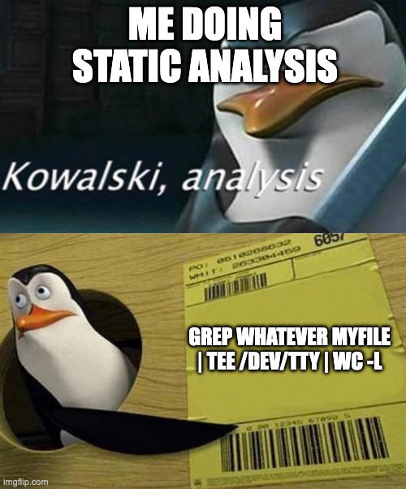

Find bugs **without** running the code.

### Linters

- **ESLint** (JavaScript/TypeScript)
- **Pylint, Flake8, Ruff** (Python)
- **Checkstyle** (Java)

### Security Scanners (SAST)

- **SonarQube:** Multi-language analysis
- **Bandit:** Python security linter
- **CodeQL:** GitHub's semantic analysis

### Formatters

- **Prettier:** JavaScript/TypeScript
- **Black:** Python
- Ensures consistent style

---

# Static Analysis Example

```python
# Before running Pylint

def calculate_gpa(grades):
    result = 0
    for i in range(len(grades)):
        if grades[i] > 0:
            result = result + grades[i]
    return result / len(grades)

# Pylint output:
# C0103: Variable name "i" doesn't conform to snake_case (invalid-name)
# C0200: Consider using enumerate instead of iterating with range and len
```

```python
# After fixing

def calculate_gpa(grades: list[float]) -> float:
    """Calculate Grade Point Average from a list of grades."""
    if not grades:
        return 0.0
    valid_grades = [g for g in grades if g > 0]
    return sum(valid_grades) / len(grades)
```

---

<!-- _footer: "" -->
<!-- _header: "" -->
<!-- _paginate: false -->

<style scoped>
p { text-align: center}
h1 {text-align: center; font-size: 72px}
</style>

# CI/CD & DevOps

---

# The Wall of Confusion

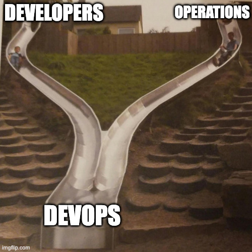

Traditionally, Development and Operations were separate teams with conflicting goals.

<div class="columns">

<div>

### Developers (Dev)

- **Goal:** Ship features fast
- **Mindset:** "It works on my machine"
- **Fear:** Slow release cycles

</div>

<div>

### Operations (Ops)

- **Goal:** Keep systems stable
- **Mindset:** "Don't touch production"
- **Fear:** Outages and incidents

</div>

</div>

**DevOps** breaks down this wall:

- Same team builds AND operates
- Shared responsibility for uptime
- Automation replaces manual processes

---

# Continuous Integration (CI)

**CI:** Developers merge code to `main` frequently (at least daily), and every merge triggers automated builds and tests.

### Principles

1.  **Single Source of Truth:** All code in one repo
2.  **Automate the Build:** No manual steps
3.  **Self-Testing Build:** Tests run automatically
4.  **Fix Broken Builds Immediately:** Priority #1
5.  **Everyone Commits Daily:** Small, frequent changes

### Benefits

- Bugs caught early (cheaper to fix)
- Always have a working version
- Reduced "integration hell"

---

# The CI/CD Pipeline

A pipeline is a sequence of automated stages:

```
┌──────────┐    ┌──────────┐    ┌──────────┐    ┌──────────┐    ┌──────────┐
│  Commit  │───>│  Build   │───>│   Test   │───>│ Package  │───>│  Deploy  │
└──────────┘    └──────────┘    └──────────┘    └──────────┘    └──────────┘
     │               │               │               │               │
  Push to        npm install      npm test      Docker build      Deploy to
    Git          npm build        Lint check    Push to registry   Staging
```

**Key Rule:** If any stage fails, the pipeline stops. ("Fail Fast")

---

# CI Pipeline Example (GitHub Actions)

```yaml
# .github/workflows/ci.yml
name: CampusPal CI

on: [push, pull_request]

jobs:
  build-and-test:
    runs-on: ubuntu-latest
    steps:
      - uses: actions/checkout@v4

      - name: Setup Node.js
        uses: actions/setup-node@v4
        with:
          node-version: "20"

      - name: Install Dependencies
        run: npm ci

      - name: Run Linter
        run: npm run lint

      - name: Run Tests
        run: npm test -- --coverage

      - name: Build
        run: npm run build
```

---

# Continuous Delivery vs. Continuous Deployment

| Aspect                | Continuous Delivery    | Continuous Deployment        |
| :-------------------- | :--------------------- | :--------------------------- |
| **Automation**        | Build, Test, Package   | Build, Test, Package, Deploy |
| **Production Deploy** | Manual (click button)  | Automatic                    |
| **Risk**              | Lower (human approval) | Higher (fully automated)     |
| **Speed**             | Fast                   | Fastest                      |
| **Requirements**      | Good tests             | Excellent tests + monitoring |

Most companies start with **Continuous Delivery** and evolve to **Continuous Deployment** as confidence grows.

---

# Deployment Strategies

### 1. Blue/Green Deployment

- Run two identical environments (Blue = current, Green = new)
- Switch traffic from Blue to Green instantly
- If problems, switch back immediately

### 2. Canary Deployment

- Release to 1% of users first
- Monitor for errors
- Gradually increase (5% → 25% → 100%)
- **Why "Canary"?** Canaries detected toxic gas in mines

### 3. Rolling Deployment

- Replace instances one at a time
- Always have some instances running
- Slower but uses fewer resources

---

# Practice - Design a Pipeline

**Scenario:** You're setting up CI/CD for a CampusPal feature that analyzes event reviews and flags inappropriate content.

**Task:** Put these steps in the correct order:

A) Deploy to staging
B) Run unit tests
C) Install dependencies
D) Train/load the analysis model
E) Lint code
F) Evaluate accuracy (fail if < 85%)
G) Run integration tests
H) Deploy to production (manual approval)

---

# Answer - Design a Pipeline

**Correct Order:**

1.  **C) Install dependencies** (Setup)
2.  **E) Lint code** (Fail fast on syntax)
3.  **B) Run unit tests** (Fast feedback)
4.  **D) Train/load model** (Expensive, only if tests pass)
5.  **F) Evaluate accuracy** (Quality gate)
6.  **G) Run integration tests** (End-to-end)
7.  **A) Deploy to staging** (Safe environment)
8.  **H) Deploy to production** (With manual approval)

**Key Principle:** Order by speed and cost. Fail fast on cheap checks.

---

# Infrastructure as Code (IaC)

Treat infrastructure like software: version controlled, reviewed, tested.

### Benefits

- **Reproducibility:** Same config → Same infrastructure
- **Version Control:** Track who changed what, when
- **Automation:** No manual clicking in cloud consoles
- **Documentation:** Code IS the documentation

### Tools

- **Terraform:** Define cloud resources (AWS, GCP, Azure)
- **Ansible:** Configure servers
- **Docker:** Containerize applications
- **Kubernetes:** Orchestrate containers

---

# Summary

To handle **Software Evolution** effectively, we need:

| Challenge           | Solution                                    |
| :------------------ | :------------------------------------------ |
| Code changes        | **Version Control** (Git, SemVer)           |
| Growing complexity  | **Refactoring** (Fight code smells)         |
| Quality degradation | **Metrics & Reviews** (Measure and inspect) |
| Manual errors       | **CI/CD** (Automate everything)             |
| Slow feedback       | **DevOps Culture** (Break down silos)       |

> **Lehman's Laws tell us evolution is inevitable. Our job is to manage it.**

---

# Key Takeaways

1.  **Software evolution is inevitable.** Plan for change from Day 1.
2.  **Complexity grows unless you fight it.** Refactor regularly.
3.  **Legacy systems are everywhere.** Learn to assess and transform them.
4.  **Version control everything:** Code, configs, infrastructure.
5.  **Automate quality checks:** Linting, testing, security scanning.
6.  **Measure what matters:** Use GQM to define useful metrics.
7.  **CI/CD is the standard:** Automate build, test, and deployment.

---

<!-- _class: lead -->

# Thank You!

## Contact Information

- **Email:** ekrem.cetinkaya@yildiz.edu.tr
- **Office Hours:** Tuesday 14:00-16:00 - Room F-B21
- **Book a slot before coming:** [Booking Link](https://calendar.app.google/aBKvBqNAqG12oD2B9)
- **Course Repository:** [GitHub](https://github.com/ekremcet/yzm2021-principles-of-software-engineering)
