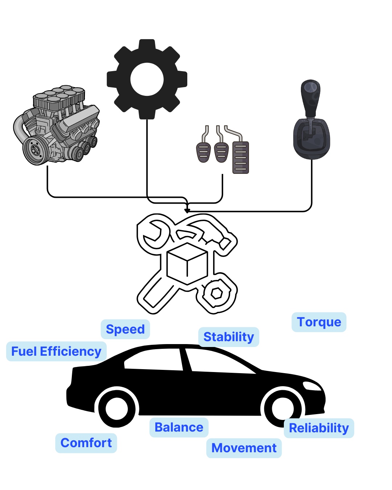
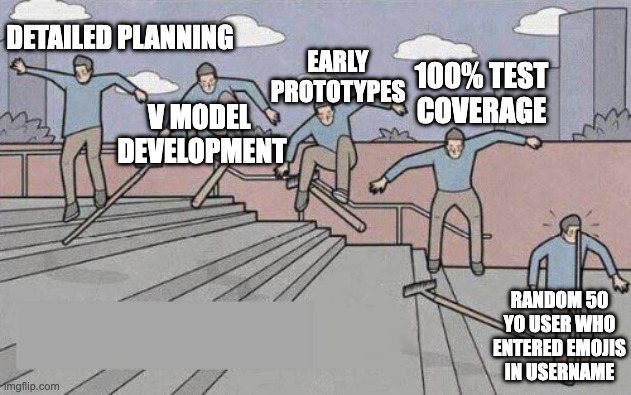
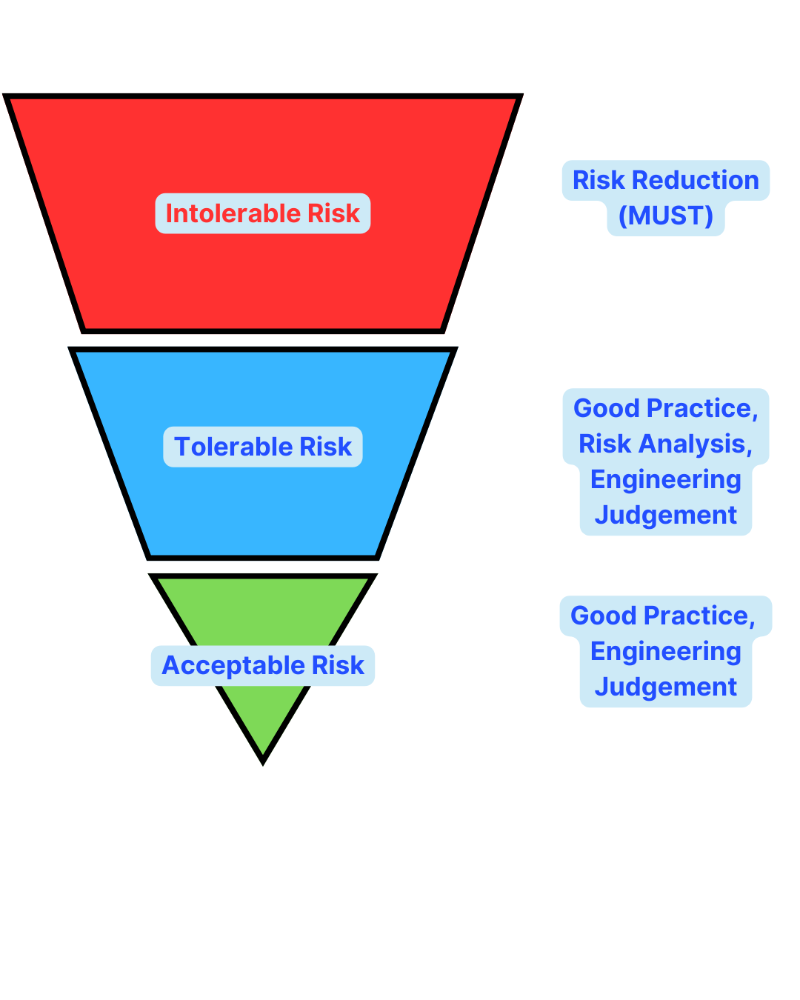
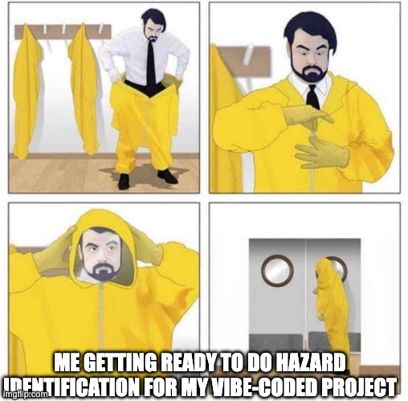
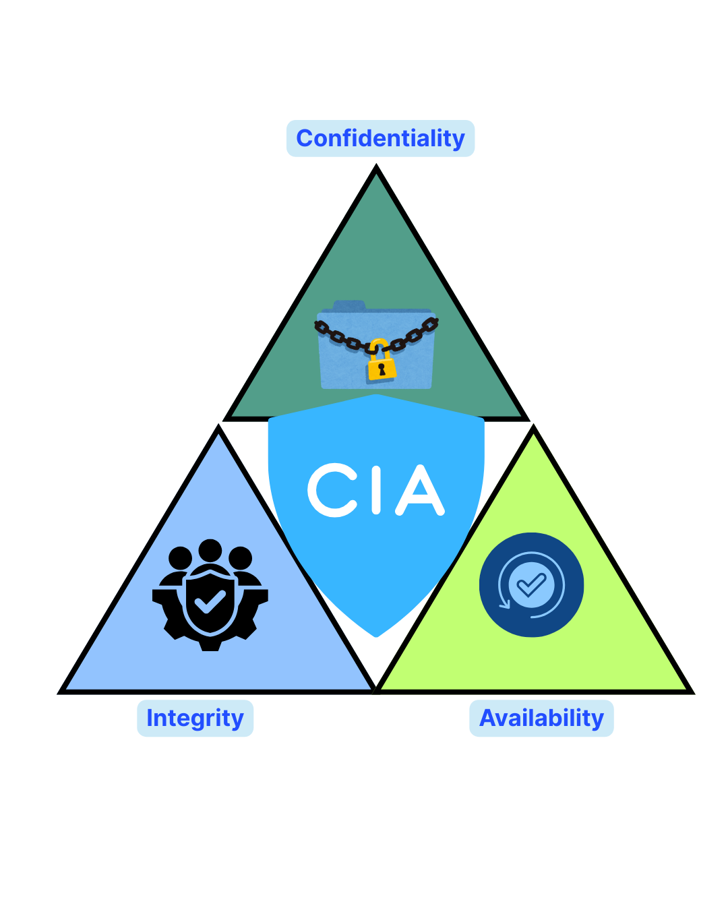
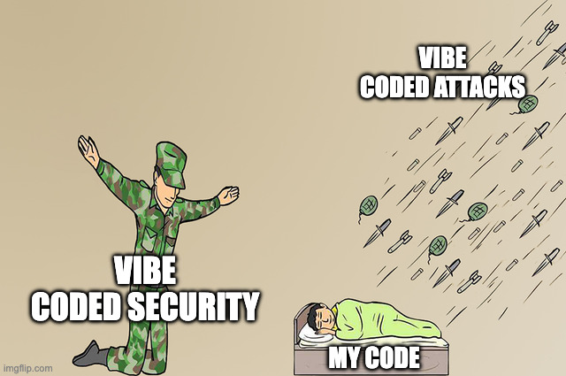
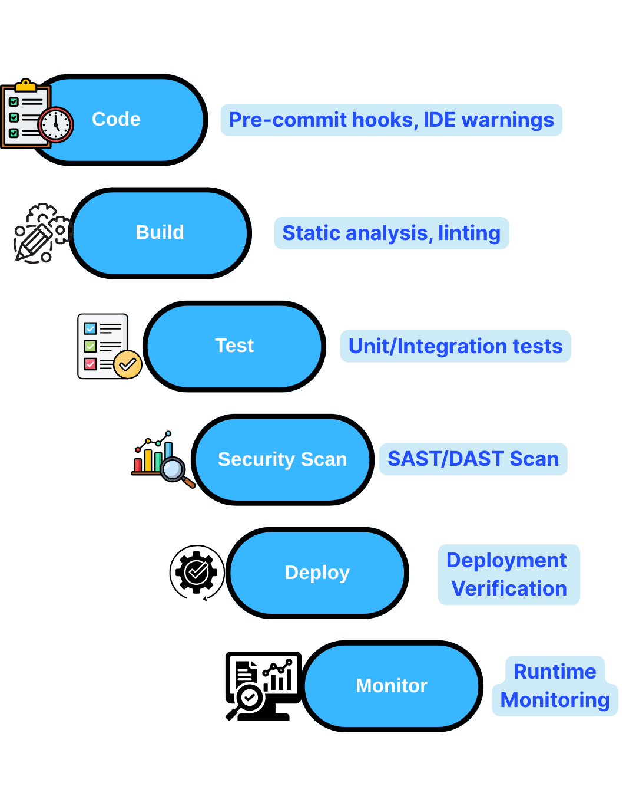

# Week 12: Dependability and Security

## YZM2021 - Software Engineering Principles

**Instructor:** Ekrem Çetinkaya
**Date:** 16.12.2025

---

# Today's Learning Outcomes

By the end of this lecture, you will be able to:

1.  **Explain** sociotechnical systems and identify their layers
2.  **Define** and differentiate availability, reliability, safety, and security
3.  **Distinguish** between faults, errors, and failures
4.  **Perform** basic risk assessment and hazard identification
5.  **Apply** the CIA triad to analyze security requirements
6.  **Design** fault-tolerant systems using redundancy and diversity
7.  **Identify** common security vulnerabilities and apply secure coding practices
8.  **Construct** basic safety arguments with claims, evidence, and reasoning

---

<!-- _footer: "" -->
<!-- _header: "" -->
<!-- _paginate: false -->
<!-- _class: lead -->

<style scoped>
p { text-align: center}
h1 {text-align: center; font-size: 72px}
</style>

# Sociotechnical Systems

---

# What is a Sociotechnical System?

> Software systems do not exist in isolation. They operate within organizations, are used by people, and interact with other systems.

### Definition

A **sociotechnical system** is a system that includes:

- **Technical components:** Hardware, software, networks, databases
- **Social components:** People, processes, organizations, regulations, culture

### Why Does This Matter?

- A technically perfect system can fail due to human factors
- Organizational policies affect how software is used
- Legal requirements constrain system design
- Culture influences adoption and trust

---

# The Sociotechnical Stack

| Layer                  | Description              | Example (CampusPal)                    |
| :--------------------- | :----------------------- | :------------------------------------- |
| **Equipment**          | Physical hardware        | Servers, student phones, campus kiosks |
| **Operating System**   | System software          | Linux servers, iOS, Android            |
| **Communications**     | Network infrastructure   | University WiFi, cellular, REST APIs   |
| **Data Management**    | Databases, storage       | PostgreSQL, Redis cache, file storage  |
| **Application**        | The software itself      | CampusPal web app, mobile apps         |
| **Business Processes** | Workflows supported      | Event registration, grade viewing      |
| **Organization**       | Policies, departments    | IT policies, student affairs rules     |
| **Society**            | Laws, regulations, norms | GDPR, KVKK, accessibility laws         |

> A failure at ANY layer can bring down the entire system.

---

# Case Study - The London Ambulance System (1992)

### What Happened?

- London Ambulance Service deployed a new Computer-Aided Dispatch system
- System crashed within hours, leaving 999 calls unanswered
- Multiple people died due to delayed ambulance response

### Technical Issues

- Software bugs under high load
- Network communication failures
- Inadequate testing

### Sociotechnical Issues

- **Staff resistance:** Dispatchers didn't trust the system
- **Inadequate training:** Users didn't know how to use workarounds
- **Organizational pressure:** Rushed deployment to meet political deadlines
- **Culture:** Management ignored staff warnings

<small>https://www.sciencedirect.com/science/article/abs/pii/S0953543898000502</small>

---

# Emergent Properties



**Emergent properties** are characteristics that arise from the interaction of components, not from individual parts.

### Functional Emergent Properties

Properties that appear when parts work together:

- CampusPal's ability to register students (UI + API + database)

### Non-Functional Emergent Properties

| Property        | Description           | Depends On                         |
| :-------------- | :-------------------- | :--------------------------------- |
| **Reliability** | Consistent operation  | All components                     |
| **Performance** | Response time         | Network + server + code + database |
| **Security**    | Resistance to attacks | All layers including humans        |
| **Usability**   | Ease of use           | UI + workflows + training          |
| **Safety**      | Absence of harm       | Design + operation + maintenance   |

---

# Why Emergent Properties are Difficult

### You Cannot Predict Them from Parts

- A reliable server + reliable network + reliable software ≠ reliable system
- Interactions create unexpected behaviors
- Small changes can have large effects

### Testing is Essential but Insufficient

- You must test the **integrated system**, not just components
- Some properties (like safety) cannot be fully tested
- Real-world conditions differ from test environments

### CampusPal Example

- **Component test:** API handles 100 requests/second ✅
- **Component test:** Database handles 1000 queries/second ✅
- **Integrated test:** System crashes at 80 concurrent users ❌
- **Why?:** Connection pool exhaustion from API-to-DB interaction

---

# Human Factors in System Failure



People are the most unpredictable and often weakest component

### Types of Human Failures

| Type           | Description              | Example                                   |
| :------------- | :----------------------- | :---------------------------------------- |
| **Slips**      | Unintended actions       | Clicking "Delete All" instead of "Delete" |
| **Lapses**     | Forgetting to act        | Forgetting to backup before upgrade       |
| **Mistakes**   | Wrong decisions          | Choosing wrong configuration option       |
| **Violations** | Deliberate rule-breaking | Sharing passwords for convenience         |

### What Does This Mean for Us ?

- Assume users WILL make errors
- Design for error recovery, not just error prevention
- Provide clear feedback and confirmation for critical actions

---

# Organizational Factors

Organizations shape how systems are built and used.

### Process Maturity

- Immature organizations produce unreliable software
- Mature processes include reviews, testing, change control

### Communication

- Siloed teams miss integration issues
- Poor documentation leads to maintenance problems

### Incentives

- Developers rewarded for features, not reliability
- Rushed deadlines lead to shortcuts

### Culture

- "Move fast and break things" vs. "Safety first"
- Blame culture discourages reporting of near-misses

---

# Practice

**Scenario:** Your university wants to deploy an AI-based proctoring system for online exams. The system uses webcam monitoring, screen recording, and AI to flag suspicious behavior.

**Task:** Identify potential issues at each layer:

| Layer              | Potential Issues |
| :----------------- | :--------------- |
| Equipment          | ?                |
| Communications     | ?                |
| Application        | ?                |
| Business Processes | ?                |
| Organization       | ?                |
| Society            | ?                |

---

# Answers

| Layer                  | Potential Issues                                                    |
| :--------------------- | :------------------------------------------------------------------ |
| **Equipment**          | Students with old webcams, poor lighting, shared computers          |
| **Communications**     | Unreliable internet in rural areas, bandwidth issues                |
| **Application**        | AI false positives, accessibility for disabled students             |
| **Business Processes** | Appeal process for flagged students, faculty training               |
| **Organization**       | IT support capacity, policy for technical failures                  |
| **Society**            | Privacy laws (GDPR/KVKK), discrimination concerns, student protests |

**Lesson:** A technically working system can still fail sociotechnically.

---

<!-- _footer: "" -->
<!-- _header: "" -->
<!-- _paginate: false -->
<!-- _class: lead -->

<style scoped>
p { text-align: center}
h1 {text-align: center; font-size: 72px}
</style>

# Dependability Fundamentals

---

# What is Dependability?

> **Dependability** is the ability of a system to deliver services that can justifiably be trusted.

### The Five Facets of Dependability

| Facet               | Definition                                   |
| :------------------ | :------------------------------------------- |
| **Availability**    | Readiness for correct service                |
| **Reliability**     | Continuity of correct service                |
| **Safety**          | Absence of catastrophic consequences         |
| **Confidentiality** | Absence of unauthorized disclosure           |
| **Integrity**       | Absence of improper system state alterations |

### Additional Properties

- **Maintainability:** Ability to undergo modifications and repairs
- **Survivability:** Ability to continue operating after attack or failure

---

# Why Dependability Matters

### The Cost of Failure

| Incident                 | Year | Impact                                                |
| :----------------------- | :--- | :---------------------------------------------------- |
| **Therac-25**            | 1987 | 6 patients killed by radiation overdose               |
| **Ariane 5 Flight 501**  | 1996 | $370M rocket destroyed (software overflow)            |
| **Mars Climate Orbiter** | 1999 | $327M spacecraft lost (unit conversion error)         |
| **Knight Capital**       | 2012 | $440M lost in 45 minutes (deployment error)           |
| **Boeing 737 MAX**       | 2019 | 346 deaths (MCAS software design)                     |
| **CrowdStrike**          | 2024 | $10B+ losses (faulty update crashed 8.5M Windows PCs) |

### The Dependability Imperative

- Some systems MUST work correctly
- Failure consequences are unacceptable
- Users expect reliability (even for non-critical systems)

---

# Availability

**Availability** is the probability that a system is operational at any given time.

### Formula

```
Availability = Uptime / (Uptime + Downtime)
```

### The Nines of Availability

| Availability      | Downtime/Year | Downtime/Month | Typical Use        |
| :---------------- | :------------ | :------------- | :----------------- |
| 99% (two 9s)      | 3.65 days     | 7.3 hours      | Internal tools     |
| 99.9% (three 9s)  | 8.76 hours    | 43.8 minutes   | Business apps      |
| 99.99% (four 9s)  | 52.6 minutes  | 4.38 minutes   | E-commerce         |
| 99.999% (five 9s) | 5.26 minutes  | 26.3 seconds   | Financial, telecom |
| 99.9999% (six 9s) | 31.5 seconds  | 2.63 seconds   | Life-critical      |

---

# Reliability

**Reliability** is the probability of failure-free operation over a specified time period.

### Key Metrics

| Metric   | Definition                               | Goal                    |
| :------- | :--------------------------------------- | :---------------------- |
| **MTTF** | Mean Time To Failure                     | Higher = more reliable  |
| **MTTR** | Mean Time To Repair                      | Lower = faster recovery |
| **MTBF** | Mean Time Between Failures (MTTF + MTTR) | Higher = better         |

### Reliability vs. Availability

- A system can be highly available but not reliable (frequent short failures)
- A system can be reliable but not available (rare but long failures)

**Example:**

- System A: Fails once/month for 5 minutes -> High reliability, high availability
- System B: Fails once/year for 1 week -> Higher reliability, lower availability

---

# Safety

**Safety** is the absence of catastrophic consequences on users and environment.

### Safety-Critical Systems

Systems where failure can cause:

- Loss of life (medical devices, aircraft, autonomous vehicles)
- Environmental damage (nuclear plants, chemical processing)
- Major financial loss (trading systems, banking)

### Safety vs. Reliability

| Aspect           | Reliability           | Safety                            |
| :--------------- | :-------------------- | :-------------------------------- |
| **Focus**        | Service continuity    | Absence of harm                   |
| **Failure mode** | Any failure is bad    | Some failures are acceptable      |
| **Example**      | Printer always prints | Radiation machine never overdoses |

> A system can be reliable but unsafe (consistently performs harmful action). A system can be safe but unreliable (stops working but causes no harm)

---

# Security

**Security** is the protection of system assets from unauthorized access and malicious attacks.

### Security Properties (CIA + AAA)

| Property            | Question           | Example Control               |
| :------------------ | :----------------- | :---------------------------- |
| **Confidentiality** | Who can see it?    | Encryption, access control    |
| **Integrity**       | Who can change it? | Checksums, digital signatures |
| **Availability**    | Is it accessible?  | DDoS protection, backups      |
| **Authentication**  | Who are you?       | Passwords, biometrics, MFA    |
| **Authorization**   | What can you do?   | Role-based access control     |
| **Accountability**  | What did you do?   | Audit logs, non-repudiation   |

### Security vs. Other Properties

- Security often conflicts with usability
- Security measures can reduce availability

---

# Dependability Trade-offs

You cannot maximize all dependability properties simultaneously.

### Common Trade-offs

| Trade-off                    | Explanation                   | Example                |
| :--------------------------- | :---------------------------- | :--------------------- |
| **Security ↔ Usability**     | More security = more friction | 2FA is secure but slow |
| **Safety ↔ Availability**    | Fail-safe = shutdown          | Nuclear reactor SCRAM  |
| **Reliability ↔ Cost**       | Redundancy is expensive       | Dual servers cost 2x   |
| **Performance ↔ Security**   | Encryption has overhead       | HTTPS slower than HTTP |
| **Availability ↔ Integrity** | Caching may serve stale data  | CDN vs. database       |

### The Engineering Challenge

- Understand stakeholder priorities
- Make explicit trade-off decisions
- Document rationale for choices

---

# Faults, Errors, and Failures

### Definitions

| Term        | Definition                     | Analogy                  |
| :---------- | :----------------------------- | :----------------------- |
| **Fault**   | Defect in the system           | Crack in a pipe          |
| **Error**   | Incorrect system state         | Water leaking internally |
| **Failure** | System doesn't deliver service | No water from tap        |

### The Fault-Error-Failure Chain

```
Fault (dormant) → [Activation] → Error (latent) → [Propagation] → Failure (observed)
```

### Breaking the Chain

1. **Fault Prevention:** Don't introduce faults (reviews, testing)
2. **Fault Removal:** Find and fix faults (debugging, static analysis)
3. **Fault Tolerance:** Continue despite faults (redundancy, recovery)
4. **Fault Forecasting:** Predict fault occurrence (reliability modeling)

---

# Types of Faults

### By Origin

| Type                   | Description                      | Example                         |
| :--------------------- | :------------------------------- | :------------------------------ |
| **Development faults** | Introduced during development    | Logic errors, typos             |
| **Physical faults**    | Hardware degradation             | Disk failure, memory corruption |
| **Interaction faults** | Arise from component interaction | Race conditions, deadlocks      |
| **External faults**    | From outside the system          | Power outage, network failure   |

### By Duration

| Type             | Description              | Example                |
| :--------------- | :----------------------- | :--------------------- |
| **Permanent**    | Persist until repaired   | Dead hard drive        |
| **Transient**    | Occur once and disappear | Cosmic ray bit flip    |
| **Intermittent** | Recur unpredictably      | Loose cable connection |

---

# Practice

**Scenario:** CampusPal's event registration has the following code:

```python
def register_for_event(user_id, event_id):
    event = db.get_event(event_id)
    if event.current_attendees < event.max_capacity:
        event.current_attendees += 1
        db.save(event)
        registration = Registration(user_id, event_id)
        db.save(registration)
        return "Success"
    return "Event full"
```

**Question:** Identify the fault, potential error, and possible failure.

---

# Answer

**Fault:** Race condition - no locking between check and update

**Error:** Two users register simultaneously:

```
User A: reads current_attendees = 99 (max = 100)
User B: reads current_attendees = 99
User A: writes current_attendees = 100, saves registration
User B: writes current_attendees = 100, saves registration
Result: current_attendees = 100, but 101 registrations exist
```

**Failure:** Event is over capacity, violating fire safety

**Fix:**

```python
def register_for_event(user_id, event_id):
    with db.transaction():
        event = db.get_event_for_update(event_id)  # Lock row
        if event.current_attendees < event.max_capacity:
            event.current_attendees += 1
            db.save(event)
            # ...
```

---

# Question

**A hospital's patient monitoring system has a software bug that occasionally calculates heart rate incorrectly. The bug has existed for 6 months but no patient has been harmed because nurses manually verify readings.**

**In dependability terms, what does the system have?**

A) A failure but no fault
B) A fault and errors, but no failures
C) Only a fault, no errors
D) A failure caused by human error

---

# Answer

**In dependability terms, what does the system have?**

**B) A fault and errors, but no failures**

**Reasoning:**

- **Fault:** The bug exists in the code (dormant defect)
- **Error:** Incorrect heart rate is calculated (wrong system state)
- **No Failure:** The service (patient monitoring) is still delivered correctly because nurses catch the errors

**Key Insight:** The human verification acts as a **fault tolerance mechanism**.

**Discussion:** Is this acceptable? What if nurses are tired or distracted?

---

# Question

A banking system processes 1 million transactions per day. It experiences 10 transaction failures per day, each taking 5 minutes to resolve. The system is available 24/7.

**Calculate the system's availability and discuss its reliability.**

---

# Answer

**Availability Calculation:**

- Total minutes per day: 24 x 60 = 1,440 minutes
- Downtime per day: 10 failures x 5 minutes = 50 minutes
- Availability = (1440 - 50) / 1440 = 96.5%

**Reliability Discussion:**

- Failure rate: 10 / 1,000,000 = 0.00001 (0.001% of transactions fail)
- This is actually quite reliable in terms of individual transactions
- But 10 failures/day means MTBF ≈ 2.4 hours between failures

**Assessment:**

- For a banking system, 96.5% availability is **poor** (three 9s expected)
- The reliability per transaction is good, but frequent failures are concerning
- Root cause analysis needed - Are these 10 failures related or independent?

---

<!-- _footer: "" -->
<!-- _header: "" -->
<!-- _paginate: false -->
<!-- _class: lead -->

<style scoped>
p { text-align: center}
h1 {text-align: center; font-size: 72px}
</style>

# Dependability Specification

---

# Risk-Driven Requirements

For critical systems, requirements must be driven by **risk analysis**.

### What is Risk?

```
Risk = Probability of Occurrence × Severity of Consequences
```

### Risk Components

| Component       | Description                     | Example                    |
| :-------------- | :------------------------------ | :------------------------- |
| **Hazard**      | Condition that could cause harm | Overcrowded event venue    |
| **Probability** | Likelihood of hazard occurring  | 1 in 100 events            |
| **Severity**    | Impact if hazard occurs         | Injuries, deaths, lawsuits |
| **Risk**        | Combined assessment             | High (P × S = significant) |

---

# Risk Classification (ALARP)



### The Risk Triangle

| Risk Level             | Description                      | Required Action                             |
| :--------------------- | :------------------------------- | :------------------------------------------ |
| **Intolerable**        | Risk cannot be accepted          | System cannot be deployed                   |
| **ALARP Region**       | As Low As Reasonably Practicable | Reduce unless cost grossly disproportionate |
| **Broadly Acceptable** | Risk is negligible               | No action required                          |

### ALARP Principle

- Risks in the ALARP region should be reduced
  - Reduction continues until cost exceeds benefit
- **Reasonably practicable** considers:
  - Technical feasibility, cost of mitigation, and severity of consequences

---

# Hazard Identification Techniques



### 1. Checklist-Based Analysis

- What went wrong in similar projects?
- What does industry guidance say?
- What do standards require?

### 2. Scenario-Based Analysis (**What If?**)

- What if the server crashes during peak registration?
- What if a user enters malicious input?
- What if the network connection is lost?

### 3. Fault Tree Analysis (FTA)

Work backwards from failure to identify causes:

```
                    [System Failure]
                          |
            +-------------+-------------+
            |                           |
    [Hardware Failure]          [Software Failure]
```

---

# Hazard and Risk Assessment Table

### CampusPal Example

| ID  | Hazard                                 | Probability | Severity | Risk       | Mitigation              |
| :-- | :------------------------------------- | :---------- | :------- | :--------- | :---------------------- |
| H1  | Event overcrowding                     | Medium      | High     | **High**   | Hard capacity limits    |
| H2  | Unauthorized grade access              | Low         | High     | **Medium** | RBAC + audit logs       |
| H3  | Payment double-charge                  | Low         | Medium   | **Low**    | Transaction idempotency |
| H4  | Data breach                            | Low         | Critical | **High**   | Encryption + monitoring |
| H5  | Event location error                   | Medium      | Low      | **Low**    | Verification workflow   |
| H6  | System unavailable during registration | Medium      | High     | **High**   | Redundancy + scaling    |

---

# Safety Requirements Specification

Safety requirements define what the system must do (or not do) to prevent hazards.

### Types of Safety Requirements

| Type          | Format      | Example                                                   |
| :------------ | :---------- | :-------------------------------------------------------- |
| **Shall not** | Prohibition | "The system shall not allow registration beyond capacity" |
| **Shall**     | Obligation  | "The system shall validate all user inputs"               |
| **Detection** | Monitoring  | "The system shall alert when capacity reaches 90%"        |
| **Recovery**  | Response    | "The system shall rollback failed transactions"           |

### Traceability

Every safety requirement should trace back to:

1. A specific hazard
2. The risk assessment
3. The mitigation decision

---

# Practice - Hazard Analysis

**Scenario:** You're building an autonomous food delivery robot for campus.

Identify 5 hazards and assess their risk.

| Hazard | Probability | Severity | Risk | Mitigation |
| :----- | :---------- | :------- | :--- | :--------- |
| 1.     |             |          |      |            |
| 2.     |             |          |      |            |
| 3.     |             |          |      |            |
| 4.     |             |          |      |            |
| 5.     |             |          |      |            |

---

# Answer

| Hazard                    | Probability | Severity | Risk       | Mitigation                           |
| :------------------------ | :---------- | :------- | :--------- | :----------------------------------- |
| Collision with pedestrian | Medium      | High     | **High**   | LIDAR, cameras, emergency stop       |
| Food contamination        | Low         | High     | **Medium** | Sealed compartments, temp monitoring |
| Theft of robot            | Medium      | Medium   | **Medium** | GPS tracking, alarms, locking        |
| Battery fire              | Low         | Critical | **High**   | Battery monitoring, fire suppression |
| Blocking wheelchair ramps | Medium      | Medium   | **Medium** | Path planning, accessibility zones   |

**Insight:** AI systems have many more hazards than traditional software

---

# The CIA Triad



Security requirements are organized around **Confidentiality, Integrity, and Availability**.

### Confidentiality

> Information is only accessible to authorized users.

**Requirements Examples:**

- "Student grades shall only be viewable by the student and their instructors"
- "Personal data shall be encrypted at rest and in transit"
- "Session tokens shall expire after 30 minutes of inactivity"

**Threats:**

- Data breaches
- Eavesdropping (MITM attacks)
- Social engineering
- Insider threats

---

# The CIA Triad - Integrity

### Integrity

> Information is accurate and has not been tampered with.

**Requirements Examples:**

- "Grade modifications shall be logged with timestamp and user ID"
- "Payment amounts shall be validated against server-side calculations"
- "Database records shall include checksums for tamper detection"

**Threats:**

- Unauthorized modification
- Data corruption
- Man-in-the-middle attacks

**Controls:**

- Input validation
- Digital signatures
- Hash verification

---

# The CIA Triad - Availability

### Availability

> Systems and data are accessible when needed.

**Requirements Examples:**

- "The system shall be available 99.9% of the time during registration periods"
- "The system shall recover from failures within 5 minutes"
- "The system shall handle 10,000 concurrent users"

**Threats:**

- DDoS attacks
- Hardware failures
- Natural disasters

**Controls:**

- Redundancy
- Backups
- Disaster recovery plans

---

# Practice - CIA Analysis

**Scenario:** CampusPal is adding a feature for students to submit anonymous feedback about courses.

**For each CIA property, identify one requirement and one threat:**

| Property            | Requirement | Threat |
| :------------------ | :---------- | :----- |
| **Confidentiality** |             |        |
| **Integrity**       |             |        |
| **Availability**    |             |        |

---

# Answers

| Property            | Requirement                                                 | Threat                                          |
| :------------------ | :---------------------------------------------------------- | :---------------------------------------------- |
| **Confidentiality** | "Feedback shall not be linkable to student identity"        | Metadata analysis (timestamp + IP = student ID) |
| **Integrity**       | "Each student shall submit only one feedback per course"    | Duplicate submissions, fake feedback            |
| **Availability**    | "Feedback system shall be available during feedback period" | DDoS during feedback deadline                   |

**Design Challenges:**

- How do you ensure one-submission-per-student while maintaining anonymity?
- Solution: Blind signatures or commitment schemes
- Trade-off: Complexity vs. privacy vs. integrity

---

# Question

**A hacker gains access to CampusPal's database and changes a student's grade from 'F' to 'A' without anyone noticing. The student later claims they earned the A.**

**Which security properties were violated?**

A) Only Confidentiality
B) Confidentiality and Integrity
C) Only Integrity
D) Availability and Integrity

---

# Answer

**Which security properties were violated?**

**C) Only Integrity**

**Reasoning:**

- **Integrity violated:** Data was modified without authorization
- **Confidentiality:** Not necessarily violated (hacker may have only modified data)
- **Availability:** System was still available

**Prevention:**

- Audit logs with tamper-evident storage
- Digital signatures on grade records
- Anomaly detection for grade changes
- Multi-person approval for grade modifications

---

<!-- _footer: "" -->
<!-- _header: "" -->
<!-- _paginate: false -->
<!-- _class: lead -->

<style scoped>
p { text-align: center}
h1 {text-align: center; font-size: 72px}
</style>

# Dependability Engineering

---

# Achieving Dependability

Three complementary approaches to building dependable systems:

### The Dependability Triangle

| Approach            | Description                          | When Applied | Cost       |
| :------------------ | :----------------------------------- | :----------- | :--------- |
| **Fault Avoidance** | Prevent faults from being introduced | Development  | Low-Medium |
| **Fault Detection** | Find and remove faults               | Testing      | Medium     |
| **Fault Tolerance** | Continue operating despite faults    | Runtime      | High       |

No single approach is sufficient. Dependable systems combine all three.

> "You cannot test quality into a product." — W. Edwards Deming

But you also cannot achieve quality without testing.

---

# Fault Avoidance Techniques

Prevent faults from entering the system in the first place.

<div class="columns">

<div>

### Development Practices

| Practice                     | How It Helps                        |
| :--------------------------- | :---------------------------------- |
| **Strongly typed languages** | Catch type errors at compile time   |
| **Code reviews**             | Human inspection finds logic errors |
| **Pair programming**         | Real-time review, knowledge sharing |
| **Static analysis**          | Automated bug detection             |
| **Formal methods**           | Mathematical proof of correctness   |

</div>

<div>

### Process Practices

| Practice                     | How It Helps                     |
| :--------------------------- | :------------------------------- |
| **Configuration management** | Track changes, enable rollback   |
| **Change control**           | Review and approve modifications |
| **Coding standards**         | Reduce variability and errors    |
| **Continuous integration**   | Catch integration issues early   |

</div>

</div>

---

# Fault Detection Techniques

Find faults before they cause failures in production.

<div class="columns">

<div>

### Testing Approaches

| Type                    | Purpose                     | Example                      |
| :---------------------- | :-------------------------- | :--------------------------- |
| **Unit testing**        | Test individual components  | Test a function in isolation |
| **Integration testing** | Test component interactions | Test API with database       |
| **System testing**      | Test complete system        | End-to-end user scenarios    |
| **Stress testing**      | Test under extreme load     | 10x expected traffic         |
| **Security testing**    | Find vulnerabilities        | Penetration testing          |

</div>

<div>

### Analysis Approaches

| Type                    | Purpose                         | Tools             |
| :---------------------- | :------------------------------ | :---------------- |
| **Static analysis**     | Analyze code without running    | ESLint, SonarQube |
| **Model checking**      | Verify state machine properties | SPIN, TLA+        |
| **Formal verification** | Mathematical proof              | Coq, Isabelle     |

</div>
</div>

---

# Fault Tolerance - Core Concepts


When faults occur (and they will occur), the system should continue operating.

### Redundancy

Multiple components perform the same function.

| Type            | Description                   | Example                  |
| :-------------- | :---------------------------- | :----------------------- |
| **Hardware**    | Duplicate physical components | RAID, multiple servers   |
| **Software**    | Duplicate software components | Primary/backup processes |
| **Information** | Duplicate or encode data      | Checksums, parity bits   |
| **Time**        | Repeat operations             | Retry mechanisms         |

### Diversity

Different implementations of the same function.

- A bug in version A is unlikely to exist in version B
- More expensive to develop and maintain

---

# N-Modular Redundancy (NMR)

N components compute the same result. A voter selects the output.

**Triple Modular Redundancy (TMR):**

```
Component A: 42 ─┐
Component B: 42 ─┼─→ Voter → Output: 42 (majority wins)
Component C: 41 ─┘
```

**Used in:** Aircraft flight control, spacecraft, nuclear plants

**Limitations:**

- Does not protect against design faults
- All components may have the same bug
- Voter itself can fail

---

# Recovery Patterns

### Recovery Blocks

Try primary algorithm, fall back to alternatives on failure.

```python
def calculate_trajectory():
    try:
        result = primary_algorithm()
        if acceptance_test(result):
            return result
    except Exception:
        pass

    try:
        result = backup_algorithm()
        if acceptance_test(result):
            return result
    except Exception:
        pass

    return failsafe_value()
```

**Key Component:** The acceptance test determines if output is valid.

---

# Recovery Patterns

### Checkpoint and Restart

Periodically save state. On failure, restart from last checkpoint.

```python
def long_running_process():
    checkpoint = load_checkpoint() or initial_state()

    for item in data[checkpoint.position:]:
        try:
            result = process(item)
            checkpoint.position += 1
            # ... process result ...
            if checkpoint.position % 100 == 0:
                save_checkpoint(checkpoint)
        except Exception:
            # Restart from last checkpoint
            return restart_from_checkpoint()
    return checkpoint.results
```

**Used in:** Database transactions, batch processing, ML training

---

# Recovery Patterns - Circuit Breaker

Stop calling a failing service to prevent cascade failures.

<div class="columns">

<div>

### The Concept

- **Closed:** Normal operation. Calls pass through.
- **Open:** Failure threshold reached. Calls fail immediately.
- **Half-Open:** Probation period. Allow one call to check if service recovered.

</div>

<div>

### Implementation Logic

```python
class CircuitBreaker:
    def call(self, func):
        if self.state == "OPEN":
            if time.time() > self.reset_timeout:
                self.state = "HALF-OPEN"
            else:
                return fallback()

        try:
            return func()
        except:
            self.failures += 1
            if self.failures >= threshold:
                self.state = "OPEN"
```

</div>

</div>

---

# Dependable Programming Practices

### 1. Defensive Programming

Assume all inputs are wrong until proven otherwise.

```python
def transfer_money(from_account, to_account, amount):
    # Precondition checks
    if from_account is None:
        raise ValueError("From account is required")
    if to_account is None:
        raise ValueError("To account is required")
    if amount <= 0:
        raise ValueError("Amount must be positive")
    if from_account.balance < amount:
        raise InsufficientFundsError()
    if from_account.id == to_account.id:
        raise ValueError("Cannot transfer to same account")

    # Actual transfer (protected by preconditions)
    from_account.balance -= amount
    to_account.balance += amount
```

---

# Dependable Programming Practices

### 2. Fail-Fast

Detect errors early and stop immediately.

```python
# Bad - Silent failure
def get_user(user_id):
    user = database.find(user_id)
    if user is None:
        return None  # Caller might not check!
    return user

# Good - Fail-fast
def get_user(user_id):
    user = database.find(user_id)
    if user is None:
        raise UserNotFoundError(f"User {user_id} not found")
    return user
```

### 3. Assertions for Invariants

```python
def withdraw(account, amount):
    old_balance = account.balance
    account.balance -= amount
    # Invariant - balance should decrease by exactly amount
    assert account.balance == old_balance - amount
```

---

# Practice - Designing Fault Tolerance

**Scenario:** CampusPal's payment processing system must handle credit card transactions. Requirements:

- Must not lose payments
- Must not charge twice
- Must handle payment gateway failures

**Design:**

1. What redundancy would you implement?
2. What diversity would you implement?
3. What recovery mechanisms would you use?

---

# Sample Solution

<div class="columns">

<div>

### Redundancy

- Multiple payment gateway providers (Stripe, PayPal, local bank)
- Database replication for transaction records
- Message queue for reliable processing

### Diversity

- Different payment gateway APIs (different failure modes)
- Primary PostgreSQL, backup in different data center

</div>

<div>

### Recovery Mechanisms

```python
def process_payment(payment):
    # Idempotency key prevents double-charging
    if payment_already_processed(payment.idempotency_key):
        return get_existing_result(payment.idempotency_key)

    # Try primary gateway, fall back to secondary
    for gateway in [stripe, paypal, bank_api]:
        try:
            return gateway.charge(payment)
        except GatewayError:
            continue

    # All gateways failed - queue for retry
    queue_for_retry(payment)
```

</div>

</div>

---

# Question

**A spacecraft uses Triple Modular Redundancy (TMR) for its navigation system. All three modules are running the same software version.**

**A software bug causes all three modules to compute an incorrect trajectory. What will the TMR voter output?**

A) Correct trajectory (voter detects the error)
B) Incorrect trajectory (majority vote)
C) No output (voter detects disagreement)
D) Random trajectory

---

# Answer

**What will the TMR voter output?**

**B) Incorrect trajectory (majority vote)**

**Reasoning:**

- All three modules have the same bug
- All three produce the same incorrect result
- The voter sees unanimous agreement (3/3)
- The voter outputs the incorrect trajectory

**Key Insight:** TMR protects against random hardware failures, NOT design faults.

**Solution:** Combine TMR with N-version programming (different implementations of the same spec)

**Real Example:** Ariane 5 - All backup systems had the same overflow bug

---

<!-- _footer: "" -->
<!-- _header: "" -->
<!-- _paginate: false -->
<!-- _class: lead -->

<style scoped>
p { text-align: center}
h1 {text-align: center; font-size: 72px}
</style>

# Security Engineering

---

# The Security Mindset



### Attacker vs. Defender Asymmetry

| Attacker                       | Defender                        |
| :----------------------------- | :------------------------------ |
| Needs to find **ONE** weakness | Must protect **ALL** weaknesses |
| Can try unlimited times        | Must succeed every time         |
| Can be patient (months, years) | Must respond immediately        |
| Has element of surprise        | Must anticipate all attacks     |
| Can use automation at scale    | Must secure every system        |

### Thinking Like an Attacker

1. What assets are valuable? (data, compute, reputation)
2. What are the entry points? (APIs, forms, users)
3. What would I do if I were malicious?
4. What's the easiest path to the asset?

---

# Types of Security Threats

### Threat Categories

| Category         | Description                 | Examples                        |
| :--------------- | :-------------------------- | :------------------------------ |
| **Interception** | Unauthorized access to data | Eavesdropping, packet sniffing  |
| **Interruption** | Denial of service           | DDoS, ransomware                |
| **Modification** | Unauthorized changes        | SQL injection, defacement       |
| **Fabrication**  | Creating fake data          | Forged transactions, fake users |

### Threat Actors

| Actor             | Motivation         | Capability                      |
| :---------------- | :----------------- | :------------------------------ |
| **Hacker Groups** | Political/social   | Medium                          |
| **Criminals**     | Financial gain     | Medium-High                     |
| **Insiders**      | Revenge, money     | High (legitimate access)        |
| **Nation states** | Espionage, warfare | Very high (unlimited resources) |

---

# OWASP Top 10 Web Vulnerabilities

| Rank | Vulnerability                        | Description                                 |
| :--- | :----------------------------------- | :------------------------------------------ |
| 1    | **Broken Access Control**            | Users access unauthorized functions/data    |
| 2    | **Cryptographic Failures**           | Weak/missing encryption                     |
| 3    | **Injection**                        | Untrusted data sent to interpreter          |
| 4    | **Insecure Design**                  | Missing security controls by design         |
| 5    | **Security Misconfiguration**        | Default/incomplete configuration            |
| 6    | **Vulnerable Components**            | Using components with known vulnerabilities |
| 7    | **Authentication Failures**          | Weak authentication mechanisms              |
| 8    | **Software/Data Integrity Failures** | Unverified updates, CI/CD issues            |
| 9    | **Logging/Monitoring Failures**      | Insufficient logging and alerting           |
| 10   | **Server-Side Request Forgery**      | Server fetches attacker-controlled URLs     |

> Every developer should know these by heart

---

# Injection Attacks

### SQL Injection

```python
# VULNERABLE
query = f"SELECT * FROM users WHERE username = '{username}'"
# If username = "admin'; DROP TABLE users;--"
# Query becomes: SELECT * FROM users WHERE username = 'admin'; DROP TABLE users;--'

# SECURE - Parameterized query
query = "SELECT * FROM users WHERE username = ?"
cursor.execute(query, (username,))
```

### Command Injection

```python
# VULNERABLE
os.system(f"ping {user_input}")

# SECURE - Use safe APIs
import subprocess
subprocess.run(["ping", "-c", "4", user_input], check=True)
```

---

# Security Design Principles


### 1. Defense in Depth

Multiple layers of security. If one fails, others protect.

```
Internet → Firewall → WAF → Load Balancer → App Server → Database
              ↓         ↓          ↓              ↓           ↓
           Block      Block     Rate          AuthN/      Encryption
           ports      attacks   limit         AuthZ       + Access Control
```

### 2. Least Privilege

Give minimum permissions needed.

```sql
-- BAD - Application uses root account
GRANT ALL PRIVILEGES ON *.* TO 'app'@'localhost';

-- GOOD - Application has limited permissions
GRANT SELECT, INSERT, UPDATE ON campuspal.* TO 'app'@'localhost';
-- No DELETE, no schema changes
```

---

# Security Design Principles

### 3. Fail Secure

When errors occur, deny access rather than grant it.

```python
# BAD - Fails open
def check_authorization(user, resource):
    try:
        return authorization_service.check(user, resource)
    except ServiceError:
        return True  # Allow access on error!

# GOOD - Fails closed
def check_authorization(user, resource):
    try:
        return authorization_service.check(user, resource)
    except ServiceError:
        log.error("Authorization service failed")
        return False  # Deny access on error
```

---

# Security Design Principles

### 4. Complete Mediation

Check authorization on EVERY access, not just the first.

```python
# Check on every request, not just login
@app.before_request
def check_permissions():
    if not current_user.has_permission(request.endpoint):
        abort(403)
```

### 5. Economy of Mechanism

Keep security simple. Complexity breeds vulnerabilities.

```python
# COMPLEX - Hard to audit, easy to make mistakes
def authenticate(user, password, token, biometric, device_id):
    # 200 lines of complex logic
    pass

# SIMPLE - Easy to understand and verify
def authenticate(user, password):
    stored_hash = get_password_hash(user)
    return verify_password(password, stored_hash)
```

---

# Authentication Best Practices

### Password Storage

```python
# NEVER store plaintext passwords or use MD5/SHA1

# GOOD - Use bcrypt or Argon2
import bcrypt

def hash_password(password):
    salt = bcrypt.gensalt(rounds=12)
    return bcrypt.hashpw(password.encode(), salt)

def verify_password(password, stored_hash):
    return bcrypt.checkpw(password.encode(), stored_hash)
```

### Multi-Factor Authentication

| Factor                 | Type       | Examples                         |
| :--------------------- | :--------- | :------------------------------- |
| **Something you know** | Knowledge  | Password, PIN, security question |
| **Something you have** | Possession | Phone, hardware key, smart card  |
| **Something you are**  | Biometric  | Fingerprint, face, voice         |

---

# Authorization Models

### Role-Based Access Control (RBAC)

```python
PERMISSIONS = {
    'student': ['view_own_grades', 'register_events', 'view_events'],
    'instructor': ['view_course_grades', 'modify_grades', 'create_events'],
    'admin': ['*']
}

def has_permission(user, permission):
    return permission in PERMISSIONS.get(user.role, [])
```

### Attribute-Based Access Control (ABAC)

```python
def can_access(user, resource, action):
    # Complex rules based on attributes
    if action == 'view_grade':
        return (user.id == resource.student_id or
                user.role == 'instructor' and resource.course_id in user.courses or
                user.role == 'admin')
    return False
```

---

# Practice - Security Code Review

**Find the vulnerabilities in this CampusPal code:**

```python
@app.route('/api/login', methods=['POST'])
def login():
    username = request.form['username']
    password = request.form['password']

    query = f"SELECT * FROM users WHERE username = '{username}'"
    user = db.execute(query).fetchone()

    if user and user['password'] == password:
        session['user_id'] = user['id']
        session['is_admin'] = request.form.get('is_admin', False)
        return redirect('/dashboard')

    return "Invalid credentials", 401
```

---

# Answer

**Vulnerabilities Found:**

| Line | Vulnerability                               | Fix                                      |
| :--- | :------------------------------------------ | :--------------------------------------- |
| 6    | **SQL Injection**                           | Use parameterized query                  |
| 8    | **Plaintext password comparison**           | Use bcrypt.checkpw()                     |
| 10   | **Session fixation / Privilege escalation** | Never trust client-provided is_admin     |
| -    | **No rate limiting**                        | Add rate limiting to prevent brute force |

---

# Answer - Sample Secure Login Implementation

```python
from flask import abort
from flask_limiter import Limiter

limiter = Limiter(app, key_func=get_remote_address)

@app.route('/api/login', methods=['POST'])
@limiter.limit("5 per minute")  # Rate limiting
@csrf.protect  # CSRF protection
def login():
    username = request.form['username']
    password = request.form['password']

    # Parameterized Query
    user = db.execute("SELECT * FROM users WHERE username = ?", (username,)).fetchone()

    # Secure Password Check
    if user and bcrypt.checkpw(password.encode(), user['password_hash']):
        session.regenerate()  # Prevent session fixation
        session['user_id'] = user['id']
        # is_admin comes from DATABASE, not request
        session['is_admin'] = user['is_admin']
        return redirect('/dashboard')

    return "Invalid credentials", 401
```

---

<!-- _footer: "" -->
<!-- _header: "" -->
<!-- _paginate: false -->
<!-- _class: lead -->

<style scoped>
p { text-align: center}
h1 {text-align: center; font-size: 72px}
</style>

# Dependability and Security Assurance

---

# What is Assurance?

> **Assurance** is the justified confidence that a system meets its dependability and security requirements.

### The Assurance Challenge

- We can never **prove** a system is secure/safe
- We can only provide **evidence** and **arguments**
- Assurance is about building confidence

### Levels of Assurance

| Level     | Method                          | Confidence             | Cost |
| :-------- | :------------------------------ | :--------------------- | :--- |
| Low       | Ad-hoc testing                  | "It seems to work"     | $    |
| Medium    | Systematic testing + reviews    | "We tested thoroughly" | $$   |
| High      | Formal analysis + certification | "We can demonstrate"   | $$$  |
| Very High | Formal verification + proofs    | "We can prove"         | $$$$ |

---

# Assurance Methods

### Static Analysis

| Tool Type                                      | Purpose                  | Examples                   |
| :--------------------------------------------- | :----------------------- | :------------------------- |
| **Linters**                                    | Style, basic errors      | ESLint, Pylint, Ruff       |
| **Type checkers**                              | Type errors              | TypeScript, mypy           |
| **SAST** (Static Application Security Testing) | Security vulnerabilities | SonarQube, Bandit, Semgrep |
| **Dependency scanners**                        | Vulnerable libraries     | Snyk, Dependabot           |

### Dynamic Analysis

| Tool Type                                       | Purpose                 | Examples               |
| :---------------------------------------------- | :---------------------- | :--------------------- |
| **DAST** (Dynamic Application Security Testing) | Runtime vulnerabilities | OWASP ZAP, Burp Suite  |
| **Fuzzing**                                     | Crash discovery         | AFL, libFuzzer         |
| **Profilers**                                   | Performance issues      | py-spy, async-profiler |

---

# Security Testing

### Penetration Testing

Simulate real attacks against the system.

**Phases:**

1. **Reconnaissance:** Gather information about target
2. **Scanning:** Identify open ports, services, vulnerabilities
3. **Exploitation:** Attempt to exploit vulnerabilities
4. **Post-exploitation:** Determine impact, pivot to other systems
5. **Reporting:** Document findings with severity ratings

**Types:**

- **Black box:** No prior knowledge (simulates external attacker)
- **White box:** Full access to source code and architecture
- **Gray box:** Partial knowledge (simulates insider)

---

# Security Testing

### Fuzzing

Send random/malformed inputs to find crashes and vulnerabilities.

```python
# Simple fuzzing example
import random

def fuzz_input():
    """Generate random test inputs"""
    strategies = [
        lambda: "",  # Empty
        lambda: "A" * 10000,  # Long string
        lambda: "'.;--",  # SQL injection chars
        lambda: "<script>alert(1)</script>",  # XSS
    ]
    return random.choice(strategies)()

# Run function with fuzzed inputs
for i in range(1000):
    try:
        result = target_function(fuzz_input())
    except Exception as e:
        print(f"Crash found: {e}")
```

---

# Safety Cases

A **safety case** is a structured argument that a system is acceptably safe.

<div class="columns">

<div>

### Claims

What you assert to be true:

- "The system is safe for use in patient monitoring"
- "All identified hazards have been mitigated to acceptable levels"

### Arguments

Why the claims are justified:

- "Because all hazards were identified through systematic analysis"
- "Because each hazard has a documented mitigation with evidence"

</div>

<div>

### Evidence

Proof supporting arguments:

- Hazard analysis documentation
- Test results showing mitigations work
- Code review reports
- Certification audit reports

</div>

</div>

---

# Building a Safety Case

### Step 1: Identify Claims

What must be true for the system to be safe?

```
Claim: CampusPal event registration is safe
├── Sub-claim: Events cannot be over-registered
├── Sub-claim: Personal data is protected
└── Sub-claim: System failures are handled gracefully
```

### Step 2: Develop Arguments

How will you demonstrate each claim?

```
Sub-claim: Events cannot be over-registered
├── Argument: Capacity limits are enforced
│   └── Evidence: Unit tests for capacity checking
├── Argument: Race conditions are prevented
│   └── Evidence: Load tests with concurrent registration
└── Argument: Manual override requires authorization
    └── Evidence: Access control tests
```

---

# Practice - Build a Safety Argument

**Scenario:** CampusPal is adding an emergency alert feature that sends push notifications to all students during campus emergencies.

**Task:** Prepare a safety argument structure:

1. Identify claims about what makes this feature safe
2. For each claim, identify 1-2 arguments
3. For each argument, identify what evidence you would need

```
Claim 1: _______________
├── Argument: _______________
│   └── Evidence: _______________
└── Argument: _______________
    └── Evidence: _______________
```

---

# Answer

```
Claim 1: Alerts reach all students reliably
├── Argument: Multiple notification channels used
│   └── Evidence: Tests showing SMS, push, email all sent
└── Argument: Delivery confirmation tracked
    └── Evidence: Logs showing delivery rates >99%

Claim 2: False alerts cannot be sent by unauthorized users
├── Argument: Only authorized personnel can send alerts
│   └── Evidence: Access control tests, audit logs
└── Argument: Alerts require 2-person approval
    └── Evidence: Workflow tests showing dual approval

Claim 3: System remains available during emergencies
├── Argument: System scales to handle surge traffic
│   └── Evidence: Load tests simulating all students
└── Argument: System has geographic redundancy
    └── Evidence: Failover tests, DR documentation
```

---

# Assurance Through Process

### Process-Based Assurance

| Standard      | Domain     | Requirements                      |
| :------------ | :--------- | :-------------------------------- |
| **ISO 9001**  | General    | Quality management system         |
| **ISO 27001** | Security   | Information security management   |
| **DO-178C**   | Aviation   | Software for airborne systems     |
| **IEC 62304** | Medical    | Medical device software lifecycle |
| **ISO 26262** | Automotive | Functional safety for vehicles    |

### Certification

Independent verification that standards are met.

- External auditors review processes and evidence
- Certification provides third-party assurance
- Required for many safety-critical domains

---

# Continuous Assurance



Assurance is not a one-time activity. It must be maintained throughout the system lifecycle.

### Key Practices

- Automated security testing in CI/CD
- Regular penetration testing
- Vulnerability scanning
- Incident response planning
- Regular security reviews

---

# Question

**A medical device company must demonstrate to regulators that their patient monitoring software is safe. They provide:**

1. Unit test coverage of 95%
2. Static analysis showing zero critical warnings
3. Penetration test report with no findings

**Is this sufficient for a safety case?**

---

# Answer

**Is this sufficient for a safety case?**

**No, they need structured arguments linking evidence to safety claims**

**Why:**

- Evidence alone is NOT a safety case, they must show how the evidence demonstrates safety
- Missing elements:
  - What hazards were identified?
  - How does each test address specific hazards?
  - What claims are they making?
  - How does the evidence support those claims?

**A proper safety case would include:**

- Hazard analysis document
- Claims about each hazard being mitigated
- Arguments linking tests to hazard mitigations
- Evidence supporting each argument

---

# Question

**You're reviewing a safety case for CampusPal's grade submission system. The case includes:**

**Claim:** "Grades cannot be modified without authorization"
**Evidence:** "Access control unit tests pass"

**What's missing?**

---

# Answer

**What's missing?**

- Missing arguments and evidence

### Improved Safety Case

```
Claim: Grades cannot be modified without authorization
├── Argument: Access control implemented at API layer
│   └── Evidence: Unit tests for authorization middleware
├── Argument: No bypass paths exist
│   └── Evidence: Security code review report
├── Argument: Unauthorized attempts are detected
│   └── Evidence: Audit log tests, alert configuration
└── Argument: Controls tested by adversarial testing
    └── Evidence: Penetration test report
```

---

# Key Takeaways

1. **Context matters:** Software exists within sociotechnical systems
2. **Dependability has trade-offs:** You cannot maximize everything
3. **Faults -> Errors -> Failures:** Break the chain at multiple points
4. **Risk-driven requirements:** Identify hazards, assess risk, mitigate
5. **Defense in depth:** Multiple security layers, assume breach
6. **Never trust input:** Validate everything, encode output
7. **Assurance requires argument:** Evidence alone doesn't prove safety
8. **Security is continuous:** Not a one-time activity

---

# Practice

**Scenario:** A startup is building an autonomous drone delivery system for a university campus.

**Task:**

1. Identify 3 sociotechnical factors that could cause failure
2. List the key dependability properties and their priorities
3. Identify 3 hazards with risk assessment
4. Describe 2 security threats and mitigations
5. Outline what evidence you'd need for a safety case

---

<!-- _class: lead -->

# Thank You!

## Contact Information

- **Email:** ekrem.cetinkaya@yildiz.edu.tr
- **Office Hours:** Tuesday 14:00-16:00 - Room F-B21
- **Book a slot before coming:** [Booking Link](https://calendar.app.google/aBKvBqNAqG12oD2B9)
- **Course Repository:** [GitHub](https://github.com/ekremcet/yzm2021-principles-of-software-engineering)
