# Week 13: Software Maintenance and Configuration Management

## YZM2021 - Software Engineering Principles

**Instructor:** Ekrem Çetinkaya
**Date:** 23.12.2025

---

# Today's Learning Outcomes

By the end of this lecture, you will be able to:

1.  **Differentiate** between the four types of software maintenance.
2.  **Evaluate** legacy systems using technical and business quality matrices.
3.  **Calculate** and interpret maintenance metrics like the Maintainability Index.
4.  **Implement** formal Change Management processes including CRs and CCB.
5.  **Apply** Configuration Management principles to AI/ML (MLOps) and Infrastructure (IaC).
6.  **Identify** root causes of historical software failures related to CM and maintenance.
7.  **Understand** the impact of human factors like the "Bus Factor" on software evolution.

---

<!-- _footer: "" -->
<!-- _header: "" -->
<!-- _paginate: false -->
<!-- _class: lead -->

<style scoped>
p { text-align: center}
h1 {text-align: center; font-size: 72px}
</style>

# Software Maintenance

---

# Recap: What is Software Maintenance?

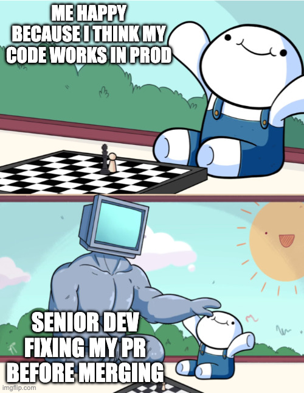

> **Software maintenance** is the general process of changing a system after it has been delivered.

### The Maintenance Reality

- Maintenance is not just _fixing bugs._
- It is the continuation of the **Software Evolution** process.
- **Lehman's Law I (Continuing Change):** A system that is used must change, or it becomes progressively less useful.
- **Maintenance vs. Evolution:** Evolution is what happens; Maintenance is how we manage it.

---

# The Four Types of Maintenance

| Type           | Goal                                                          | Analogy                               |
| :------------- | :------------------------------------------------------------ | :------------------------------------ |
| **Corrective** | Fixing reported errors                                        | Repairing a leaking pipe.             |
| **Adaptive**   | Adjusting to environment changes (OS, Cloud, Laws).           | Moving your furniture to a new house. |
| **Perfective** | Adding new features or improving performance.                 | Adding an extra room to your house.   |
| **Preventive** | Improving structure to prevent future problems (Refactoring). | Changing the oil in your car.         |

---

# Distribution of Maintenance Effort

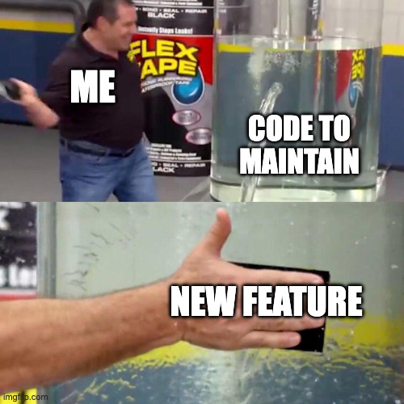

- **Perfective (65%):** Most effort is spent adding value.
- **Adaptive (18%):** Keeping up with the external world.
- **Corrective (17%):** Fixing mistakes.
- **Preventive (Ongoing):** Often neglected, leading to Technical Debt.

### The Funny Thing

We call it _Maintenance_ but most of the work is actually **Development** of new functionality.

---

# Why Maintenance is Expensive

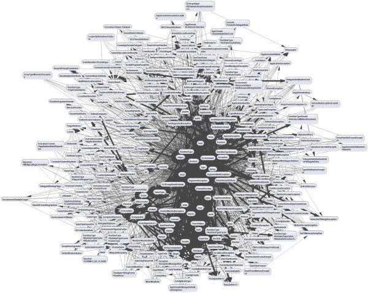

> The cost of maintenance is usually 2x to 100x the cost of development

### 1. Technical Factors

- **Module Independence:** Tightly coupled code makes changes ripple through the system.
- **Programming Language:** Older languages (COBOL, Fortran) are harder to maintain than modern ones.
- **Documentation:** Missing or outdated docs force developers to guess the intent.

### 2. Non-Technical Factors

- **Staff Stability:** If the original authors leave, the tribal knowledge is lost.
- **Program Age:** Older systems are often patched so many times they become a Big Ball of Mud.

---

# Human Factors - The Bus Factor

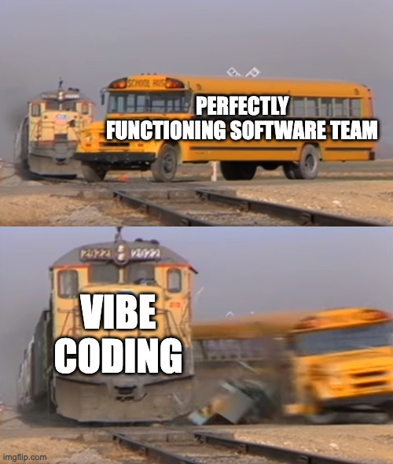

**Definition:** The minimum number of team members that have to be hit by a bus (or leave the project) before the project stalls due to lack of knowledge.

### In Maintenance:

- If your _Bus Factor_ is 1, your maintenance risk is **Critical**.
- **Knowledge Silos:** When only one person knows how the _Legacy Database_ works.

### Mitigation:

- Pair Programming
- Mandatory Code Reviews
- Comprehensive Documentation
- Cross-training between modules

---

# Software Aging

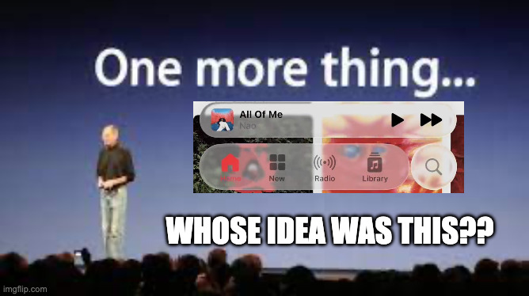

Just like humans, software "ages" over time.

### Causes of Software Aging

1.  **Failure to Change:** If software doesn't adapt to its environment, it becomes obsolete.
2.  **Ignorant Change:** Changes made by people who don't understand the original design degrade the system's structure.

### Symptoms of Aged Software

- Increased bug rate.
- Slower performance.
- Extreme difficulty in adding small features.
- Developers have "Fear of changing code."

---

# Software Rejuvenation

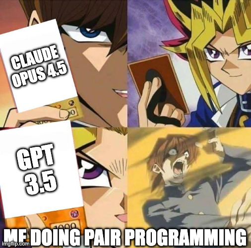

How do we fight software aging?

### Strategies

1.  **Refactoring:** Continuous, small improvements to internal structure without changing behavior.
2.  **Re-engineering:** Large-scale restructuring, often migrating to a new platform or language.
3.  **Preventive Maintenance:** Scheduled "clean-up" sprints to pay down technical debt.
4.  **Automated Testing:** High test coverage acts as a safety net for changes.

> **Vibe Coding Advantage:** AI tools like **Cursor** or **Claude Code** can suggest refactoring patterns or explain "spaghetti code" to new maintainers. But they can also hallucinate new spaghetti codes

---

# Maintenance Prediction

Managers must decide where to spend their limited maintenance budget.

### 1. Predicting Maintainability

- **Complexity Metrics:** High Cyclomatic Complexity = Hard to maintain.
- **Nesting Level:** Deeply nested `if/else` or `for` loops increase cognitive load.
- **Comment Density:** Too few comments (hard to understand) or too many comments (hiding bad code).

### 2. Predicting Maintenance Costs

- **Change Requests per Module:** Which modules get the most requests?
- **MTTR (Mean Time To Repair):** How long does it take to fix a bug in Module A vs Module B?

---

# Maintenance Metrics

How do we measure "How maintainable is our code?"

### 1. Maintainability Index (MI)

A composite metric calculated using LOC, Cyclomatic Complexity, and Halstead Volume.

- **MI > 85:** Highly maintainable (Green).
- **MI 65-85:** Moderate maintainability (Yellow).
- **MI < 65:** Difficult to maintain, high risk (Red).

### 2. Technical Debt Ratio (TDR)

```
TDR = (Remediation Cost / Development Cost) x 100%
```

- A high TDR indicates that the system is "bankrupt" and may need full replacement rather than further patching.

---

# Halstead's Software Science Metrics

Developed by Maurice Halstead in 1977, these metrics measure the "Volume" and "Difficulty" of code.

| Metric               | Calculation Basis                                                                      |
| :------------------- | :------------------------------------------------------------------------------------- |
| **$n_1, n_2$**       | Number of unique operators and operands.                                               |
| **$N_1, N_2$**       | Total number of operators and operands.                                                |
| **Volume ($V$)**     | $V = (N_1 + N_2) \times \log_2(n_1 + n_2)$. Represents the size of the implementation. |
| **Difficulty ($D$)** | $D = (n_1 / 2) \times (N_2 / n_2)$. Represents how hard it is to write/maintain.       |
| **Effort ($E$)**     | $E = D \times V$. Represents cognitive effort to understand the code.                  |

---

# Practice

**Scenario:**
The Grade Calculator module has an **MI (Maintainability Index) of 42** (Red Zone).

- It is 3,000 lines long in a single file.
- It has zero unit tests.
- It is critical for the "Final Exams" calculation happening next week.

**Task:** What is your recommendation?
A) Refactor it now before the exams.
B) Do nothing and pray.
C) Plan a "Maintenance Sprint" immediately after the exams.
D) Wrap it in automated tests first, then refactor later.

---

# Answer

**Best Answer: D, then C**

**Reasoning:**

- **A is too risky:** Refactoring without tests right before a deadline is a recipe for disaster. You could introduce new bugs.
- **B is irresponsible:** The technical debt will only grow, and the risk of a catastrophic bug increases.
- **D (First Step):** Before exams, add Characterization Tests (Tests that document the _current_ behavior, not the _intended_ behavior). This creates a safety net.
- **C (Next Step):** After exams, perform a planned Re-engineering or Refactoring when the time pressure is low.

---

# Legacy System Management

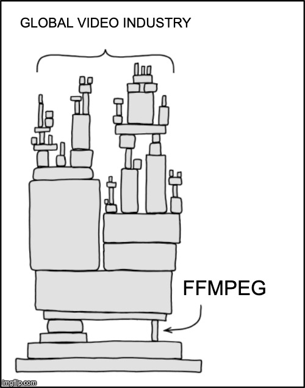

**Legacy System:** A system that is old but still provides significant business value.

### The Legacy Dilemma

- "It's too expensive to keep running."
- "It's too risky to replace."

### Assessment Matrix

We must evaluate every legacy component on two axes:

1.  **Business Value:** How important is this to the company's bottom line?
2.  **Technical Quality:** How reliable, maintainable, and modern is the code?

---

# Legacy System Assessment Matrix

|                  | Low Business Value      | High Business Value            |
| :--------------- | :---------------------- | :----------------------------- |
| **Low Quality**  | **Scrap:** Retire it.   | **Re-engineer / Replace**      |
| **High Quality** | **Maintain:** Low cost. | **Maintain:** The "Sweet Spot" |

### Examples?

Think of a system you use daily. Where would you place it on this matrix?

---

# Legacy System Assessment - Technical Quality Criteria

How do we objectively define "Low Technical Quality"?

1.  **Supplier Stability:** Is the vendor still supporting the OS/Database?
2.  **Failure Rate:** Does the system crash more than once a month?
3.  **Age:** Is the hardware more than 10 years old?
4.  **Performance:** Is the response time frustrating for users?
5.  **Understandability:** Is the source code readable? Are there automated tests?
6.  **Data Quality:** Is the data inconsistent, duplicated, or corrupted?

---

# Practice

**Scenario:** CampusPal has a "Legacy SMS Gateway" written in 2012. It uses an obsolete protocol that only one provider supports. It rarely fails, but adding a new template takes 3 days of manual coding.

**Data:**

- **Usage:** Used for 2FA and Emergency Alerts.
- **Maintenance:** Handled by a senior dev who wants to retire next year.
- **Replacement Cost:** $50,000 for a modern AWS SNS integration.

**Task:** Should we Scrap, Maintain, Re-engineer, or Replace? Why?

---

# Answer

**Decision:** **Replace**

**Reasoning:**

- **High Business Value:** 2FA and Emergency Alerts are critical for security and safety.
- **Low Technical Quality:** Hard to change (3 days for a template), obsolete protocol, single point of failure (one provider), and imminent loss of human expertise (retiring dev = Bus Factor 1).
- **Conclusion:** The risk of the system failing or becoming unmaintainable exceeds the $50k cost of replacement.

**Action:** Start the replacement project now, before the senior dev retires, to enable knowledge transfer.

---

# AI and Machine Learning in Software Maintenance

AI is transforming how we maintain software:

### 1. Predictive Bug Detection

- AI models trained on millions of commits can predict which lines of code are likely to contain a bug.

### 2. Automated Impact Analysis

- "If I change this variable, what else will break?" AI can map complex dependencies.

### 3. Automated Code Documentation

- AI can read old, undocumented code and generate human-readable explanations and JSDoc/Docstrings.

### 4. Self-Healing Systems

- Modern cloud systems use AI to detect failures and automatically restart services or roll back faulty configurations.

---

# The Rise of Vibe Coding

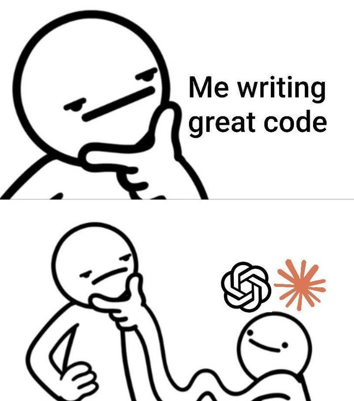

**Vibe Coding:** Writing code by describing what you want to an AI assistant (Cursor, Copilot, Claude) and accepting the generated output with minimal review.

### The Appeal

- **Speed:** Generate hundreds of lines in seconds.
- **Low Barrier:** You don't need to know the exact syntax or API.
- **Exploration:** Quickly prototype ideas.

> "I just tell the AI what I want and it works" - The dev who pushed a new vulnerability to codebase

---

# The Dangers of Blindly Trusting AI Code

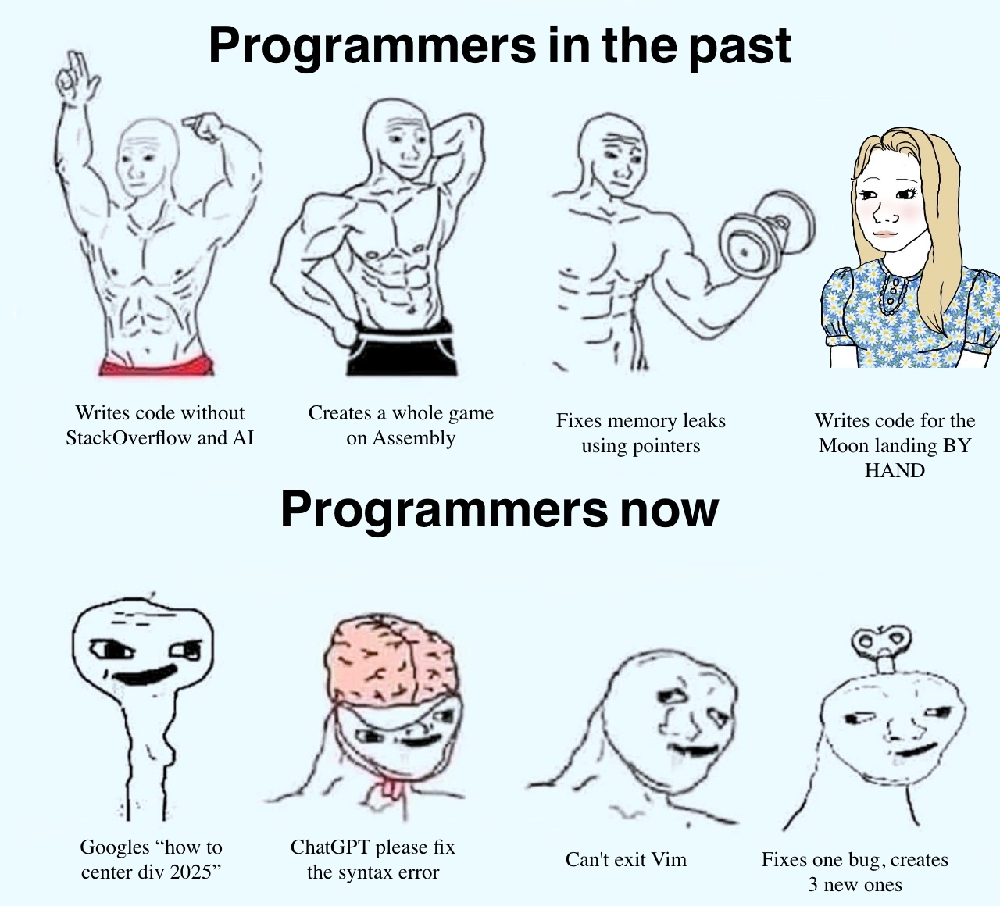

### 1. Hallucinated APIs & Libraries

- AI confidently generates code using functions or libraries that **don't exist**.
- Example: `import { superSecureHash } from 'crypto-plus'` - This package doesn't exist.

### 2. Outdated Patterns

- AI is trained on old data. It may suggest deprecated methods or insecure practices.
- Example: Using `componentWillMount` in React (deprecated since 2018).

### 3. Subtle Logic Errors

- The code _looks right_ but has off-by-one errors, race conditions, or edge cases that fail silently.

---

# The Dangers of Blindly Trusting AI Code

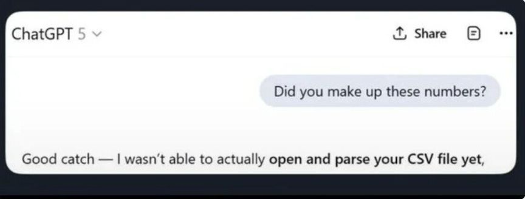

### 4. Security Vulnerabilities

- AI can generate code with SQL injection, XSS, or insecure deserialization flaws.
- It doesn't understand your specific threat model.

### 5. License & Copyright Issues

- AI may reproduce code from copyrighted sources verbatim.
- You could unknowingly introduce GPL-licensed code into a proprietary project.

### 6. The "It Works" Trap

- The code passes basic tests but creates **massive technical debt**.
- Future maintainers (including yourself in 3 months) won't understand _why_ it was written that way.

---

# Responsible Vibe Coding

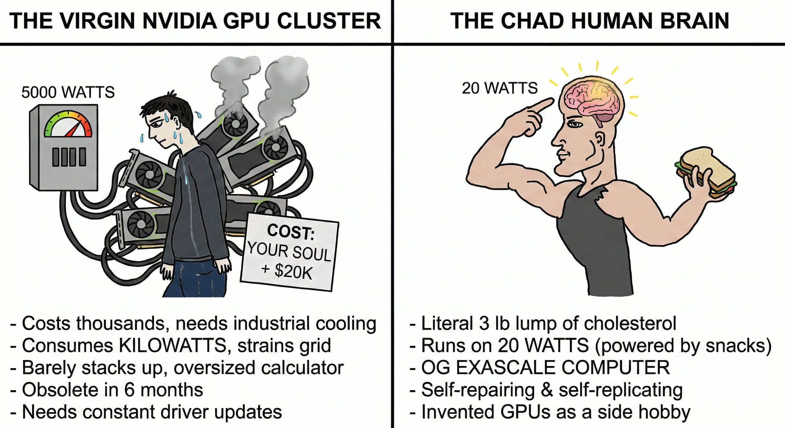

### The Rules

1.  **Read What It Produced:** If you can't explain what it does, don't merge it.
2.  **Test Aggressively:** AI-generated code needs _more_ testing, not less.
3.  **Verify Dependencies:** Check that imported libraries actually exist and are secure.
4.  **Check for Deprecation:** Is this the modern way to solve this problem?
5.  **Refactor for Clarity:** AI code is often verbose. Simplify it for human readers.
6.  **Remove Trash Snippets:** AI tends to leave _trash_ code occasionally; try to clean them from time to time
7.  **Keep a Memory:** AI agents tend to forget the context, leave a _memory.md_ for them so the collaboration can continue
8.  **Define Rules:** Transfer your organizational knowledge/rules to AI agents by using _rules_

> **Remember:** You are responsible for the code, not the AI. When it breaks in production, the AI won't be the one getting the call.

---

<!-- _footer: "" -->
<!-- _header: "" -->
<!-- _paginate: false -->
<!-- _class: lead -->

<style scoped>
p { text-align: center}
h1 {text-align: center; font-size: 72px}
</style>

# Configuration Management (CM)

---

# What is Configuration Management?

> **Configuration Management (CM)** is the discipline of identifying, organizing, and controlling changes to software.

### Why do we need it?

- Multiple people working on the same files.
- Multiple versions of the system (Dev, Test, Prod).
- Multiple platforms (Web, iOS, Android).

**The Goal:** To ensure the integrity of the system and provide a clear history of its evolution.

---

# Configuration Items (CI)

A **Configuration Item** is anything that is subject to change and needs to be versioned.

### Examples of CIs:

- **Source Code:** .js, .py, .java
- **Documentation:** Requirements Spec, Design Docs, User Manuals.
- **Data:** SQL schemas, database seed data.
- **Build Scripts:** `package.json`, `Dockerfile`, `Makefile`.
- **Environment Configs:** `.env.production`, `nginx.conf`.
- **Test Cases:** Test scripts and expected results.

> **Rule:** If it's part of the project, it should be a Configuration Item under version control.

---

# Practice

**Scenario:**
You are starting the "CampusPal Marketplace" feature (Students selling books/furniture).

**Task:** List 5 specific items that MUST be under version control.

---

# Answer

1.  **Database Migration Scripts** (SQL) - To track schema changes.
2.  **API Specification** (OpenAPI/Swagger YAML) - For frontend/backend sync.
3.  **UI Mockups** (Figma export or link) - To track design evolution.
4.  **Environment Variable Templates** (`.env.example`) - For deployment setup.
5.  **Docker Configuration** (`Dockerfile`, `docker-compose.yml`) - To version the runtime environment.
6.  **Dependency Manifests** (`package-lock.json`) - For build reproducibility.
7.  **Unit & Integration Tests** (`.test.js`) - To verify integrity.
8.  **CI/CD Pipeline Definition** (`.github/workflows/ci.yml`) - To version the build process.
9.  **Acceptance Criteria** (Markdown file) - To track "Definition of Done."
10. **Third-Party API Keys** - Stored in a **Secrets Manager** (Vault, AWS Secrets), NOT in Git!

---

# The Four Pillars of CM

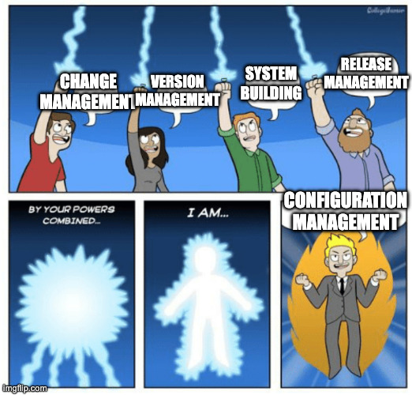

1.  **Change Management:** Who can change what, and how is it approved?
2.  **Version Management:** Keeping track of different versions.
3.  **System Building:** Assembling components into an executable system.
4.  **Release Management:** Delivering the software to the user.

---

# 1. Change Management

Changes must be managed through a formal process to ensure they don't break the system.

### The Change Control Board (CCB)

A group of stakeholders responsible for approving or rejecting Change Requests.

### The Change Request (CR) Lifecycle

1.  **Submitted:** A user or developer logs a request.
2.  **Analysis:** Evaluate cost, impact, and risk.
3.  **CCB Review:** Board approves, rejects, or defers.
4.  **Implementation:** Developers write code, update tests.
5.  **Verification:** QA validates the change.
6.  **Closed:** Change is released.

### Fast Track?

Not every change needs a board meeting. Typo fixes can be fast-tracked.

---

# The Change Analysis Phase

Before a change is approved, we must analyze its impact:

1.  **Traceability Analysis:** What other requirements/design docs are affected?
2.  **Technical Impact:** Which modules/APIs need modification?
3.  **Cost/Benefit:** Is the value of the change worth the development and testing cost?
4.  **Risk Analysis:** What could break? Are we touching a _Legacy_ module with no tests?

---

# Practice

**Scenario:** Users complain that they can't see the cafeteria menu for Tomorrow, only for Today in CampusPal.

**Task:** Draft a Change Request for this feature.

- **CR ID:** CR-2025-042
- **Description:** ?
- **Reason:** ?
- **Impacted Modules:** ?
- **Priority:** High / Medium / Low ?

---

# Answer

- **CR ID:** CR-2025-042
- **Description:** Add a **Tomorrow** tab to the Cafeteria Menu screen.
- **Reason:** Users want to plan meals in advance. Currently only **Today** is shown.
- **Impacted Modules:**
  - `CafeteriaService` (Backend API needs to accept a date parameter).
  - `MenuScreen.tsx` (Frontend needs a tab/date picker).
  - `menu.test.js` (New unit tests required).
- **Priority:** **Medium** (Not critical, but high user demand).

---

# 2. Version Management

### Distributed vs. Centralized VCS

- **Centralized (e.g., SVN):** One single server. You lock a file to edit it.
- **Distributed (e.g., Git):** Every developer has a full copy of the history. Changes are merged later.

### Versioning Models

- **Pessimistic (Locking):** I lock the file, nobody else can edit it until I'm done. (Safe but slow).
- **Optimistic (Merging):** We both edit the same file. Git tries to merge our changes. If we edit the same line, we have a **Conflict**.

**99% of the time you will be using Git, not SVN. SVN is not that active anymore**

---

# Versioning AI/ML - The Data Challenge

Configuration Management for AI (MLOps) is different than traditional software.

### The Three Pillars of MLOps

1.  **Code Versioning:** Git
2.  **Data Versioning:** The same code with different data produces a different model. (Tool: **DVC**, **HuggingFace Datasets**)
3.  **Model Versioning:** Tracking model files (.h5, .safetensors) and their metrics. (Tools: **MLflow**, **HuggingFace Hub**, **Weights & Biases**)

### Real-World Risk

If you can't reproduce your training data, you can't debug your production model.

---

# MLOps: Data Version Control (DVC)

**Why not just use Git for data?**

- Git is bad at handling large files (GBs of images/CSV).
- DVC acts as a _Git for Data_ It stores data in a cloud bucket (S3, GCS) and stores a small `.dvc` file (a hash pointer) in Git.

**The Workflow:**

```bash
# Developer wants to recreate the environment for v1.0
git checkout v1.0
dvc pull  # Downloads the exact version of the data used for v1.0
```

**Result:** 100% Reproducibility of training data.

---

# 3. System Building

> The process of assembling components into a working, executable system.

**Store config in the environment.**

- Never hardcode database URLs or API keys in your source code.
- Use environment variables (`process.env.DB_URL`).
- **Secret Management:** Use tools like HashiCorp Vault or AWS Secrets Manager.

### Dependency Management & "Lockfiles"

- `package-lock.json` or `poetry.lock` are **NOT optional**.
- They ensure every developer and CI server use the **exact same version** of every library.

---

# Build Automation - Continuous Integration (CI)

A build server (GitHub Actions, Jenkins) performs these steps on every push:

1.  **Environment Setup:** Spin up a clean container (Docker).
2.  **Dependency Install:** Download libraries based on the lockfile.
3.  **Static Analysis:** Run Linters and Security Scanners.
4.  **Unit Tests:** Run all small, fast tests.
5.  **Build:** Compile source code into assets.
6.  **Integration Tests:** Run tests that touch the DB/API.

> **Rule:** If the CI build fails, the code is "broken" and cannot be merged.

---

# Infrastructure as Code (IaC)

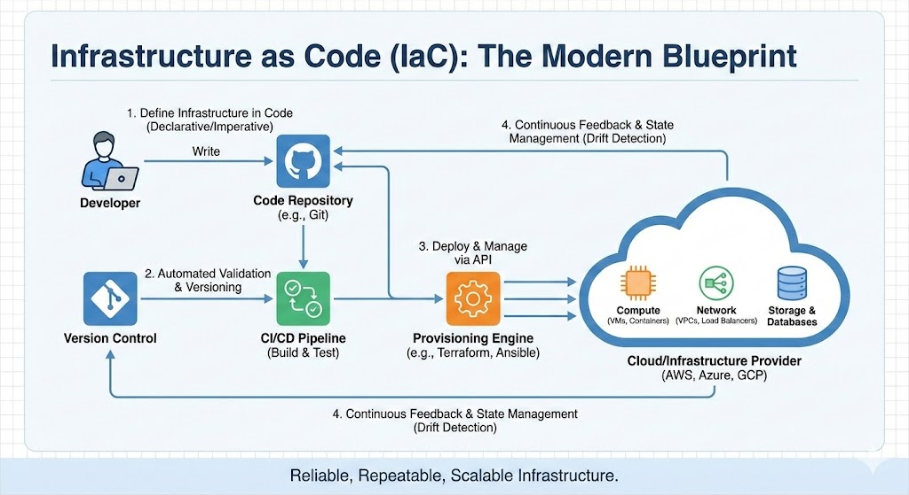

Infrastructure is no longer "clicking in a console." It is **Configuration**.

### The Concept

- Define your servers, databases, and networks in code (e.g., **Terraform**, **Ansible**, **CloudFormation**).

### Benefits:

- **Version Control:** Track who changed the infrastructure and when.
- **Reproducibility:** "Staging" and "Production" are guaranteed to be identical.
- **Speed:** Deploy a whole data center in minutes with one command.

---

# 4. Release Management

Deciding when and how to give the software to the users.

### Release Terminology

- **Baseline Release:** A stable, reviewed version for internal use.
- **External Release:** A version delivered to customers.
- **Patch:** A small update for bug fixes.

### Software Bill of Materials (SBOM)

A comprehensive list of every component, library, and version used in a release.

- **Why?** To quickly identify if you are vulnerable to a new exploit.
- Required by law in some industries (healthcare, defense).

---

# Deployment Patterns

How do we safely release new versions to production?

### 1. Big Bang Deployment

- Push the new version to 100% of users at once.
- **Risk:** If something breaks, everyone is affected.

### 2. Rolling Deployment

- Gradually replace old instances with new ones.
- At any time, some servers run v1, some run v2.
- **Risk:** Incompatible versions may coexist briefly.

---

# Software Configuration Audit (SCA)

How do we know the CM process is actually working?

### The Audit Questions:

1.  **Completeness:** Are all Configuration Items (Code, Docs, Data) present in the release?
2.  **Traceability:** Can we trace every change back to a Change Request?
3.  **Compliance:** Did we follow the formal CCB process for critical changes?
4.  **Reproducibility:** Can we rebuild "Release v1.2" from scratch using only the items in version control?

---

# Summary & Key Takeaways

1.  **Maintenance is Evolution:** Plan for 80% of software's lifetime to be maintenance.
2.  **Fight the Aging:** Use MI and Complexity metrics to identify "Spaghetti Code" early.
3.  **The "Bus Factor":** Share knowledge aggressively to reduce single-person dependencies.
4.  **CM is the "Source of Truth":** If it's not in version control, it doesn't officially exist.
5.  **Formal Change Control:** Use CRs and CCB for critical systems to prevent "Knight Capital" style disasters.
6.  **Version Everything:** Code (Git), Data (DVC), Infrastructure (Terraform), Models (MLflow).
7.  **Staged Releases:** Use Canaries and Blue/Green to minimize the "Blast Radius" of failures.
8.  **Learn from History:** Study failures like CrowdStrike and Log4j to build more resilient release processes.

---

<!-- _class: lead -->

# Thank You!

## Contact Information

- **Email:** ekrem.cetinkaya@yildiz.edu.tr
- **Office Hours:** Tuesday 14:00-16:00 - Room F-B21
- **Book a slot before coming:** [Booking Link](https://calendar.app.google/aBKvBqNAqG12oD2B9)
- **Course Repository:** [GitHub](https://github.com/ekremcet/yzm2021-principles-of-software-engineering)
