# YZM2021

## Principles of Software Engineering

### Week 2: Core Principles and Quality Attributes

**Instructor:** Ekrem Çetinkaya
**Date:** 07.10.2025

---

# Last Week Recap

## What We Covered

- **What is Software Engineering?** - Systematic, disciplined approach to software development
- **Why Do We Need It?** - Manage complexity, ensure quality, reduce costs
- **Real-World Failures** - Mars Climate Orbiter ($125M), Therac-25 (lives lost)
- **Fundamental Activities** - Specification, Design, Validation, Evolution
- **Ethics and Professionalism** - ACM Code of Ethics, responsibilities

## This Week's Focus

**Deep dive into the principles that guide software engineering practice**

---

# Today's Agenda

## Topics We'll Cover

1. **Software Engineering Principles** - Foundational concepts
2. **Quality Attributes** - What makes software "good"
3. **Software Engineering Methods** - How we approach development
4. **Tools and Techniques** - Supporting technologies
5. **Process vs. Product** - Understanding the distinction

---

<!-- _footer: "" -->
<!-- _header: "" -->
<!-- _paginate: false -->

<style scoped>
p { text-align: center}
h1 {text-align: center; font-size: 72px}
</style>

# 🎯 Core Software Engineering Principles

---

# Software Engineering Principles

## What Are Principles?

> Fundamental truths that guide software engineering practice, regardless of the specific methodology, programming language, or technology stack

**Not Rules** - Guidelines that help make informed decisions
**Context-Dependent** - Apply them based on project needs
**Time-Tested** - Proven through decades of industry experience

---

# Principle 1: Separation of Concerns


---

# Principle 1: Separation of Concerns

<div class="two-columns">
<div class="column">

### Divide and Conquer

- Break down complex systems into manageable pieces
- Each piece addresses a separate concern
- Reduces cognitive load
- Enables parallel development

### Examples

- **MVC Pattern** - Model, View, Controller
- **Microservices** - Each service has one responsibility
- **CSS Separation** - Structure (HTML), Style (CSS), Behavior (JS)

</div>
<div class="column">

### Without Separation

```python
def process_user():
    # Mixing database, business logic, UI
    conn = db.connect()
    data = conn.fetch_user()
    if data['age'] > 18:
        print("Welcome!")
        email = data['email']
        send_email(email, "Hi!")
```

### With Separation

```python
class UserService:
    def get_user(self, id): ...
    def is_adult(self, user): ...

class EmailService:
    def send_welcome(self, email): ...

class UserController:
    def handle_user(self, id): ...
```

</div>
</div>

---

# Example: Spotify's Architecture

<div class="two-columns">
<div class="column">

### The Problem (Early Days)

**Monolithic Application:**

- All code in one giant codebase
- Playlist, search, recommendations, payment - all mixed
- Changing one feature risks breaking others
- Slow deployments (had to deploy everything)
- Team conflicts (everyone editing same code)

**Result:**

- Hard to scale
- Developers stepping on each other's toes
- Features took months to ship

</div>
<div class="column">

### The Solution

**Microservices Architecture:**

- **Playlist Service** - Handles playlists only
- **Search Service** - Music discovery
- **Recommendation Service** - Personalized suggestions
- **Payment Service** - Subscriptions
- **Streaming Service** - Audio delivery
- **User Service** - Account management

**Benefits:**

- Teams work independently
- Deploy services separately
- Scale services based on demand
- Bug in recommendations? Doesn't affect streaming
- Can use different technologies per service

</div>
</div>

---

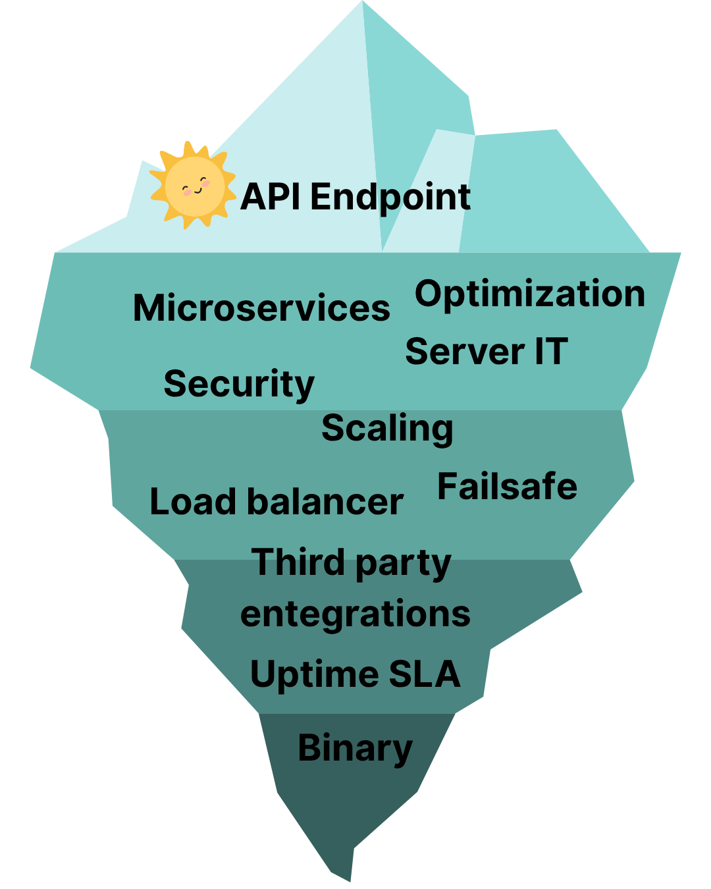

# Principle 2: Abstraction

---

# Principle 2: Abstraction

<div class="two-columns">
<div class="column">

### Hide Unnecessary Complexity

- Show only essential features
- Hide implementation details
- Work at appropriate level of detail
- Manage complexity through layers

### Real-World Analogy

**Driving a Car**

- You use: steering wheel, pedals, gear shift
- You don't need to know: engine combustion, transmission mechanics, electronic control units

</div>
<div class="column">

### In Software

```python
# High-level abstraction
user = authenticate(username, password)

# vs. Low-level details
def authenticate(username, password):
    # Hash password with SHA-256
    # Query database with prepared statement
    # Check timing-safe comparison
    # Generate JWT token
    # Set session cookie
    # Log authentication event
    return user
```

### Benefits

- **Simplicity** - Easier to understand and use
- **Flexibility** - Change implementation without affecting users
- **Reusability** - Same interface, different implementations

</div>
</div>

---

# Real-World Example: Stripe Payment API

<div class="two-columns">
<div class="column">

### What Developers See (The Tip)

```javascript
const charge = await stripe.charges.create({
  amount: 2000,
  currency: "usd",
  source: "tok_visa",
  description: "Coffee purchase",
});
```

**That's it!** You can accept payments with this simple API

### The Promise

- "Just call our API"
- "We handle everything else"
- Works the same whether processing $1 or $1,000,000
- Developer doesn't need to be a payment expert

</div>
<div class="column">

### What Stripe Handles (The Iceberg)

1. **Security & Compliance**

   - PCI DSS compliance and encyrption
   - Fraud detection algorithms
   - 3D Secure authentication

2. **Payment Processing**

   - Route to correct payment network (Visa, Mastercard, etc.)
   - Handle declined transactions
   - Retry logic for network failures

3. **Global Infrastructure**
   - Distributed across data centers
   - Handle millions of requests/second
   - Store payment methods securely

</div>
</div>

---

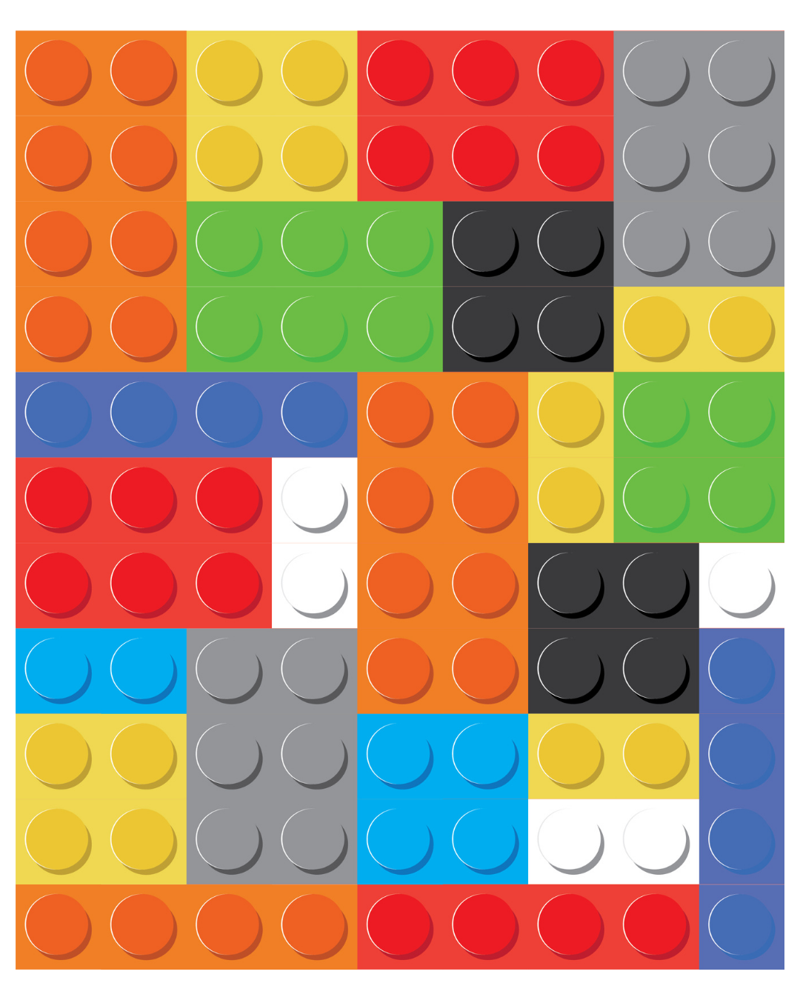

# Principle 3: Modularity

---

# Principle 3: Modularity

<div class="two-columns">
<div class="column">

### Build with Interchangeable Components

- System composed of well-defined modules
- Each module has specific responsibility
- Modules interact through interfaces
- Can be developed, tested, and maintained independently

### Characteristics of Good Modules

- **High Cohesion** - Related functionality together
- **Low Coupling** - Minimal dependencies
- **Clear Interface** - Well-defined inputs/outputs
- **Single Responsibility** - One reason to change

### Benefits

- **Maintainability** - Fix bugs in isolation
- **Testability** - Test modules independently
- **Reusability** - Use modules in different projects

</div>
<div class="column">

### Example: E-Commerce System

```python
# Each module has clear responsibility
class AuthModule:
    def login(self, credentials): ...
    def logout(self): ...
    def verify_token(self, token): ...

class CartModule:
    def add_item(self, product_id): ...
    def remove_item(self, product_id): ...
    def get_total(self): ...

class ProductModule:
    def get_product(self, id): ...
    def search_products(self, query): ...
    def update_inventory(self, id, quantity): ...

class PaymentModule:
    def process_payment(self, amount, method): ...
    def refund(self, transaction_id): ...
    def verify_payment(self): ...
```

</div>
</div>

---


# Your code should be LEGO not JENGA

---

# Real-World Example: Tesla's Software Architecture

### Modular Electric Vehicle System

<div class="two-columns">
<div class="column">

**Tesla vehicles have separate, independent modules:**

1. **Autopilot Module**

   - Camera processing
   - Sensor fusion
   - Path planning

2. **Battery Management System (BMS)**
   - Cell monitoring
   - Thermal management
   - Charge control
   - Standalone module

</div>
<div class="column">

3. **Infotainment System**

   - Navigation
   - Music & media
   - Web browser
   - Games (yes, really!)

4. **Drive Unit Controller**
   - Motor control
   - Regenerative braking
   - Traction control

</div>
</div>

---

## Why Modularity Matters Here?

<div class="two-columns">
<div class="column">

**Over-the-Air (OTA) Updates:**

- Can update Autopilot without touching battery system
- Add new games without affecting driving
- Fix bugs in specific modules
- Like updating apps on your phone

**Testing & Development:**

- Different teams work on different modules
- Autopilot team doesn't accidentally break AC
- Faster feature development
- Easier certification for safety systems

**Safety Critical:**

- Bug in games? Annoying
- Bug in brake controller? Dangerous
- Modularity isolates critical systems

</div>
<div class="column">

**Real Example:**

- December 2020: Added "Santa Mode" (entertainment)
- Didn't require testing drive systems
- Rolled out to millions of cars overnight
- If bug occurred, only affects entertainment

**Result:**

- Regular feature updates
- Improved safety
- Better user experience
- Cars get better over time reliably

</div>
</div>

---

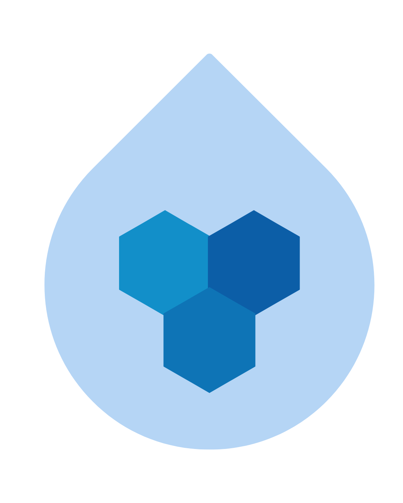

# Principle 4: Encapsulation

---

# Principle 4: Encapsulation

<div class="two-columns">
<div class="column">

### Information Hiding

- Hide internal state and implementation
- Access only through well-defined interfaces
- Protect data integrity
- Reduce system coupling

### Why It Matters

**Without Encapsulation:**

- Any code can modify any data
- Hard to track bugs
- Changes ripple through system
- Difficult to maintain invariants

</div>
<div class="column">

### Example

```python
# Bad: Direct access
class BankAccount:
    def __init__(self):
        self.balance = 0

account.balance = -1000  # Oops!

# Good: Encapsulation
class BankAccount:
    def __init__(self):
        self.__balance = 0

    def deposit(self, amount):
        if amount > 0:
            self.__balance += amount

    def withdraw(self, amount):
        if 0 < amount <= self.__balance:
            self.__balance -= amount

    def get_balance(self):
        return self.__balance
```

</div>
</div>

---

# Real-World Example: Apple's iOS Security

<div class="two-columns">
<div class="column">

### The Sandboxing Approach

Each iOS app runs in a **sandbox**

**What Apps Can Access (Public Interface):**

- Camera API: `AVFoundation.requestAccess()`
- Location: `CLLocationManager`
- Photos: `PHPhotoLibrary`
- Contacts: `CNContactStore`

**Apps must ask permission for each!**

```swift
// App code (public interface)
locationManager.requestWhenInUseAuthorization()
```

**User sees**: "Allow app to use your location?"

</div>
<div class="column">

### What's Hidden (Encapsulated)

**Apps CANNOT directly access:**

- Other apps' data
- System files
- Hardware directly
- Other apps' memory
- Bluetooth without permission
- Network without entitlements

---

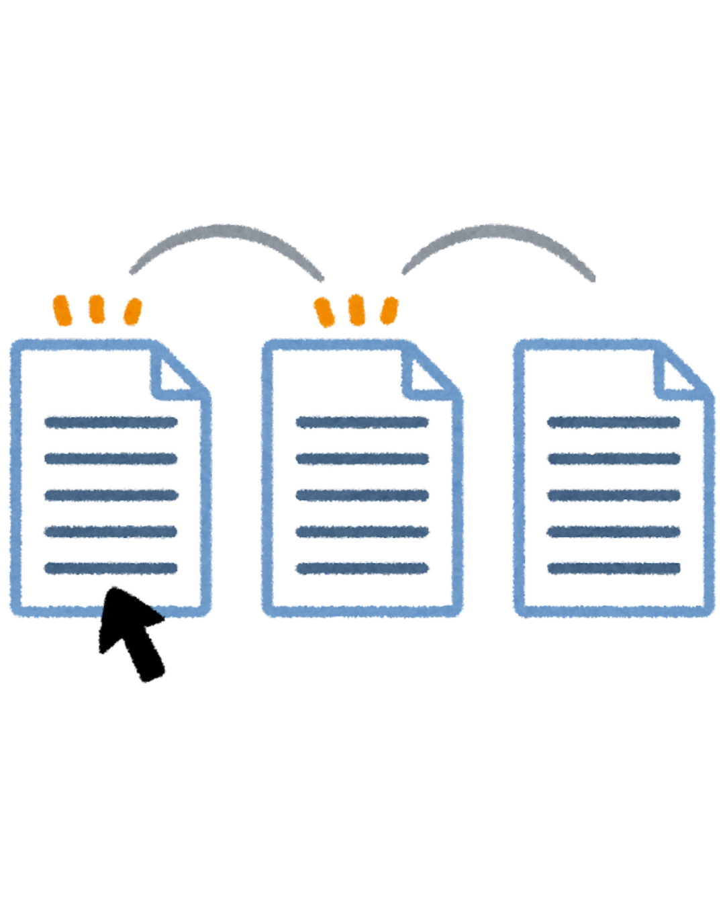

# Principle 5: DRY (Don't Repeat Yourself)

---

# Principle 5: DRY (Don't Repeat Yourself)

<div class="two-columns">
<div class="column">

### Every Piece of Knowledge Should Have a Single Representation

- Avoid code duplication
- Single source of truth
- Changes in one place
- Reduces maintenance burden

### Not Just About Code

- **Documentation** - Don't duplicate in code and docs
- **Data** - Don't store same data multiple places
- **Logic** - Don't implement same business rule twice
- **Configuration** - Centralize settings

</div>
<div class="column">

### Example

```python
# Bad: Repetition
def calculate_order_total_with_tax(items):
    subtotal = sum(item.price for item in items)
    return subtotal * 1.18

def calculate_cart_total_with_tax(products):
    subtotal = sum(p.price for p in products)
    return subtotal * 1.18

# Good: DRY
TAX_RATE = 0.18

def calculate_total_with_tax(items):
    subtotal = sum(item.price for item in items)
    return subtotal * (1 + TAX_RATE)
```

### Benefits

- **Maintainability** - Update once, effect everywhere
- **Consistency** - Same logic everywhere
- **Reduced Bugs** - Fix once, fixed everywhere

</div>
</div>

---

# Real-World Example: Stripe's API Libraries

<div class="two-columns">
<div class="column">

### The Problem (No DRY)

**Stripe supports 10+ programming languages:**

- Ruby, Python, JavaScript, PHP, Java, Go, .NET, etc.

**Without DRY:**

- Write API client for each language separately
- Add new API endpoint? Update 10+ codebases
- Fix bug? Replicate fix across all languages

**The Pain:**

```ruby
# Ruby version
Stripe::Charge.create(amount: 2000)

# Python version (different!)
stripe.Charge.create(amount=2000)

# Java version (completely different!)
chargeParams.setAmount(2000L)
```

</div>
<div class="column">

### The Solution (with DRY)

**Single Source of Truth: OpenAPI Specification**

```yaml
# openapi.yaml (ONE definition)
paths:
  /charges:
    post:
      parameters:
        - name: amount
          type: integer
          required: true
        - name: currency
          type: string
          required: true
```

**Auto-Generate All Libraries:**

```bash
# From ONE spec → Generate 10+ libraries
generate_library --spec openapi.yaml --lang ruby
generate_library --spec openapi.yaml --lang python
# ... etc
```

</div>
</div>

---

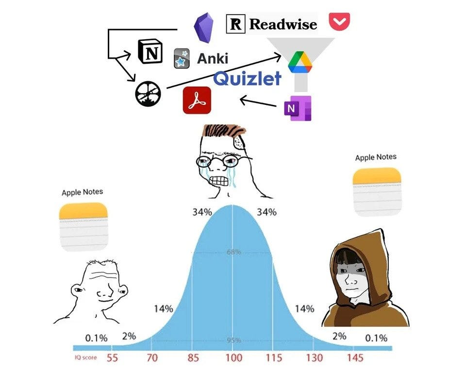

# Principle 6: KISS (Keep It Simple, Stupid)

---

# Principle 6: KISS (Keep It Simple, Stupid)

<div class="two-columns">
<div class="column">

### Simplicity Should Be a Key Goal

- Avoid unnecessary complexity
- Choose simpler solutions
- Don't over-engineer
  > "Make things as simple as possible, but not simpler"
  > Albert Einstein

### Why We Complicate Things

- **Anticipating future needs** - "We might need this..."
- **Showing off skills** - "Look at this clever code!"
- **Following trends** - "Everyone uses AI agents"
- **Premature optimization** - "This will be faster..."

</div>
<div class="column">

### Example

```python
# Overcomplicated
class AbstractFactoryPatternBuilder:
    def __init__(self):
        self.factory = FactoryFactory()

    def create_product(self, type):
        builder = self.factory.get_builder(type)
        return builder.build()

# Simple
def create_product(type):
    if type == "A":
        return ProductA()
    elif type == "B":
        return ProductB()
```

### Guidelines

- **YAGNI** - You Aren't Gonna Need It
- **Start simple, refactor when needed**
- **Readable > Clever**

</div>
</div>

---

# Real-World Example: Google Search vs. Other Search Engines (1990s)

<div class="two-columns">
<div class="column">

### Complex Approach: Yahoo, AltaVista (Late 1990s)

**Homepage overload:**

- News sections, Stock tickers, Weather widgets, Email notifications, Shopping deals, Horoscopes, ...

**Search algorithm:**

- Complex rules, Manual categorization, Keyword stuffing detection, Many adjustable parameters, etc.

**Result:**

- Slow page loads
- Confused users
- "Where's the search box?"
- Difficult to maintain

</div>
<div class="column">

### Simple Approach: Google (1998)

**Homepage:**

- Logo
- Search box
- Two buttons: "Google Search" and "I'm Feeling Lucky"

**Worked for decades**

**Search algorithm:**

- PageRank: Count links to pages
- Simpler, more elegant solution
- One core idea executed well

**Result:**

**1998:** Google launched
**1999:** Yahoo tried to compete with more features
**2000:** Google becomes default search

---

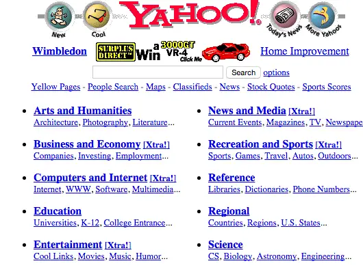

## Why simplicity won?

- Loads instantly, Clear purpose, Easy to use
- Better results from simpler algorithm
- Easier to improve and scale

> "Simplicity is powerful. The perfect search engine would understand exactly what you mean and give you back exactly what you want."
> Larry Page, Co-Founder, Google

**Today:**

- Google homepage still simple
- Backend extremely complex
- User sees: **one magical search box**

</div>
</div>

---

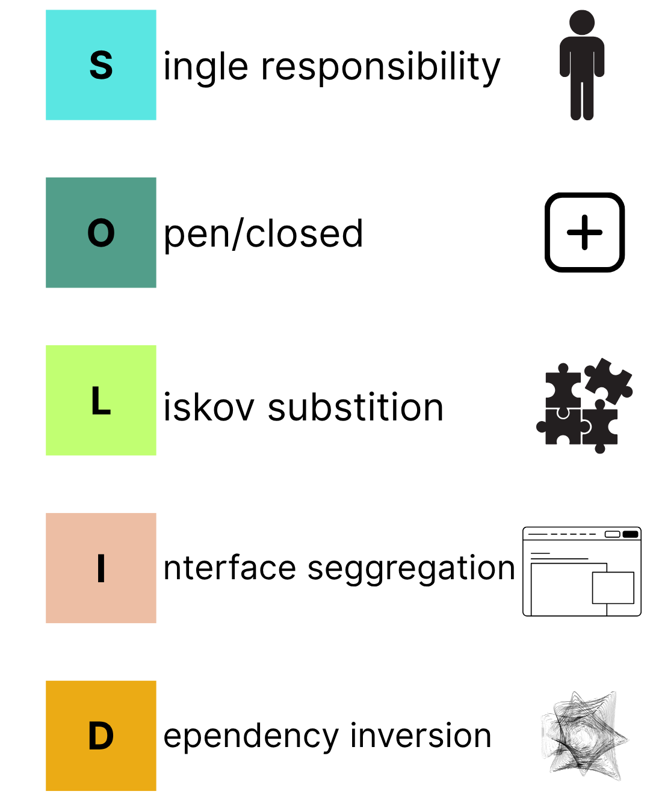

# Principle 7: SOLID Principles

---

# Principle 7: SOLID Principles

### Five Principles for Object-Oriented Design

<div class="two-columns">
<div class="column">

### S - Single Responsibility Principle

- A class should have one reason to change
- One responsibility per class

### O - Open/Closed Principle

- Open for extension, closed for modification
- Add new functionality without changing existing code

### L - Liskov Substitution Principle

- Subtypes must be substitutable for base types
- Don't break expected behavior in inheritance

</div>
<div class="column">

### I - Interface Segregation Principle

- Many specific interfaces > one general interface
- Don't force clients to depend on unused methods

### D - Dependency Inversion Principle

- Depend on abstractions, not concretions
- High-level modules shouldn't depend on low-level modules

### Why SOLID?

- **Maintainable** code
- **Flexible** architecture
- **Testable** components
- **Understandable** design

</div>
</div>

---

# Example: Single Responsibility Principle

<div class="two-columns">
<div class="column">

## Violating SRP

```python
class User:
    def __init__(self, name, email):
        self.name = name
        self.email = email

    def save_to_database(self):
        # Database logic
        db.save(self)

    def send_email(self, message):
        # Email sending logic
        smtp.send(self.email, message)

    def generate_report(self):
        # Report generation logic
        return f"Report for {self.name}"

    def validate_email(self):
        # Validation logic
        return "@" in self.email
```

**Problem:** Class has 4 responsibilities!

</div>
<div class="column">

## Following SRP

```python
class User:
    def __init__(self, name, email):
        self.name = name
        self.email = email

class UserRepository:
    def save(self, user):
        db.save(user)

class EmailService:
    def send(self, email, message):
        smtp.send(email, message)

class ReportGenerator:
    def generate(self, user):
        return f"Report for {user.name}"

class EmailValidator:
    def validate(self, email):
        return "@" in email
```

**Benefit:** Each class has one responsibility!

</div>
</div>

---

# Real-World Example: E-Commerce Platform

<div class="two-columns">
<div class="column">

### Single Responsibility Principle (S)

**Separate services for separate concerns:**

- **Product Service** - Just manages products
- **Order Service** - Just handles orders
  ...etc.

### Open/Closed Principle (O)

**Adding new payment methods:**

- Payment providers are plugins
- Each added without touching existing code

### Liskov Substitution Principle (L)

**Can swap shipping providers seamlessly**

```python
shipping = UPS()  # or FedEx() or USPS()
shipping.calculate_cost(package)
```

</div>
<div class="column">

### Interface Segregation Principle (I)

**Different interfaces for different users:**

- **Customer API** - Browse, buy, track
- **Seller API** - List products, manage inventory
- **Admin API** - Full system access
- **Warehouse API** - Just fulfillment operations

**Not one giant "E-Commerce API"** with everything

### Dependency Inversion Principle (D)

**High-level business logic doesn't depend on databases:**

```python
class OrderService:
    def __init__(self, database: DatabaseInterface):
        # Depends on interface, not MySQL/Postgres
        self.db = database
```

**Can switch databases without changing business logic**

</div>
</div>

---

<!-- _footer: "" -->
<!-- _header: "" -->
<!-- _paginate: false -->

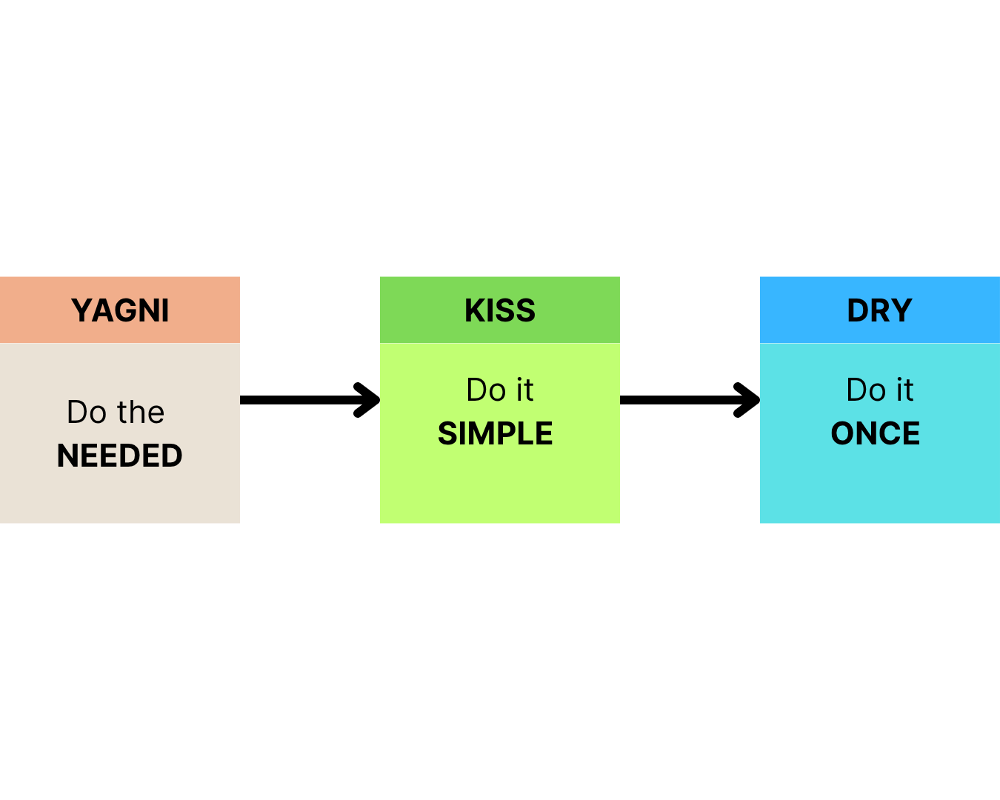

---

<!-- _footer: "" -->
<!-- _header: "" -->
<!-- _paginate: false -->

<style scoped>
p { text-align: center}
h1 {text-align: center; font-size: 72px}
</style>

# 🏆 Software Quality Attributes

---

# Software Quality Attributes

<!-- TODO: VISUAL - Quality diamond/radar chart
     Create a diamond/pentagon shape with 4-5 axes:
     - Maintainability
     - Dependability
     - Efficiency
     - Usability
     Show two overlaid shapes: "Ideal" (outlined) vs "Typical Trade-offs" (filled)
     Caption: "You can't maximize everything" -->

## What Makes Software "Good"?

<div class="two-columns">
<div class="column">

### Functional Requirements

- **What** the system should do
- Features and capabilities
- User requirements
- Business logic

**Example:** "System must allow users to login with email and password"

</div>
<div class="column">

### Non-Functional Requirements (Quality Attributes)

- **How well** the system should do it
- Performance characteristics
- System qualities
- Constraints

**Example:** "Login must complete within 2 seconds for 10,000 concurrent users"

</div>
</div>

## Quality attributes often conflict with each other - trade-offs are inevitable!

---

# Key Quality Attributes

<div class="two-columns">
<div class="column">

## 1. Maintainability

- **Ease of modification** and updates
- **Understandable** code
- **Well-documented** system
- **Modular** architecture

## 2. Dependability (Reliability)

- **Availability** - system is operational when needed
- **Reliability** - operates without failure
- **Safety** - doesn't cause harm
- **Security** - protected from attacks

</div>
<div class="column">

## 3. Efficiency (Performance)

- **Response time** - how fast
- **Throughput** - how much
- **Resource usage** - CPU, memory, network
- **Scalability** - handle growth

## 4. Usability

- **Ease of learning** - quick to understand
- **Ease of use** - intuitive interface
- **Error tolerance** - forgives mistakes
- **Accessibility** - usable by everyone

</div>
</div>

---

# Maintainability : The Largest Cost Factor in Software Lifecycle

<div class="two-columns">
<div class="column">

### Why It Matters

- **70-80%** of software cost is maintenance
- Code is **read 10x more** than written
- Original developers often leave
- Requirements change constantly

### Components

1. **Understandability** - Can developers read it?
2. **Modifiability** - Can it be changed easily?
3. **Testability** - Can it be tested effectively?
4. **Analyzability** - Can problems be diagnosed accurately?

</div>
<div class="column">

### How to Achieve It

**Code Quality**

- Clear naming conventions, consistent style, appropriate comments, simple logic

**Documentation**

- Architecture decisions, API documentation, setup guides, troubleshooting guides

**Testing**

- Unit tests, integration tests, static tests, test coverage

**Version Control**

- Meaningful commit messages, feature branches, PR reviews

</div>
</div>

---

# Dependability : Can We Trust This Software?

<div class="two-columns">
<div class="column">

### Four Dimensions

**1. Availability**

- System uptime percentage
- 99.9% = 8.76 hours downtime/year
- 99.99% = 52.56 minutes downtime/year
- 99.999% = 5.26 minutes downtime/year

**2. Reliability**

- Operates correctly over time
- MTBF (Mean Time Between Failures)
- MTTR (Mean Time To Repair)

</div>
<div class="column">

**3. Safety**

- System won't cause harm
- Critical in: medical, automotive, aviation
- Fail-safe mechanisms
- Error handling

**4. Security**

- Confidentiality - data privacy
- Integrity - data accuracy
- Availability - access when needed
- Authentication & Authorization
- Protection from attacks

</div>
</div>

---

# Example: How Netflix Achieves 99.99% Availability

<div class="two-columns">
<div class="column">

### Strategies

**Redundancy**

- Multiple copies of services
- Multiple data centers
- Multiple CDN locations

**Chaos Engineering**

- Chaos Monkey - randomly kills services
- Test system resilience in production

**Graceful Degradation**

- If recommendations fail, show popular content
- If images fail, show placeholder
- **If X fail, do Y, make sure core functionality always works**

</div>
<div class="column">

### Monitoring

**Proactive**

- 24/7 system monitoring, automated alerts, performance metrics, error tracking

**Reactive**

- Incident response teams, post-mortem analysis, continuous improvement

### Result

- **200+ million** subscribers worldwide
- **99.99%** uptime
- System handles **service failures automatically**
- Users rarely notice problems

</div>
</div>

---

# Efficiency : Performance and Resource Usage

<div class="two-columns">
<div class="column">

### Dimensions

**Time Efficiency**

- Response time - user request to response
- Throughput - requests handled per second
- Latency - delay in processing

**Space Efficiency**

- Memory usage
- Storage requirements
- Network bandwidth

**Energy Efficiency**

- Power consumption
- Battery life (mobile)
- Carbon footprint (data centers)

</div>
<div class="column">

### Considerations

**When It Matters Most**

- Real-time systems, high-traffic applications, mobile applications, AI applications, resource-constrained devices, cloud computing

**Trade-offs**

- Faster code may use more memory
- Caching improves speed but uses storage
- Optimization takes development time
  > Premature optimization is the root of all evil
  > Donald Knuth

**Today's Reality**

- Hardware is cheap, AI is cheaper, developers are expensive
- Optimize only when necessary

</div>
</div>

---

# Usability: If Users Can't Use It, It's Useless

<div class="two-columns">
<div class="column">

### Components

**Learnability**

- How quickly can new users learn?
- Are features discoverable?
- Is there a learning curve?

**Efficiency of Use**

- How quickly can power users work?
- Keyboard shortcuts, bulk operations
- Workflow optimization

**Memorability**

- Can casual users remember how to use it?
- Consistent patterns
- Clear mental models

</div>
<div class="column">

**Error Prevention & Recovery**

- Prevent errors before they happen
- Clear error messages
- Easy undo/redo
- Confirmation for destructive actions

**Satisfaction**

- Enjoyable to use
- Aesthetic design
- Positive emotional response

**Accessibility**

- Usable by people with disabilities
- Screen reader support
- Keyboard navigation
- Color contrast
- WCAG compliance

</div>
</div>

---

# Quality Attributes: The Trade-offs

### You Can't Optimize Everything

<div class="two-columns">
<div class="column">

**Security vs Usability**

- More security = more friction
- Biometric auth vs simple password

**Performance vs Maintainability**

- Optimized code is usually difficult to understand
- Premature optimization creates complexity

**Flexibility vs Simplicity**

- More options = more complexity
- Enterprise software vs consumer apps

**Cost vs Quality**

- Higher availability = more infrastructure
- More testing = longer development time

</div>
<div class="column">

**Time to Market vs Quality**

- Ship fast vs ship right
- Technical debt trade-off

### Know your priorities

- Medical software → Safety, Reliability
- Gaming → Performance, Usability
- Banking → Security, Availability
- Startup MVP → Speed, Flexibility

</div>
</div>

---

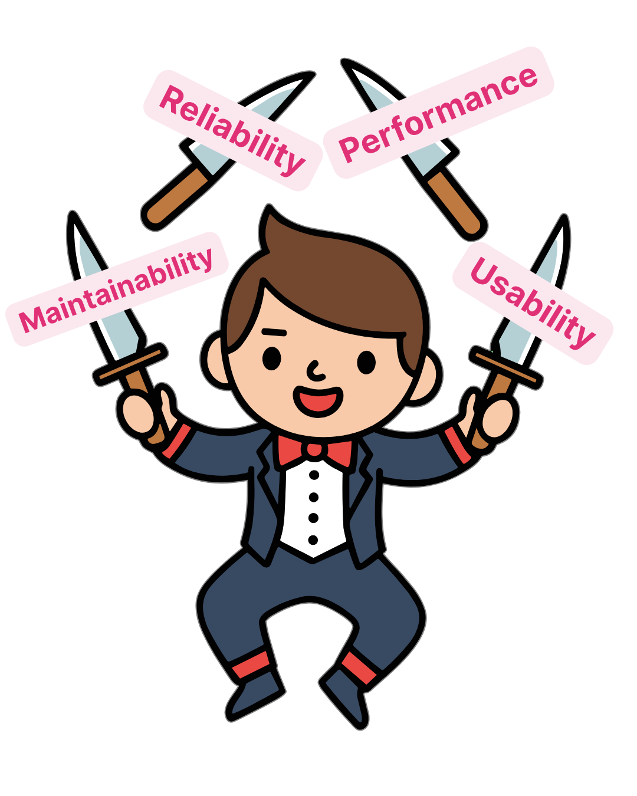

# Software Engineering is About Balance

### Technical Concerns

- Code quality, architecture, performance, security, scalability

### Process Concerns

- Methodology, team workflow, tools, documentation, testing

### Business Concerns

- Time to market, budget, ROI, competitive advantage, user satisfaction

### Human Concerns

- Team morale, work-life balance, career growth, sustainable pace, communication

</div>
</div>

### Good software engineering means balancing ALL

---

<!-- _footer: "" -->
<!-- _header: "" -->
<!-- _paginate: false -->

<style scoped>
p { text-align: center}
h1 {text-align: center; font-size: 72px}
</style>

# 🪾 Version Control Foundations

---

# What is Version Control?

> Version control (also called source control) is a system that records changes to files over time so you can recall specific versions later.

<div class="two-columns">
<div class="column">

**📒 Track Changes**
- Every modification is recorded
- Who changed what, when, and why
- Complete history of your project

**👥 Collaborate**
- Multiple people work on same project
- Merge changes from different people
- Resolve conflicts when they occur

</div>
<div class="column">

**🧪 Experiment Safely**
- Create branches to try new ideas
- Keep main code stable
- Merge successful experiments

**♻️ Recover**
- Restore previous versions
- See what broke and when
- Time travel through your code

</div>
</div>

---

# How Git Works

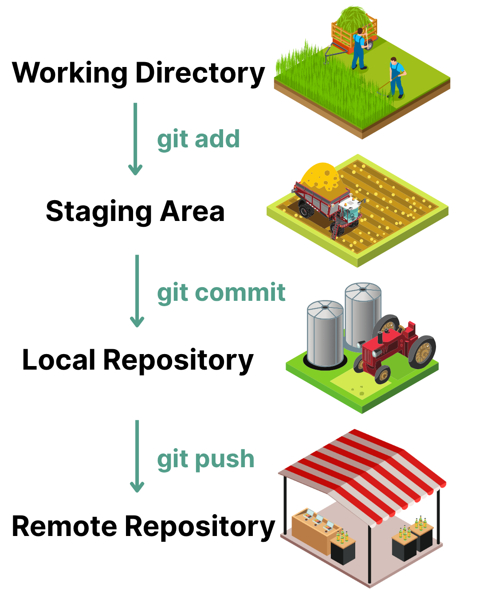

**1. Working Directory**
- Your actual project files
- Where you make changes
- Untracked or modified files

**2. Staging Area (Index)**
- Prepared changes for commit
- You choose what to commit

**3. Local Repository (History)**
- Permanent snapshots
- Complete project history

**4. Remote Repository (Collaborate)**
- Shared version on server (GitHub)
- Team members can access

---

# Why Version Control Matters

<div class="two-columns">
<div class="column">

### Without Version Control

```
my_project.py
my_project_v2.py
my_project_v2_final.py
my_project_v2_final_FINAL.py
my_project_v2_final_FINAL_actually_final.py
my_project_v2_final_REALLY_FINAL_this_time.py
```

**Problems:**

- Which version is current?
- What changed between versions?
- How to collaborate?
- How to recover from mistakes?
- What did I change yesterday?

</div>
<div class="column">

### With Version Control (Git)

```bash
git log --oneline
a1b2c3d Fix login bug
e4f5g6h Add user registration
i7j8k9l Update database schema
za314sd Added authentication
m0n1o2p Initial commit
```

**Benefits:**

- Complete history
- See what changed and why
- Multiple people work simultaneously
- Work on multiple features
- Undo mistakes

</div>
</div>

---

# Git Basics: Essential Commands

<div class="two-columns">
<div class="column">

### Creating a Repository

```bash
# Create a new repository
git init

# Clone an existing repository
git clone https://github.com/user/repo.git
```

### Basic Workflow

```bash
# Check status of your files
git status

# Add files to staging
git add filename.py
git add .  # Add all changes

# Commit changes
git commit -m "Descriptive message"

# Push changes
git push origin main
```

</div>
<div class="column">

### Common Commands

```bash
# See what changed
git diff  # Unstaged changes
git diff --staged  # Staged changes

# Undo changes
git restore filename.py  # Discard changes
git restore --staged file.py  # Unstage

# Remove files
git rm filename.py
git rm --cached file.py  # Stop tracking

# Move/rename files
git mv old.py new.py

# View commit history
git log
git log --oneline --graph

# View remotes
git remote -v

# Fetch without merging
git fetch origin
```
</div>
</div>

---

# Git Branching

### Why Branches?

- **Isolate features** - Work without affecting main code
- **Experiment safely** - Try new ideas
- **Parallel development** - Multiple features at once
- **Code review** - Review before merging

### Branch Commands

```bash
# List branches
git branch  # Local branches
git branch -a  # All branches (local + remote)

# Create branch
git branch feature/new-ui

# Switch to branch
git checkout feature/new-ui

# Create and switch (shortcut)
git checkout -b feature/new-ui
```

---


# Git Workflow Example

1. **Create branch** from main: `git checkout -b feature/login`
2. **Make changes** and commit: `git commit -m "Add login form"`
3. **Push to remote**: `git push origin feature/login`
4. **Create Pull Request** on GitHub
5. **Code Review** - teammates review changes
6. **Address feedback** - make requested changes
7. **Merge** - approved changes merge to main
8. **Deploy** - automated deployment to production

---

# Git Merging and Conflicts

<div class="two-columns">
<div class="column">

### What is a Merge Conflict?

Occurs when:

- Two branches modify the same line
- One branch deletes a file another modifies
- Git can't automatically decide which change to keep

### Example Conflict

```python
<<<<<<< HEAD (your current branch)
def calculate_total(price):
    return price * 1.18  # With tax
=======
def calculate_total(price):
    return price * 1.10  # Different tax rate
>>>>>>> feature/tax-update
```

**You must manually choose which version to keep!**

</div>
<div class="column">

### Resolving Conflicts

```bash
# Try to merge
git merge feature/tax-update
# CONFLICT! Git tells you which files

# Check conflicting files
git status

# Open file, you'll see:
# <<<<<<< HEAD
# Your changes
# =======
# Their changes
# >>>>>>> branch-name

# Edit file to keep what you want
# Remove conflict markers

# After resolving
git add resolved-file.py
git commit -m "Merge feature/tax-update"
```

</div>
</div>

---

# Git for Your Project

<div class="two-columns">
<div class="column">

### Project Setup (One team member)

```bash
# Create repository on GitHub
# Then clone it
git clone https://github.com/team/project.git
cd project

# Create initial structure
mkdir src tests docs
touch README.md .gitignore

# Add .gitignore content
echo "node_modules/" >> .gitignore
echo "*.pyc" >> .gitignore
echo ".env" >> .gitignore
echo "__pycache__/" >> .gitignore

# Commit and push
git add .
git commit -m "Initial project structure"
git push origin main
```

</div>
<div class="column">

### Daily Workflow

```bash
# Morning: Get latest changes
git checkout main
git pull origin main

# Create your feature branch
git checkout -b feature/add-login

# Work on your feature
# ... edit files ...
git add .
git commit -m "Add login form UI"

# Push your branch
git push origin feature/add-login

# Create Pull Request on GitHub

# After PR is approved and merged
git checkout main
git pull origin main
git branch -d feature/add-login
```

</div>
</div>

---

# Git Best Practices


### Try to:
- **Never commit directly to main**
- **Always work in feature branches**
- **Write meaningful commit messages**
- **Pull before you push**
- **Review your teammates' PRs**

---
# Git Best Practices 

### Write meaningful commit messages! This is your message to history

<div class="two-columns">
<div class="column">

### Bad Commit Messages

❌ "fixed stuff"
❌ "asdf"
❌ "update"
❌ "changes"
❌ "final version"
❌ "this should work"


</div>
<div class="column">

### Good Commit Messages

✅ "Add user authentication with JWT"
✅ "Fix crash when submitting empty form"
✅ "Update README with setup instructions"
✅ "Refactor database connection code"
✅ "Add unit tests for payment processing"

</div>
</div>

---

# Git Common Mistakes and Fixes

<div class="two-columns">
<div class="column">

### Committed to Wrong Branch?

```bash
# Committed to main instead of feature branch
git log  # Note the commit hash

# Undo the commit (keep changes)
git reset --soft HEAD~1

# Create correct branch
git checkout -b feature/correct-branch

# Commit again
git add .
git commit -m "Add feature (on correct branch)"
```

### Want to Undo Last Commit?

```bash
# Keep changes, undo commit
git reset --soft HEAD~1

# Discard changes AND commit
git reset --hard HEAD~1  # CAREFUL!
```

</div>
<div class="column">

### Merge Went Wrong ?

```bash
# Abort the merge
git merge --abort

# Start over
git status  # Make sure working tree is clean
```

### Need to Change Last Commit Message ?

```bash
# Change most recent commit message
git commit --amend -m "Better message"

# WARNING: Only if you haven't pushed yet!
```

</div>
</div>

---

<!-- _footer: "" -->
<!-- _header: "" -->
<!-- _paginate: false -->

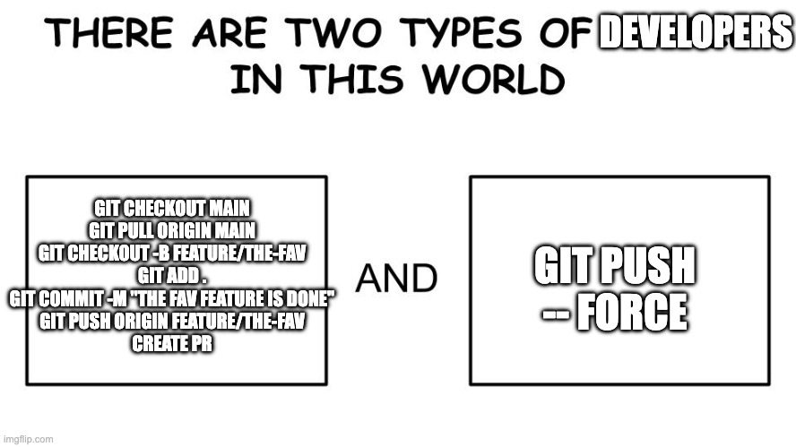

---

<!-- _footer: "" -->
<!-- _header: "" -->
<!-- _paginate: false -->

<style scoped>
p { text-align: center}
h1 {text-align: center; font-size: 72px}
</style>

# 📊 Project Progress Check

---

# Project Progress: Week 2


## What Should Be Happening Now

**Team Formation**

- Exchanged contact information?
- Set up communication channel (WhatsApp, Slack, Teams)?

**Initial Brainstorming**

- Discussed potential project ideas?
- Identified user problems to solve?
- Thought about technology preferences?

**GitHub Setup**

- Created GitHub accounts?
- Explored GitHub features?

---

<!-- _footer: "" -->
<!-- _header: "" -->
<!-- _paginate: false -->

<style scoped>
p { text-align: center}
h1 {text-align: center; font-size: 72px}
</style>

# 🎦 Team Progress Reports 

---

# Apply Software Engineering Principles

**For Your Project, Discuss:**

1. **Which principles are most important?**

   - Maintainability? Performance? Usability?
   - Why?

2. **What quality attributes do you prioritize?**

   - What trade-offs will you make?

3. **What technologies will you use?**

   - Why those choices?
   - What are the trade-offs?

4. **How will you ensure quality?**
   - Testing strategy?
   - Code review process?
   - Documentation approach?

---

# Deliverable 1 Preview

## Software Development Plan (Due Week 4)

### What You'll Submit

<div class="two-columns">
<div class="column">

**1. Project Overview**

- Title and brief description
- Problem statement
- Target users
- Core features (3-5)
- What makes it unique?

**2. Technology Stack**

- Frontend: Framework and reasoning
- Backend: Language/framework and why
- Database: Choice and justification
- Other tools: Hosting, CI/CD, etc.
- Why these choices for YOUR project?

</div>
<div class="column">

**3. Initial Design**

- Wireframes (low-fidelity sketches OK)
- Main pages/views
- User flow diagram
- Basic architecture diagram

**4. Development Setup**

- GitHub repository link
- Project board created
- Initial issues created

</div>
</div>

---

# Questions from Teams?

### Topics We Can Discuss:

- **Project Ideas** - Need help brainstorming?
- **Technology Choices** - Unsure what to use?
- **Technical Questions** - Git, frameworks, tools?
- **Scope Questions** - Too big? Too small?
- **Anything Else** - Don't hesitate to ask!

---

# Next Week Preview

## Week 3: Software Process Models

We'll explore in detail:

- **Waterfall Model** - Sequential development
- **Incremental Development** - Build piece by piece
- **Integration and Configuration** - Reuse existing components
- **Process Activities** - Specification, Design, Implementation, Testing
- **Choosing the Right Process** - Context matters
- **More Project Discussion** - Continue helping you plan

## Reading Assignment

- **Sommerville Chapter 2** - Software Processes
- Think about which process model fits your project best
- Start documenting your project idea

---

# Thank You!

## Contact Information

- **Email:** ekrem.cetinkaya@yildiz.edu.tr
- **Office Hours:** Tuesday 14:00-16:00 - Room F-B21
- **Book a slot before coming:** [Booking Link](https://calendar.app.google/aBKvBqNAqG12oD2B9)
- **Course Repository:** [GitHub](https://github.com/ekremcet/yzm2021-principles-of-software-engineering)

## Next Class

- **Date:** 14.10.2025
- **Topic:** Software Process Models
- **Reading:** Sommerville Ch. 2

**See you next week! Start working on projects!**
