# YZM2021

## Principles of Software Engineering

### Week 3: Software Process Models

**Instructor:** Ekrem Çetinkaya
**Date:** 14.10.2025

---

# Last Week Recap

### Core Principles We Covered

- **Separation of Concerns** - Divide and conquer complexity
- **Abstraction** - Hide unnecessary details, show what matters
- **Modularity** - Build independent, replaceable components
- **Encapsulation** - Information hiding and data protection
- **DRY Principle** - Don't Repeat Yourself
- **KISS Principle** - Keep It Simple, Stupid
- **SOLID Principles** - Five principles for object-oriented design

### This Week's Focus

**How do we organize and structure the software development process?**

---

<!-- _footer: "" -->
<!-- _header: "" -->
<!-- _paginate: false -->

<style scoped>
p { text-align: center}
h1 {text-align: center; font-size: 72px}
</style>

# 🔄 What is a Software Process?

---

# Software Process

<div class="two-columns">
<div class="column">

> A **software process** is a set of related activities that leads to the production of a software product

**It's not coding** It's a structured approach to:
- Understanding what to build
- Designing the solution
- Implementing the design
- Verifying it works
- Delivering to users
- Maintaining over time

</div>

<div class="column">

### House Analogy 

| Building Software | Building a House |
|------------------|------------------|
| Requirements | What rooms? How many floors? Budget? |
| Design | Architectural blueprints |
| Implementation | Construction work |
| Testing | Building inspection |
| Deployment | Move in |
| Maintenance | Repairs and renovations |

</div>
</div>

---

# Why Do We Need Process Models?

<div class="two-columns">
<div class="column">

### Without a Process Model

❌ No clear roadmap - Teams work without direction
❌ Inconsistent quality - Different standards across projects
❌ Poor communication - Misunderstandings and conflicts
❌ Missed deadlines - No realistic planning
❌ Budget overruns - Uncontrolled scope and costs
❌ Failed projects - High risk of complete failure

</div>
<div class="column">

### With a Process Model

✅ Clear structure and predictability
✅ Better communication and coordination
✅ Risk management and quality assurance
✅ Easier to estimate time and cost
✅ Foundation for improvement
✅ Professional accountability

</div>
</div>

---

# Process Model vs. Process

<div class="two-columns">
<div class="column">

### Process Model

> An **abstract representation** of a process. A template or framework that describes the approach.

**Think of it as**: The recipe or blueprint
**Examples**: Waterfall, Scrum, Kanban

### Process

> The **actual implementation** of a process model in a specific context

**Think of it as**: How you actually cook the recipe
**Examples**: "How we do Scrum at our company"

</div>
<div class="column">

###  Cooking Analogy

- **Process Model** = Recipe for chocolate cake (general instructions)
- **Process** = How YOU make chocolate cake (your oven, your ingredients, your timing)
- Two chefs following the same recipe = same process model, different processes


### Key Point
The same process model can be implemented differently in different organizations or projects

</div>
</div>


---

<!-- _footer: "" -->
<!-- _header: "" -->
<!-- _paginate: false -->

<style scoped>
p { text-align: center}
h1 {text-align: center; font-size: 72px}
</style>

# Fundamental Process Activities

---

# Four Fundamental Activities

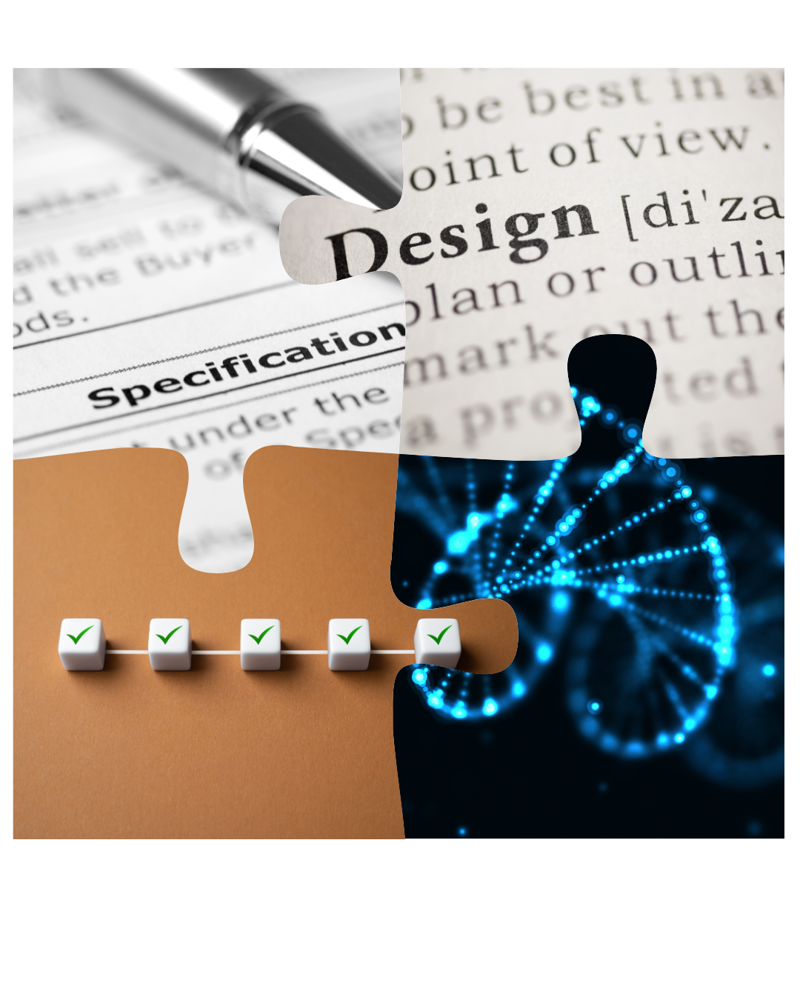

Regardless of the specific model used, every software process includes:

### 1. Specification
Defining what the system should do and its constraints

### 2. Design and Implementation
Producing the system that meets the specification

### 3. Validation
Checking that the system does what the customer wants

### 4. Evolution
Modifying the system to meet changing needs

---

# 1. Specification 

### What the System Should Do (aka Requirements Engineering)

<div class="two-columns">
<div class="column">

### Activities
- **Requirements elicitation** - Discovering requirements
- **Requirements analysis** - Understanding and modeling
- **Requirements specification** - Documenting requirements
- **Requirements validation** - Checking correctness

### Outputs
- Requirements document
- System models
- User stories
- Acceptance criteria

</div>

<div class="column">

### Key Questions
- **Who** will use the system?
- **What** should it do?
- **Where** will it be used?
- **When** should features be available?
- **Why** is this needed?
- **How** should it behave?

###  Example: Food Delivery App

"As a **hungry customer**, I want to **browse restaurants by cuisine type** so that **I can quickly find food I'm craving** (within 5 seconds)"

</div>
</div>

---

# Example: Instagram Stories

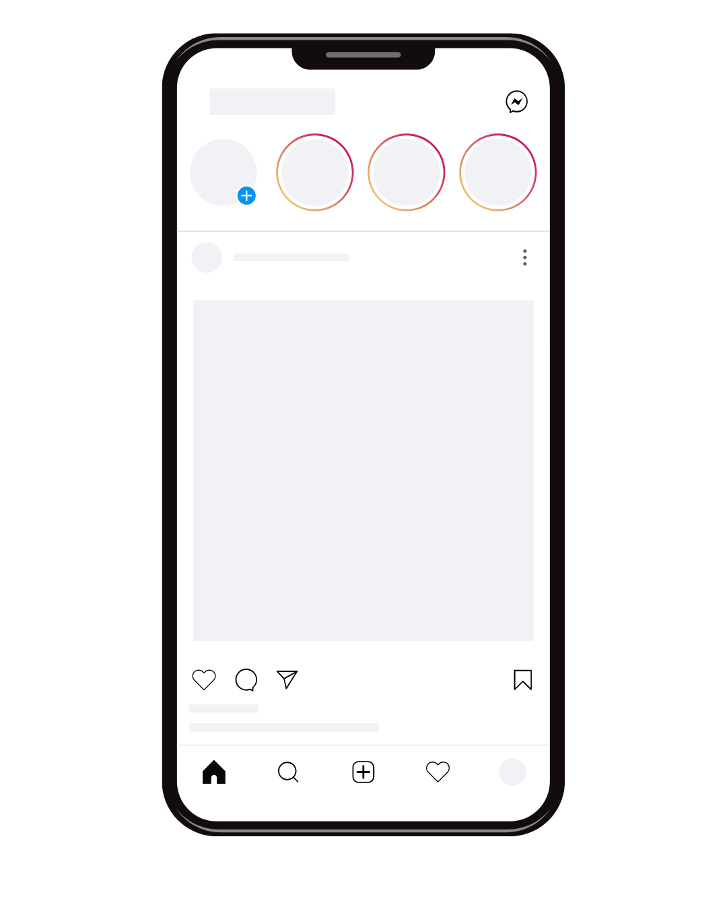

**Elicitation**: User interviews revealed people want temporary, casual content
**Analysis**: Snapchat's success showed demand for 24-hour posts
**Specification**: "Stories must disappear after 24 hours, support photos/videos up to 15 seconds, show seen by user list, ..."
**Validation**: Prototype tested with focus groups before full launch

---

# Output - Requirements Document

> Formal document describing what the system must do

<div class="two-columns">
<div class="column">

### What It Contains
- **Functional requirements** - What the system does
- **Non-functional requirements** - Quality attributes (performance, security, usability)
- **Constraints** - Technical, regulatory, budget limits
- **Assumptions** - What we're assuming is true

### Example Structure
1. Introduction & Scope
2. User Requirements
3. System Requirements
4. System Architecture (high-level)
5. Appendices (glossary, models)

</div>

<div class="column">

### Example: Online Banking App

**Functional Requirements**:
- FR-1: User shall be able to transfer money between accounts
- FR-2: System shall send SMS notification for transactions over $1000

**Non-Functional Requirements**:
- NFR-1: System shall respond within 2 seconds (performance)
- NFR-2: System shall use 256-bit encryption (security)
- NFR-3: System shall have 99.9% uptime (reliability)

**Constraints**:
- Must comply with banking regulations (PCI-DSS)
- Must work on iOS 15+ and Android 12+
- Budget: $500K, Timeline: 6 months

</div>
</div>

---

# Output - System Models

> Visual representations of system structure and behavior

<div class="two-columns">
<div class="column">

### Types of Models
- **Use case diagrams** - Who uses the system and how
- **Data flow diagrams** - How data moves through system
- **State diagrams** - System states and transitions
- **Entity-relationship diagrams** - Data structure
- **Sequence diagrams** - Interactions over time

### Why We Need Them
- Pictures are easier to understand than text
- Reveal missing requirements
- Communication tool between stakeholders
- Basis for design phase

</div>

<div class="column">

### Example: Food Delivery App

**Use Case Diagram**:
```
Customer → Browse Restaurants
Customer → Place Order
Customer → Track Delivery
Restaurant → Update Menu
Restaurant → Accept/Reject Order
Driver → Accept Delivery
Driver → Update Location
```

**Data Flow**:
```
Customer → Order → Restaurant
Restaurant → Acceptance → System
System → Assignment → Driver
Driver → Location Updates → Customer
```

</div>
</div>

---

# Output - User Stories

> Short descriptions of features from user perspective

<div class="two-columns">
<div class="column">

### Format
```
As a [user type]
I want to [action]
So that [benefit]
```

### Characteristics (INVEST)
- **I**ndependent - Can be developed separately
- **N**egotiable - Details can be discussed
- **V**aluable - Provides value to user
- **E**stimable - Can estimate effort
- **S**mall - Completable in one sprint
- **T**estable - Clear success criteria

</div>

<div class="column">

### Example: E-Learning Platform

**Student Stories**:
- As a **student**, I want to **watch lecture videos** so that **I can learn at my own pace**
- As a **student**, I want to **download slides** so that **I can study offline**

**Instructor Stories**:
- As an **instructor**, I want to **upload assignments** so that **students can submit work**
- As an **instructor**, I want to **grade submissions** so that **students get feedback**

**Admin Stories**:
- As an **admin**, I want to **manage users** so that **I can control access**

</div>
</div>

---

# Output - Acceptance Criteria

> Specific conditions that must be met for a feature to be accepted

<div class="two-columns">
<div class="column">

### What They Define
- **Functional criteria** - What the feature does
- **Performance criteria** - How fast/efficient
- **Quality criteria** - Error handling, edge cases
- **User experience criteria** - How it should feel

### Format: Given-When-Then
```
Given [initial context] When [event occurs] Then [expected outcome]
```

### Why Important
- Clear definition of "done"
- Prevents misunderstandings
- Basis for testing

</div>

<div class="column">

### Example: Login Feature

**User Story**: As a user, I want to log in so that I can access my account

**Acceptance Criteria**:

1. **Successful Login**
   - Given I am on the login page, When I enter valid email and password, Then I should be redirected to dashboard

2. **Failed Login**
   - Given I am on the login page, When I enter invalid credentials, Then I should see "Invalid email or password" error And I should remain on login page

3. **Performance** ??

</div>
</div>

---

# 2. Design and Implementation

<div class="two-columns">
<div class="column">

### Design Activities
- **Architectural design** - Overall system structure
- **Database design** - Data organization
- **Interface design** - User and system interfaces
- **Component design** - Individual modules

### Design Outputs
- Architecture diagrams
- Database schemas
- API specifications
- Component specifications

</div>

<div class="column">

### Implementation Activities
- **Coding** - Writing the actual code
- **Debugging** - Fixing errors
- **Unit testing** - Testing individual components
- **Integration** - Combining components

### Implementation Outputs
- Source code
- Build scripts
- Unit tests
- Technical documentation

</div>
</div>

---

# Example: Netflix Streaming


**Architectural Design**: Microservices architecture (catalog, streaming, recommendations, billing)
**Database Design**: User profiles in PostgreSQL, viewing history in Cassandra
**Interface Design**: TV app, mobile app, web player - different UIs, same backend
**Implementation**: React frontend, Java/Python microservices, AWS infrastructure

---

# Design Output - Architecture Diagrams

> High-level view of system structure and components

<div class="two-columns">
<div class="column">

### Types of Architecture Diagrams
- **System context diagram** - System and external entities
- **Component diagram** - Major components and relationships
- **Deployment diagram** - Physical deployment
- **Layered architecture** - Layers and their responsibilities

### What They Show
- Major components/modules
- How components communicate
- Data flow between components
- External systems/APIs
- Technology choices

</div>

<div class="column">

### Example: System Diagram of AI Call Center App

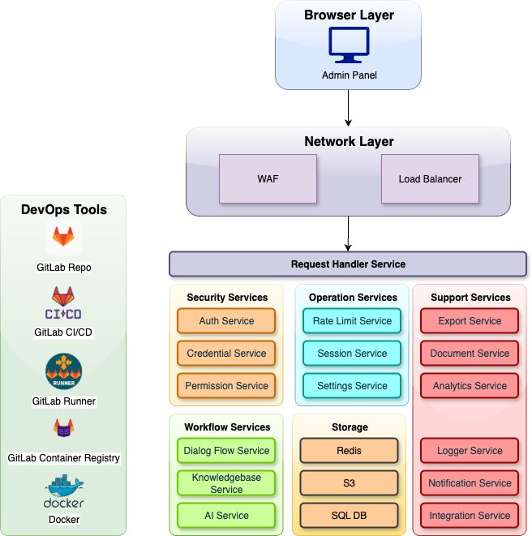

</div>
</div>

---

# Design Output - Database Schemas

> Structure of data storage including tables, relationships, and constraints

### What They Define
- **Tables/Collections** - Data entities
- **Fields/Columns** - Attributes and data types
- **Primary keys** - Unique identifiers
- **Foreign keys** - Relationships between tables
- **Indexes** - For query performance
- **Constraints** - Data validation rules

### Types of Schemas
- Relational (SQL) - Tables with relationships
- NoSQL - Document, key-value, graph
- Hybrid - Mix of both

---

# Example: ER Diagram of AI Call Center App

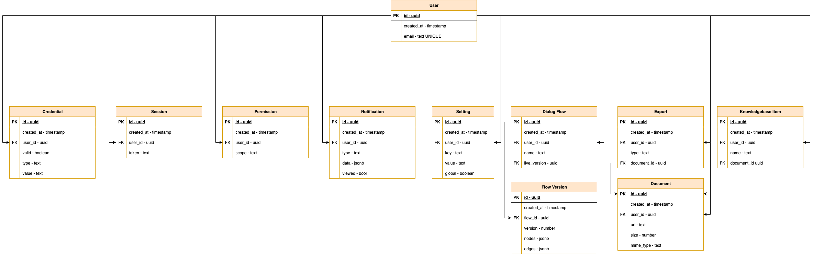

---

# Design Output - API Specifications

> Detailed documentation of how software components communicate

<div class="two-columns">
<div class="column">

### What They Include
- **Endpoints** - URLs for each API call
- **Methods** - GET, POST, PUT, DELETE
- **Request format** - Parameters, body structure
- **Response format** - Success and error responses
- **Authentication** - How to authenticate
- **Rate limits** - Usage restrictions
- **Examples** - Sample requests/responses

</div>

<div class="column">

### Example: User API Specification

**Endpoint**: `POST /api/users/register`

**Request Body**:
```json
{
  "email": "john@example.com",
  "password": "SecurePass123!"
}
```

**Success Response Body (201 Created)**:
```json
{
  "id": 12345,
  "email": "john@example.com",
  "created_at": "2025-10-13T10:30:00Z"
}
```

</div>
</div>

---

# Implementation Output - Source Code

> The actual code that implements the design

<div class="two-columns">
<div class="column">

### Characteristics of Good Code
- **Readable** - Easy to understand
- **Maintainable** - Easy to modify
- **Efficient** - Performs well
- **Testable** - Easy to test
- **Well-documented** - Comments and docs
- **Follows standards** - Coding conventions

### Code Organization
- Logical file structure
- Clear naming conventions
- Proper modularization
- Version controlled (Git)

</div>

<div class="column">

---

# Implementation Output - Build Scripts

> Automated scripts that compile and package the software

<div class="two-columns">
<div class="column">

### What They Do
- **Compile code** - Convert source to executable
- **Manage dependencies** - Download libraries
- **Run tests** - Execute test suites
- **Package application** - Create deployable artifacts
- **Generate documentation** - Auto-generate docs
- **Optimize code** - Minification, bundling

### Common Tools
- npm/yarn (JavaScript)
- Maven/Gradle (Java)
- Make/CMake (C/C++)
- pip (Python)

</div>

<div class="column">

### Example: package.json (Node.js)

```json
{
  "name": "my-web-app",
  "version": "1.0.0",
  "scripts": {
    "dev": "vite",
    "build": "vite build",
    "test": "vitest",
    "lint": "eslint src/",
    "deploy": "npm run build && firebase deploy"
  },
  "dependencies": {
    "react": "^18.2.0",
    "express": "^4.18.0"
  },
  "devDependencies": {
    "vitest": "^0.34.0",
    "eslint": "^8.50.0"
  }
}
```

**Usage**: `npm run build` - Compiles and bundles the app

</div>
</div>

---

# Implementation Output - Unit Tests

<div class="two-columns">
<div class="column">

### Purpose
- Verify each part works correctly
- Catch bugs early
- Enable refactoring with confidence

### Good Test Characteristics
- **Fast** - Run quickly
- **Independent** - Don't depend on others
- **Repeatable** - Same result every time
- **Self-validating** - Pass or fail clearly

### Test Structure (AAA Pattern)
1. **Arrange** - Set up test data
2. **Act** - Execute code being tested
3. **Assert** - Verify expected outcome

</div>

<div class="column">

### Example: Testing calculateTotal()

```javascript
describe('calculateTotal', () => {
  test('calculates total correctly', () => {
    // Arrange
    const items = [
      { price: 10, quantity: 2 },
      { price: 5, quantity: 3 }
    ];
    const taxRate = 0.08;
    const shippingCost = 5;
    
    // Act
    const total = calculateTotal(
      items, 
      taxRate, 
      shippingCost
    );
    
    // Assert
    expect(total).toBe(40); 
    // subtotal: 35, tax: 2.80, shipping: 5
    // total: 42.80 ≈ 40 (rounded)
  });
});
```

</div>
</div>

---

# Implementation Output - Technical Documentation

> Documentation for developers about how the system works

### Types of Documentation
- **Code comments** - Inline explanations
- **API documentation** - How to use APIs
- **Architecture docs** - System structure
- **Setup guides** - How to install/run
- **Deployment guides** - How to deploy
- **Troubleshooting guides** - Common issues

### Best Practices
- Keep it up-to-date
- Include examples
- Use clear language
- Auto-generate when possible
- Version with code

---

# 3. Validation (Testing)

## Verification vs. Validation

<div class="two-columns">
<div class="column">

### Verification
**"Are we building the product right?"**

- Does it conform to specifications?
- Is the code correct?
- Are standards followed?
- Static analysis, code reviews

</div>

<div class="column">

### Validation
**"Are we building the right product?"**

- Does it meet user needs?
- Is it useful?
- Does it solve the problem?
- User testing, acceptance testing

</div>
</div>

### Testing Levels
1. **Unit Testing** - Individual components
2. **Integration Testing** - Component interactions
3. **System Testing** - Complete system
4. **Acceptance Testing** - User requirements

---

# Example: E-Commerce Checkout


**Unit Test**: Does calculateTotal() correctly sum item prices?
**Integration Test**: Does payment gateway connect to order system?
**System Test**: Can a user complete full purchase flow end-to-end?
**Acceptance Test**: Does it meet the requirement "checkout in under 3 clicks"?

### Analogy: Car Manufacturing
- **Unit**: Test each part (engine, brakes)
- **Integration**: Test parts together (engine + transmission)
- **System**: Test complete car on track
- **Acceptance**: Test drive with real customers

---

# 4. Evolution (Maintenance)

### Why Software Changes

- **Bug fixes** - Correcting discovered errors
- **New requirements** - Adding new features
- **Changing environment** - OS updates, new platforms
- **Performance improvements** - Optimization
- **Security updates** - Addressing vulnerabilities
- **Technical debt** - Refactoring old code

### Evolution Statistics

> **Industry Fact**: Maintenance typically accounts for **60-80%** of total software costs!

Most software engineers spend more time maintaining existing systems than building new ones.

---

## Examples of Evolution

**WhatsApp (2009-2025)**
- Started: Simple text messaging
- Added: Voice calls (2015), video calls (2016)
- Added: Status feature (2017), business accounts (2018)
- Added: Communities (2022)
- **Constantly evolving** to compete with competitors

**Python Language**
- Python 2 → Python 3 (breaking changes in 2008)
- Still maintaining both versions until 2020
- Security updates, performance improvements
- New features: Type hints, async/await, pattern matching

---

<!-- _footer: "" -->
<!-- _header: "" -->
<!-- _paginate: false -->

<style scoped>
p { text-align: center}
h1 {text-align: center; font-size: 72px}
</style>

# Common Process Models

---

<!-- _footer: "" -->
<!-- _header: "" -->
<!-- _paginate: false -->

<style scoped>
p { text-align: center}
h1 {text-align: center; font-size: 72px}
</style>

# 🌊 Waterfall Model

---

# The Waterfall Model

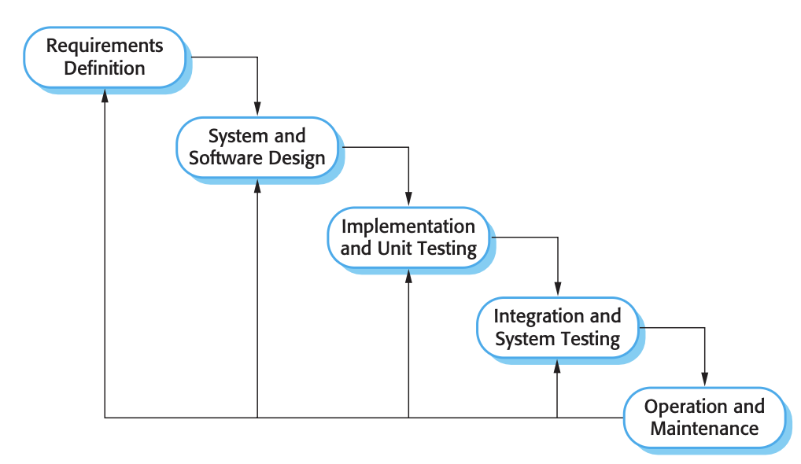

The classic process model where development flows downward like a waterfall through phases:

1. **Requirements Definition**
2. **System and Software Design**
3. **Implementation and Unit Testing**
4. **Integration and System Testing**
5. **Operation and Maintenance**

Each phase must be completed before the next begins.

### Key Characteristics

- **Document-driven** - Heavy documentation at each phase
- **Sequential** - One phase at a time
- **Milestone-based** - Clear phase completion criteria
- **Plan-driven** - Extensive upfront planning
- **Change-resistant** - Going back is expensive

---

# Waterfall: When to Use

<div class="two-columns">
<div class="column">

## ✅ Good For

- **Well-understood requirements**
  - Requirements are clear and stable
  
- **Stable technology**
  - Technology stack is proven
  
- **Short projects**
  - Can complete before changes needed
  
- **Regulatory projects**
  - Heavy documentation required
  
- **Fixed-price contracts**
  - Scope must be locked

</div>

<div class="column">

### Examples
- Safety-critical systems
- Medical devices
- Government contracts

### Example: Hospital Patient Management System
- Requirements clear (legal/medical standards)
- Stable technology (proven databases)
- Fixed scope (regulatory requirements)
- Heavy documentation required
- **Waterfall works well here!**

</div>
</div>

---

# Waterfall: When to Use

<div class="two-columns">
<div class="column">

## ❌ Not Good For

- **Unclear requirements**
  - Requirements will evolve
  
- **New technology**
  - Learning as you go
  
- **Long projects**
  - World will change during development
  
- **Innovative products**
  - Need user feedback
  
- **Competitive markets**
  - Need to adapt quickly

</div>

<div class="column">

### Examples
- Startup products
- Consumer apps
- Innovative features

### Example: New Social Media App
- Don't know what users want
- Competing with TikTok, Instagram
- Features need rapid changes
- Market trends shift quickly
- **Waterfall would fail here!**

</div>
</div>

---

# Waterfall: Problems

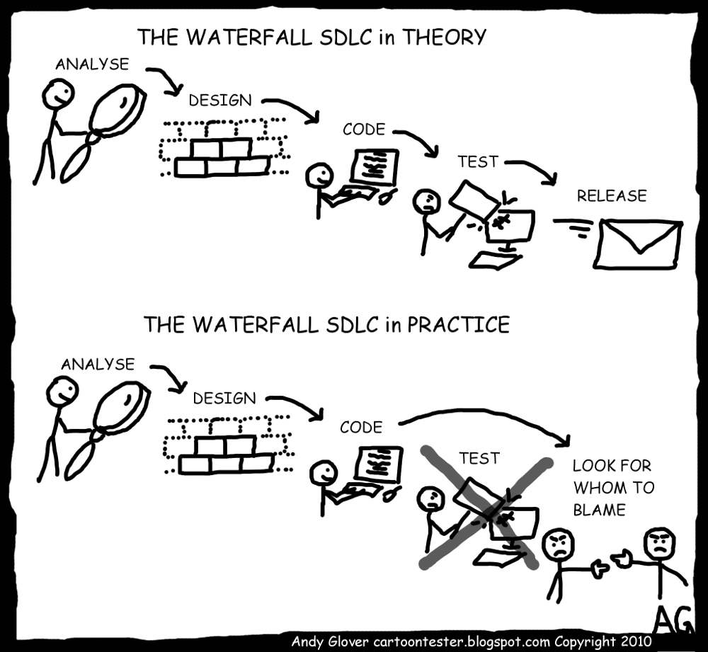

### 1. Inflexibility
- Requirements are locked early
- Difficult and expensive to accommodate changes
- Real world is dynamic, waterfall is static

### 2. Late Integration
- Components come together late
- Integration problems discovered too late
- "Big bang" integration is risky

### 3. Late Feedback
- No working software until late in project
- Customer sees nothing until testing phase
- Misunderstandings discovered too late

---

# Waterfall: More Problems

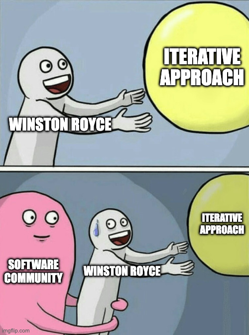

### 4. Unrealistic Expectations
- Assumes requirements can be fully understood upfront
- In reality: Requirements evolve as understanding grows
- Users don't know what they want until they see something

### 5. Testing Comes Too Late
- Defects are expensive to fix
- Design flaws discovered during testing
- May need to go back to design (very costly)

### 6. No Risk Management
- Technical risks not validated early
- Assumes everything will work as planned
- No mechanism for early risk mitigation

> **Side Note**: Winston Royce, who described the waterfall model in 1970, actually advocated for an iterative approach but is often misinterpreted

---

## Failure Example: Healthcare.gov (2013)

**The Project**: US government health insurance website
**Cost**: $1.7 billion

**What Went Wrong (Classic Waterfall Problems)**:
- Requirements locked in early = couldn't adapt to reality
- No working software until launch = massive "big bang" release
- Integration problems discovered at end = systems didn't work together
- No user testing until late = terrible user experience
- **Result**: Site crashed on launch day, national embarrassment

**Lesson**: Even with huge budgets, waterfall can fail spectacularly for complex, uncertain projects

---

# Modified Waterfall: The V-Model


## Testing at Every Level

The V-Model extends waterfall by:
- Pairing each development phase with a testing phase
- Planning tests alongside requirements/design
- Emphasizing verification and validation

### Left Side (Development)
- Requirements → Acceptance Tests
- Design → Integration Tests  
- Implementation → Unit Tests

### Right Side (Testing)
* Each level is validated against its corresponding development phase.

---

<!-- _footer: "" -->
<!-- _header: "" -->
<!-- _paginate: false -->

<style scoped>
p { text-align: center}
h1 {text-align: center; font-size: 72px}
</style>

# 🔄 Incremental Development

---

# Incremental Development

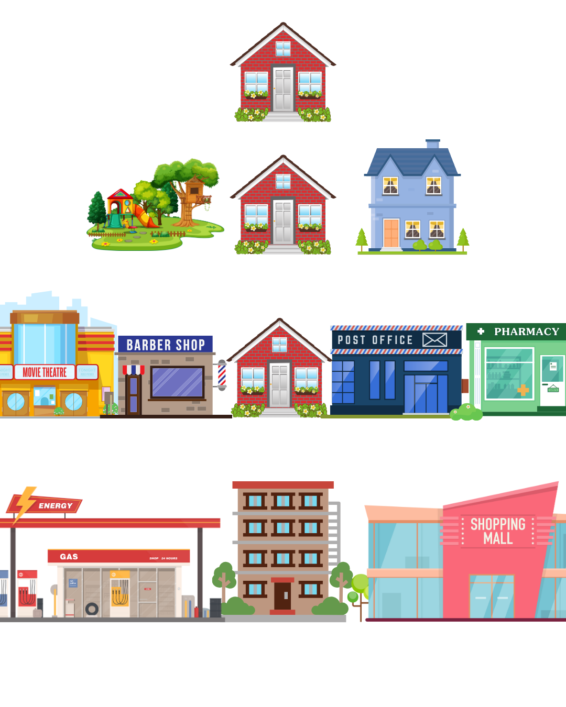

## Build in Pieces

Instead of delivering everything at once:

1. **Divide** system into increments
2. **Develop** one increment at a time
3. **Deliver** working software incrementally
4. **Iterate** based on feedback

### Each Increment
- Adds new functionality
- Is a working system
- Can be used by customers
- Incorporates feedback from previous increments

---

# 🏗️ Analogy: Building a City


**Waterfall**: Plan entire city, build everything, then people move in
**Incremental**: 
- Build one neighborhood → people move in → learn what works
- Build second neighborhood with improvements → more people
- Keep adding neighborhoods based on what residents actually need

---

# Incremental Development: How It Works

## The Cycle

```
Increment 1: Core features → Deploy → Feedback
                                        ↓
Increment 2: More features → Deploy → Feedback
                                        ↓
Increment 3: Advanced features → Deploy → Feedback
                                           ↓
                                    Final System
```

### Key Principles

- **Iterative and incremental** - Build → Measure → Learn
- **Early delivery** - Working software available early
- **Continuous feedback** - Learn from users regularly
- **Adaptive** - Can change direction based on feedback
- **Risk reduction** - Problems caught early

---

# Incremental vs. Iterative

<div class="two-columns">
<div class="column">

### Incremental
**Adding pieces progressively**

- Each release adds new features
- Previous functionality unchanged
- Building UP the system
- Like building a house floor by floor

```
v1.0: Login
v2.0: Login + Profile
v3.0: Login + Profile + Posts
```

</div>

<div class="column">

### Iterative
**Refining through repetition**

- Each iteration improves the whole
- Refinement of existing features
- Building ACROSS the system
- Like sculpting - rough → refined

```
Iteration 1: Basic prototype
Iteration 2: Improved design
Iteration 3: Polished product
```

</div>
</div>

### Best Practice
Combine both! Add features incrementally, refine iteratively.

---

## Example: Gmail

**Incremental Approach (2004-2025)**:
- **v1.0 (2004)**: Basic email + 1GB storage (revolutionary at the time)
- **v2.0 (2005)**: Added chat
- **v3.0 (2007)**: Added IMAP support
- **v4.0 (2008)**: Added tasks and calendar
- **v5.0 (2010)**: Added Priority Inbox (using feedback)
- **v6.0 (2012)**: Added tabs (Primary, Social, Promotions)
- **Ongoing**: AI features, Smart Compose, Smart Reply

Each increment:
- Added real value
- Got user feedback
- Shaped next features
- Competed with Yahoo, Hotmail

**If they used Waterfall**: Would have tried to build all features at once, launched years late, and competitors would have won (sad yahoo noises)

---

# Incremental Development: Benefits

<div class="two-columns">
<div class="column">

### For Customers

✅ **Early value delivery**
   - Working software available sooner
   - Can start using basic features

✅ **Reduced risk**
   - See progress regularly
   - Can cancel if not working

✅ **Influence development**
   - Feedback shapes future increments
   - Features prioritized by need

✅ **Smoother deployment**
   - Smaller changes easier to adopt
   - Gradual learning curve

</div>

<div class="column">

### For Development Team

✅ **Better requirements**
   - Learn what users really need
   - Requirements emerge over time

✅ **Early integration**
   - Components integrated regularly
   - Integration problems found early

✅ **Manageable complexity**
   - Focus on one increment at a time
   - Less overwhelming

✅ **Team morale**
   - Regular sense of completion
   - Visible progress

</div>
</div>

---

# Incremental Development: Challenges

### 1. Process Visibility
- Hard to measure progress
- No clear milestones like waterfall
- Management may be uncomfortable
- Need good tracking tools

### 2. System Structure Degradation
- Adding increments can degrade architecture
- Without care, becomes messy
- Need continuous refactoring
- Technical debt accumulates

### 3. Requires More Discipline
- Must maintain good practices
- Continuous integration needed
- Automated testing essential
- Documentation must keep up

---

# Incremental Development: More Challenges

### 4. Not All Systems Can Be Incremental
- Replacement systems need full functionality
- Difficult to identify useful increments
- Some features depend on others
- May need waterfall for first version

### 5. Contractual Issues
- Traditional contracts expect fixed scope
- Incremental requires flexibility
- Hard to price upfront
- Need different contract models

### 6. Integration Challenges
- Must integrate with existing systems
- Interface changes can be disruptive
- Need stable interfaces
- Backward compatibility important

---

<!-- _footer: "" -->
<!-- _header: "" -->
<!-- _paginate: false -->

<style scoped>
p { text-align: center}
h1 {text-align: center; font-size: 72px}
</style>

# 🔧 Integration and Configuration

---

# Reuse-Oriented Software Engineering

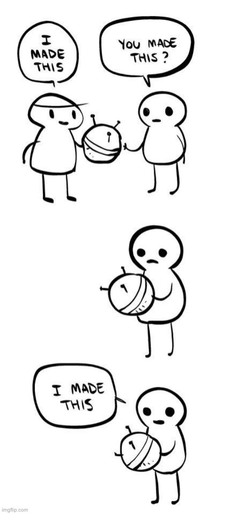

### Modern Reality
Most software development involves:
- Using existing components
- Integrating frameworks
- Configuring systems
- Minimal custom code

### Types of Reuse
- **Libraries and Frameworks** - npm, pip, Maven
- **COTS** - Commercial Off-The-Shelf products
- **Web Services** - APIs, microservices
- **Open Source** - GitHub, GitLab

---

## Analogy: LEGO Blocks

**Building from Scratch**: Make your own bricks, design everything -> slow, expensive
**Reuse-Oriented**: Use LEGO blocks, combine them creatively -> fast, proven quality

**In Software**:
- Don't write your own authentication -> Use Auth0
- Don't build your own maps -> Use Google Maps API
- Don't create payment system -> Use Stripe
- Don't write code -> Use OpenAI

---

# Integration and Configuration: Process

### The Modern Approach

```
Requirements Specification
         ↓
    Discover and Evaluate Components
         ↓
    Refine Requirements (based on available components)
         ↓
    Configure and Adapt Components
         ↓
    Integrate Components
         ↓
    System Validation
```

### Key Principle
**Requirements are negotiable based on what components are available**

---

# Types of Software Reuse

<div class="two-columns">
<div class="column">

### Component-Based

**Off-the-shelf components**

- Buy or download components
- Integrate into your system
- Configure as needed

### Examples
- React component libraries
- Payment gateways (Stripe)
- Authentication (Auth0)
- Charts (D3.js, Chart.js)

</div>

<div class="column">

### Service-Based

**External services via APIs**

- No code to maintain
- Pay-per-use model
- Always up-to-date

### Examples
- Google Maps API
- SendGrid (email)
- Twilio (SMS)
- AWS services

</div>
</div>

---

## Example: Uber

**What Uber Actually Built**: Matching algorithm, UI, business logic (maybe 20% of the app)

**What Uber Reused**:
- **Maps**: Google Maps API (navigation, addresses)
- **Payments**: Stripe/Braintree (credit card processing)
- **SMS**: Twilio (rider/driver notifications)
- **Push Notifications**: Firebase Cloud Messaging
- **Cloud Infrastructure**: AWS (servers, databases)
- **Analytics**: Segment, Amplitude

**Result**: Built revolutionary product in months, not years!

---

# Reuse-Oriented: Benefits and Drawbacks

<div class="two-columns">
<div class="column">

## ✅ Benefits

**Faster development**
- Don't build from scratch
- Proven solutions

**Lower costs**
- Less code to write
- Shared development costs

**Better quality**
- Well-tested components
- Used by many systems

**Easier maintenance**
- Component updates
- Security patches

</div>

<div class="column">

## ❌ Drawbacks

**Less control**
- Dependent on vendor
- Limited customization

**Compatibility issues**
- Components may not fit perfectly
- Version conflicts

**Learning curve**
- Must learn component APIs
- Documentation quality varies

**Vendor lock-in**
- Difficult to switch later
- Cost increases over time

</div>
</div>

---

<!-- _footer: "" -->
<!-- _header: "" -->
<!-- _paginate: false -->

<style scoped>
p { text-align: center}
h1 {text-align: center; font-size: 72px}
</style>

# The Rational Unified Process (RUP)

---

# The Rational Unified Process

## A Modern Process Framework

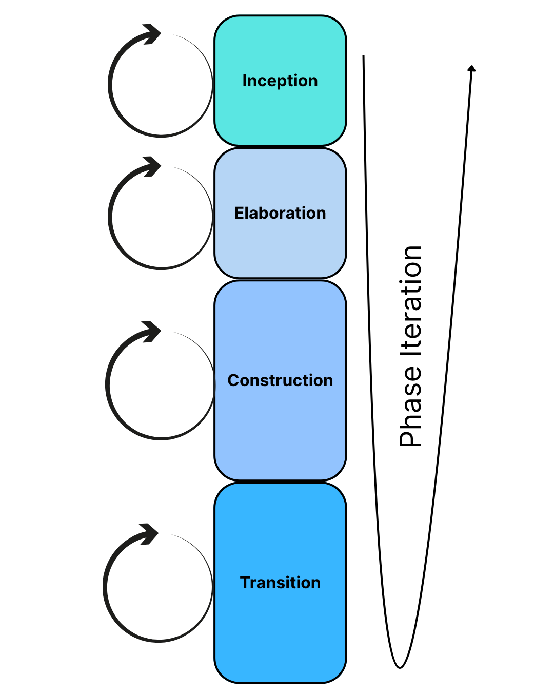

> **RUP** is a modern, generic process framework that brings together elements of all three generic process models

### Key Characteristics

- **Iterative and incremental** - Development in iterations
- **Architecture-centric** - Focus on system architecture
- **Risk-driven** - Address highest risks first
- **Use-case driven** - Requirements captured as use cases

### Three Perspectives
1. A **dynamic perspective**, which shows the phases of the model over time.
2. A **static perspective**, which shows the process activities that are enacted.
3. A **practice perspective**, which suggests good practices to be used during the process.

---

# RUP: Two Key Dimensions

## Phases and Disciplines

<div class="two-columns">
<div class="column">

### Phases (Time)
**When activities happen**

1. **Inception**
2. **Elaboration**
3. **Construction**
4. **Transition**

Phases are sequential and time-bounded

Unlike the waterfall model where phases are equated with process
activities, the phases in the RUP are more closely related to business rather than technical concerns.

</div>

<div class="column">

### Disciplines (Activities)
**What activities are performed**

- Business Modeling
- Requirements
- Analysis & Design
- Implementation
- Test
- Deployment
- Configuration Management
- Project Management
- Environment

Disciplines span all phases

</div>
</div>

---

# RUP Phases

### 1. Inception Phase 🌱
**Goal**: Establish business case and scope

- Define project scope and boundaries
- Identify key system features
- Create business case
- Assess risks and estimate costs
- **Output**: Vision document, initial use cases, project plan

### 2. Elaboration Phase 🔍
**Goal**: Establish architecture and eliminate highest risks

- Analyze problem domain
- Establish architectural foundation
- Develop detailed plan
- Eliminate high-risk elements
- **Output**: Executable architecture baseline, detailed use cases

---

# RUP Phases

### 3. Construction Phase 🏗️
**Goal**: Build the system

- All features developed
- Components integrated
- All features tested
- User manuals prepared
- System ready for deployment
- **Output**: Working software, user documentation

### 4. Transition Phase 🚀
**Goal**: Deliver system to users

- Beta testing with users
- Convert operational databases
- Train users and maintainers
- Roll out to user community
- **Output**: Deployed system, lessons learned

---

# RUP: Iterations Within Phases

## Each Phase Contains Multiple Iterations

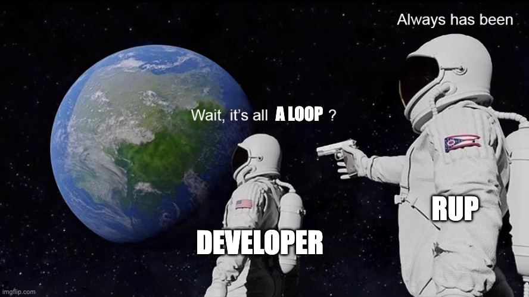

### Iteration Structure

```
Phase (e.g., Elaboration)
  ├── Iteration 1
  │   ├── Requirements
  │   ├── Design
  │   ├── Implementation
  │   ├── Test
  │   └── Deployment
  ├── Iteration 2
  │   └── (Same activities)
  └── Iteration 3
      └── (Same activities)
```

### Key Insight
**Each iteration is like a mini-waterfall**, but the overall process is incremental!

---

## 🎬 Analogy: Making a Movie (RUP Style)

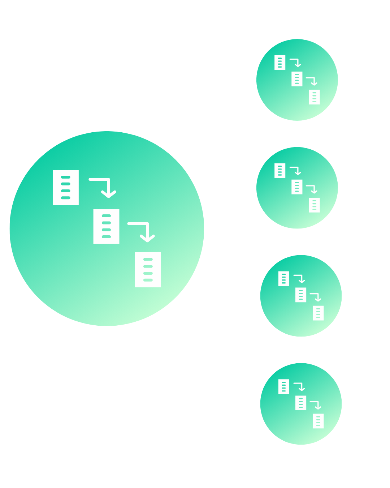

**Inception** = Script development, securing funding
- "Should we make this movie? Is there a market?"

**Elaboration** = Pre-production, location scouting, casting
- "How will we make it? Test with screen readings"

**Construction** = Filming all scenes
- "Actually shoot the movie, scene by scene"

**Transition** = Post-production, marketing, release
- "Edit, add effects, distribute to theaters"

**Within Each Phase**: Multiple iterations (takes) until it's right!

---

# RUP: Effort Distribution Across Phases

## Different Emphasis in Each Phase

| Discipline | Inception | Elaboration | Construction | Transition |
|------------|-----------|-------------|--------------|------------|
| **Requirements** | ✅✅✅ | ✅✅ | ✅ | - |
| **Design** | ✅ | ✅✅✅ | ✅✅ | - |
| **Implementation** | - | ✅ | ✅✅✅ | ✅ |
| **Testing** | - | ✅ | ✅✅ | ✅✅✅ |
| **Deployment** | - | - | ✅ | ✅✅✅ |

**✅ = Intensity of effort**

### Pattern
- Early phases focus on requirements and design
- Later phases focus on implementation and testing
- Activities span all phases but with different emphasis

---

# RUP vs. Waterfall

<div class="two-columns">
<div class="column">

### Waterfall

* **Sequential phases**: One phase at a time and no going back
* **Late integration**: Big bang at the end
* **Late risk discovery**: Problems found late
* **Inflexible**: Hard to change direction
* **Single delivery**: Everything at once

</div>

<div class="column">

### RUP

* **Iterative phases**: All activities in each iteration and refinement across iterations
* **Continuous integration**: Integration in each iteration
* **Early risk mitigation**: Risks addressed in elaboration
* **Adaptable**: Can adjust based on feedback
* **Multiple deliveries**: Working software each iteration

</div>
</div>

### Key Difference
RUP = "Controlled iteration" vs. Waterfall = "Sequential cascade"

---

# Example: E-Commerce System

### How RUP Would Work

### Inception (4 weeks)
- Identify key features: product catalog, shopping cart, checkout
- Assess feasibility and risks
- Estimate: 6 months, $200K budget
- **Output**: Vision document, business case approved

### Elaboration (8 weeks, 2 iterations)
- **Iteration 1**: Design architecture, prototype catalog
- **Iteration 2**: Refine design, prototype checkout flow
- Validate technical approach
- **Output**: Architecture baseline, mitigated technical risks

---

# Example: E-Commerce System

### Construction (16 weeks, 4 iterations)
- **Iteration 1**: Implement product catalog and search
- **Iteration 2**: Implement shopping cart functionality
- **Iteration 3**: Implement checkout and payment
- **Iteration 4**: Implement user accounts and order history
- **Output**: Complete, tested e-commerce system

### Transition (4 weeks)
- Beta testing with selected users
- Fix critical bugs
- Train customer service staff
- Deploy to production
- **Output**: Live e-commerce website

---

# When to Use RUP

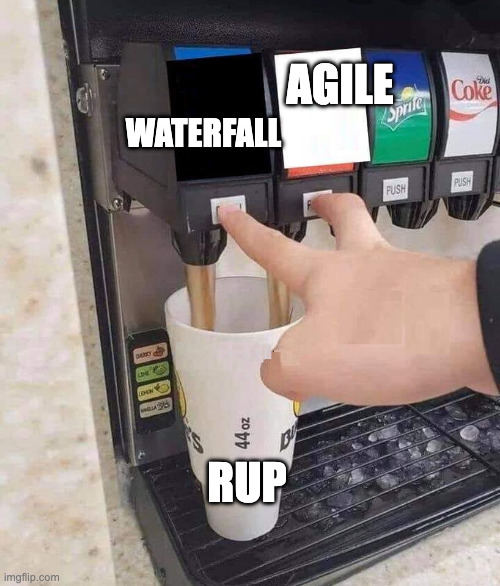

###  ✅ Good For

* Large projects
* High-risk projects
* Regulated industries
* Distributed teams
* Long-term projects

### ❌ Not Good For

* Small projects
* Simple applications
* Startups
* Time-critical
* Inexperienced teams


---

<!-- _footer: "" -->
<!-- _header: "" -->
<!-- _paginate: false -->

<style scoped>
p { text-align: center}
h1 {text-align: center; font-size: 72px}
</style>

# 📊 Comparing Process Models

---

# Process Models

| Aspect | Waterfall | Incremental | Reuse-Oriented | RUP |
|--------|-----------|-------------|----------------|-----|
| **Requirements** | Fixed upfront | Evolving | Adapted to components | Iteratively refined |
| **Delivery** | End of project | Multiple releases | Rapid deployment | Phase-based releases |
| **Feedback** | Late | Continuous | During configuration | End of each iteration |
| **Risk** | High (late integration) | Lower (early integration) | Medium (dependency) | Low (early mitigation) |
| **Flexibility** | Low | High | Medium | Medium-High |
| **Documentation** | Heavy | Moderate | Light | Heavy (but structured) |
| **Best For** | Stable requirements | Evolving needs | Time-to-market | Large, complex projects |

---

# Choosing the Right Model

<div class="two-columns">
<div class="column">

### Consider the Project

**Requirements clarity**
- Clear and stable -> Waterfall
- Unclear or changing -> Incremental

**Project size**
- Small -> Any model works
- Large -> Incremental 

**Technical risk**
- Low risk -> Waterfall
- High risk -> Prototype first

</div>

<div class="column">

### Consider the Organization

**Team experience**
- Inexperienced -> More structure
- Experienced -> More flexibility

**Customer involvement**
- Available -> Incremental
- Distant -> Waterfall

**Regulatory environment**
- Heavy regulation -> Waterfall
- Light regulation -> Flexible

</div>
</div>

---

# Process Models 

### Which Model for Which Situation?

| Scenario | Best Model | Why? |
|----------|------------|------|
| **e-Devlet** | |  |
| **Kafa Futbolu** | |  |
| **YTÜ Library Management System** | | |
| **SpaceX Starship Software** | | |
| **Getir** | | |
| **İş Bankası Mobile Banking** | |  |
| **YTÜ Online Store** | | |

---

# Process Models

### Which Model for Which Situation?

| Scenario | Best Model | Why? |
|----------|------------|------|
| **e-Devlet (Turkish Gov. Portal)** | Waterfall | Legal requirements fixed, security critical, heavily regulated |
| **Kafa Futbolu** | Incremental | Needed user feedback, iterative design |
| **YTÜ Library Management System** | Reuse-Oriented | Use existing frameworks (Django/React), standard CRUD operations |
| **SpaceX Starship Software** | RUP | Extremely high risk, safety-critical, complex system, iterative testing |
| **Getir** | Incremental | Startup MVP, needed fast feedback, pivoted based on user behavior |
| **İş Bankası Mobile Banking** | Waterfall/RUP | Banking regulations (BDDK), security requirements, audit trails required |
| **YTÜ Online Store** | Reuse-Oriented | Platform exists, just configure your shop (ikas, ticimax, shopify), don't build e-commerce from scratch |

---

# Cooking Analogy: Choosing Your Approach

<div class="two-columns">
<div class="column">

**Waterfall** = Baking a wedding cake
- Must follow recipe exactly
- Can't taste and adjust mid-bake
- Everything planned upfront

**Incremental** = Cooking a stir-fry
- Start with basics, keep adding
- Taste and adjust as you go
- Build flavors incrementally

</div>
<div class="column">

**Reuse-Oriented** = Meal kit delivery (Pişir)
- Pre-measured ingredients
- Proven recipes
- Just assemble and cook

**RUP** = Running a restaurant kitchen
- Planned menu (phases)
- Multiple dishes at once (iterations)
- Quality checks throughout (disciplines)

</div>
</div>

---

# Hybrid Approaches

### Most Organizations Mix Models

<div class="two-columns">
<div class="column">

### Traditional Hybrids

**1. Waterfall with Iterative Design**
- Overall project follows waterfall phases but design phase uses iterations

**2. Incremental with Reuse**
- Deliver incrementally while using existing components (modern web development)

**3. Prototyping + Waterfall**
- Prototype to clarify requirements, then follow waterfall to reduce risk

</div>
<div class="column">

### Modern Approaches

**4. Test-Driven Development (TDD)**
- Write tests before code (Red→Green→Refactor), forces thinking before coding

**5. Behavior-Driven Development (BDD)**
- Tests written in natural language (Cucumber/Gherkin) so business people can read them

**6. Developer-Driven Development (DDD)**
- Engineers own entire features end-to-end (Stripe's model, no separate QA/PM/Ops)

**7. Trunk-Based Development**
- Everyone commits to main branch daily, use feature flags to hide incomplete features (Google, Facebook)

</div>
</div>

---


<!-- _footer: "" -->
<!-- _header: "" -->
<!-- _paginate: false -->

<style scoped>
p { text-align: center}
h1 {text-align: center; font-size: 72px}
</style>

# Summary

---

# Key Takeaways

### Software Process Fundamentals
- Process is a structured approach to building software
- Four fundamental activities: Specification, Design & Implementation, Validation, Evolution
- Process models are abstract templates, processes are concrete implementations

### Four Main Process Models
1. **Waterfall** - Sequential, document-heavy, good for stable requirements
2. **Incremental** - Iterative delivery, continuous feedback, handles change well
3. **Reuse-Oriented** - Integration of existing components, fast time-to-market
4. **RUP** - Modern framework with 4 phases, iterative and risk-driven

### Coping with Change
- Change is inevitable in software development
- Prototyping validates ideas early
- Incremental delivery reduces risk and provides feedback
- RUP addresses change through iterations within phases

---

# Key Takeaways 

## Important Principles

### No One-Size-Fits-All
- Choose process based on context
- Consider requirements stability, team, organization, risk
- Most organizations use hybrid approaches

### Balance is Key
- Too little process = chaos
- Too much process = bureaucracy
- Find the sweet spot for your context

---

<!-- _footer: "" -->
<!-- _header: "" -->
<!-- _paginate: false -->

<style scoped>
p { text-align: center}
h1 {text-align: center; font-size: 72px}
</style>

# 🎦 Team Progress Reports 

---

# Thank You!

## Contact Information

- **Email:** ekrem.cetinkaya@yildiz.edu.tr
- **Office Hours:** Tuesday 14:00-16:00 - Room F-B21
- **Book a slot before coming:** [Booking Link](https://calendar.app.google/aBKvBqNAqG12oD2B9)
- **Course Repository:** [GitHub](https://github.com/ekremcet/yzm2021-principles-of-software-engineering)

## Next Class

- **Date:** 21.10.2025
- **Topic:** Agile Methodologies
- **Reading:** Sommerville Ch. 3

**See you next week! Start working on D1**