# YZM2021

## Principles of Software Engineering

### Week 4: Agile Methodologies

**Instructor:** Ekrem Çetinkaya
**Date:** 21.10.2025

---

# Last Week Recap

### Software Process Models We Covered

- **Waterfall Model** - Sequential phases, heavy documentation, good for stable requirements
- **Incremental Development** - Build in pieces, continuous feedback, handles change well
- **Reuse-Oriented** - Integration of existing components, fast time-to-market
- **RUP** - Four phases with iterations, risk-driven, architecture-centric

### Modern Approaches Introduced

- **TDD** - Write tests before code
- **BDD** - Tests in natural language
- **Developer-Driven** - Engineers own features end-to-end (Stripe)
- **Trunk-Based** - Everyone commits to main (Google, Facebook)

### This Week's Focus

**Deep dive into Agile: the most popular approach to modern software development**

---

<!-- _footer: "" -->
<!-- _header: "" -->
<!-- _paginate: false -->

<style scoped>
p { text-align: center}
h1 {text-align: center; font-size: 72px}
</style>

# What is Agile?

---

# The Birth of Agile


### The Problem (1990s-2000s)

- Waterfall was dominant but failing for many projects
- Software took years to develop
- By the time it was done, requirements had changed
- Users didn't get what they needed
- 70% of software projects failed or were challenged

### The Solution

In **February 2001**, 17 software developers met at a ski resort in Utah:
- Kent Beck, Martin Fowler, Robert Martin, Jeff Sutherland, and others
- They created the **Agile Manifesto**
- Changed software development forever

---

# What Does "Agile" Mean?

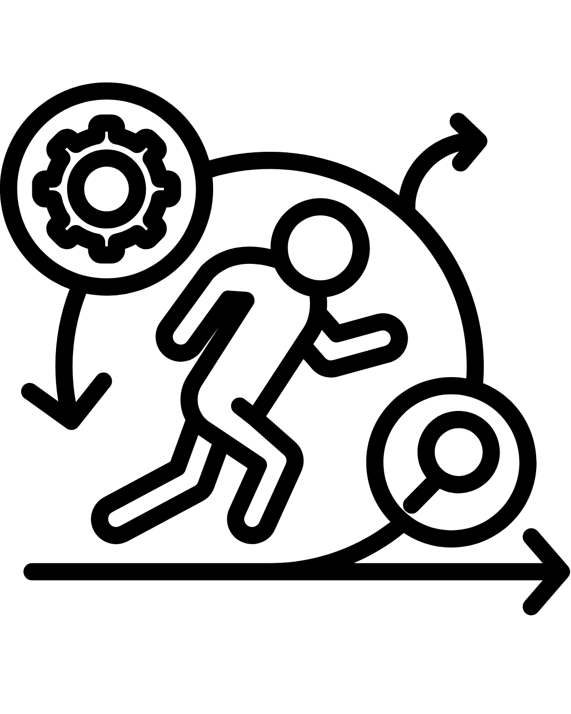

### Dictionary Definition

> **Agile** (adjective): Able to move quickly and easily

### In Software Development

> A **philosophy** and set of **practices** for delivering software iteratively, with continuous feedback and adaptation

### Key Characteristics

- **Iterative** - Build in small cycles
- **Adaptive** - Embrace change
- **Collaborative** - Close teamwork
- **Customer-focused** - Deliver value continuously
- **Fast feedback** - Learn and improve quickly

---

# Agile is NOT...

<div class="two-columns">
<div class="column">

### Common Misconceptions

❌ **"No planning"** - Agile has planning, just not months in advance
❌ **"No documentation"** - Agile values working software over excessive docs (not no docs!)
❌ **"Just Scrum"** - Scrum is one framework; Agile is the philosophy
❌ **"Chaotic"** - Agile has structure, ceremonies, and discipline
❌ **"Only for small teams"** - Can scale to large organizations
❌ **"Faster and cheaper"** - Not necessarily; it's about delivering value better

</div>

<div class="column">

### What Agile Really Is

✅ A **mindset** and **set of values**
✅ Focused on **people and collaboration**
✅ Emphasizes **working software** over comprehensive documentation
✅ Embraces **change** as a competitive advantage
✅ Delivers **value incrementally**

</div>

</div>

---

# Pop Quiz - Agile Basics

### Your manager says "We need to be Agile. Let's remove all documentation and skip planning meetings to move faster!" What's the problem?

**A)** Nothing wrong - that's exactly what Agile means

**B)** Agile has minimal planning, but "no planning" is chaos, not agile

**C)** This confuses "agile" (flexible) with "Agile" (methodology)

**D)** Agile requires just as much documentation as waterfall, just different types

---

### Answer: B ✅

**B)** Agile has minimal planning, but "no planning" is chaos, not agile

**Why?**
- ✅ **Agile ≠ no planning**: Sprint planning, backlog refinement, retrospectives
- ✅ **Agile ≠ no docs**: Just enough documentation, not excessive
- ✅ **Misconception**: "Move faster" doesn't mean "skip structure"

**Why others are wrong:**
- **A)** Common but dangerous misconception (chaos, not agile)
- **C)** While true in etymology, misses the main issue
- **D)** False - Agile explicitly values "just enough" documentation

**Key Takeaway**: Agile is disciplined flexibility, not undisciplined chaos!

---

<!-- _footer: "" -->
<!-- _header: "" -->
<!-- _paginate: false -->

<style scoped>
p { text-align: center}
h1 {text-align: center; font-size: 72px}
</style>

# The Agile Manifesto

---

# The Agile Manifesto


## Four Core Values

We are uncovering better ways of developing software by doing it and helping others do it. Through this work we have come to value:

### 1. **Individuals and interactions** over processes and tools
### 2. **Working software** over comprehensive documentation
### 3. **Customer collaboration** over contract negotiation
### 4. **Responding to change** over following a plan

> That is, while there is value in the items on the right, we value the items on the left more.

---

# Value 1: Individuals and Interactions

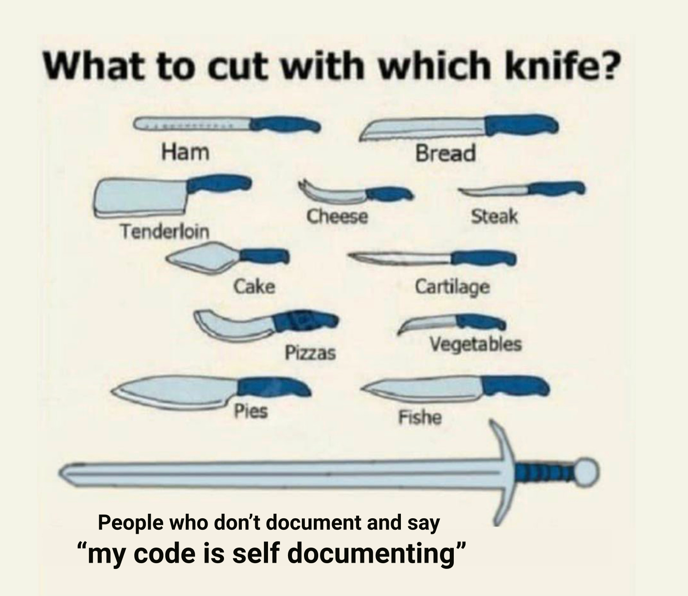

### Over Processes and Tools

**Traditional Approach**:
- Focus on following the process
- Tools dictate how team works
- "We must use Jira this way because that's the process"

**Agile Approach**:
- Focus on people working together effectively
- Tools serve the team, not vice versa
- Face-to-face conversation is best communication

---

# Pop Quiz

### Your team has 3 remote members and 4 in-office. Which approach BEST represents "Individuals and Interactions"?

**A)** Everyone must come to office for daily standups to enable face-to-face communication

**B)** Use Slack for all communication since it creates documented history

**C)** Team decides to have video standups at a time that works for all, with optional coffee chats

**D)** Standardize all communication through Jira tickets to avoid miscommunication

---

### Answer: C ✅

**C)** Team decides to have video standups at a time that works for all, with optional coffee chats

**Why?**
- ✅ **Team decides**: Process adapts to people, not vice versa
- ✅ **Enables interaction**: Video maintains human connection
- ✅ **Respects individuals**: Time that works for everyone
- ✅ **Tools serve team**: Jira/Slack used as needed, not mandated

**Why others might seem right but aren't:**
- **A)** Forces process on people (remote members suffer)
- **B)** Tool dictates workflow, documentation over conversation
- **D)** Process over people, formal over informal communication

**Key Takeaway**: Let the team decide HOW they work best together!

---

# Value 2: Working Software

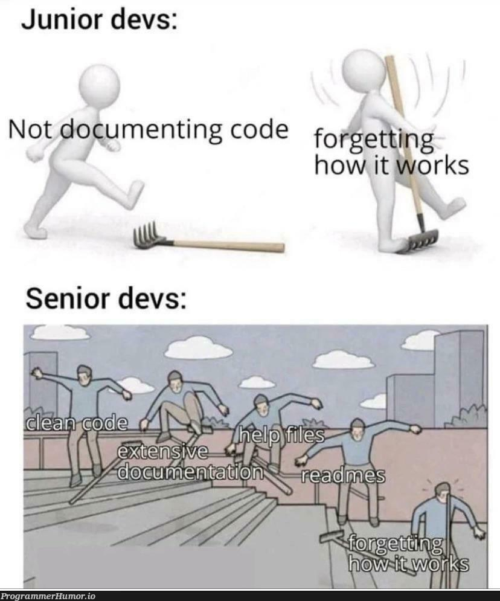

### Over Comprehensive Documentation

**Traditional Approach**:
- 100-page requirements document
- Detailed design documents
- Software comes later
- Documentation often outdated

**Agile Approach**:
- Working software is the primary measure of progress
- Just enough documentation to support the work
- Code is the most accurate documentation
- Automated tests serve as living documentation

---

# Pop Quiz

### Your team finishes a user registration feature. What should you do FIRST?

**A)** Write comprehensive API documentation before showing it to anyone

**B)** Deploy to production and write documentation based on user feedback

**C)** Get it code-reviewed, then write unit tests and documentation in parallel

**D)** Demo it to stakeholders with working credentials, minimal docs in README

---

### Answer: D ✅

**D)** Demo it to stakeholders with working credentials, minimal docs in README

**Why?**
- ✅ **Show working software**: Stakeholders can actually use it
- ✅ **Immediate feedback**: Learn what works/doesn't before investing in docs
- ✅ **Just enough docs**: README helps others use it, not comprehensive manual
- ✅ **Value first**: Stakeholders see progress they can touch

**Why others might seem right but aren't:**
- **A)** Delays feedback, documentation without validation
- **B)** Too risky - need validation before production
- **C)** Code review + tests good, but stakeholders need to see it working!

**Key Takeaway**: Demo working software ASAP to get real feedback!

---

# Value 3: Customer Collaboration

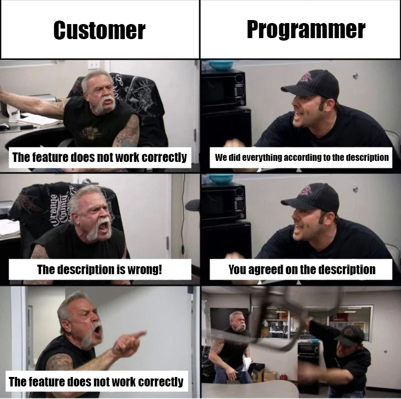

### Over Contract Negotiation

**Traditional Approach**:
- Negotiate fixed scope, time, and cost upfront
- "You'll get exactly what's in the contract"
- Changes require change requests
- Adversarial relationship

**Agile Approach**:
- Customer is part of the team
- Regular feedback and collaboration
- Scope can adapt to needs
- Partnership, not contract enforcement

---

# Pop Quiz

### Mid-sprint, your Product Owner says "Users are confused by the dashboard. Can we simplify it?" Sprint ends in 3 days. What's the BEST response?

**A)** "That's out of scope for this sprint. Let's add it to the backlog for next sprint"

**B)** "Sure! Let's discuss what 'simplify' means and see if we can do a quick iteration"

**C)** "We need a formal change request and impact analysis before changing anything"

**D)** "Let's finish what we committed to, then schedule a meeting to discuss changes"

---

### Answer: B ✅

**B)** "Sure! Let's discuss what 'simplify' means and see if we can do a quick iteration"

**Why?**
- ✅ **Welcomes collaboration**: Immediately engages with PO
- ✅ **Partnership mindset**: Working together to solve problem
- ✅ **Clarifies need**: "Simplify" is vague, needs discussion
- ✅ **Pragmatic**: Sees if quick fix is possible

**Why others might seem right but aren't:**
- **A)** Rigid sprint commitment over customer value
- **C)** Formal process over collaboration (waterfall mindset)
- **D)** Sprint commitment over collaboration, delays partnership

**Key Takeaway**: Customer feedback > Sprint commitment. Collaborate immediately!

---

# Value 4: Responding to Change

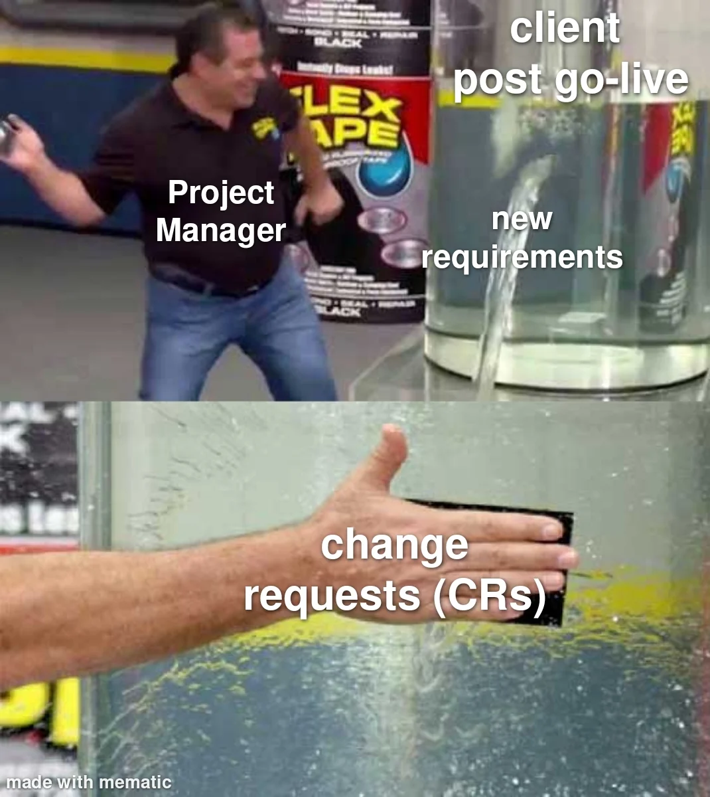

### Over Following a Plan

**Traditional Approach**:
- Create detailed plan upfront
- Execute the plan
- Changes are problems
- "Scope creep" is bad

**Agile Approach**:
- Plans are living documents
- Change is expected and welcome
- Adapt to market, technology, user needs
- Each iteration adjusts based on learning

---

# Pop Quiz

### Your team spent 6 weeks building a recommendation engine. Beta users say "We don't want recommendations, we want better search." You have 4 weeks left. What do you do?

**A)** Finish the recommendation engine as planned - we're 60% done, can't waste that work

**B)** Pivot to search immediately, reuse relevant code from recommendations where possible

**C)** Finish recommendations quickly, then add search if time permits

**D)** Present both options to stakeholders and let them decide the direction

---

### Answer: B ✅

**B)** Pivot to search immediately, reuse relevant code from recommendations where possible

**Why?**
- ✅ **User feedback > sunk cost**: 6 weeks wasted < wrong product
- ✅ **Immediate adaptation**: Don't wait, act on validated learning
- ✅ **Pragmatic**: Salvage relevant work but change direction
- ✅ **Value-driven**: Build what users actually need

**Why others might seem right but aren't:**
- **A)** Sunk cost fallacy - "60% done" of wrong thing = 0% value
- **C)** Half-hearted compromise, neither done well
- **D)** Users already decided! Asking stakeholders delays action

**Key Takeaway**: Validated user feedback > your original plan. Pivot fast!

---

# The 12 Agile Principles

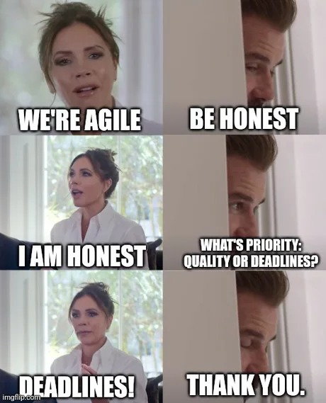

### Customer Satisfaction

1. Our highest priority is to satisfy the customer through early and continuous delivery of valuable software

### Welcome Change

2. Welcome changing requirements, even late in development. Agile processes harness change for the customer's competitive advantage

### Deliver Frequently

3. Deliver working software frequently, from a couple of weeks to a couple of months, with a preference to the shorter timescale

### Work Together

4. Business people and developers must work together daily throughout the project

---

# The 12 Agile Principles (Continued)

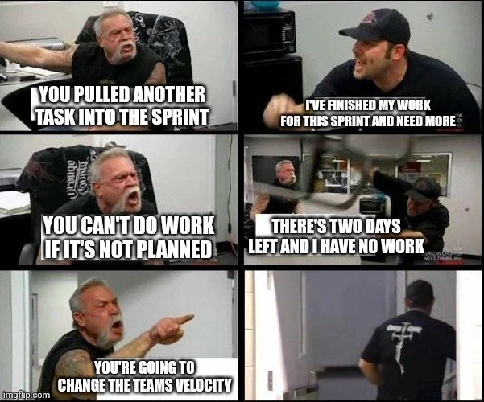

### Motivated Individuals

5. Build projects around motivated individuals. Give them the environment and support they need, and trust them to get the job done

### Face-to-Face

6. The most efficient and effective method of conveying information is face-to-face conversation

### Working Software

7. Working software is the primary measure of progress

### Sustainable Pace

8. Agile processes promote sustainable development. The sponsors, developers, and users should be able to maintain a constant pace indefinitely

---

# The 12 Agile Principles (Continued)

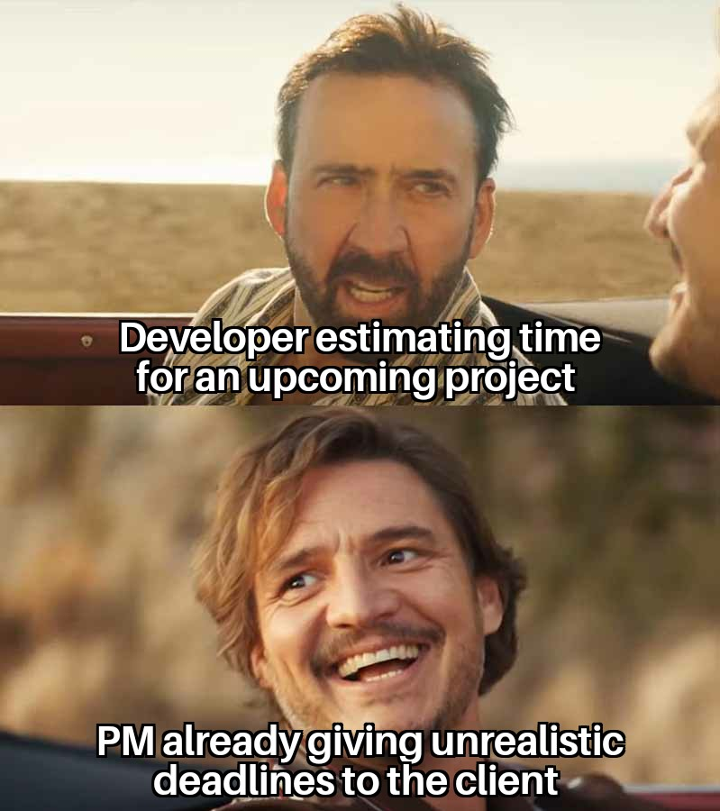

### Technical Excellence

9. Continuous attention to technical excellence and good design enhances agility

### Simplicity

10. Simplicity - the art of maximizing the amount of work not done - is essential

### Self-Organizing Teams

11. The best architectures, requirements, and designs emerge from self-organizing teams

### Reflect and Adjust

12. At regular intervals, the team reflects on how to become more effective, then tunes and adjusts its behavior accordingly

---

<!-- _footer: "" -->
<!-- _header: "" -->
<!-- _paginate: false -->

<style scoped>
p { text-align: center}
h1 {text-align: center; font-size: 72px}
</style>

# Scrum Framework

---

# What is Scrum?

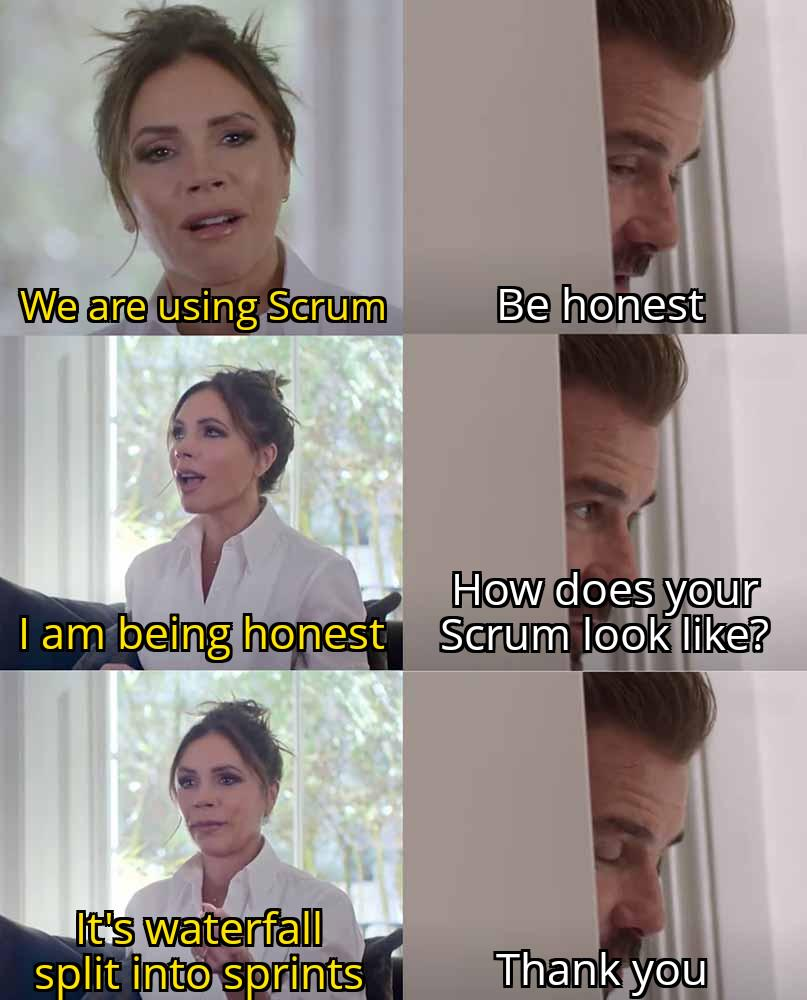

### Most Popular Agile Framework

> **Scrum** is a way to get work done as a team in small pieces at a time, with continuous experimentation and feedback loops along the way to learn and improve as you go

### Origins

- Created by Jeff Sutherland and Ken Schwaber in early 1990s
- Name comes from rugby (scrum = team working together)
- Formalized in 2010 with Scrum Guide

### Key Characteristics

- **Timeboxed sprints** - Fixed-length iterations (usually 2 weeks)
- **Three roles** - Product Owner, Scrum Master, Developers
- **Five events** - Sprint, Planning, Daily Scrum, Review, Retrospective
- **Three artifacts** - Product Backlog, Sprint Backlog, Increment

---

<style scoped>
p {text-align: center; font-size: 24px; font-style: italic}
</style>

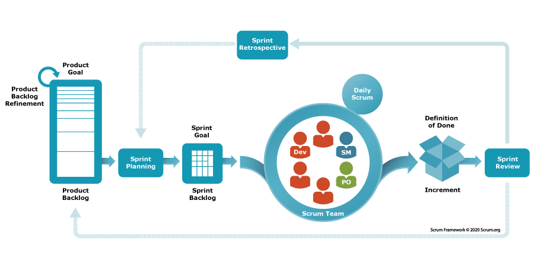

<a href="https://www.scrum.org/resources/what-scrum-module" style="text-center">What is Scrum? - scrum.org
</a>

---

# Scrum Roles

<div class="two-columns">
<div class="column">

### 1. Product Owner

**Responsibility**: Maximize product value

- Manages Product Backlog
- Defines and prioritizes features
- Accepts or rejects work
- Represents stakeholders
- **One person**, not a committee

### 2. Scrum Master

**Responsibility**: Manage Scrum process

- Removes obstacles
- Runs meetings
- Coaches the team
- Protects team from disruptions
- **Leader**, not a manager

</div>

<div class="column">

### 3. Developers

**Responsibility**: Deliver the increment

- Self-organizing team (3-9 people)
- Cross-functional (all skills needed)
- Commit to Sprint Goal
- No titles or sub-teams
- Collectively responsible

</div>
</div>

---

# Pop Quiz - Scrum Roles

### Q1: Developers say a backlog item is technically impossible. Product Owner insists it's critical. Who should resolve this?

**A)** Scrum Master facilitates discussion between PO and Developers to find alternative solution

**B)** Product Owner decides - they own the backlog priorities

**C)** Developers decide - they know what's technically feasible

**D)** Escalate to management to make final call

---

### Answer: A ✅

**A)** Scrum Master facilitates discussion between PO and Developers to find alternative solution

- ✅ **SM facilitates**: Helps team collaborate, doesn't decide
- ✅ **Removes blockers**: Conflict is blocking progress
- ✅ **Team decision**: PO + Devs find solution together
- ✅ **No escalation needed**: Self-organizing team resolves it

**Why others are wrong:**
- **B)** PO owns priorities, not technical feasibility
- **C)** Devs can't ignore business value/urgency
- **D)** Self-organizing team doesn't need management

---

# Scrum Events

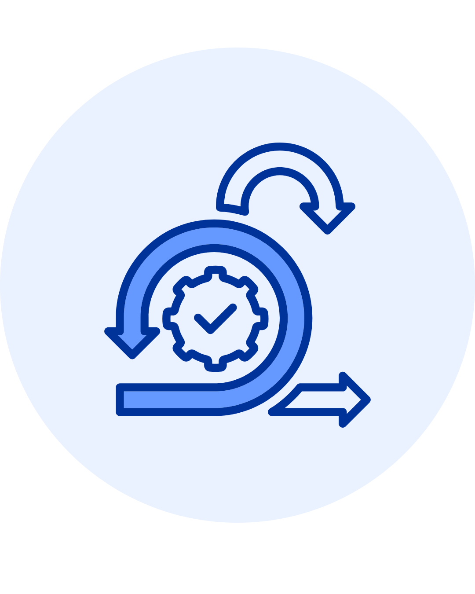

### 1. The Sprint

> Container for all other events; fixed length iteration

**Goal**: Create a working, tested increment
**Duration**: Consistent (e.g., always 2 weeks)
**Output**: Potentially shippable product increment

---

# Sprint Planning

### What & How

**Duration**: Maximum 8 hours for 1-month sprint (4 hours for 2 weeks)

**Questions Answered**:
1. **What** can be delivered in the Sprint? (Product Owner leads)
2. **How** will the work be done? (Developers lead)

**Inputs**:
- Product Backlog (prioritized by Product Owner)
- Latest increment
- Team capacity
- Past performance (velocity)

**Outputs**:
- Sprint Goal
- Sprint Backlog (selected items + plan)

---

# Sprint Planning Example

### Building Login Feature

<div class="two-columns">
<div class="column">

**Product Owner presents**:
- Priority 1: User can register with email
- Priority 2: User can login with email/password
- Priority 3: User can reset password
- Priority 4: Social media login (Google, Facebook)

**Team discusses**:
- "We can do Priority 1-3 in this sprint"
- "Priority 4 is too risky, need to research API"

</div>
<div class="column">

**Sprint Goal**: "Users can create accounts and login securely"

**Sprint Backlog**:
- Design database schema (3 points)
- Create registration API (5 points)
- Build registration UI (5 points)
- Create login API (3 points)
- Build login UI (3 points)
- Implement password reset (8 points)
- Write tests (8 points)

**Total**: 35 points (team's velocity is 30-40 points per sprint)

</div>
</div>

---

# Pop Practice

### Your Turn, you are the Product Owner

**Team**: 5 developers, velocity = 25-30 points per 2-week sprint

**Top 5 priorities in Product Backlog**:
1. User profile page (13 points)
2. Search functionality (8 points)
3. Push notifications (8 points)
4. Dark mode (5 points)
5. Export data feature (13 points)

**Question**: Which items should you select for the sprint? Why?

---

### Answer & Discussion 

**Best Selection**: Items 2, 3, and 4 = 21 points

**Reasoning**:
- ✅ Within velocity (25-30 points)
- ✅ Delivers 3 complete features
- ✅ All can be finished in one sprint

**Why not include Item 1 or 5?**
- Would exceed velocity (21 + 13 = 34 points)
- Risk not finishing anything
- Better to under-promise and over-deliver

**Alternative**: Items 2 and 4 (13 points) if you want a safer sprint, allowing buffer for unexpected work

**Key Principle**: Select items that can be completed and potentially shipped!

---

# Daily Scrum (Standup)

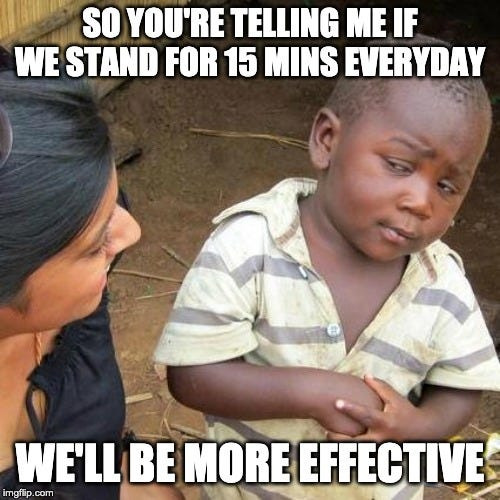

### 15-Minute Sync

**Purpose**: Inspect progress toward Sprint Goal, adapt Sprint Backlog

**Format** (each team member):
1. What did I do yesterday?
2. What will I do today?
3. Are there any blockers?

**Rules**:
- Same time and place every day
- 15 minutes max (timeboxed)
- Standing up (hence "standup")
- Only team members talk
- Others can observe silently

---

# Daily Scrum Example

### Monday Morning Standup

**Ali**: 
- Yesterday: Finished registration API
- Today: Start registration UI
- Blockers: None

**Ayşe**:
- Yesterday: Database schema design
- Today: Implement database migrations
- Blockers: Need AWS credentials for test database

**Mehmet (Scrum Master)**:
- *Takes note*: "I'll get AWS credentials for Ayşe after standup"

**Total time**: 4 minutes
**Scrum Master follows up on blockers immediately after**

---

# Sprint Review

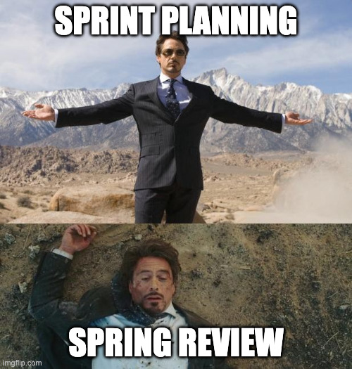

### Demo & Feedback

**Duration**: Maximum 4 hours for 1-month sprint (2 hours for 2 weeks)

**Purpose**: 
- Inspect the Increment
- Adapt the Product Backlog

**Activities**:
- Team demonstrates working software
- Stakeholders provide feedback
- Product Owner explains what was done and what wasn't
- Discuss what's next
- Update Product Backlog based on feedback

**Attendees**: Scrum Team + stakeholders + users

---

# Sprint Review Example

### Demo Day: Login Feature

**Team demonstrates**:
1. Live demo of registration (2 min)
2. Live demo of login (1 min)
3. Live demo of password reset (2 min)
4. Show test coverage (1 min)
5. Show performance metrics (1 min)

**Stakeholder feedback**:
- CEO: "Great! Can we add company email validation?"
- Designer: "Login form looks good, but can we add a loading spinner?"
- Marketing: "We need social login before launch"

**Product Owner**:
- Adds "Company email validation" to backlog (Priority 5)
- Adds "Loading spinner" to backlog (Priority 4)
- Moves "Social login" up to Priority 1 for next sprint

---

# Sprint Retrospective

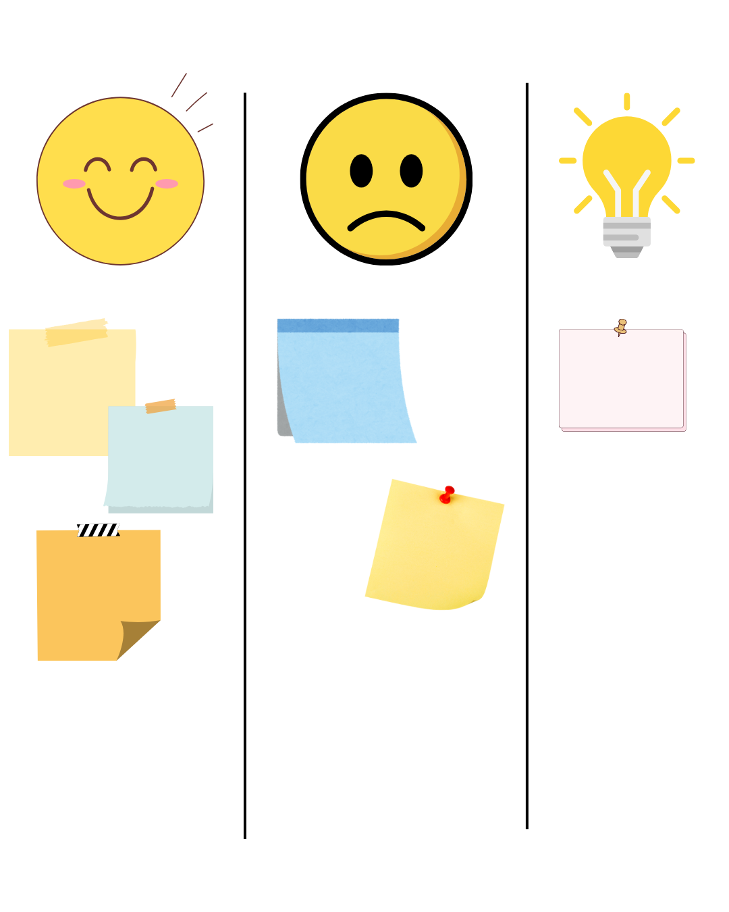

### Improve the Process

**Duration**: Maximum 3 hours for 1-month sprint (1.5 hours for 2 weeks)

**Purpose**: 
- Reflect on the sprint
- Plan improvements

**Questions**:
1. What went well?
2. What didn't go well?
3. What will we do differently next sprint?

**Format** (many variations):
- Start/Stop/Continue
- Mad/Sad/Glad
- 4Ls (Liked, Learned, Lacked, Longed for)

---

# Sprint Retrospective Example

### Team Reflection

**What went well?** 👍
- Daily standups were quick and effective
- Pair programming on complex features helped
- Good communication with Product Owner

**What didn't go well?** 👎
- Too many meetings interrupted flow
- Test environment was unstable
- Code reviews took too long (2-3 days)

**Action Items for Next Sprint**: 💡
1. **No-meeting Wednesdays** for deep work
2. **Scrum Master** to fix test environment this week
3. **Team agreement**: Code reviews within 24 hours or pair programming

**Responsible**: Scrum Master tracks action items

---

# Pop Activity - Sprint Retrospective

### Your team just finished a sprint. What went wrong?

**Situation**:
- Only 3 out of 8 user stories completed
- 2 stories blocked waiting for database access
- Team worked overtime last week
- Code reviews took 3-4 days each
- Daily standups often ran 30+ minutes

**Task**: Identify top 3 issues and suggest actionable improvements

---

### Sample Solutions ✅

**Top Issues Identified**:
1. **Blockers not resolved quickly**: 2 stories blocked entire sprint
2. **Slow code reviews**: 3-4 days is too long
3. **Long daily standups**: 30+ min defeats the purpose

**Actionable Improvements**:
1. **Scrum Master**: Check for blockers daily, escalate immediately (target: resolve within 24h)
2. **Team agreement**: Code reviews within same day, or pair programming for complex work
3. **Standup rule**: 15 min max, take detailed discussions offline

**Next Sprint**: Track these metrics and discuss improvement in next retro

---

# Scrum Artifacts

### 1. Product Backlog

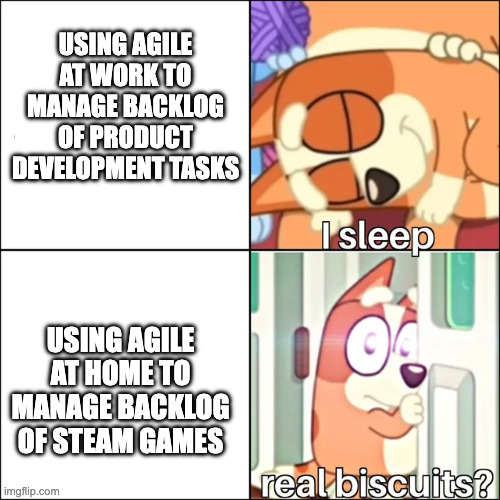

> Ordered list of everything needed in the product

**Owned by**: Product Owner
**Content**: Features, fixes, technical work, knowledge acquisition
**Order**: By value (most valuable at top)
**Evolving**: Never complete, constantly refined

**Example Items**:
1. User registration (13 points)
2. Social login (8 points)
3. Password reset (5 points)
4. Email verification (3 points)
5. Profile page (8 points)

---

# Scrum Artifacts

### 2. Sprint Backlog


> Items selected for the sprint + plan for delivering them

**Owned by**: Developers
**Content**: Product Backlog items + tasks
**Visible**: Physical or digital board (Jira, Trello)
**Updated**: Daily during Daily Scrum

**Example**:
- **User Story**: User registration (13 points)
  - Design database schema (Done)
  - Create API endpoint (In Progress)
  - Build UI form (To Do)
  - Write tests (To Do)

---

# Scrum Artifacts

### 3. Increment


> Sum of all completed Product Backlog items in all Sprints

**Definition**: Concrete stepping stone toward Product Goal
**Quality**: Meets Definition of Done
**Usability**: Must be in usable condition
**Cumulative**: All previous Increments + new work

**Example**:
- Sprint 1: User registration ✅
- Sprint 2: Login + Password reset ✅
- Sprint 3: Social login + Profile ✅
- **Current Increment**: Fully functional auth system

---

# Definition of Done (DoD)

### Shared Understanding of "Complete"

> Formal description of the state of the Increment when it meets quality measures

**Example DoD for User Story**:
- ✅ Code written and committed
- ✅ Unit tests written (>80% coverage)
- ✅ Integration tests pass
- ✅ Code reviewed by peer
- ✅ Deployed to staging environment
- ✅ Acceptance criteria met
- ✅ Documentation updated
- ✅ No critical bugs
- ✅ Product Owner accepted

**If not "Done"**: Not included in Increment, goes back to backlog

---

# Scrum Board Example

### Visual Workflow

```
┌─────────────┬──────────────┬─────────────┬──────────┐
│   TO DO     │  IN PROGRESS │   REVIEW    │   DONE   │
├─────────────┼──────────────┼─────────────┼──────────┤
│ Profile UI  │ Social Login │ Registration│ Login API│
│ (Ali)       │ (Ayşe)       │ (Can)       │          │
│             │              │             │ Password │
│ Email       │ Password     │             │ Reset    │
│ Verify      │ Reset UI     │             │          │
│ (Mehmet)    │ (Ali)        │             │          │
│             │              │             │          │
└─────────────┴──────────────┴─────────────┴──────────┘
```

**Update**: Every day during Daily Scrum
**Tool**: Physical board (sticky notes) or digital (Jira, Trello, Linear, GitHub Projects)

---

<style scoped>
p {text-align: center; font-size: 24px; font-style: italic}
</style>

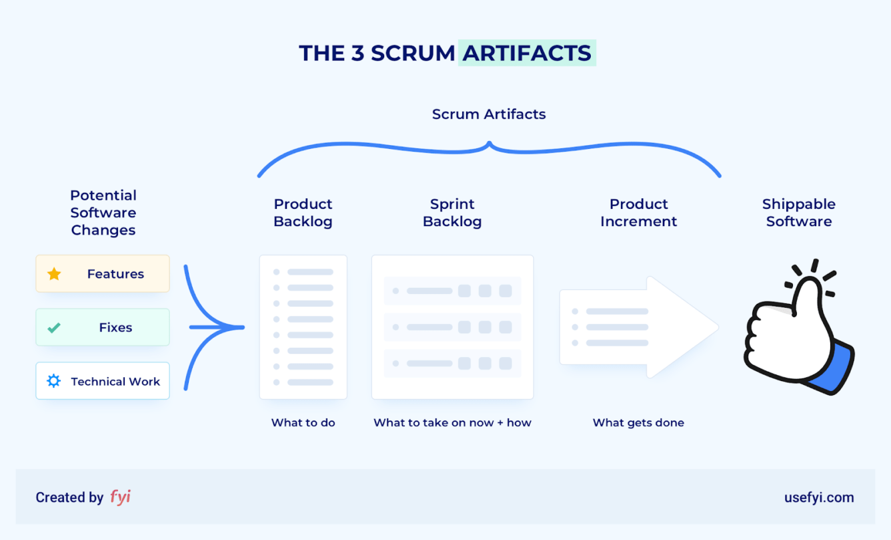

<a href="https://nira.com/scrum-artifacts/" style="text-center">The 3 Scrum Artifacts and How They Can Help You - nira.com
</a>

---

<!-- _footer: "" -->
<!-- _header: "" -->
<!-- _paginate: false -->

<style scoped>
p { text-align: center}
h1 {text-align: center; font-size: 72px}
</style>

# Kanban

---

# What is Kanban?

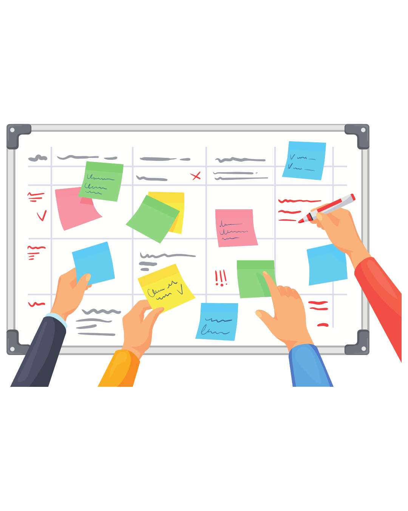

### Flow-Based Development

> **Kanban** is a method to visualize work, limit work-in-progress, and maximize efficiency

### Origins

- Developed by Toyota for manufacturing (1940s)
- Adapted for software by David J. Anderson (2000s)
- Name means "visual card" or "billboard" in Japanese

### Key Principles

- **Visualize work** - Make work visible
- **Limit WIP** - Work-In-Progress limits
- **Manage flow** - Optimize throughput
- **Make policies explicit** - Clear rules
- **Continuous improvement** - Kaizen

---

# Kanban vs. Scrum

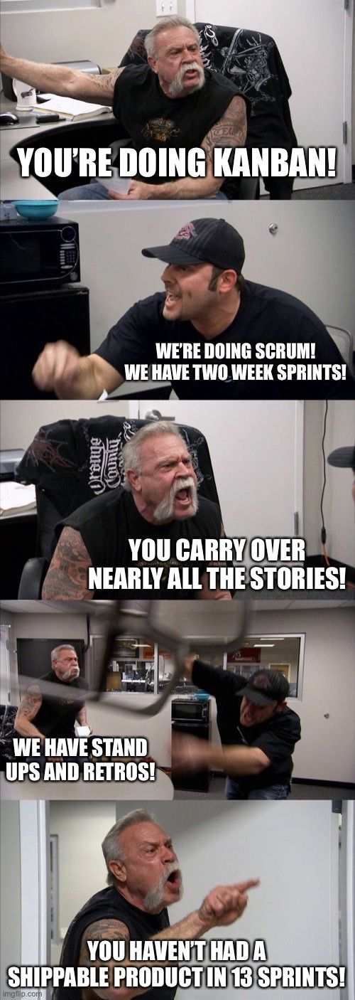

| Aspect | Scrum | Kanban |
|--------|-------|--------|
| **Iterations** | Fixed sprints (2 weeks) | Continuous flow |
| **Roles** | Product Owner, Scrum Master, Developers | No prescribed roles |
| **Meetings** | Sprint Planning, Daily Scrum, Review, Retro | Optional standups, no fixed ceremonies |
| **Changes** | No changes during sprint | Can add anytime |
| **Metrics** | Velocity (points per sprint) | Lead time, cycle time, throughput |
| **Board** | Cleared each sprint | Continuous |

### Can Combine Both!

Many teams use **Scrumban**: Scrum's structure + Kanban's flow


---

# Kanban Board

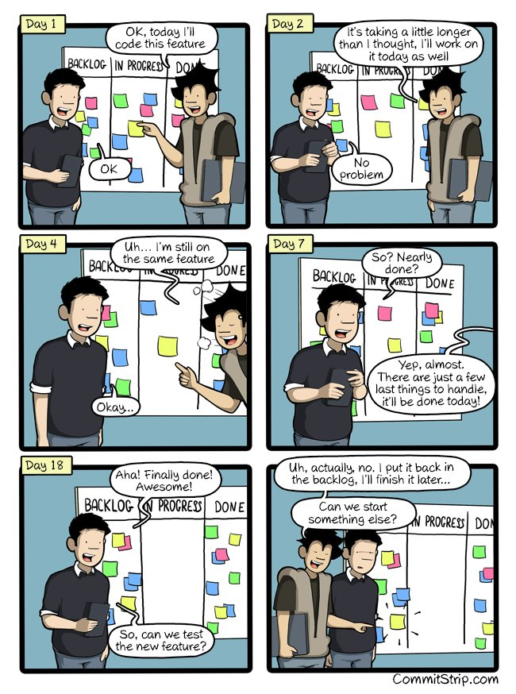

### Columns and WIP Limits

```
┌──────────────────────────────────────────────────────────────┐
│                    KANBAN BOARD                              │
├────────┬────────┬────────┬────────┬────────┬─────────────────┤
│BACKLOG │ TO DO  │ DOING  │ REVIEW │ TESTING│      DONE       │
│        │ WIP:5  │ WIP:3  │ WIP:2  │ WIP:2  │       ✓         │
├────────┼────────┼────────┼────────┼────────┼─────────────────┤
│ Task 1 │ Task A │ Task X │ Task P │ Task M │ Task Complete 1 │
│ Task 2 │ Task B │ Task Y │ Task Q │ Task N │ Task Complete 2 │
│ Task 3 │ Task C │ Task Z │        │        │ Task Complete 3 │
│ Task 4 │ Task D │        │        │        │                 │
│ Task 5 │ Task E │        │        │        │                 │
│ Task 6 │        │        │        │        │                 │
└────────┴────────┴────────┴────────┴────────┴─────────────────┘
```

**WIP Limits**: Maximum items allowed in each column
**Red Flag**: If column at limit, must finish before starting new work

---

# Kanban Metrics

<div class="two-columns">
<div class="column">

### 1. Lead Time

**Definition**: Time from request to delivery

**Example**:
- Bug reported: Monday 9:00 AM - Bug fixed and deployed: Wednesday 3:00 PM
- **Lead time**: 2.25 days

**Goal**: Reduce lead time

### 2. Cycle Time

**Definition**: Time from start of work to completion

**Example**:
- Started working: Tuesday 10:00 AM - Deployed: Wednesday 3:00 PM
- **Cycle time**: 1.2 days

**Goal**: Faster cycle time = higher throughput

</div>

<div class="column">

### 3. Throughput

**Definition**: Number of items completed per time period

**Example**:
- Week 1: 12 tasks completed
- Week 2: 15 tasks completed
- Week 3: 10 tasks completed
- **Average throughput**: 12.3 tasks/week

**Goal**: Increase throughput without sacrificing quality

### 4. Cumulative Flow Diagram (CFD)

Visual chart showing work distribution across stages over time

**Insights**:
- Bottlenecks (growing columns)
- Flow issues
- WIP trends

</div>
</div>

---

# When to Use Kanban

<div class="two-columns">
<div class="column">

### ✅ Good For

**Support teams**
- Bug fixes and maintenance
- Unpredictable incoming work
- Varied task sizes

**Operations**
- IT operations
- DevOps teams
- System admin tasks

**Personal productivity**
- Individual task management
- Freelancers
- Side projects

</div>

<div class="column">

### Example: Customer Support Team

**Backlog**: Customer tickets
**Columns**: New, Investigating, Fixing, Verified, Closed
**WIP Limits**: 
- Investigating: 5
- Fixing: 3
- Verified: 2

**Why Kanban works**:
- Can't predict when tickets arrive
- Varied complexity (5 min to 5 days)
- Need to respond quickly
- Continuous flow better than sprints

</div>
</div>

---

# Pop Quiz

### For each team, which would you recommend?

**Team A**: Building a new mobile app

**Team B**: IT support team

**Team C**: DevOps team

---

### Answers ✅

**Team A**: **Scrum**
- Predictable work fits sprints
- Can plan 2-week iterations
- Benefit from regular demos/feedback

**Team B**: **Kanban**
- Unpredictable incoming work
- Varied ticket complexity
- Need continuous flow, not sprints

**Team C**: **Scrumban** (hybrid!)
- Use Scrum for planned projects
- Use Kanban board for urgent issues
- Best of both worlds

**Key Insight**: Choose based on work predictability, not team preference!

---

<!-- _footer: "" -->
<!-- _header: "" -->
<!-- _paginate: false -->

<style scoped>
p { text-align: center}
h1 {text-align: center; font-size: 72px}
</style>

# Extreme Programming (XP)

---

# What is Extreme Programming?


### Taking Good Practices to the Extreme

> **XP** is an agile framework that emphasizes technical excellence and engineering practices

### Created By

- Kent Beck in the late 1990s
- "Take the best practices and turn them up to extreme levels"

### Philosophy

- If code reviews are good → **pair program** all the time
- If testing is good → **test first** before every change
- If integration is good → **integrate** multiple times per day
- If simplicity is good → keep design **as simple as possible**
- If short iterations are good → make them **really, really short**

---


# XP Practices (1-5)

### 1. Incremental Planning
Requirements recorded on **Story Cards**. Stories to be included in a release determined by time available and priority. Developers break Stories into **Tasks**.

### 2. Small Releases
Minimal useful set of functionality (MVP) developed first. Releases are frequent and incrementally add functionality.

### 3. Simple Design
Enough design to meet current requirements **and no more**.

### 4. Test-First Development
Automated unit test framework used. Tests written **before** functionality is implemented.

### 5. Refactoring
All developers refactor continuously as soon as code improvements are found. Keeps code simple and maintainable.

---

# XP Practices (6-10)

### 6. Pair Programming
Developers work in pairs, checking each other's work and supporting each other to always do a good job.

### 7. Collective Ownership
Pairs work on all areas of system, so **no islands of expertise** develop. All developers take responsibility for all code. **Anyone can change anything.**

### 8. Continuous Integration
As soon as work on a task is complete, it is integrated into the whole system. All unit tests must pass after integration.

### 9. Sustainable Pace
Large amounts of overtime **not acceptable** as net effect often reduces code quality and medium-term productivity.

### 10. On-Site Customer
A representative of end-user (Customer) should be available **full time** for XP team. In extreme programming, customer is a team member responsible for bringing system requirements to team.

---

# XP Planning Process

<div class="two-columns">
<div class="column">

**Step 1: Story Cards**
- Customer & team develop story cards
- Main input to planning process

**Step 2: Break Down into Tasks**
- Team breaks stories into tasks
- Estimates effort & resources
- Discusses with customer to refine

</div>
<div class="column">

**Step 3: Customer Prioritizes**
- Customer chooses stories for implementation
- Priority: immediate business value
- Goal: implement in ~2 weeks

**Step 4: Release**
- Deliver useful functionality
- Unimplemented stories may change or be discarded
- New story cards for changes

</div>
</div>

---

# Story Cards in XP

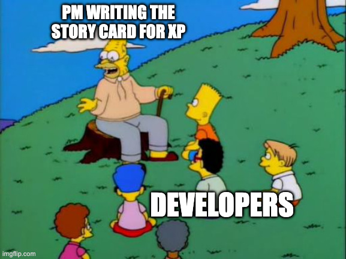

### Customer-Driven Requirements

In XP, requirements are **not** specified as lists of functions. Instead:

- **Customer is part of the development team**
- Team discusses **scenarios** together
- Develop **story cards** that encapsulate customer needs
- Story cards are short descriptions of scenarios

---

# Example Story Card - Prescribing Medication

*Kate is a doctor who wishes to prescribe medication for a patient attending a clinic. The patient record is already displayed on her computer so she clicks on the medication field and can select current medication’, ‘new medication’ or ‘formulary’.*

*If she selects ‘current medication’, the system asks her to check the dose. If she wants to change the dose, she enters the dose and then confirms the prescription.*

*If she chooses ‘new medication’, the system assumes that she knows which medication to prescribe. She types the first few letters of the drug name. The system displays a list of possible drugs starting with these letters. She chooses the required medication and the system responds by asking her to check that the medication selected is correct. She enters the dose and then confirms the prescription.*

*If she chooses ‘formulary’, the system displays a search box for the approved formulary. She can then search for the drug required. She selects a drug and is asked to check that the medication is correct. She enters the dose and then confirms the prescription.*

*The system always checks that the dose is within the approved range. If it isn’t, Kate is asked to change the dose.*

*After Kate has confirmed the prescription, it will be displayed for checking. She either clicks ‘OK’ or ‘Change’.*

*If she clicks ‘OK’, the prescription is recorded on the audit database.* 

*If she clicks on ‘Change’, she reenters the ‘Prescribing medication’ process.'*


---

# Story Cards to Tasks

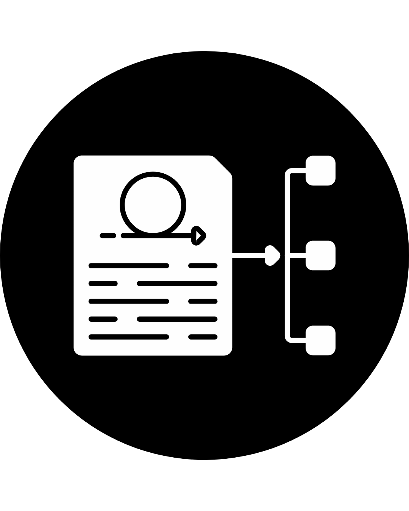

**Story Card**: Doctor prescribes medication for patient attending clinic

**Tasks** (broken down by developers):

**Task 1: Change Dose of Prescribed Drug**

**Task 2: Formulary Selection**

**Task 3: Dose Checking**
- Safety precaution to check doctor hasn't prescribed dangerously small/large dose
- Using formulary ID for generic drug name, look up formulary and retrieve recommended max/min dose
- Check prescribed dose against minimum and maximum
- If outside range, issue error message (dose too high/low)
- If within range, enable 'Confirm' button

---

# Pop Activity

### Scenario: Online Food Ordering System

**Your team is building a food delivery app like Yemeksepeti/Getir Food**

1. **Write a Story Card** for this scenario:
   - *"Customer wants to order food from a restaurant and pay online"*
   - Think about: What steps? What options? What validations?
   - Keep it short but complete (like the medication example)

2. **Break it into 3-5 Tasks**
   - Give each task a clear name
   - For one task, write detailed steps (like "Dose Checking" example)

**Tips**:
- Focus on ONE user scenario (don't try to cover entire app)
- Think about happy path AND error cases
- What needs to be checked/validated?

---

# Pop Activity - Example Solution

### Story Card: Order Food from Restaurant

*"Customer browses restaurant list, selects a restaurant, views menu. Customer adds items to cart and sees total price. Customer proceeds to checkout, enters delivery address. System validates address is in delivery zone. Customer selects payment method (credit card or cash). If credit card, customer enters card details. System validates card. Customer confirms order. System displays order confirmation with estimated delivery time."*

---

# Pop Activity - Example Solution

### Task Breakdown:

**Task 1: Restaurant Selection & Menu Display**

**Task 2: Shopping Cart Management**

**Task 3: Address Validation** (detailed)
- After customer enters delivery address, validate format
- Check if address is within restaurant's delivery zone using coordinates
- Query delivery zone database with address coordinates
- If outside zone, show error "Restaurant doesn't deliver to this address"
- If valid, enable "Proceed to Payment" button and show delivery fee

**Task 4: Payment Processing**

**Task 5: Order Confirmation Display**

---

# XP's Extreme Incremental Approach


<div class="two-columns">
<div class="column">

**Traditional Agile**:
- Releases every 2-4 weeks
- Build daily or few times per week

**Extreme Programming**:
- **Builds several times per day**
- **Releases every ~2 weeks**
- Release deadlines **never slip**

</div>
<div class="column">

### Never Slip Deadlines

If development problems occur:
- ❌ **DON'T**: Delay release
- ✅ **DO**: Consult customer
- ✅ **DO**: Remove functionality from release

**Philosophy**: Better to ship less on time than slip deadline

</div>
</div>

---

# XP Build Process

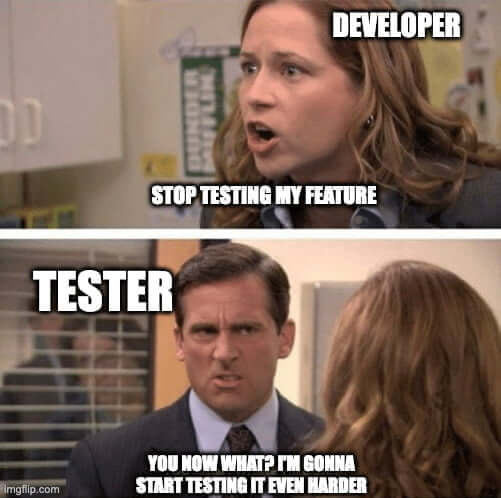

### All Tests Must Pass

When programmer builds new version:

1. **Run all existing automated tests**
2. **Run tests for new functionality**
3. **New build accepted ONLY if all tests pass**
4. This becomes basis for next iteration

### Result

- No "broken" builds sit around
- Always have working software
- Tests prevent regression
- Confidence to make changes

---

# Pop Quiz

### Which XP practice would solve each problem?

**Problem 1**: Team member quits, only they understood authentication code

**Problem 2**: Bugs keep appearing in production

**Problem 3**: Code is messy and hard to change

**Problem 4**: Team worked 80-hour weeks last month, 3 people burnt out

---

### Solutions ✅

<div class="two-columns">
<div class="column">

**Problem 1**: **Pair Programming** + **Collective Ownership**
- Pairs work on all areas of system
- No islands of expertise develop
- Anyone can change anything

**Problem 2**: **Test-First Development**
- Write tests before functionality
- Automated unit test framework
- Catch bugs early

</div>
<div class="column">

**Problem 3**: **Refactoring** + **Simple Design**
- Continuous code improvement as soon as found
- Just enough design for current requirements
- Keep code simple and maintainable

**Problem 4**: **Sustainable Pace**
- Large amounts of overtime not acceptable
- Net effect reduces code quality
- Maintains medium-term productivity

</div>
</div>

---

<!-- _footer: "" -->
<!-- _header: "" -->
<!-- _paginate: false -->

<style scoped>
p { text-align: center}
h1 {text-align: center; font-size: 72px}
</style>

# Agile vs. Waterfall

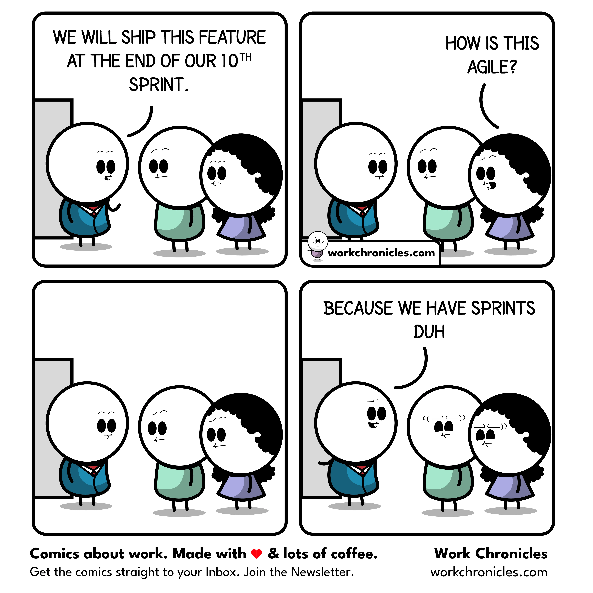

---

# Detailed Comparison


| Aspect | Waterfall | Agile |
|--------|-----------|-------|
| **Approach** | Sequential, one phase at a time | Iterative, parallel activities |
| **Requirements** | Fixed at start, changes are costly | Evolving, changes welcomed |
| **Customer Involvement** | Beginning and end | Continuous throughout |
| **Delivery** | Single delivery at end | Incremental, every 2-4 weeks |
| **Testing** | After implementation | Continuous (TDD) |
| **Documentation** | Extensive, upfront | Just enough, evolving |
| **Team Structure** | Specialized roles, hierarchical | Cross-functional, self-organizing |
| **Risk** | High (late feedback) | Lower (early and continuous feedback) |
| **Best For** | Stable requirements, regulated | Changing requirements, innovation |

---

# Visual Comparison

<div class="two-columns">
<div class="column">

### Waterfall Timeline

```
Month 1-2: Requirements ████
Month 3-4: Design       ████
Month 5-6: Code         ████
Month 7:   Test         ██
Month 8:   Deploy       █
Month 9+:  Maintain     ██████
```

**Customer sees product**: Month 8
**Feedback incorporated**: Month 9+ (new project)

</div>

<div class="column">

### Agile Timeline

```
Sprint 1 (2 weeks): ███ → Release 1
Sprint 2 (2 weeks): ███ → Release 2
Sprint 3 (2 weeks): ███ → Release 3
Sprint 4 (2 weeks): ███ → Release 4
```

**Customer sees product**: Week 2, 4, 6, 8...
**Feedback incorporated**: Next sprint

</div>
</div>

---

# When to Use Agile

<div class="two-columns">
<div class="column">

### ✅ Use Agile When

**Uncertain requirements**
- Exploring new market
- Innovative product
- User needs unclear

**Rapid change**
- Competitive market
- Fast-moving technology
- Need to pivot quickly

**Customer collaboration**
- Customer available
- Feedback critical
- User-centric product

</div>

<div class="column">

### ❌ Don't Use Agile When

**Fixed requirements**
- Regulatory compliance
- Hardware constraints
- Contract specifies everything

**Low customer availability**
- Customer can't participate
- Multiple disconnected stakeholders
- Government contracts

**Safety-critical systems**
- Lives at stake
- Need extensive documentation
- Certification required

</div>
</div>

---

# Scenario Analysis - Agile or Waterfall?

### Analyze each project and recommend an approach

**Project 1**: Building a pacemaker medical device software

**Project 2**: Building a social media app for Gen Z

**Project 3**: Government tax filing system

**Project 4**: E-commerce website for small business

---

### Recommended Approaches ✅

<div class="two-columns">
<div class="column">

**Project 1**: **Waterfall** (or V-Model)
- Safety-critical, lives at stake
- FDA requires extensive documentation
- Hardware constraints = fixed requirements
- Can't rapidly iterate on implanted device

**Project 2**: **Agile** (Scrum)
- Uncertain requirements, need to discover what works
- Rapid iteration and user feedback essential
- Competitive market = need to pivot quickly
- Gen Z preferences change fast

</div>
<div class="column">

**Project 3**: **Waterfall** (or Hybrid)
- Legal requirements are fixed
- Multiple contractors need detailed specs
- Heavy documentation for compliance
- Long maintenance period

**Project 4**: **Agile with Reuse** (or just use Shopify!)
- Standard e-commerce features
- Quick delivery needed
- Use existing platforms/components
- Incremental delivery to get feedback

</div>
</div>

---

<!-- _footer: "" -->
<!-- _header: "" -->
<!-- _paginate: false -->

<style scoped>
p { text-align: center}
h1 {text-align: center; font-size: 72px}
</style>

# Agile at Scale

---

# Why Scale Agile?


### The Original Context

Agile methods developed for:
- **Small programming teams** (3-9 people)
- **Same room** - can communicate informally
- **Small/medium systems**

### The Need

**But...** Need for faster delivery and customer-focused software also applies to:
- Large systems
- Large organizations
- Distributed teams

**Goal**: Avoid common problems (systems not meeting needs, budget overruns) by making agile work for large systems

---

# Large vs. Small System Development

<div class="two-columns">
<div class="column">

**1. Multiple Communicating Systems**
- Separate teams per system
- Different locations, time zones
- No single team has view of whole system
- Teams focus on their part only

**2. Brownfield Systems**
- Interact with existing systems
- Requirements about integration
- Political issues with changing existing systems
- Negotiation with other system managers

**3. System Configuration**
- Significant integration work
- Not original code development
- Incompatible with continuous integration

</div>
<div class="column">

**4. External Rules & Regulations**
- Constrained by external requirements
- Certain documentation required
- Limits development approach

**5. Long Development Time**
- Hard to maintain coherent teams
- People move to other jobs
- Knowledge loss over time

**6. Diverse Stakeholders**
- End-users, managers, executives
- Different interests and concerns
- Impossible to involve all in development

</div>
</div>

---

# Two Perspectives on Scaling

### 1. Scaling Up

**Concern**: Using agile for developing **large software systems**
- Too large for single small team
- Multiple teams needed
- Coordination challenges

### 2. Scaling Out

**Concern**: Introducing agile **across large organization**
- Many years of existing development experience
- Existing processes and culture
- Organizational change management

---

# Critical Adaptations for Large Systems

### Maintain Agile Fundamentals and Adapt to:

**1. More Up-Front Design & Documentation**
- Cannot focus only on code
- Software architecture must be designed
- Document critical aspects (database schemas, work breakdown)

**2. Cross-Team Communication Mechanisms**
- Regular phone/video conferences
- Frequent short electronic meetings
- Multiple channels: email, instant messaging, wikis, social networks

**3. Frequent (Not Continuous) System Builds**
- Continuous integration impractical for multiple programs
- But maintain frequent builds and regular releases
- May need new configuration management tools

---

# Example - Spotify Model

### Autonomous Teams

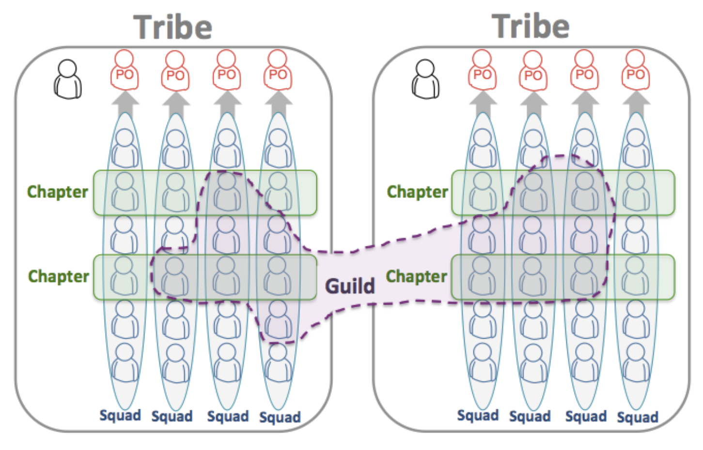

<div class="two-columns">
<div class="column">

**Squads** (6-12 people)
- Like mini-startups
- Own a feature area
- Full autonomy
- Each has Product Owner, Agile Coach

**Chapters** (5-10 people)
- Same competency across squads
- E.g., "Backend Chapter", "iOS Chapter"
- Chapter Lead provides coaching

</div>
<div class="column">

**Tribes** (40-150 people)
- Multiple squads in same area
- Share mission
- Tribe Lead coordinates

**Guilds** (open membership)
- Communities of interest
- Knowledge sharing
- E.g., "Web Tech Guild", "Testing Guild"

</div>
</div>

*[Scaling Agile @ Spotify](https://blog.crisp.se/wp-content/uploads/2012/11/SpotifyScaling.pdf)*

---

# Pop Quiz

### You're planning your course project


**Answer these questions**:
1. Which agile framework should you use? (Scrum, Kanban, XP, Hybrid?)
2. How long should your sprints be?
3. Which XP practices can you adopt?
4. How will you handle changing requirements from your instructor?

**Discuss with your team mate for 2 minutes, then share**

---

# Key Takeaways

### Agile Philosophy

- **Four values** from Agile Manifesto guide all decisions
- **12 principles** provide practical guidance
- **Mindset over methodology** - values matter more than specific practices
- **People over process** - collaboration is key

### Agile Frameworks

1. **Scrum** - Most popular, structured with roles, events, artifacts
2. **Kanban** - Flow-based, visualize work, limit WIP
3. **XP** - Technical excellence, pair programming, TDD, CI
4. **Scaled Frameworks** - SAFe, LeSS, Spotify Model for large organizations

---

# Key Takeaways

### When to Use Agile

✅ **Use when**: Uncertain requirements, rapid change, customer collaboration
❌ **Avoid when**: Fixed requirements, safety-critical, low customer availability

### Success Factors

- **Customer involvement** - Regular feedback is essential
- **Team empowerment** - Trust teams to make decisions
- **Technical excellence** - Don't skip testing or refactoring
- **Continuous improvement** - Regular retrospectives
- **Working software** - Deliver value frequently

---

<!-- _footer: "" -->
<!-- _header: "" -->
<!-- _paginate: false -->

<style scoped>
p { text-align: center}
h1 {text-align: center; font-size: 72px}
</style>

# Team Progress Reports 

---

<!-- _footer: "" -->
<!-- _header: "" -->

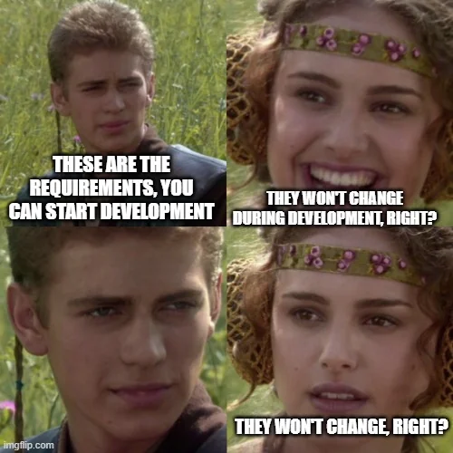

# Next Deliverable: D2 - SRS

### Software Requirements Specification

**Due Date**: Week 6 (Two weeks from now)

**What is SRS?**
- Complete description of **what** your system will do
- **Functional requirements**: Features and capabilities
- **Non-functional requirements**: Performance, security, usability
- **User stories** and **acceptance criteria**
- **System constraints** and **assumptions**

---

# D2 - SRS Content

### What to Include

<div class="two-columns">
<div class="column">

**1. Introduction**
- Purpose of the system
- Scope and objectives
- Definitions and acronyms

**2. Overall Description**
- Product perspective
- User characteristics
- Constraints and assumptions

**3. Functional Requirements**
- Use cases or user stories
- Detailed feature descriptions
- Input/output specifications

</div>
<div class="column">

**4. Non-Functional Requirements**
- Performance requirements
- Security requirements
- Usability requirements
- Reliability and availability

**5. System Models**
- Use case diagrams
- Activity diagrams (optional)
- Data flow diagrams (optional)

</div>
</div>

---

# Example User Story Format

### Template

```
As a [user role]
I want to [goal/desire]
So that [benefit/value]

Acceptance Criteria:
- Given [context]
- When [action]
- Then [expected result]
```

### Example for Your Project

```
As a student
I want to view upcoming campus events by category
So that I can find events relevant to my interests

Acceptance Criteria:
- Given I'm on the events page
- When I select "Sports" category
- Then I see only sports-related events sorted by date
- And each event shows: title, date, time, location
```

**Write 15-25 user stories for your project**

---

# Thank You!

## Contact Information

- **Email:** ekrem.cetinkaya@yildiz.edu.tr
- **Office Hours:** Tuesday 14:00-16:00 - Room F-B21
- **Book a slot before coming:** [Booking Link](https://calendar.app.google/aBKvBqNAqG12oD2B9)
- **Course Repository:** [GitHub](https://github.com/ekremcet/yzm2021-principles-of-software-engineering)

## Next Class

- **Date:** 28.10.2025
- **Topic:** Requirements Engineering
- **Reading:** Sommerville Ch. 4

**See you next week! Start working on D2 (Software Requirements Specification)**

