<!-- _class: lead -->
# Week 5: Requirements Engineering

## YZM2021 - Software Engineering Principles

**Instructor:** Ekrem Çetinkaya
**Date:** 28.10.2025


---

# Agenda

1. **What is Requirements Engineering?**
2. **Types of Requirements**
   - Functional vs Non-Functional
3. **Requirements Elicitation**
4. **Requirements Specification**
5. **User Stories & Use Cases**
6. **Requirements Validation**
7. **Requirements Management**

---

<!-- _footer: "" -->
<!-- _header: "" -->
<!-- _paginate: false -->

<style scoped>
p { text-align: center}
h1 {text-align: center; font-size: 72px}
</style>

# What is Requirements Engineering?

---

# What is Requirements Engineering?

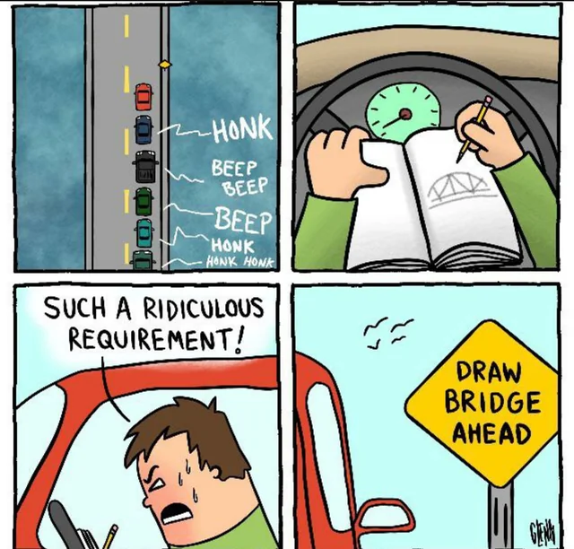

> **Requirements Engineering (RE)** is the process of establishing the services that a customer requires from a system and the constraints under which it operates and is developed


### The Goal
- Understand **WHAT** the system should do
- Not **HOW** it will do it
- Bridge gap between problem and solution

---

# The Requirements Engineering Process

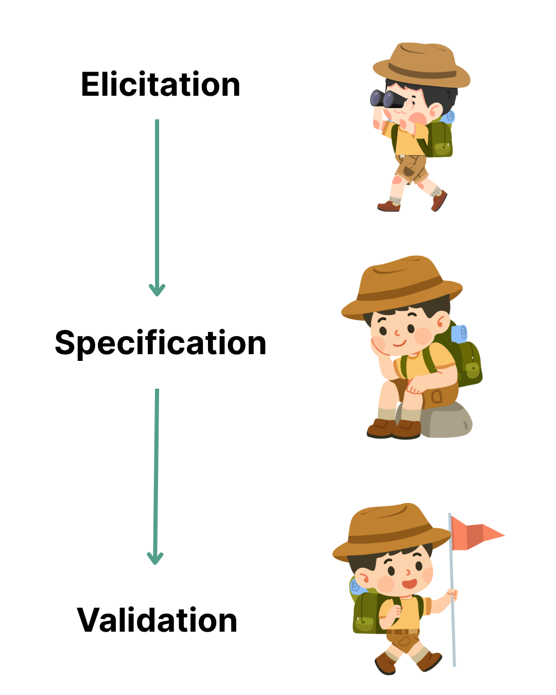

### 1. Elicitation
Discovery & understanding

### 2. Specification
Documentation


### 3. Validation
Verification & agreement

---

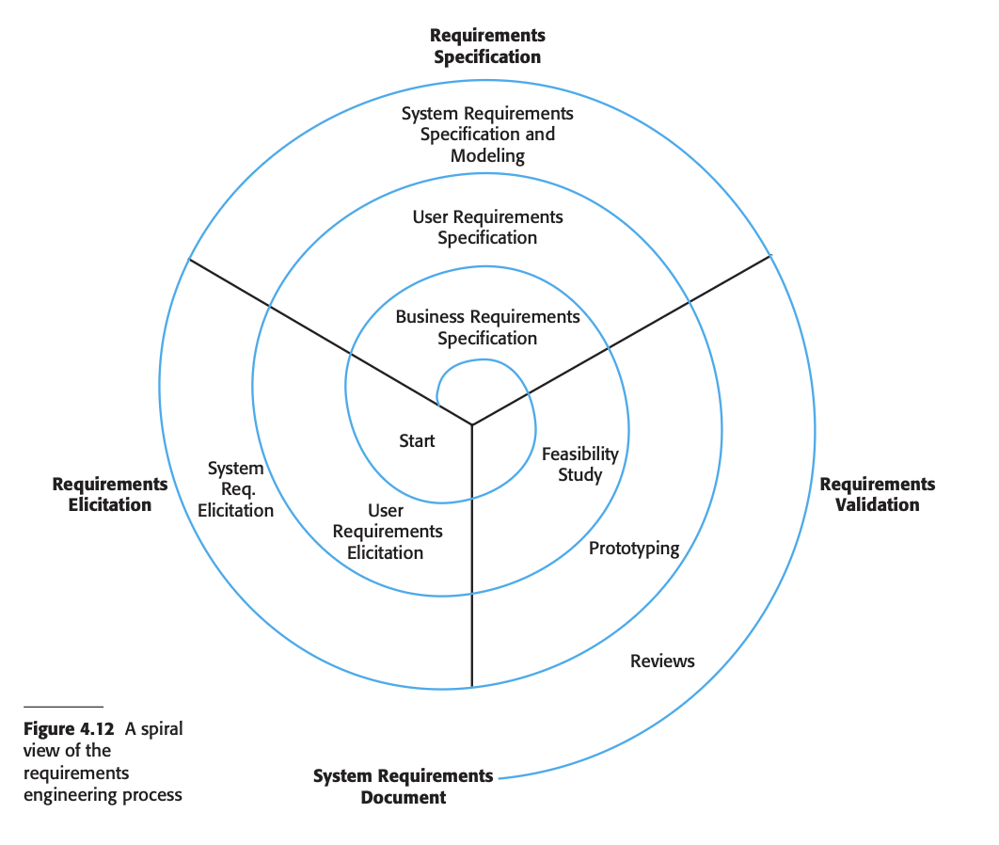

---

# What is a Requirement?

> The term **requirement** is not used consistently in the software industry.

<div class="columns">

<div>

### Two Extremes:

**High-level, abstract:**
- "The system should provide a user-friendly interface"
- "The system must be secure"

**Detailed, formal:**
- "The login form shall accept email addresses in RFC 5322 format"
- "Passwords shall be hashed with bcrypt (cost factor 12)"

</div>

<div>

### Why This Matters:

When a company wants to hire contractors:
- Requirements must be **abstract enough** that multiple solutions are possible
- Different contractors can bid with different approaches

After signing the contract:
- Requirements become **detailed** so the client can validate
- Both documents may be called _requirements_

**This causes confusion**

</div>

</div>

---

# User Requirements vs. System Requirements

> To reduce confusion, we distinguish between two levels of requirements:

<div class="columns">

<div>

### 1. User Requirements

Statements in **natural language** + diagrams of:
- What services the system provides
- What constraints it must operate under

**Audience:**
- Clients
- End users
- Managers

**Example:**
- Students shall be able to discover and register for campus events

</div>

<div>

### 2. System Requirements

**Detailed descriptions** of:
- Software system functions
- Services and Operational constraints

**Audience:**
- Developers
- Testers
- System architects

**Example:**
- FR-2.1: System shall display events sorted by date (ascending)
- FR-2.2: System shall decrement available spots counter upon RSVP

</div>

</div>

---

# User Requirements vs. System Requirements: Example

<div class="columns">

<div>

### User Requirement:
> "Students need a way to buy and sell used textbooks with other students on campus."

</div>

<div>

### System Requirements (Detailed, Specific):

**FR-4.1:** Students shall be able to create a marketplace listing with the following fields:
- Title (required, max 100 chars)
- Description (required, max 500 chars)
- Price (required, numeric, TRY currency)
- Category (required, dropdown: Textbooks, Electronics, Furniture, Clothing, Other)
- Condition (required, dropdown: New, Like New, Good, Fair, Poor)
- Photos (optional, max 5 images, each max 5MB)

**FR-4.2:** The system shall validate all inputs before submission and display error messages for invalid fields within 200ms

**FR-4.3:** Upon successful listing creation, the system shall send confirmation email to seller within 5 seconds

</div>

</div>

---

# Why This Distinction Matters

### Problem: Failing to separate these levels causes issues

<div class="columns">

<div>

### User Requirements Should:
✅ Be understandable by non-technical stakeholders
✅ Focus on **what** users need
✅ Avoid technical jargon
✅ Enable multiple technical solutions

**Example:**
"Students can message sellers about items"

</div>

<div>

### System Requirements Should:
✅ Be precise and testable
✅ Define **exactly** what to implement
✅ Include technical details
✅ Serve as a contract for developers

**Example:**
"The messaging system shall store messages in database with user_id, item_id, message_text, timestamp, and read_status fields. Messages shall be delivered via WebSocket for real-time delivery (< 1s latency) with fallback to polling every 30s."

</div>

</div>

---

<!-- _class: lead -->
# Part 2: Types of Requirements

## Functional vs. Non-Functional

---

# Two Types of Requirements

<div class="columns">

<div>

### Functional Requirements (FR)
**"What does the system DO?"**

Define the **functions**, **features**, and **behaviors** of the system.

**Examples:**
- Users can register with email
- System sends verification email
- Users can reset password
- Students can search for events
- Organizers can create events

</div>

<div>

### Non-Functional Requirements (NFR)
**"How WELL does it do it?"**

Define **quality attributes**, **constraints**, and **system properties**.

**Examples:**
- Page loads in < 2 seconds
- Supports 1,000 concurrent users
- 99.5% uptime
- Data encrypted with HTTPS
- Works on Chrome, Safari, Firefox

</div>

</div>

**Both are essential!** Functional requirements without non-functional requirements = working but unusable system.

---

# Functional Requirements

> **Functional Requirements** describe what services the system provides, how it reacts to inputs, and how it behaves in specific situations.

### Characteristics:
- Describe **actions** and **behaviors**
- Can be **directly tested** with specific inputs/outputs
- Usually start with: "The system shall..." or "Users can..."
- Answer: **What features does it have?**

### Categories:
- **Business rules**: Validation, calculations, workflows
- **User interactions**: Login, search, post, edit, delete
- **System operations**: Send email, store data, generate reports
- **External interfaces**: API calls, third-party integrations

### Test Question:
"Can I test this by performing an action and checking the result?" -> If YES, it's likely **Functional**.

---

# Non-Functional Requirements

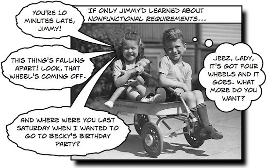

> **Non-Functional Requirements** specify criteria for judging system operation rather than specific behaviors.

### Characteristics:
- Describe **quality** and **constraints**
- Apply to the **system as a whole** (not specific features)
- Often have **measurable metrics**
- Answer: "How well does it perform?"

---

# Non-Functional Requirements - The 8 Categories (URPS + 4)

| Category | What it measures | Example Metric |
|----------|------------------|----------------|
| **U**sability | Ease of use | Task completion rate |
| **R**eliability | Dependability | Uptime % |
| **P**erformance | Speed | Response time |
| **S**upportability | Maintainability | Time to deploy fix |
| **Security** | Protection | Encryption standard |
| **Scalability** | Growth handling | Concurrent users |
| **Compatibility** | Platform support | Browsers supported |
| **Compliance** | Legal/regulatory | KVKK, GDPR |

---

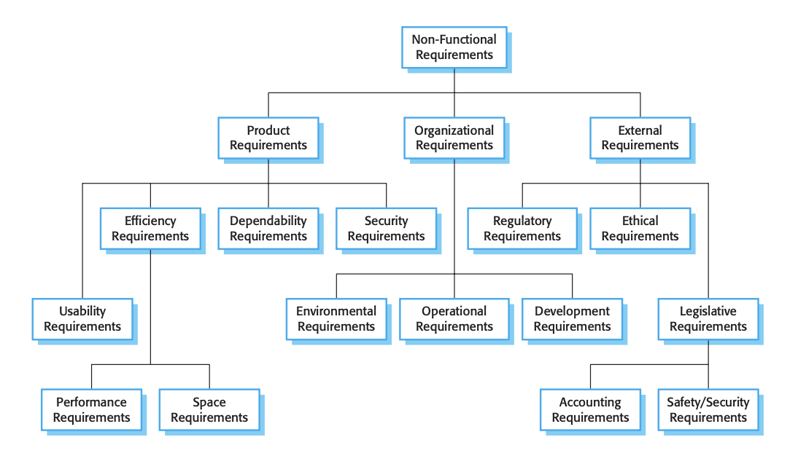

---

# Functional vs. Non-Functional

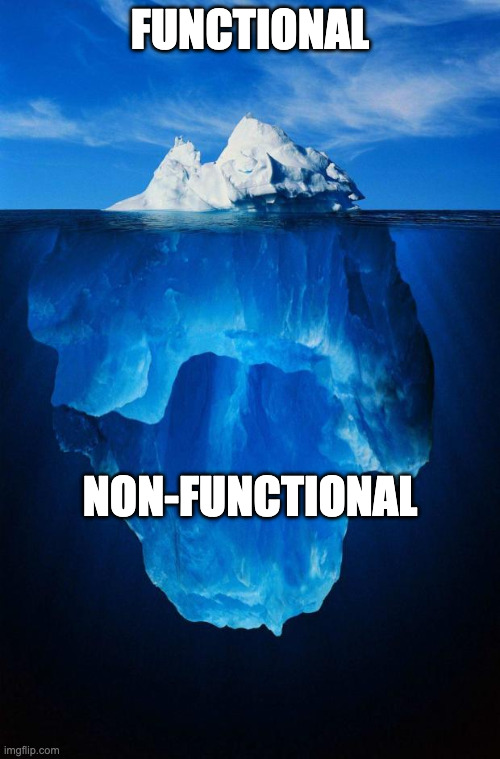

| Aspect | Functional | Non-Functional |
|--------|-----------|----------------|
| **Focus** | What the system **does** | How **well** it does it |
| **Scope** | Specific features | Entire system |
| **Testing** | Feature testing (unit, integration) | Quality testing (performance, security) |
| **Examples** | Login, search, checkout | Speed, security, reliability |
| **Mandatory?** | Yes - defines core features | Yes - defines quality |
| **User sees** | Directly (features) | Indirectly (experience) |
| **In SRS** | Detailed with inputs/outputs | Metrics and constraints |

### The Restaurant:

**Functional:** What's on the menu? (Burgers, pizza, salads)
**Non-Functional:** How's the experience? (Fast service, clean, affordable)

Both matter! Great food (functional) with terrible service (non-functional) = bad restaurant.

---

# Wait... Isn't This the Same as User vs. System?

## No! These are **two different dimensions:**

<div class="columns">

<div>

### Dimension 1: Level of Detail
**(Who is the audience?)**

**User Requirements:**
- High-level, abstract
- Natural language
- For clients/managers/users

**System Requirements:**
- Detailed, precise
- Technical specification
- For developers/testers

</div>

<div>

### Dimension 2: Type of Requirement
**(What aspect of the system?)**

**Functional Requirements:**
- What the system **does**
- Features, behaviors, functions

**Non-Functional Requirements:**
- How **well** it does it
- Quality attributes, constraints

</div>

</div>

### These dimensions are **independent**

---

# The Requirement Matrix - User/System x Functional/Non-Functional

| | **Functional** | **Non-Functional** |
|---|---|---|
| **User Requirement** | "Students should be able to search for events" | "The system should be fast and easy to use" |
| **System Requirement** | "FR-2.2: System shall filter events by category (Sports, Academic, Social, Club, Workshop) with results displayed in a table showing title, date, location" | "NFR-1.3: Event search shall return results within 1 second for any keyword query with up to 10,000 events in database" |

### Key Insight:
- **User/System** describes the **level of detail** and **intended audience**
- **Functional/Non-Functional** describes the **type** of requirement

### In Your D2 (SRS):
You'll write both functional AND non-functional requirements, and most will be at the **system level** (detailed and testable)

---

# Question - Requirements Basics

**Question:** A banking app must process transactions in less than 2 seconds. Is this a:

A) Functional requirement
B) Non-functional requirement
C) User story
D) Use case

---

# Question - Requirements Basics

**Question:** A banking app must process transactions in less than 2 seconds. Is this a:

A) Functional requirement
B) ✅ **Non-functional requirement** ← Correct!
C) User story
D) Use case

**Explanation:** Performance metrics (speed, response time) are non-functional requirements. They describe **HOW WELL** the system performs, not what it does.

---

# Our App - CampusPal


> Throughout this lecture, we'll use **CampusPal** - a campus social and event management platform

### What is CampusPal?

**A web & mobile platform for university students to:**
- Discover and join campus events (clubs, workshops, sports)
- Find and form study groups
- Buy/sell used textbooks and items
- Share campus news and announcements
- Rate and review campus facilities (cafeterias, libraries)

### Target Users:
- **Students**: Browse events, join groups, buy/sell items
- **Club Organizers**: Create and manage events
- **Admins**: Moderate content, manage users

---

# CampusPal - Requirements Overview

### We'll build a complete SRS for CampusPal

<div class="columns">

<div>

### Functional Requirements
**What the system does:**
- User registration & authentication
- Event discovery & RSVP
- Study group creation & joining
- Campus marketplace
- Facility ratings & reviews
- Notifications
- Admin moderation
...

</div>

<div>

### Non-Functional Requirements
**How well the system performs:**
- Performance (< 2s load time)
- Scalability (1,000+ users)
- Security (HTTPS, bcrypt, JWT)
- Usability (90% task completion)
- Reliability (99.5% uptime)
- Maintainability (80% test coverage)
- Compatibility (browsers, mobile)
- Compliance (KVKK, accessibility)
...

</div>

</div>

---

# Practice - Classify Requirements

For each CampusPal requirement, identify if it's **Functional (F)** or **Non-Functional (NF)**:

1. Students can filter events by category (Sports, Academic, Social)
2. Page load time must be under 2 seconds on 5G connection
3. Users must verify their email before accessing the platform
4. System shall support 1,000 concurrent users during peak times
5. Club organizers can view attendee list with names and emails
6. All passwords must be hashed with bcrypt encryption
7. Students receive email notifications 24h before events
8. The platform must comply with KVKK data protection laws
9. Event search results return in under 1 second
10. Admins can ban users who violate community guidelines

---

# Practice - Classify Requirements - Answers

| # | CampusPal Requirement | Type | Reasoning |
|---|----------------------|------|-----------|
| 1 | Filter events by category | **F** | Feature/functionality - what system does |
| 2 | Load under 2s on 5G | **NF** | Performance - how well it performs |
| 3 | Email verification required | **F** | Business rule/workflow |
| 4 | Support 1,000 concurrent users | **NF** | Scalability - capacity constraint |
| 5 | View attendee list | **F** | Feature/functionality |
| 6 | Passwords hashed with bcrypt | **NF** | Security - implementation quality |
| 7 | Email notifications 24h before | **F** | Feature/functionality |
| 8 | KVKK compliance | **NF** | Legal/compliance constraint |
| 9 | Search results in < 1s | **NF** | Performance - response time |
| 10 | Admins can ban users | **F** | Feature/functionality |

**Tricky Ones:** #3 (could be NFR security), #6 (defines HOW, not WHAT)

---

<!-- _class: lead -->
# Part 3: Requirements Elicitation

## How do we discover requirements?

---

# Requirements Elicitation

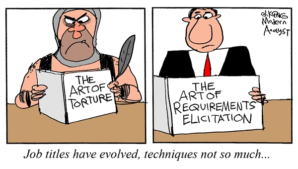

> **Elicitation** = The process of discovering, extracting, and understanding requirements from stakeholders and sources

### The Challenge:
- Stakeholders don't always know what they want
- They struggle to describe their needs
- Different stakeholders have conflicting needs
- Domain knowledge is implicit, not explicit

### The Goal
Extract the **real** requirements, not just stated wants

---

# Stakeholders in Requirements Elicitation

<div class="columns">

<div>

### Who are stakeholders?

- **End users**: People who use the system
- **Customers**: People who pay for it
- **Domain experts**: Subject matter experts
- **Developers**: Technical team
- **Managers**: Project sponsors
- **Regulators**: Compliance authorities

</div>

<div>

### Example: University Course Registration System

- **Students**: Register for courses
- **Professors**: View enrolled students
- **Admins**: Manage course catalog
- **Registrar**: Generate reports
- **IT**: Maintain system
- **Legal**: Ensure compliance

</div>

</div>

---

# Requirements Elicitation Techniques

| Technique | Description | When to Use |
|-----------|-------------|-------------|
| **Interviews** | One-on-one or group discussions | Deep understanding, complex domains |
| **Questionnaires** | Written surveys | Large user base, quantitative data |
| **Observation** | Watch users in natural environment | Understand actual behavior |
| **Workshops** | Facilitated group sessions | Resolve conflicts, build consensus |
| **Prototyping** | Build mock-ups or demos | Unclear requirements, UI-heavy |
| **Document Analysis** | Review existing docs & systems | Legacy system replacement |
| **User Stories** | Structured narrative format | Agile projects |
| **Use Cases** | Detailed interaction scenarios | System behavior modeling |

---

# Elicitation Technique #1: Interviews

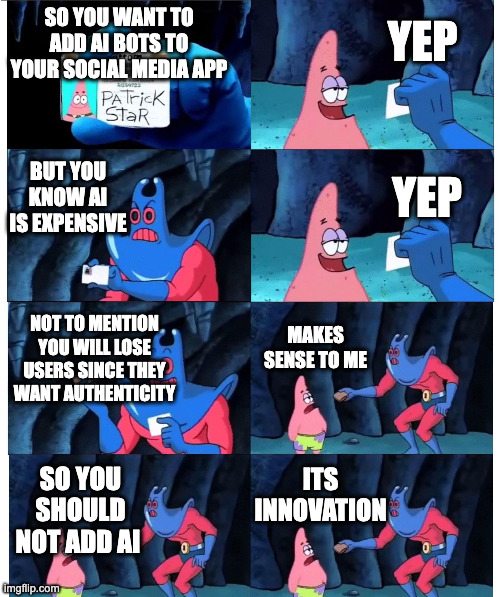

### Types:
- **Structured**: Fixed questions, like a survey
- **Unstructured**: Open-ended conversation
- **Semi-structured**: Mix of both (most common)

### Best Practices:
- Prepare questions in advance
- Try to understand the pain point
- Start broad, then narrow down
- Ask "why" to understand motivation
- Listen more than you talk

### Example Questions:
- "Walk me through a typical day using this system..."
- "What frustrates you about the current process?"
- "What would make your job easier?"

---

# Elicitation Technique #2: Observation

> **Observation** = Watch users perform tasks in their natural environment.

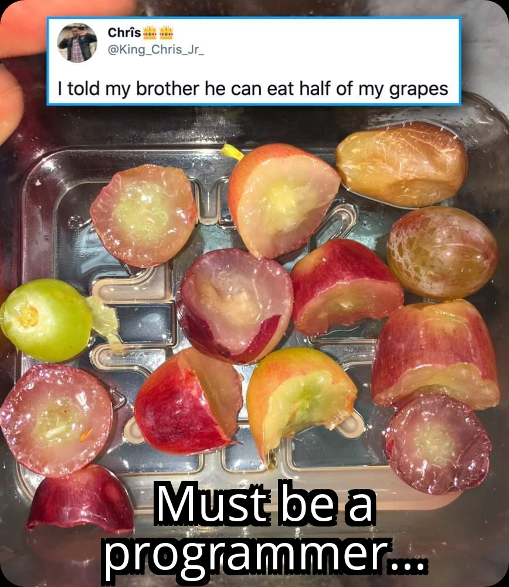

### Why it matters:
- People don't always do what they say they do
- Uncover implicit knowledge and workarounds
- Discover pain points users forgot to mention

### Example - E-commerce Checkout

**What users said:** "Checkout is fine"
**What observation revealed:**
- Users confused by multi-step process
- 60% abandon cart at shipping form
- Users re-enter same info multiple times

---

# Elicitation Technique #3: Prototyping

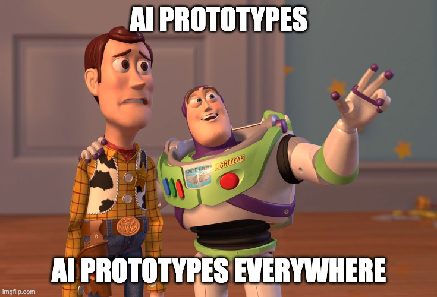


<div class="columns">

<div>

### Types of Prototypes:
- **Low-fidelity**: Paper sketches, wireframes
- **High-fidelity**: Interactive mockups
- **Throwaway**: Just for learning
- **Evolutionary**: Evolves into final product
- **AI generated**: :')

</div>

<div>

### When to use:
- UI/UX heavy applications
- Requirements are vague
- High risk/uncertainty
- Need quick feedback

### Tools:
Figma, Sketch, InVision, Balsamiq, V0, Lovable

</div>

</div>

---

# Elicitation Technique #4: User Stories

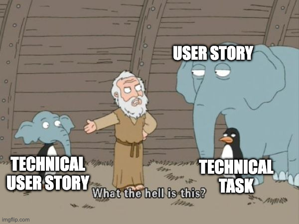

> **User Stories** = Short, simple descriptions of a feature from the user's perspective.

### Format
```
As a [user role]
I want to [goal/desire]
So that [benefit/value]
```

### Example - CampusPal Event Management
```
As a student
I want to filter events by category
So that I can quickly find events I'm interested in

Acceptance Criteria:
- Given I'm on the events page
- When I select "Sports" category
- Then I see only sports events
- And events are sorted by date
```

---

# Question - Elicitation Techniques

**Scenario:** You're building a hospital patient management system. Doctors are too busy to sit for long interviews. Nurses use a legacy system with many workarounds. Administrators want reports.

**Which elicitation technique would you prioritize?**

A) Long structured interviews with all stakeholders
B) Observation of nurses + short interviews + document analysis
C) Just read the old system manual
D) Build a prototype and show it to them

---

# Question - Elicitation Techniques - Answer

**Scenario:** Hospital patient management system. Busy doctors, nurses with workarounds, admins want reports.

**Best Answer: B) Observation + short interviews + document analysis**

**Why:**
- **Observation**: Uncover implicit workflows and workarounds
- **Short interviews**: Respect busy schedules, get key insights
- **Document analysis**: Understand existing system requirements

**Why not the others:**
- ❌ A: Too time-intensive for busy doctors
- ❌ C: Doesn't capture workarounds or actual usage
- ❌ D: Premature without understanding context

**Lesson:** Choose techniques that fit stakeholder availability and domain complexity.

---

<!-- _class: lead -->
# Part 4: Requirements Specification

## Documenting What We Learned

---

# Requirements Specification

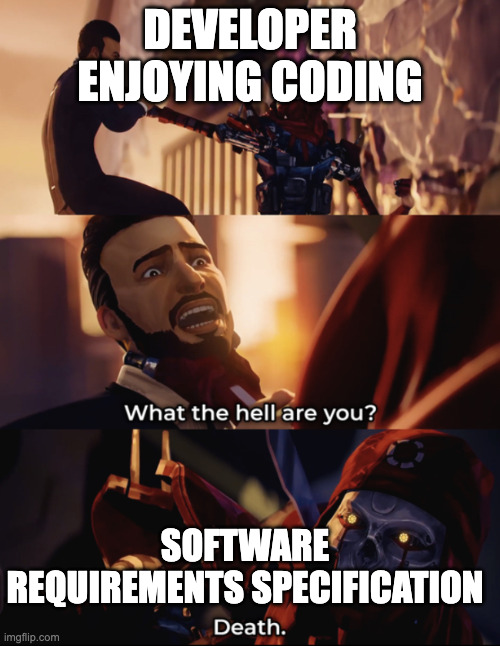

> **Specification** = The process of documenting requirements in a clear, precise, and unambiguous manner

### Purpose:
- Create a **contract** between stakeholders and developers
- Provide a **reference** for design and testing
- Enable **communication** across the team
- Support **validation** and **verification**

### Key Principle - **Clear > Clever**

Requirements must be understandable by all stakeholders, not just developers

---

# Characteristics of Good Requirements

### A requirement should be:

| Quality | Description | Example |
|---------|-------------|---------|
| **Clear** | Unambiguous, easy to understand | ✅ "Load within 3 sec" vs ❌ "Fast" |
| **Complete** | All necessary info included | Includes inputs, outputs, constraints |
| **Consistent** | No contradictions | Can't be both "real-time" and "batch" |
| **Verifiable** | Can be tested | ✅ "99% uptime" vs ❌ "Reliable" |
| **Traceable** | Can track to source & design | Numbered: FR-1, NFR-1, US-01 |
| **Prioritized** | Importance level defined | MoSCoW: Must/Should/Could/Won't |
| **Feasible** | Technically & economically possible | Don't promise impossible things |
| **Modifiable** | Easy to change | Well-structured, not redundant |

---

# Good vs. Bad Requirements

<div class="columns">

<div>

### Bad Requirements

**Vague:**
- "System should be fast"
- "User-friendly interface"
- "Secure data storage"

**Ambiguous:**
- "Users can manage events"
- "System handles errors gracefully"

**Non-verifiable:**
- "Works most of the time"
- "Easy to use"

</div>

<div>

### Good Requirements

**Specific:**
- "Page load time < 2 seconds on 4G"
- "All forms include field validation and error messages"
- "Data encrypted with AES-256 at rest and TLS 1.3 in transit"

**Clear:**
- "Users can create, edit, delete, and view events"
- "System displays error message within 500ms of invalid input"

**Verifiable:**
- "99% of requests succeed"
- "95% of users complete registration without help"

</div>

</div>

---

# Requirements Numbering & Traceability

### Why number requirements?

- Easy reference: "FR-12 is unclear"
- Traceability: Link requirements -> design -> tests
- Change management: Track what changed

### Numbering Schemes:

| Type | Prefix | Example |
|------|--------|---------|
| Functional Requirements | FR- | FR-1, FR-2, FR-3... |
| Non-Functional Requirements | NFR- | NFR-1, NFR-2, NFR-3... |
| User Stories | US- | US-01, US-02, US-03... |
| Use Cases | UC- | UC-1, UC-2, UC-3... |
| System Requirements | SR- | SR-1, SR-2, SR-3... |

---

# Requirements Traceability Matrix (RTM)

> **RTM** = A table that links requirements to design, implementation, and tests

| Req ID | Requirement | Design Element | Test Case | Status |
|--------|-------------|----------------|-----------|--------|
| FR-1 | User registration | AuthService.register() | TC-01, TC-02 | ✅ Done |
| FR-2 | Email verification | EmailService.verify() | TC-03 | 🔄 In Progress |
| NFR-1 | Load time < 2s | CDN + caching | TC-10 | ⏳ Pending |
| US-01 | Filter events | EventFilter component | TC-15, TC-16 | ✅ Done |

### Benefits:
- Ensure **nothing is missed**
- Track **progress**
- Impact analysis for **changes**

### Useful for your project!

---

# Activity - Write a Good Requirement

**Scenario:** You're building CampusPal. Students want to find and join study groups easily.

**Bad Requirement:**
*"Study groups should be easy to find and work well"*

**Your Task:** Rewrite this as **3 specific requirements** (2 functional, 1 non-functional) that are:
- Clear
- Verifiable
- Testable

*Work in pairs (3 minutes)*

---

# Activity - Write a Good Requirement - Sample Answer

**Scenario:** CampusPal study groups feature

**Bad Requirement:** *"Study groups should be easy to find and work well"*

**Better Requirements:**

**FR-3.1: Study Group Search**
"Students shall be able to search for study groups by filtering on: course name, department, meeting time, and availability (open/closed). Search results shall display within 1 second."

**FR-3.2: Study Group Details**
"Each study group listing shall display: course name, current members count, max capacity, meeting schedule, location, and group admin name."

**NFR-4.1: Usability**
"90% of students shall successfully find and join a relevant study group within 2 minutes of first visiting the study groups page."

---

<!-- _class: lead -->
# Part 5: User Stories & Use Cases

## Two Approaches to Requirements

---

# User Stories - Agile Way

> **User Story** = A short, simple description of a feature from the user's perspective.

### Format:
```
As a [user role]
I want to [goal/desire]
So that [benefit/value]
```

### Example:
```
US-05: Quick Event Search

As a busy student
I want to search events by keyword
So that I can quickly find specific events without browsing categories

Priority: Should Have

Acceptance Criteria:
- Given I'm on the events page
- When I type "basketball" in the search box
- Then I see all events with "basketball" in title or description
- And results appear as I type (live search)
- And I see at least the title, date, and location for each result
```

---

# Anatomy of a User Story

<div class="columns">

<div>

### The 3 Cs:

**Card**: The story itself
```
As a student
I want to RSVP to events
So that organizers know I'm coming
```

**Conversation**: Discussion & clarification
- What happens if event is full?
- Can I un-RSVP?
- Do I get a confirmation?

**Confirmation**: Acceptance criteria
- Given/When/Then scenarios
- Definition of "Done"

</div>

<div>

### INVEST Criteria:

✅ **I**ndependent: Can be developed separately
✅ **N**egotiable: Details can be discussed
✅ **V**aluable: Delivers user value
✅ **E**stimable: Can estimate effort
✅ **S**mall: Fits in one sprint
✅ **T**estable: Has clear pass/fail

</div>

</div>

---

# User Story - Example from CampusPal

```
US-04: Marketplace Item Listing

As a student selling used textbooks
I want to list my items with photos and details
So that other students can find and buy them easily

Priority: Must Have

Acceptance Criteria:
1. Given I'm logged into CampusPal
   When I navigate to "Sell Item" page
   Then I see a form with fields: title, description, price, category, condition, photos

2. Given I'm filling out the sell form
   When I upload photos (up to 5)
   Then each photo is previewed and can be reordered or removed
   And each photo is compressed to < 200KB automatically

3. Given I've completed all required fields
   When I click "Post Listing"
   Then my item appears in the marketplace within 5 seconds
   And I receive a confirmation email with listing details

4. Given my item is listed
   When another student views it
   Then they see all details and a "Contact Seller" button
   And can send me a message through the platform

Story Points: 8
Dependencies: User authentication (US-01), File upload service (FR-4)
```

---

# Use Cases

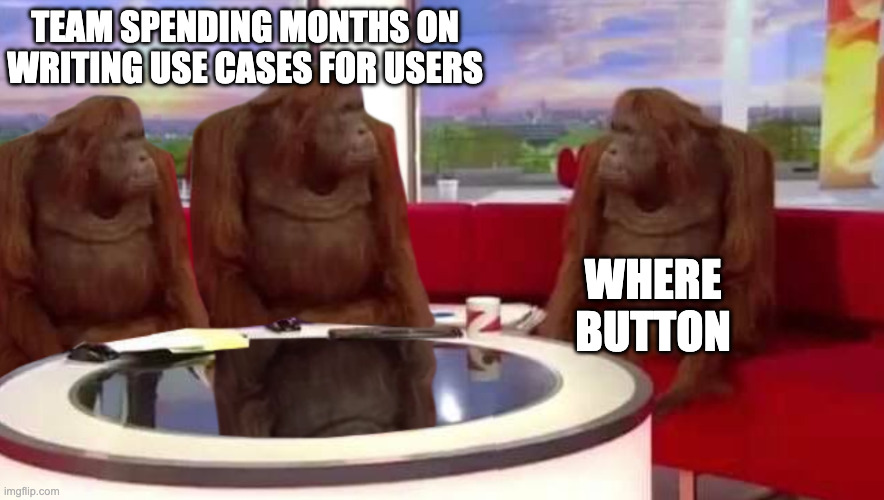

> **Use Case** = A detailed description of how a user interacts with the system to achieve a goal

### Structure:
- **Use Case ID & Name**
- **Primary Actor**: Who initiates this?
- **Preconditions**: What must be true before?
- **Main Success Scenario**: Step-by-step happy path
- **Extensions/Alternatives**: What if something goes wrong?
- **Postconditions**: What's true after?

---

# Use Case Example - CampusPal Student Event Registration

**UC-03: Register for Event**

**Primary Actor:** _____
**Preconditions:** Student is ____, event has ______
**Trigger:** Student clicks "Register" on event page

**Main Success Scenario:**
1. System displays event details and registration form
2. Student confirms attendance
3. System checks ______
4. System registers student for event
5. System sends confirmation email
6. System displays ______ with calendar add option

**Extensions (Alternatives):**
3a. Event is full
   3a1. ____

**Postconditions:** Student is registered, _____

---

# Use Case Example - CampusPal Student Event Registration

**UC-03: Register for Event**

**Primary Actor:** Student
**Preconditions:** Student is logged in, event has available spots
**Trigger:** Student clicks "Register" on event page

**Main Success Scenario:**
1. System displays event details and registration form
2. Student confirms attendance
3. System checks if spots available
4. System registers student for event
5. System sends confirmation email
6. System displays success message with calendar add option

**Extensions (Alternatives):**
3a. Event is full
    3a1. System displays "Event Full" message

**Postconditions:** Student is registered, spot count decreased by 1, confirmation sent

---

# Use Case Diagram

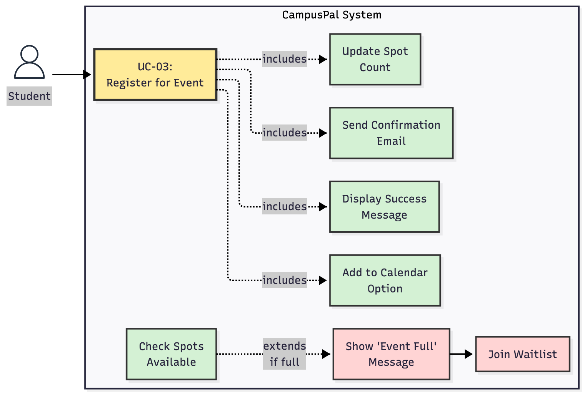

### Elements:
- **Actors**: Users/systems
- **Use Cases**: System functions
- **Relationships**:
  - Association (line): Actor performs use case
  - Include (dotted arrow): Always includes another use case
  - Extend (dotted arrow): Optionally extends another use case

### Tools:
- Mermaid, Draw.io
---

<!-- _class: lead -->
# Part 6: Requirements Validation

## Making Sure We Got It Right

---

# Requirements Validation

> **Validation** = Ensuring requirements actually represent what stakeholders need and are feasible to build

### Key Questions:
- **Validity**: Does it reflect real needs?
- **Consistency**: No contradictions?
- **Completeness**: Everything covered?
- **Realism**: Can we actually build this?
- **Verifiability**: Can we test it?

### Why it matters:
- Catch errors **early**
- Avoid building the **wrong** thing
- Get stakeholder **buy-in**

---

# Requirements Validation Techniques

| Technique | Description | When to Use |
|-----------|-------------|-------------|
| **Reviews** | Team walks through requirements document | Always - first line of defense |
| **Prototyping** | Build mockup to validate understanding | UI-heavy, unclear requirements |
| **Test Case Generation** | Write tests before building | Critical, well-defined requirements |
| **User Acceptance** | Stakeholders formally approve | Before development starts |
| **Automated Checks** | Tools check for completeness, consistency | Large, complex specifications |
| **Simulations** | Model system behavior | Real-time, safety-critical systems |

---

# Validation Technique #1: Requirements Reviews

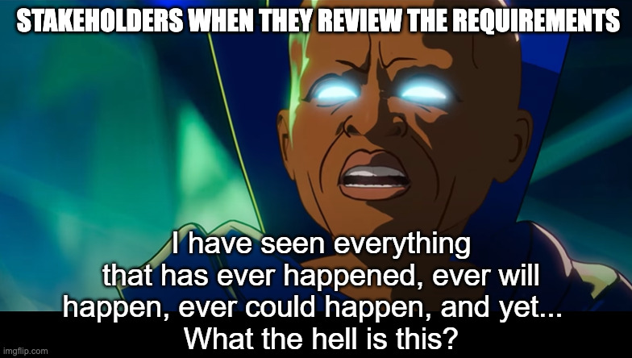

### Types:
- **Informal Walkthrough**: Team reads through together
- **Formal Inspection**: Structured process with checklist
- **Peer Review**: Colleagues review each other's work

### Review Checklist:
- Every requirement has a unique ID?
- All requirements are testable/verifiable?
- No contradictions between requirements?
- All stakeholders' needs addressed?
- Technical feasibility confirmed?
- Priorities assigned ?
- Dependencies identified?

---

# Validation Technique #2: Prototyping for Validation

<div class="columns">
<div>

### Process:
1. Create mockup based on requirements
2. Show to stakeholders
3. Gather feedback
4. Refine requirements
5. Repeat until validated

### Easier to execute now with tools like V0, Lovable, Bolt, etc.
</div>

<div>

### Example: E-commerce Checkout

**Initial Requirement:**
"Users shall be able to complete purchase"

**Prototype Feedback:**
- Users confused by 4-step process
- Want to see total price earlier
- Need guest checkout option

**Refined Requirements:**
- FR-15: Guest checkout without account
- FR-16: Price breakdown visible on every step
- NFR-8: Checkout completable in < 3 minutes
</div>

---

# Validation Technique #3: Test Case Generation

> **Write tests BEFORE building** to validate requirements are testable.

### Example:

**Requirement:**
FR-12: "Users can filter events by date range"

**Test Cases:**
- TC-12.1: Filter shows events within selected date range ✅
- TC-12.2: Filter handles same start/end date ✅
- TC-12.3: Filter handles invalid date range (end before start) ✅
- TC-12.4: Filter shows "no results" when no events match ✅

**Problem Found:** Requirement doesn't specify time zone handling

**Refined Requirement:**
FR-12: "Users can filter events by date range (using browser's local time zone)"

---

# Question - Validation

**Question:** Your team wrote: *"The app must support many users."*

**What's the PRIMARY problem with this requirement?**

A) It's a non-functional requirement
B) It's not verifiable/testable
C) It needs acceptance criteria
D) It should be a user story

**Follow-up: How to improve?**

---

# Question - Validation - Answer

**Question:** *"The app must support many users."*

**Answer: B) It's not verifiable/testable** ✅

**Why:**
- "Many" is ambiguous - could mean 10, 100, or 1,000,000
- Cannot write a test to verify this
- No way to know if we've met the requirement

**Better Requirement:**
NFR-5: "The system shall support 1,000 concurrent users with response time < 3 seconds."

**Now it's:**
- Specific (1,000 concurrent users)
- Verifiable (can load test)
- Measurable (response time < 3 sec)

---

<!-- _class: lead -->
# Part 7: Requirements Management

## Handling Change & Evolution

---

# Requirements Management

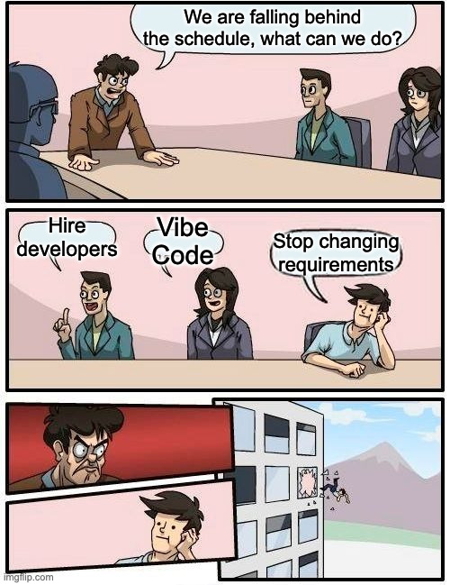

> **Requirements Management** = The process of managing changes to requirements throughout the project lifecycle.

### Why it's needed:
- Requirements **WILL** change (business, market, regulations)
- New stakeholders, new insights
- Technical constraints discovered during development
- Competitive pressures

### The Challenge:
Change is inevitable, but **uncontrolled change** leads to chaos.

---

# Why Requirements Change

<div class="columns">

<div>

### External Factors:
- **Market shifts**: Competitors launch new feature
- **Regulation changes**: New privacy laws (GDPR)
- **Business pivots**: Company strategy changes
- **User feedback**: "This isn't what we need"
- **Technology evolution**: New tools available

</div>

<div>

### Internal Factors:
- **Better understanding**: "Oh, we need this too"
- **Technical discovery**: "That's harder than we thought"
- **Scope creep**: "While you're at it..."
- **Stakeholder conflicts**: Competing priorities
- **Budget/time constraints**: "We can't afford that"

</div>

</div>

---

# Requirements Change Management Process

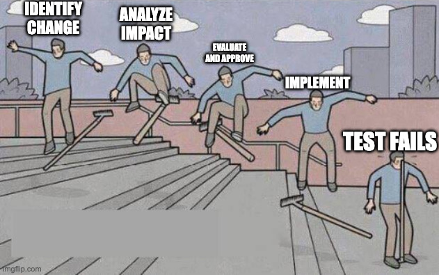

### Steps:
1. **Identify Change**: Someone proposes a change
2. **Analyze Impact**: What's affected? (cost, time, risk)
3. **Evaluate**: Is it worth it? (value vs. cost)
4. **Approve/Reject**: Decision by change control board
5. **Implement**: Update requirements, notify team
6. **Verify**: Ensure change is correctly implemented

---

# Change Request Example

**CR-005: Add Social Media Login**

| Field | Value |
|-------|-------|
| **Requested By** | Product Owner |
| **Date** | October 15, 2025 |
| **Priority** | Medium |
| **Affected Requirements** | FR-1 (User Registration), FR-2 (Login) |
| **Description** | Allow users to sign up/login with Google and Apple |
| **Justification** | User feedback: 40% abandon registration due to form |
| **Impact Analysis** | +3 days development, OAuth integration, security review |
| **Cost/Benefit** | Cost: $1,500 / Benefit: +20% conversion (est.) |
| **Decision** | ✅ Approved for Sprint 5 |
| **Updated Docs** | SRS v2.1, Design Doc v1.3 |

---

# Requirements Versioning

### Why version requirements?
- Track **what changed** and **when**
- Understand **why** it changed
- Ability to **rollback** if needed
- Maintain **history** for compliance

### Versioning Scheme:

```
SRS Version 1.0 → Initial approved version
SRS Version 1.1 → Minor changes (typos, clarifications)
SRS Version 2.0 → Major changes (new features, removed requirements)
```

### Tools:
- **Documents**: Git, Google Docs version history
- **Requirements**: Jira, Linear, GitHub Projects

---

# Requirements Prioritization: MoSCoW Method

> **MoSCoW** = A prioritization technique to manage scope and handle changes.

| Priority | Meaning | % of Effort | Example |
|----------|---------|-------------|---------|
| **M**ust Have | Non-negotiable, core functionality | 60% | User login, place order |
| **S**hould Have | Important but not critical | 20% | Email notifications, search |
| **C**ould Have | Nice to have if time permits | 10% | Dark mode, profile themes |
| **W**on't Have | Out of scope for this release | 10% | AI recommendations, analytics |

### Usage:
When requirements change or time runs out, drop from bottom (W → C → S).
**Never drop M!**

---

# Requirements Traceability for Change Management

### Traceability Matrix Shows Impact:

| Req ID | Requirement | Design | Code | Test | Status |
|--------|-------------|--------|------|------|--------|
| FR-1 | User registration | AuthService | auth.js | TC-01, TC-02 | ✅ |
| **FR-1a** | **+ Social login** | **OAuthService** | **oauth.js** | **TC-01a, TC-01b** | **🔄** |

### Benefits:
- **Impact analysis**: If FR-1 changes, we know exactly what to update
- **Completeness**: Ensure change is implemented everywhere
- **Testing**: Know which tests to update/add
- **Communication**: Show stakeholders what's affected

---

# Change Control Board (CCB)

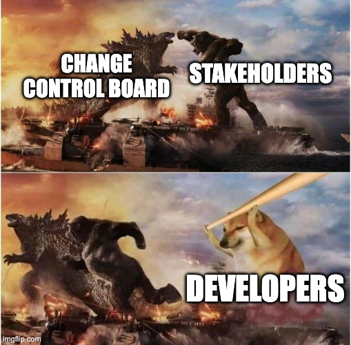

> **CCB** = A group that reviews and approves/rejects requirement changes.

### Who's on the board?
- **Product Owner**: Business value
- **Project Manager**: Timeline & budget
- **Lead Developer**: Technical feasibility
- **QA Lead**: Testing impact
- **Stakeholder Rep**: User needs

### When to meet?
- **Formal projects**: Weekly/biweekly meetings
- **Agile projects**: During sprint planning or backlog refinement

---

# Pop Activity - Change Management Decision

**Scenario:** You're building CampusPal. It's Week 10 of 15. You're slightly behind schedule. A club organizer requests:

**Change Request:**
"Add a live streaming feature so club events can be broadcast to students who can't attend in person"

**Impact Analysis:**
- Development: 3 weeks (video infrastructure, UI, player)
- Affects: FR-2 (events), NFR-1 (performance), NFR-2 (scalability)
- Requires: Video streaming service (AWS IVS/Twitch), new database tables, bandwidth
- Testing: +1 week
- Cost: +$200/month for streaming service
- Currently: On track for Must-Have features, but no buffer time

**Your Decision: Approve or Reject? Why?**

---

# Pop Activity: Change Management Decision - Discussion

**Possible Decisions:**

**Option A: Reject**
- ✅ Stay focused on core features (event RSVP, marketplace)
- ✅ Less risk of missing deadline
- ❌ Could provide value for remote students

**Option B: Defer to v2.0** 
- ✅ Acknowledge value but prioritize current MVP
- ✅ Add to "Could Have" or "Won't Have (this release)"
- ✅ Gather user feedback first: Is this actually needed?

**Option C: Approve with Trade-offs**
- ✅ If it's truly a game-changer for value
- ❌ Must drop 2-3 Should-Have features (study groups? facility ratings?)
- ❌ High risk of missing deadline

---

<!-- _class: lead -->
# Interactive Workshop

## Let's Complete CampusPal SRS Together!

---

# Workshop - Complete CampusPal Requirements

### What We'll Do:
1. **Complete Functional Requirements** (Events, Marketplace, Campus News & Facilities)
2. **Write Non-Functional Requirements** (Performance, Security, Usability)
3. **Practice writing good requirements** (specific, testable, traceable)

### Format:
- Work in groups
- Each group gets a feature area
- 10 minutes to write requirements
- Present to class & discuss

**Goal:** By the end, we'll have a complete CampusPal SRS as your template for D2

---

# Group 1 - Event Management (FR + NFR)

**Your Mission:** Write complete requirements for Event Management

### Functional Requirements (FR-2):
1. **Event browsing** - How do students find events?
2. **Event registration (RSVP)** - How do students join events?
3. **Event creation** - How do organizers create events?

### Non-Functional Requirements (NFR-2):
1. **Performance** - How fast should event operations be?
2. **Scalability** - How many events/users can system handle?
3. **Usability** - How easy to use?

---

# Group 2 - Marketplace (FR + NFR)

**Your Mission:** Write complete requirements for Campus Marketplace

### Functional Requirements (FR-4):
1. **Marketplace browsing** - How do students find items?
2. **Seller communication** - How do buyers contact sellers?
3. **Item listing** - How do students list items for sale?

### Non-Functional Requirements (NFR-4):
1. **Performance** - How fast should marketplace operations be?
2. **Security** - How to protect user data and transactions?
3. **Privacy** - How to handle seller/buyer information?

---

# Group 3 - Campus News & Facilities (FR + NFR)

**Your Mission:** Write complete requirements for Campus News and Facility Ratings

### Functional Requirements (FR-5 & FR-6):
1. **Campus news feed** - How do students view/post campus news?
2. **Facility ratings** - How do students rate facilities (cafeteria, library)?
3. **Review management** - How to view/upvote reviews?

### Non-Functional Requirements (NFR-5 & NFR-6):
1. **Performance** - How fast should news feed load?
2. **Content moderation** - How to handle inappropriate content?
3. **Reliability** - How to ensure data integrity?

---

# Reminder - CampusPal


> Throughout this lecture, we'll use **CampusPal** - a campus social and event management platform

### What is CampusPal?

**A web & mobile platform for university students to:**
- Discover and join campus events (clubs, workshops, sports)
- Find and form study groups
- Buy/sell used textbooks and items
- Share campus news and announcements
- Rate and review campus facilities (cafeterias, libraries)

### Target Users:
- **Students**: Browse events, join groups, buy/sell items
- **Club Organizers**: Create and manage events
- **Admins**: Moderate content, manage users

---

# Event Management - Sample Solutions

### FR-2.1: Event Browsing
- System displays all upcoming events chronologically
- Each shows: title, date, time, location, organizer, category, available spots
- Filter by category & date range; search by keyword
- Pagination: 20 events/page

### FR-2.2: Event Registration
- Click "RSVP" → System checks availability → adds to attendee list
- Decrements spots by 1, sends confirmation email (< 5s) with calendar invite
- **Alternative:** If full → "Event Full" message, hide RSVP button

### FR-2.3: Event Creation
- **Required:** title (≤100), description (≤500), date/time, location, capacity (1-1000)
- **Optional:** category, image (≤5MB, JPG/PNG), RSVP deadline
- Validates → generates ID → publishes immediately → emails organizer

---

# Event Management - Sample Solutions (cont.)

### NFR-2.1: Performance
- Event listing page: < 3s load with 100+ events
- Event search: < 1s result return
- RSVP processing: < 2s confirmation
- Measured at 95th percentile

### NFR-2.2: Scalability
- 5,000 concurrent users during peak registration
- 10,000+ active events per semester
- DB queries < 200ms with 1M+ records

### NFR-2.3: Usability
- 95% of students RSVP in < 30 seconds
- Event creation form completable in < 2 minutes
- Max 3 clicks from home to event detail
- Mobile-responsive (320px-1920px)


---

# Marketplace - Sample Solutions

### FR-4.1: Marketplace Browsing
- Display all active listings sorted by newest
- Each shows: title, price, condition, category, thumbnail, posted date
- Filter by category, price range (TRY), condition
- Search by keyword; Pagination: 30 items/page

### FR-4.2: Seller Communication
- Click "Contact Seller" → in-app messaging (max 500 chars)
- System sends message → notifies seller via email
- Chat history stored for both parties
- **Privacy:** Email addresses hidden, communication through platform only

### FR-4.3: Item Listing
- **Required:** title (≤100), description (≤500), price (0-10,000 TRY), category, condition
- **Optional:** photos (max 5, ≤5MB JPG/PNG)
- Validates → generates ID → compresses images to <200KB → publishes → emails seller

---

# Marketplace - Sample Solutions (cont.)

### NFR-4.1: Performance
- Marketplace page: < 3s load with 200+ listings
- Item search: < 1.5s result return
- Image upload & compression: < 3s
- Messaging: < 1s delivery

### NFR-4.2: Security
- All transactions over HTTPS (TLS 1.3)
- User data encrypted at rest (AES-256)
- Input validation to prevent XSS/SQL injection
- Max file size enforced: 5MB per image

### NFR-4.3: Privacy
- Seller/buyer email addresses never exposed
- Communication through in-app messaging only
- Users can delete listings (data removed within 24h)
- Contact info hidden until mutual agreement

---

# Campus News & Facilities - Sample Solutions

### FR-5.1: Campus News Feed
- Students can view news feed sorted by newest first
- Each post shows: title, content (≤1000 chars), author, timestamp, category (News, Announcement, Event)
- Students can post campus news (requires approval for non-verified users)
- Filter by category; search by keyword

### FR-5.2: Facility Ratings
- Students rate facilities (cafeteria, library, sports center, etc.) with 1-5 stars
- Optional text review (≤500 chars) and photos (max 3, ≤5MB each)
- System calculates and displays average rating

### FR-5.3: Review Management
- Students can view all reviews sorted by newest or by rating
- Students can upvote/downvote reviews for helpfulness
- System sorts reviews by helpfulness score (upvotes - downvotes)

---

# Campus News & Facilities - Sample Solutions (cont.)

### NFR-5.1: Performance
- News feed loads in < 2s with 100+ posts
- Facility ratings page loads in < 2s with 50+ reviews
- Review submission processed in < 1s

### NFR-5.2: Content Moderation
- All posts flagged for inappropriate content reviewed within 24h
- Admins can remove posts/reviews that violate guidelines
- Automated content filtering for profanity and spam
- Users can report inappropriate content (button on each post/review)

### NFR-5.3: Reliability
- Reviews stored with referential integrity (linked to user and facility)
- Rating calculations updated in real-time (< 500ms after new review)
- Data backup daily; deleted content archived for 30 days
- 99.5% uptime for news feed and ratings features

---

# From Workshop to Your D2 (SRS)

### You now have the template! Apply what we did to your project:

<div class="columns">

<div>

### Functional Requirements:
1. List your **core features** (5-7 areas)
2. For each feature, write **3-5 requirements**
3. Be specific: fields, types, constraints
4. Include system behavior & responses

**D2:** 15-25 user stories
(Each story = multiple system requirements)

</div>

<div>

### Non-Functional Requirements:
1. Cover all **8 categories** (Performance, Scalability, Security, Usability, Reliability, Maintainability, Compatibility, Compliance)
2. Use **measurable metrics**
3. Specify **standards/algorithms**
4. Define **acceptable ranges**

**D2:** At least 2-3 NFRs per category

</div>

</div>

---

# D2: Software Requirements Specification

### Due: **Week 6** (November 4, 2025)

### What you'll deliver:
A comprehensive SRS document with:
1. **Introduction**: Purpose, scope, audience, references
2. **Overall Description**: Product perspective, users, constraints
3. **Functional Requirements**: **15-25 user stories** with acceptance criteria
4. **Non-Functional Requirements**: Performance, security, usability, etc.
5. **System Models**: Use case diagrams, user flows
6. **Data Requirements**: Entities, validation rules
7. **External Interfaces**: APIs, third-party services

**Format:** PDF named `<TeamName>_D2_SRS.pdf`

---

<!-- _class: lead -->
# Thank You!

## Contact Information

- **Email:** ekrem.cetinkaya@yildiz.edu.tr
- **Office Hours:** Tuesday 14:00-16:00 - Room F-B21
- **Book a slot before coming:** [Booking Link](https://calendar.app.google/aBKvBqNAqG12oD2B9)
- **Course Repository:** [GitHub](https://github.com/ekremcet/yzm2021-principles-of-software-engineering)

## Next Class

- **Date:** 04.11.2025
- **Topic:** System Modeling & UML
- **Reading:** Sommerville Ch. 5

**Remember:** Requirements are the foundation of your project. Get them right, and everything else becomes easier.


