# Week 6: System Modeling and UML

## YZM2021 - Software Engineering Principles

**Instructor:** Ekrem Çetinkaya
**Date:** 04.11.2025

---

# Where Are We?


### What We've Covered:
- **Week 1-2:** Software Engineering & Principles
- **Week 3:** Process Models (Waterfall, RUP, Incremental)
- **Week 4:** Agile Methodologies (Scrum, XP, Kanban)
- **Week 5:** Requirements Engineering (FR, NFR, Elicitation, Validation)

### Deliverables So Far:
- ✅ **D1 (Week 4):** Software Development Plan
- 🔴 **D2 (Week 6 - Due Today):** Software Requirements Specification

---

# Today's Learning Outcomes

By the end of this lecture, you will be able to:

1. **Explain** why system modeling is essential in software engineering
2. **Identify** different UML diagram types and their purposes
3. **Create** Use Case Diagrams for user interactions
4. **Design** Class Diagrams to model system structure
5. **Draw** Sequence Diagrams for interaction flows
6. **Construct** Activity Diagrams for complex processes
7. **Build** State Machine Diagrams for behavior modeling
8. **Apply** appropriate modeling techniques to your project

---

# Why Do We Need Models?

### Why don't we just write code directly?

<div class="columns">

<div>

### Models Help Us:
1. **Visualize** the system before building it
2. **Communicate** with stakeholders (non-technical people)
3. **Understand** complex systems (big picture)
4. **Document** design decisions
5. **Detect** problems early (before coding)
6. **Plan** development work

</div>

<div>

### Real-World Analogy:

**Building a House:**
- Architect draws blueprints
- Electrical diagrams for wiring
- Plumbing diagrams for pipes
- 3D visualizations for clients

**Building Software:**
- Use Case Diagrams (what users do)
- Class Diagrams (structure)
- Sequence Diagrams (interactions)
- Activity Diagrams (workflows)

</div>

</div>

---

# System Modeling: Two Perspectives

<div class="columns">

<div>

### External Perspective (Context)
**"What does the system interact with?"**

- System as a black box
- Environment and external actors
- Boundaries and interfaces
- Context diagrams

**Purpose:** Understand the system's environment

</div>

<div>

### Internal Perspective (Structure & Behavior)
**"How does the system work inside?"**

- Components and their relationships
- Interactions between parts
- Data flow and control flow
- Detailed behavior

**Purpose:** Design and implement the system

</div>

</div>

### Both perspectives are essential for complete understanding!

---

# Types of Models in Software Engineering

<div class="columns">

<div>

### Structural Models (Static)
**"What is the system made of?"**

- **Class Diagrams:** Classes, attributes, methods, relationships
- **Component Diagrams:** Components and dependencies
- **Deployment Diagrams:** Hardware/software mapping
- **Object Diagrams:** Instances at a point in time
- **Package Diagrams:** Logical grouping

</div>

<div>

### Behavioral Models (Dynamic)
**"How does the system behave?"**

- **Use Case Diagrams:** User interactions
- **Sequence Diagrams:** Message flow over time
- **Activity Diagrams:** Workflows and processes
- **State Machine Diagrams:** State transitions
- **Communication Diagrams:** Object interactions

</div>

</div>

### **We'll focus on the 5 most essential diagrams today**

---

# UML: Unified Modeling Language

<div class="columns">

<div>

### What is UML?
- **Standard notation** for software modeling
- Created by Grady Booch, Ivar Jacobson, James Rumbaugh (1990s)
- Maintained by OMG (Object Management Group)
- Version 2.5.1 (current)

### Why UML?
- **Universal language** - everyone understands it
- **Tool support** - many tools available
- **Comprehensive** - covers many aspects
- **Industry standard** - used worldwide

</div>

<div>

### UML Diagram Types (14 Total):

**Structure Diagrams (7):**
- Class, Component, Deployment, Object, Package, Profile, Composite Structure

**Behavior Diagrams (7):**
- Use Case, Activity, State Machine, Sequence, Communication, Timing, Interaction Overview

### Today's Focus:
1. ✅ Use Case Diagrams
2. ✅ Class Diagrams
3. ✅ Sequence Diagrams
4. ✅ Activity Diagrams
5. ✅ State Machine Diagrams

</div>

</div>

---

# Our Running Example - CampusPal 🎓

### Remember our imaginary campus app from Week 5?

**CampusPal** is a web application for YTÜ students with three main features:

1. **📅 Event Management:** Browse, create, and RSVP to campus events
2. **🛒 Marketplace:** Buy/sell items (textbooks, electronics, furniture)
3. **📰 Campus News & Facilities:** View news, rate/review facilities

### We'll use CampusPal to demonstrate all UML diagrams today!

---

# Use Case Diagrams

### Show **what** the system does from a **user's perspective**

<div class="columns">

<div>

### Components:
- **Actors:** Users or external systems 
- **Use Cases:** System functions
- **Relationships:**
  - Association (line): Actor uses use case
  - Include: Mandatory sub-function (arrow with «include»)
  - Extend: Optional variation (arrow with «extend»)
  - Generalization: Inheritance (empty arrow)

</div>

<div>

### When to Use:
- Requirements elicitation
- Scope definition
- High-level system overview
- Communication with stakeholders

### Key Questions:
- Who uses the system? (actors)
- What can they do? (use cases)
- What are the relationships?

</div>

</div>

---

# Use Case Diagram: CampusPal Event Management

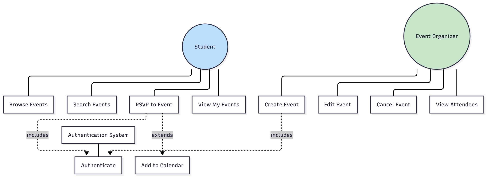

---

# Use Case Diagram Notation Details

<div class="columns">

<div>

### Actors:
- **Primary Actors:** Initiate use cases (Student, Organizer)
- **Secondary Actors:** Provide services (Email System, Payment Gateway)
- Place primary actors on left, secondary on right

### Use Cases:
- Action verb + object (e.g., "Browse Events")
- User goal at the right level of detail
- **Too high:** "Use System"
- **Too low:** "Click Button"
- **Just right:** "RSVP to Event"

</div>

<div>

### Relationships:

**«include»** (always happens):
- "RSVP to Event" **includes** "Authenticate"
- Dashed arrow from base → included

**«extend»** (optional):
- "RSVP to Event" **extends to** "Add to Calendar"
- Dashed arrow from extension → base

**Generalization** (inheritance):
- "Event Organizer" is a type of "Student"
- Solid arrow from specific → general

</div>

</div>

---

# Question - Use Case Diagrams

### Scenario: CampusPal Marketplace

A student browses marketplace listings. If they find an item they like, they can contact the seller via in-app messaging. To send a message, they must be logged in. After sending a message, they may optionally mark the item as "Watching."

### Questions:
1. What are the actors?
2. What are the use cases?
3. Which relationship is between "Contact Seller" and "Authenticate"? (include/extend)
4. Which relationship is between "Contact Seller" and "Mark as Watching"? (include/extend)

---

# Answer

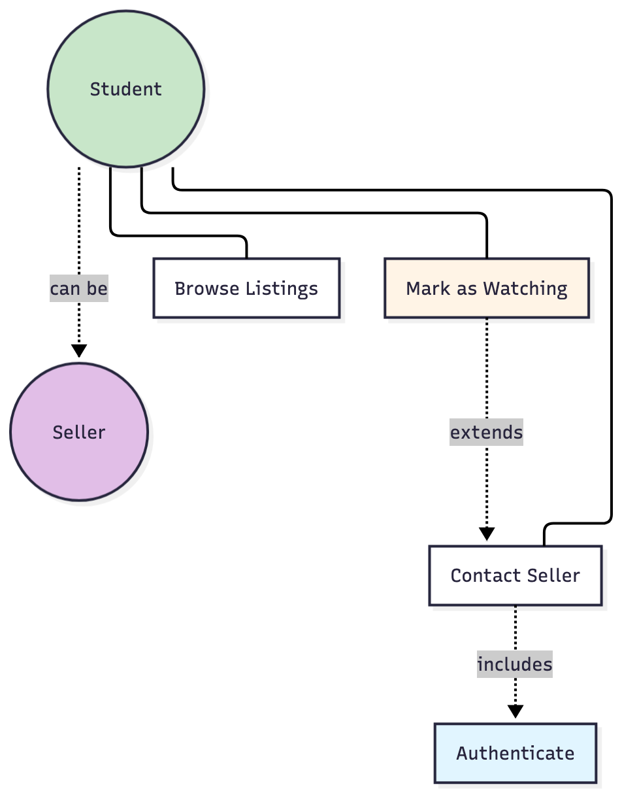


1. **Actors:** Student (primary), Seller (can also be Student - generalization)
2. **Use Cases:** Browse Listings, Contact Seller, Authenticate, Mark as Watching
3. **Contact Seller includes Authenticate** (must login to message - required)
4. **Mark as Watching extends Contact Seller** (optional action after messaging)

**Key Points:**
- «include»: Authenticate is REQUIRED (solid dependency)
- «extend»: Mark as Watching is OPTIONAL (extends the base use case)

---

# Class Diagrams

### Show the **structure** of the system (classes, attributes, methods, relationships)

<div class="columns">

<div>

### Components:
- **Classes:** Rectangles with 3 compartments
  1. Name (top)
  2. Attributes/Properties (middle)
  3. Methods/Operations (bottom)
- **Relationships:**
  - Association (line)
  - Aggregation (empty diamond) - "has-a"
  - Composition (filled diamond) - "owns"
  - Inheritance (empty arrow) - "is-a"
  - Dependency (dashed arrow) - "uses"

</div>

<div>

### When to Use:
- **Design phase** (after requirements)
- Database schema design
- Object-oriented analysis
- Code structure planning

### Key Questions:
- What are the main entities?
- What data do they contain?
- What operations can they perform?
- How are they related?

</div>

</div>

---

# Class Diagram - CampusPal Event Management

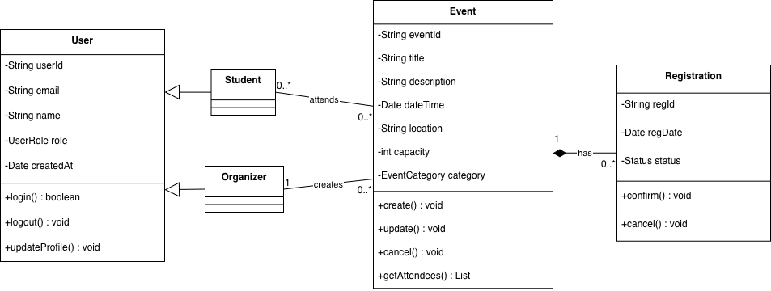

---

# Class Diagram Notation Details

<div class="columns">

<div>

### Visibility Modifiers:
- `+` **public:** Accessible from anywhere
- `-` **private:** Only within class
- `#` **protected:** Within class + subclasses
- `~` **package:** Within same package

### Attributes Format:
```
visibility name: type = defaultValue
- userId: String
- age: int = 0
```

### Methods Format:
```
visibility name(params): returnType
+ login(email: String, password: String): boolean
```

</div>

<div>

### Relationships:

**Association (line):**
- General relationship
- Multiplicity: `0..1`, `1`, `0..*`, `1..*`, `m..n`

**Aggregation (◇——):**
- "has-a" (weak ownership)
- Example: Course ◇—— Student

**Composition (◆——):**
- "owns" (strong ownership)
- Example: House ◆—— Room

**Inheritance (△——):**
- "is-a" relationship

</div>

</div>

---

# Multiplicity in Class Diagrams

### Understanding Cardinality (How Many?)

<div class="columns">

<div>

| Notation | Meaning |
|----------|---------|
| `1` | Exactly one |
| `0..1` | Zero or one (optional) |
| `0..*` or `*` | Zero or more |
| `1..*` | One or more (at least one) |
| `m..n` | Between m and n |

</div>

<div>

### Examples:

**Student 0..* ——— 0..* Event**
- A student can attend many events
- An event can have many students

**Organizer 1 ——— 0..* Event**
- Each event has exactly ONE organizer
- An organizer can create MANY events

**Event 1 ——— 0..* Registration**
- Each registration belongs to ONE event
- An event can have MANY registrations

</div>

</div>

---

# Aggregation vs Composition

<div class="columns">

<div>

### Aggregation (◇ empty diamond)
**"Has-a" - Weak Ownership**

```
Department ◇─────○─○ Professor
    1               0..*
```

- Professors can exist without the department
- Department "has" professors
- If department is deleted, professors still exist

**Example:**
- Course ◇─── Student
- Car ◇─── Driver
- Team ◇─── Player

</div>

<div>

### Composition (◆ filled diamond)
**"Owns" - Strong Ownership**

```
House ◆─────●─● Room
  1             1..*
```

- Rooms cannot exist without the house
- House "owns" rooms
- If house is destroyed, rooms are destroyed too

**Example:**
- Event ◆─── Registration
- Book ◆─── Chapter
- Car ◆─── Engine

</div>

</div>

### 💡 Rule of thumb: If the part can exist independently, use Aggregation. If not, use Composition.

---

# Question - Class Diagrams

### Given this relationship: `Order 1 ——— 1..* LineItem`

**Questions:**
1. What does the multiplicity mean?
2. Is this Aggregation or Composition?
3. If an Order is deleted, should LineItems be deleted too?
4. Can a LineItem exist without an Order?


---

# Answer - Class Diagrams

### Given this relationship: `Order 1 ——— 1..* LineItem`

1. **Multiplicity:** Each Order has at least ONE LineItem (1..*). Each LineItem belongs to exactly ONE Order (1).
2. **Composition** (◆) - LineItems are part of an Order
3. **Yes** - LineItems don't make sense without their Order
4. **No** - LineItems are owned by Orders, they die together
   - **Correction:** Should be `Order ◆─────● LineItem`

---

# Pop Activity - Draw a Class Diagram

### Task: Model CampusPal **Marketplace** feature

**Requirements:**
- A `User` can list multiple `Items` for sale
- Each `Item` has: title, description, price, condition, category, photos
- Users can send `Messages` to each other about items
- A `Message` belongs to one `Conversation` between two users about one item
- A `Listing` represents an item currently for sale (has active/sold status)

**Hint:** Consider:
- What classes do you need?
- What attributes and methods for each class?
- What relationships? (Association, Composition, Inheritance?)
- What multiplicities?

---

# Sample Solution - Marketplace Class Diagram

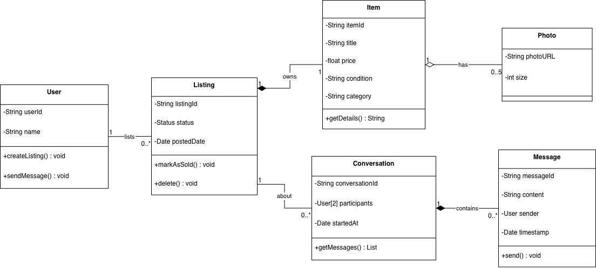

---

# Sequence Diagrams

### Show **how objects interact over time** (message flow)

<div class="columns">

<div>

### Components:
- **Actors/Objects:** Boxes
- **Lifelines:** Vertical dashed lines
- **Activation Bars:** Rectangles on lifelines 
- **Messages:** Horizontal arrows
  - Synchronous: →
  - Asynchronous: →
  - Return: ⇢ (dashed)
  - Self-call: ↻

</div>

<div>

### When to Use:
- Detailed interaction design
- API flow documentation
- Understanding complex scenarios
- Debugging and troubleshooting

### Key Questions:
- What is the sequence of events?
- Which objects are involved?
- What messages are exchanged?
- What is the order?

</div>

</div>

---

# Sequence Diagram - RSVP to Event in CampusPal

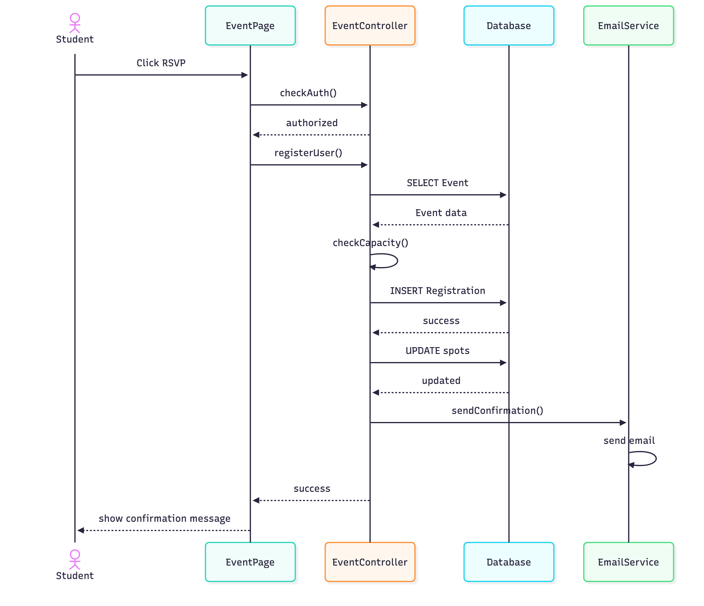

---

# Sequence Diagram Notation Details

<div class="columns">

<div>

### Message Types:

**Synchronous Call (→):**
- Caller waits for response
- `student.login()` waits for result

**Asynchronous Call (→):**
- Caller doesn't wait
- `sendEmail()` fires and forgets

**Return Message (⇢ dashed):**
- Optional (often implicit)
- Shows return value

**Self-Call (↻):**
- Object calls its own method
- Loop on same lifeline

</div>

<div>

### Advanced Notation:

**alt (alternative):** if-else logic
```
alt [capacity available]
    → register
else [full]
    → show error
end
```

**loop:** repetition
```
loop [for each attendee]
    → sendReminder
end
```

**opt (optional):** maybe execute
```
opt [premium user]
    → sendCalendarInvite
end
```

</div>

</div>

---

# Sequence Diagram - Create Event with Validation

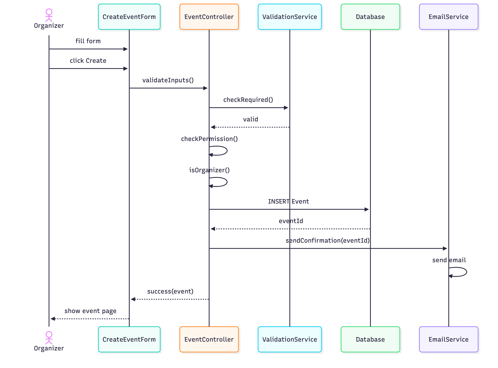

---

# Pop Activity - Sequence Diagrams

### Scenario: Student contacts seller about marketplace item

**Steps:**
1. Student clicks "Contact Seller" on item page
2. System checks if student is logged in
3. If not logged in, redirect to login page
4. After login, open messaging interface
5. Student types and sends message
6. System saves message to database
7. System sends email notification to seller
8. Display "Message sent!" to student

### Task: Draw the sequence diagram (on paper or in your mind)
- What are the participants/objects?
- What is the message flow?
- Where would you use `alt` for the login check?

---

# Sample Solution: Contact Seller Sequence

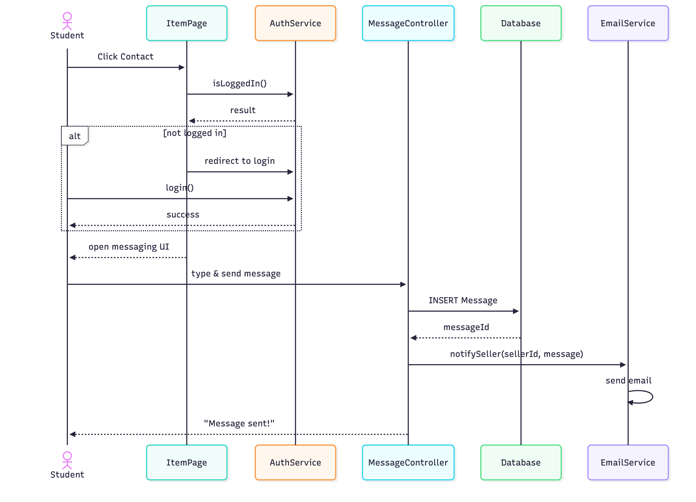

---

# Activity Diagrams

### Show **workflows, business processes, and algorithms** (flowcharts)

<div class="columns">

<div>

### Components:
- **Start Node:** ● (filled circle)
- **End Node:** ◉ (filled circle in circle)
- **Activity:** Rounded rectangle
- **Decision:** ◇ (diamond) with [conditions]
- **Merge:** ◇ (diamond) combining flows
- **Fork/Join:** Thick bar (parallel activities)
- **Swimlanes:** Divide by actor/component

</div>

<div>

### When to Use:
- Complex business logic
- User workflows (multi-step)
- Algorithm visualization
- Process documentation
- Parallel activities

### Key Questions:
- What are the steps?
- What are the decision points?
- What happens in parallel?
- Who is responsible for each step?

</div>

</div>

---

# Activity Diagram - Event RSVP Process

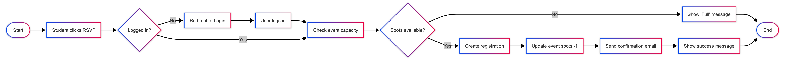

---

# Activity Diagram with Swimlanes

### Event Creation Process (showing responsibilities)

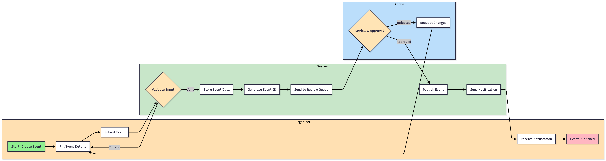

**Note:** Swimlanes show Organizer, System, and Admin responsibilities

---

# Activity Diagram - Parallel Activities (Fork/Join)

### Order Processing with Parallel Tasks

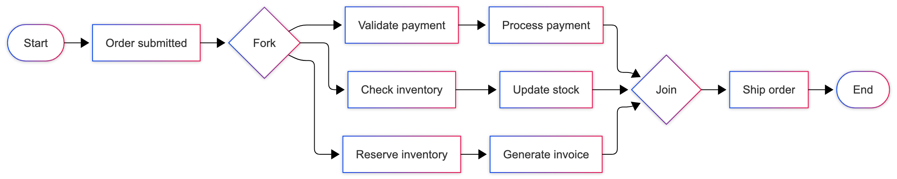

**Note:** Fork/Join shows parallel processing of payment, inventory, and invoice tasks

---

# Pop Activity - Draw an Activity Diagram

### Task: Model the "List Item for Sale" process in CampusPal Marketplace

**Process:**
1. Seller fills out listing form (title, description, price, condition, category)
2. Seller optionally uploads photos (max 5)
3. System validates all required fields
4. If validation fails, show errors and return to form
5. If validation passes, compress uploaded images
6. Save listing to database
7. Send confirmation email to seller
8. Display success message

**Include:**
- Start and End nodes
- Decision points (validation)
- Activities (actions)
- Flow arrows with conditions

---

# Sample Solution - List Item Activity Diagram

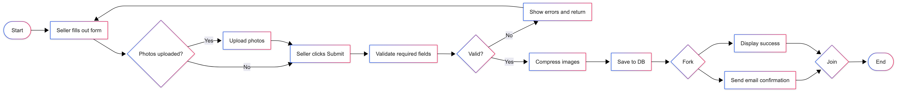

---

# State Machine Diagrams

### Show **how objects change states** in response to events

<div class="columns">

<div>

### Components:
- **States:** Rounded rectangles
- **Transitions:** Arrows with labels
- **Initial State:** ● (filled circle)
- **Final State:** ◉ (filled circle in circle)
- **Events/Triggers:** Text on transitions
- **Guard Conditions:** [in brackets]
- **Actions:** /action on transition

</div>

<div>

### When to Use:
- Objects with distinct states
- State-dependent behavior
- Complex lifecycle modeling
- Protocol specification

### Key Questions:
- What are the possible states?
- What triggers state changes?
- What are the valid transitions?
- What happens on entry/exit?

</div>

</div>

---

# State Machine Diagram - Event Lifecycle in CampusPal

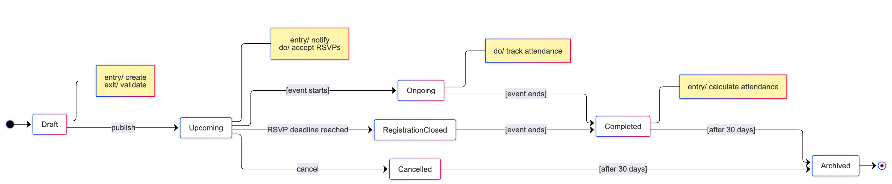

---

# State Machine Notation Details

<div class="columns">

<div>

### State Format:

```
┌──────────────────┐
│   State Name     │
├──────────────────┤
│ entry/ action    │  <- Run when entering
│ do/ activity     │  <- Ongoing activity
│ exit/ action     │  <- Run when leaving
└──────────────────┘
```

### Transition Format:

```
event [guard] / action
```

- **event:** What triggers the transition
- **[guard]:** Condition (optional)
- **/action:** What happens (optional)

**Example:**
```
submit [form valid] / save data
```

</div>

<div>

### Special States:

**Initial Pseudostate (●):**
- Where the object starts
- Only one per diagram

**Final State (◉):**
- End of lifecycle
- Can have multiple

**Composite States:**
- States within states
- Nested state machines

**History State (Ⓗ):**
- Remember last substate
- Return to it when re-entering

</div>

</div>

---

# State Machine Diagram - Marketplace Listing States

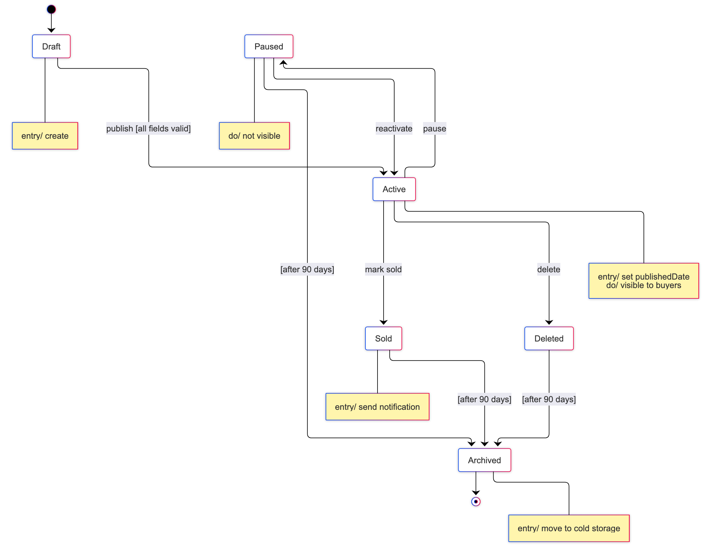

---

# Question - State Machine Diagrams

### Scenario: User Account States

A user account can be:
- **New:** Just created, needs email verification
- **Active:** Verified and can use the system
- **Suspended:** Temporarily blocked for policy violation
- **Deleted:** User requested deletion, 30-day recovery period
- **Purged:** Permanently removed after 30 days

### Questions:
1. What are the valid transitions?
2. Can a Suspended account go directly to Deleted?
3. Should there be a transition from Deleted back to Active?
4. What guards might you add?

---

# Sample Answer

**Valid transitions:**
- New -> Active (verify email)
- Active -> Suspended (policy violation)
- Suspended -> Active (appeal approved)
- Active -> Deleted (user request)
- Deleted -> Active (recovery within 30 days)
- Deleted -> Purged (after 30 days)

**Guards:**
- verify [email code valid]
- recover [within 30 days]
- purge [after 30 days]

---

# Choosing the Right Diagram

<div class="columns">

<div>

| Diagram | When to Use | Question It Answers |
|---------|------------|-------------------|
| **Use Case** | Requirements phase | What can users do? |
| **Class** | Design phase | What objects exist? How are they structured? |
| **Sequence** | Detailed design | How do objects interact over time? |
| **Activity** | Process modeling | What is the workflow? |
| **State Machine** | Behavior modeling | How do objects change states? |

</div>

<div>

### Best Practices:

1. **Start with Use Case** - understand requirements
2. **Then Class Diagram** - design structure
3. **Then Sequence/Activity** - design interactions
4. **Finally State Machine** - for stateful objects

### Don't Over-Model:
- Not every class needs a state machine
- Not every use case needs a sequence diagram
- Model what adds value, skip what doesn't

</div>

</div>

---

# UML in  D3 (SDD)

**Due: Week 9**

**Required Diagrams:**
1. **Detailed Class Diagram** (full object model)
   - All classes, attributes, methods
   - Complete relationships
2. **Sequence Diagrams** (2-3 key scenarios)
   - Critical user flows
   - Complex interactions
3. **Activity Diagram** (1-2 complex workflows)
   - Business logic
   - Multi-step processes
4. **Component/Deployment Diagram**
   - System architecture

**Purpose:** Show HOW the system will work

---

# Tools for Creating UML Diagrams

<div class="columns">

<div>

### Online Tools:
- **Draw.io**
- **Mermaid**
- **Lucidchart**
- **PlantUML**
- **Excalidraw**
- **Figma**

</div>

<div>

### Tips:
- Start simple, don't over-complicate
- Consistent notation matters
- Export to PNG/PDF for documentation
- Version control your diagrams (if text-based)

</div>

</div>

---

# Final Challenge - Model Your Project!

### Task: Create UML diagrams for YOUR project

<div class="columns">

<div>

### Task 1 - Use Case Diagram 
- Identify all actors
- List major use cases
- Show include/extend relationships
- Think about authentication, notifications

### Task 2 - Class Diagram 
- Identify main classes
- Define key attributes (types!)
- Show relationships (association, composition, inheritance)
- Add multiplicities

</div>

<div>

### Task 3 - Sequence Diagram
- Choose a scenario
- Show all participating objects
- Show message flow
- Show return values
- Show alternative flows (opt/alt)

</div>
</div>

**Pick one, work in groups, present here**

---

# System Modeling Best Practices

<div class="columns">

<div>

1. **Know your audience**
   - Technical team: detailed diagrams
   - Stakeholders: high-level diagrams
   - Documentation: comprehensive set

2. **Model at the right level of abstraction**
   - Too high: not useful for implementation
   - Too low: hard to understand, maintain
   - Just right: clear, implementable, understandable

</div>

<div>

3. **Iterate and refine**
   - Start with rough sketches
   - Refine based on understanding
   - Update as you build the system

4. **Use models as communication tools**
   - Discuss design decisions
   - Identify problems early
   - Document rationale

</div

</div>

---

# Key Takeaways

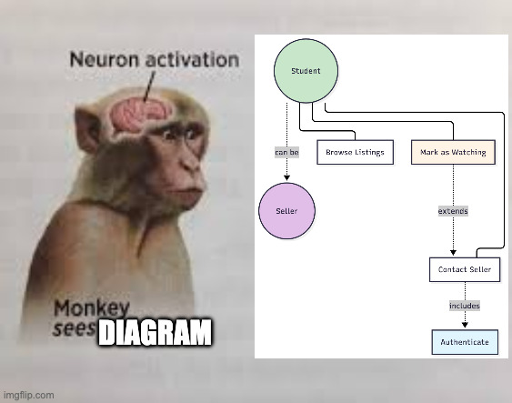

1. **Models help us think, design, and communicate** - they're tools, not deliverables
2. **Different diagrams serve different purposes** - choose the right one for your need
3. **Use Case Diagrams** show WHAT users can do
4. **Class Diagrams** show system STRUCTURE
5. **Sequence Diagrams** show HOW objects interact OVER TIME
6. **Activity Diagrams** show WORKFLOWS and processes
7. **State Machine Diagrams** show how objects CHANGE STATES
8. **Model at the right level** - not too abstract, not too detailed
9. **Keep diagrams updated** - stale diagrams are worse than no diagrams

---

<!-- _footer: "" -->
<!-- _header: "" -->
<!-- _paginate: false -->

<style scoped>
p { text-align: center}
h1 {text-align: center; font-size: 72px}
</style>

# Team Progress Reports 

---

<!-- _class: lead -->
# Thank You!

## Contact Information

- **Email:** ekrem.cetinkaya@yildiz.edu.tr
- **Office Hours:** Tuesday 14:00-16:00 - Room F-B21
- **Book a slot before coming:** [Booking Link](https://calendar.app.google/aBKvBqNAqG12oD2B9)
- **Course Repository:** [GitHub](https://github.com/ekremcet/yzm2021-principles-of-software-engineering)

## Next Class

- **Date:** 11.11.2025
- **Topic:** Software Architecture and Design
- **Reading:** Sommerville Ch. 6
