# Week 7: Software Architecture and Design

## YZM2021 - Software Engineering Principles

**Instructor:** Ekrem Çetinkaya
**Date:** 11.11.2025

---

# Where Are We?

### What We've Covered:

- **Week 1-2:** Software Engineering & Principles
- **Week 3:** Process Models (Waterfall, RUP, Incremental)
- **Week 4:** Agile Methodologies (Scrum, XP, Kanban)
- **Week 5:** Requirements Engineering (FR, NFR, Elicitation, Validation)
- **Week 6:** System Modeling & UML (Use Case, Class, Sequence, Activity, State)

### Today:

- **Week 7:** **Software Architecture and Design**

### Next Week:

- **Week 8:** 📝 **Midterm 1**

---

# Today's Learning Outcomes

By the end of this lecture, you will be able to:

1. **Define** software architecture and distinguish it from design and implementation
2. **Identify** and **apply** common architectural patterns (Layered, MVC, Client-Server, Microservices, Event-Driven)
3. **Describe** the 4+1 architectural views model
4. **Create** component diagrams showing system structure
5. **Create** deployment diagrams showing physical architecture
6. **Analyze** how architecture supports quality attributes (performance, scalability, security)
7. **Apply** architectural design principles to real systems
8. **Recognize** architectural anti-patterns and avoid them

---

# What is Software Architecture?

<div class="columns">

<div>

### Definition:

> "The software architecture of a system is the set of structures needed to reason about the system, which comprise software elements, relations among them, and properties of both."
>
> — **Bass, Clements, Kazman**

### In simpler terms

**Architecture = High-level structure of your software system**

- What are the major components?
- How do they interact?
- What are the key design decisions?
- Why did we make those decisions?

</div>

<div>

### Real-World Analogy

**Building Architecture:**

- Blueprints show rooms, floors, structure
- Foundation, walls, electrical, plumbing
- Big decisions: Steel vs wood frame?
- Hard to change later

**Software Architecture:**

- Components, modules, services
- Databases, APIs, message queues
- Big decisions: Monolith vs microservices?
- Expensive to change later

</div>

</div>

---

# The Architecture Design Process

Architectural design bridges requirements and implementation

<div class="columns">

<div>

### Inputs to Architecture:

1. **Functional Requirements**

   - What the system must do
   - User stories, use cases

2. **Non-Functional Requirements**

   - Performance, scalability, security
   - **NFRs have the biggest impact on architecture choices**

3. **Constraints**
   - Budget, timeline, team skills
   - Technology choices
   - Existing systems

</div>

<div>

### Outputs from Architecture:

1. **Architectural Patterns**

   - Layered, microservices, etc.

2. **Component Structure**

   - Major building blocks
   - Interfaces between them

3. **Deployment Strategy**

   - Where components run
   - How they communicate

4. **Documentation**
   - Diagrams, decisions (ADRs)
   - Trade-offs made

</div>

</div>

---

# Key Architectural Design Questions

### Before designing, answer these questions

<div class="columns">

<div>

### **Pattern & Structure Questions:**

**1. Can we reuse an existing pattern?**

- Is there a proven template for our type of system?
- Example: E-commerce -> Layered + Microservices

**2. What architectural pattern fits best?**

- Monolith, microservices, event-driven?
- Based on team size, scale needs

**3. How will we structure components?**

- Organize by feature? By layer? By service?
- How to break into sub-components?

---

# Key Architectural Design Questions

<div class="columns">

<div>

### **Distribution & Control:**

**4. How will the system be distributed?**

- Single server? Multiple servers? Multi-region?
- How to distribute across processors?

**5. How will components interact?**

- Synchronous (REST)? Asynchronous (events)?
- Who controls the flow?

</div>

<div>

### **Quality & Documentation:**

**6. How to achieve non-functional requirements?**

- Performance needs → caching + CDN
- Scalability needs → horizontal scaling
- Security needs → layered security

**7. How will we evaluate the architecture?**

- Proof of concept? Prototypes?
- Architecture review meetings?
- Performance testing?

**8. How to document decisions?**

- Component diagrams? Deployment diagrams?
- ADRs (Architectural Decision Records)?
- Runbooks for operations?

</div>

---

# Architecture Design Example - CampusPal


| Question                  | CampusPal Answer                                     |
| ------------------------- | ---------------------------------------------------- |
| **Pattern to use**        | Layered (3-tier) - proven for web apps               |
| **Distribution**          | Cloud deployment (AWS) - single region initially     |
| **Component structure**   | Frontend, Backend API, Database - organized by layer |
| **Component interaction** | REST API (synchronous) + Events for notifications    |
| **NFR: Performance**      | Redis caching, CDN for static assets                 |
| **NFR: Scalability**      | Horizontal scaling of API servers, load balancer     |
| **NFR: Security**         | HTTPS, JWT tokens, input validation at API gateway   |
| **Evaluation**            | Load testing, security audit, code review            |
| **Documentation**         | Component diagram, deployment diagram, API docs      |

---

# Why Non-Functional Requirements Drive Architecture

### Architecture is primarily shaped by NFRs, not functional requirements

<div class="columns">

<div>

### Example - Social Media App

**Same Functional Requirements:**

- Users post messages
- Users follow each other
- Feed shows latest posts
- Users can like/comment

**Different NFRs = Different Architecture**

---

# Sample Social Media Architectures

<div class="columns">

<div>

### Scenario A: Small Community (1,000 users)

**NFRs:**

- 100 concurrent users max
- Basic performance acceptable
- Small budget

**Architecture:**

```
Simple Monolith
Web Server + Database
Single VPS ($10/month)
```

</div>

<div>

### Scenario B: Global Scale (100M users)

**NFRs:**

- 10M concurrent users
- Sub-second response time
- 99.99% availability

**Architecture:**

```
Microservices
├─ Post Service (1000+ servers)
├─ Feed Service (5000+ servers)
├─ User Service (500+ servers)
├─ Media Service (CDN)
└─ Distributed Database (sharded)
Multi-region deployment
Cost: $Millions/month
```

</div>

---

# Architecture vs Design vs Implementation

<div class="columns">

<div>

### 🏗️ **Architecture (High-Level)**

**"What are the major components?"**

- System-wide decisions
- Overall structure
- Technology choices
- Patterns and styles
- Cross-cutting concerns

**Example:**

- "We'll use a 3-tier web architecture"
- "Frontend talks to backend via REST API"
- "PostgreSQL for database"

**Stakeholders:** Architects, Tech Leads, Management

</div>

<div>

### 🎨 **Design (Mid-Level)**

**"How do components work internally?"**

- Class structures
- Interfaces and APIs
- Algorithms
- Data structures
- Design patterns

**Example:**

- "User authentication uses Strategy pattern"
- "Event class has title, date, capacity attributes"
- "Repository pattern for data access"

**Stakeholders:** Senior Developers, Team Leads

---

### 💻 **Implementation (Low-Level)**

**"How is it coded?"**

- Actual code
- Variable names
- Function implementation
- Code style
- Specific libraries

**Example:**

```javascript
function createEvent(title, date) {
  // implementation code
}
```

**Stakeholders:** All Developers

</div>

</div>

---

# Architectural Patterns

### What is an Architectural Pattern?

> **A reusable solution to a commonly occurring problem in software architecture**

### Patterns We'll Cover:

1. **Layered (N-Tier)**
2. **MVC** (Model-View-Controller)
3. **Client-Server**
4. **Microservices**
5. **Event-Driven**
6. **Repository**

---

# 1. Layered (N-Tier) Architecture

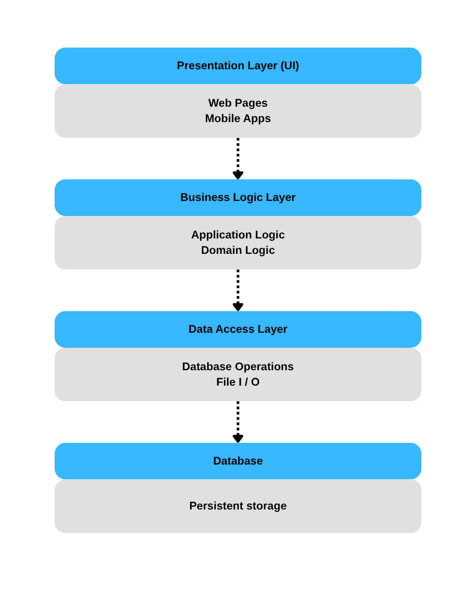

**Layered architecture organizes the system into horizontal layers**, where each layer has a specific responsibility and only communicates with adjacent layers.

**Key Rule:** Each layer only depends on the layer directly below it

**Direction:** Top -> Down (requests flow downward)

### Key Characteristics:

- **Separation of concerns** - each layer has one job
- **Clear boundaries** - well-defined interfaces between layers
- **Independent development** - teams can work on different layers
- **Technology independence** - can change one layer without affecting others

---

# 1. Layered (N-Tier) Architecture


### Common Variations:

- **2-Tier:** Client - Database (simple apps)
- **3-Tier:** Presentation - Business - Data (most common)
- **4-Tier:** Presentation + business + data + database
- **N-Tier:** Multiple layers for complex systems

### Real-World Examples:

- Enterprise applications (SAP, Oracle)
- Traditional web applications
- Banking systems
- E-commerce platforms

---

# Layered Architecture - CampusPal Example

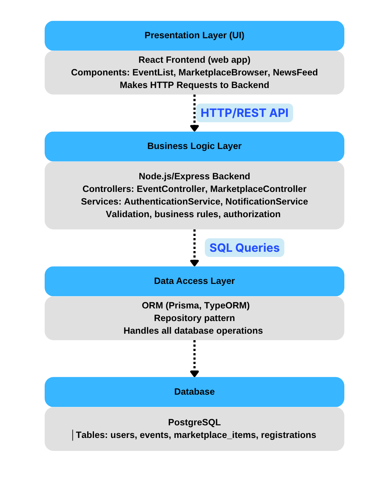

### 3-Tier Implementation

**Presentation Layer:**

- React Frontend
- Components: EventList, Marketplace, NewsFeed
- Makes HTTP requests to backend

**Business Logic Layer:**

- Node.js/Express Backend
- Controllers: EventController, UserController
- Services: AuthService, NotificationService
- Validation, authorization, business rules

**Data Access Layer:**

- ORM (Sequelize/Prisma)

**Database:**

- Tables: users, events, marketplace_items

---

# 2. Model-View-Controller (MVC) Pattern

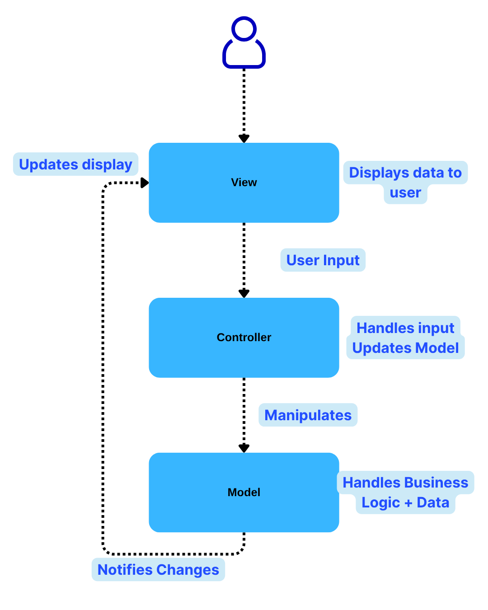

**MVC separates an application into three interconnected components** to separate internal representations of information from how it's presented to the user.

**Separation:** UI (View) - Logic (Controller) - Data (Model)

### Key Characteristics:

- **Model:** Manages data and business logic
- **View:** Renders UI and displays data
- **Controller:** Handles user input, coordinates model and view
- **Decoupling:** Each component can change independently

---

# 2. Model-View-Controller (MVC) Pattern


### Common Variations:

- **MVP (Model-View-Presenter):** Presenter handles ALL UI logic
- **MVVM (Model-View-ViewModel):** Two-way data binding
- **MVT (Model-View-Template):** Django's approach

### Real-World Examples:

- Web frameworks (Django, Rails, Spring MVC)
- Desktop applications (Java Swing, WPF)
- Mobile apps (iOS, Android)

### Benefits:

- Multiple views for same data
- Easier testing (test model separately)
- Parallel development (frontend/backend)

---

# MVC: CampusPal Event Creation Example

<div class="columns-3">

<div>

### Model

```javascript
// MODEL (Event.js) - Data + Business Logic
class Event {
  constructor(title, date, capacity, organizerId) {
    this.title = title;
    this.date = date;
    this.capacity = capacity;
    this.organizerId = organizerId;
    this.attendees = 0;
  }

  isFull() {
    return this.attendees >= this.capacity;
  }

  addAttendee() {
    if (this.isFull()) throw new Error("Event is full");
    this.attendees++;
  }
}
```

</div>

<div>

### Controller

```javascript
// CONTROLLER (EventController.js) - Handles requests
class EventController {
  async createEvent(req, res) {
    const { title, date, capacity } = req.body;
    const event = new Event(title, date, capacity, req.user.id);

    // Validate
    if (!title || !date) {
      return res.status(400).json({ error: "Missing fields" });
    }

    // Save to database
    await eventRepository.save(event);

    // Return to view
    res.json({ success: true, event });
  }
}
```

</div>

<div>

### View

```javascript
// VIEW (CreateEventForm.jsx) - React component
function CreateEventForm() {
  const [title, setTitle] = useState("");
  const [date, setDate] = useState("");

  const handleSubmit = async () => {
    await fetch("/api/events", {
      method: "POST",
      body: JSON.stringify({ title, date }),
    });
  };

  return (
    <form onSubmit={handleSubmit}>
      <input value={title} onChange={(e) => setTitle(e.target.value)} />
      <input
        type="date"
        value={date}
        onChange={(e) => setDate(e.target.value)}
      />
      <button>Create Event</button>
    </form>
  );
}
```

</div>

</div>

---

# 3. Client-Server Architecture

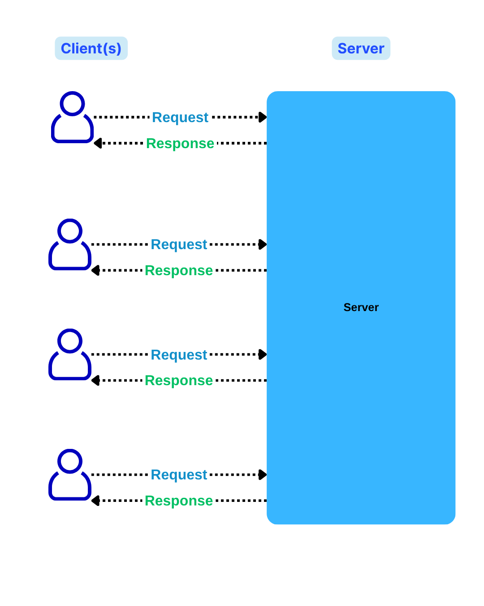

**Client-Server architecture distributes the system into two parts**: clients that request services and servers that provide services. This is one of the most fundamental distributed system patterns.

**Key Idea:** Centralized server provides services to multiple distributed clients

### Key Characteristics:

- **Server:** Centralized, provides services, always running
- **Client:** Requests services, initiates communication
- **Network:** Clients and server communicate over network
- **Scalability:** Add more clients easily, scale server as needed

---

# 3. Client-Server Architecture


### Types:

**2-Tier:**

- Client - Database Server
- Fat client (business logic on client)

**3-Tier:**

- Client - Application Server - Database
- Thin client (business logic on server)

**N-Tier:**

- Multiple application servers
- Load balancers, caches, etc.

### Real-World Examples:

- Email (email client - mail server)
- Banking ATMs (ATM - bank server)
- Mobile apps (app - backend API)

---

# Client-Server - Thin vs Thick Clients


### Thin Client vs Thick Client

**Thin Client (Web Browser):**

- Minimal logic on client
- Server does heavy lifting
- Example: Gmail, Google Docs

**Thick Client (Desktop App):**

- Significant logic on client
- Server mainly for data/sync
- Example: Photoshop, IDEs

---

# Client-Server - CampusPal REST API

```http
# CLIENT (React Frontend) makes requests:

GET /api/events
→ Fetch all events

GET /api/events/123
→ Fetch specific event details

POST /api/events
Body: { "title": "Tech Talk", "date": "2025-11-15", "capacity": 50 }
→ Create new event

PUT /api/events/123
Body: { "capacity": 100 }
→ Update event capacity

DELETE /api/events/123
→ Delete event

POST /api/events/123/rsvp
Body: { "userId": 456 }
→ RSVP to event

# SERVER (Node.js/Express Backend) responds:

200 OK - Success
201 Created - Resource created
400 Bad Request - Invalid data
401 Unauthorized - Not logged in
403 Forbidden - No permission
404 Not Found - Resource doesn't exist
500 Internal Server Error - Server problem
```

---

# Question

### Match the scenario to the best architectural pattern:

| Scenario                                                          | Pattern |
| ----------------------------------------------------------------- | ------- |
| A) Traditional web app with clear UI/Business/Data layers         | ?       |
| B) React app where UI components need to update when data changes | ?       |
| C) Mobile app that fetches data from a backend API                | ?       |

**Choices:** Layered, MVC, Client-Server

---

# Answer

| Scenario                                                          | Pattern           | Why?                                            |
| ----------------------------------------------------------------- | ----------------- | ----------------------------------------------- |
| A) Traditional web app with clear UI/Business/Data layers         | **Layered**       | Clear separation into horizontal layers         |
| B) React app where UI components need to update when data changes | **MVC** (or MVVM) | Separation of model (data) and view (UI)        |
| C) Mobile app that fetches data from a backend API                | **Client-Server** | Distributed system with client and server roles |

**Note:** These patterns can overlap! A web app can be:

- Layered (within the server)
- MVC (for request handling)
- Client-Server (frontend-backend communication)

---

# 4. Microservices Architecture

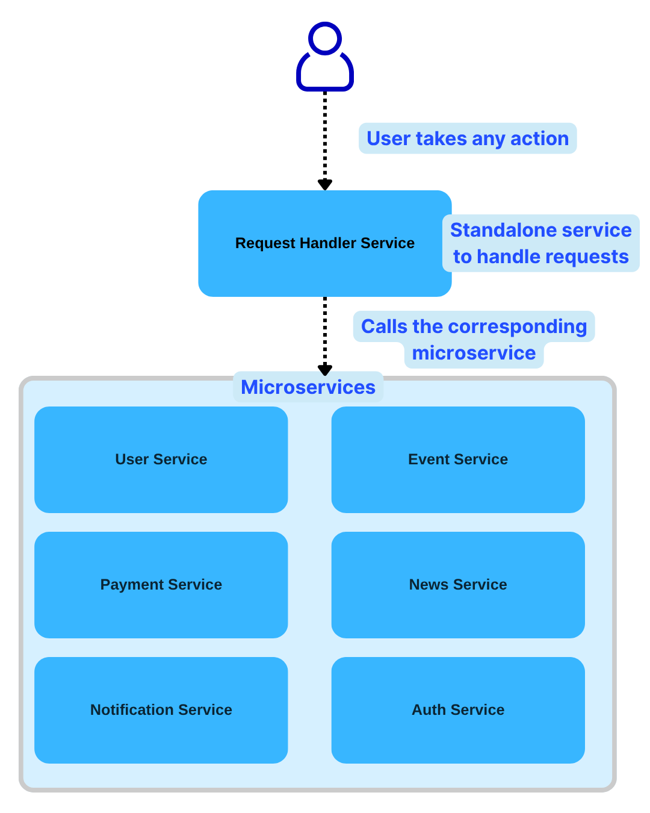

**Microservices architecture structures an application as a collection of small, autonomous services** that are independently deployable and organized around business capabilities.

Instead of ONE big application, multiple small services

**Each service:** Own database, independent deployment, different tech stack possible

### Key Characteristics:

- **Single responsibility:** Each service does one thing well
- **Independent:** Deploy, scale, update separately
- **Decentralized:** Each service owns its data
- **Communication:** Services talk via APIs (REST, gRPC, messaging)
- **Autonomy:** Teams own services end-to-end

---

# 4. Microservices Architecture


### Core Principles:

1. **Organized around business capabilities** (not technical layers)
2. **Products not projects** (teams own services for life)
3. **Smart endpoints, dumb pipes** (intelligence in services)
4. **Decentralized governance** (teams choose tech)
5. **Failure isolation** (one service fails, others continue)

### Real-World Examples:

- Netflix (700+ microservices)
- Amazon (service-oriented since 2002)
- Uber (2000+ microservices)
- Spotify (backend for frontend pattern)

---

### Rule of Thumb - Start with Monolith

**Good advice from Martin Fowler:**

> "Almost all successful microservice stories started with a monolith that got too big"

**The Pattern:**

1. **Start:** Monolith (fast development)
2. **Grow:** App becomes too big
3. **Identify:** Pain points & service boundaries
4. **Extract:** One service at a time
5. **Repeat:** Gradually split more services

### When to Consider Microservices:

- Large team (50+ developers)
- Need independent scaling
- Clear domain boundaries
- Different parts have different requirements

---

# Practice - Monolith vs Microservices

### Scenario: You're building a food delivery app (like Uber Eats)

**Features:**

- User authentication & profiles
- Restaurant listings & menus
- Order placement & tracking
- Payment processing
- Delivery driver matching & routing
- Real-time notifications
- Reviews & ratings

### Questions:

1. How would you split this into microservices?
2. Which services would need to communicate with each other?
3. What challenges might you face?

---

# Answer

<div class="columns">

<div>

### Possible Microservice Architecture:

```
1. User Service (authentication, profiles)
2. Restaurant Service (listings, menus)
3. Order Service (order management, state machine)
4. Payment Service (billing, transactions)
5. Delivery Service (driver matching, routing)
6. Notification Service (emails, push notifications)
7. Review Service (ratings, comments)
```

</div>

<div>

### Communication:

- Order Service → Payment Service (process payment)
- Order Service → Delivery Service (assign driver)
- Order Service → Notification Service (order updates)
- Review Service → Restaurant Service (update ratings)

### Challenges:

- **Consistency:** Order created but payment fails?
- **Latency:** Multiple service calls slow down checkout
- **Testing:** Need all services running
- **Deployment:** Coordinating releases
- **Monitoring:** Track requests across services

</div>

</div>

---

# 5. Event-Driven Architecture

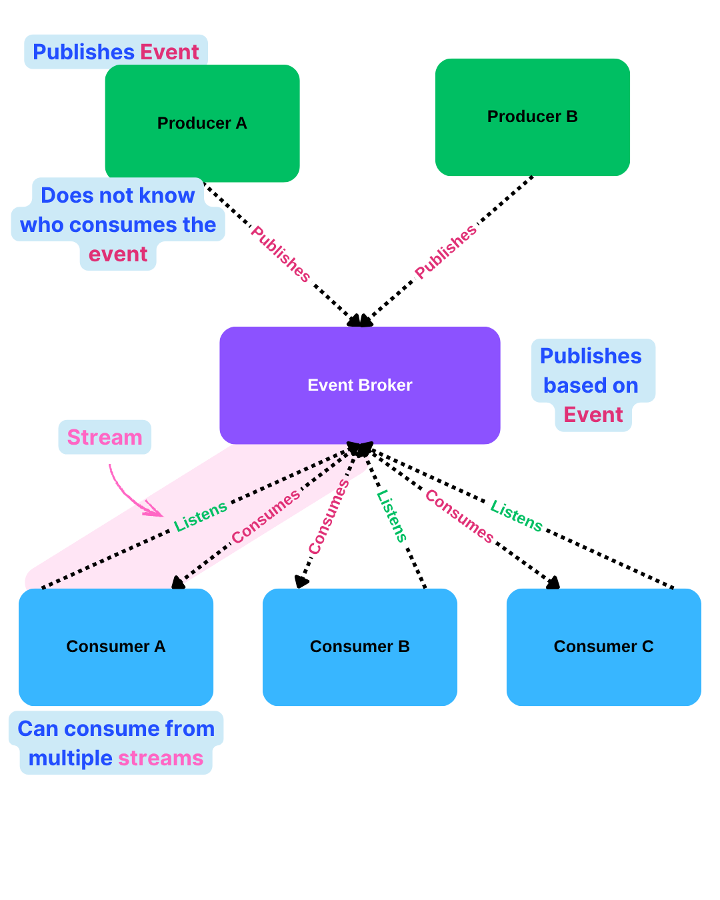

**Event-Driven Architecture (EDA) is a design pattern where components communicate by producing and consuming events** rather than making direct calls to each other. Events represent something that has happened.

**Key Idea:** Producer doesn't know who consumes the event

### Key Characteristics:

- **Asynchronous:** Producer doesn't wait for consumers
- **Loose coupling:** Services don't directly depend on each other
- **Event:** Something that happened (past tense): "OrderCreated", "UserRegistered"
- **Pub-Sub:** Publishers produce events, subscribers consume them
- **Message Broker:** Mediates event distribution (Kafka, RabbitMQ, AWS SNS)

---

# 5. Event-Driven Architecture


**Event-Driven Architecture (EDA) is a design pattern where components communicate by producing and consuming events** rather than making direct calls to each other. Events represent something that has happened.

### Event Types:

1. **Domain Events:** Business events ("OrderPlaced")
2. **Integration Events:** Between systems
3. **System Events:** Technical events ("DatabaseConnected")

### Real-World Examples:

- E-commerce: Order placed - inventory, shipping, email
- Banking: Transaction - fraud check, notification, reporting
- Social media: Post created - feed update, notification, analytics
- IoT: Sensor data - processing, storage, alerts

---

# Event-Driven: Publish-Subscribe Pattern

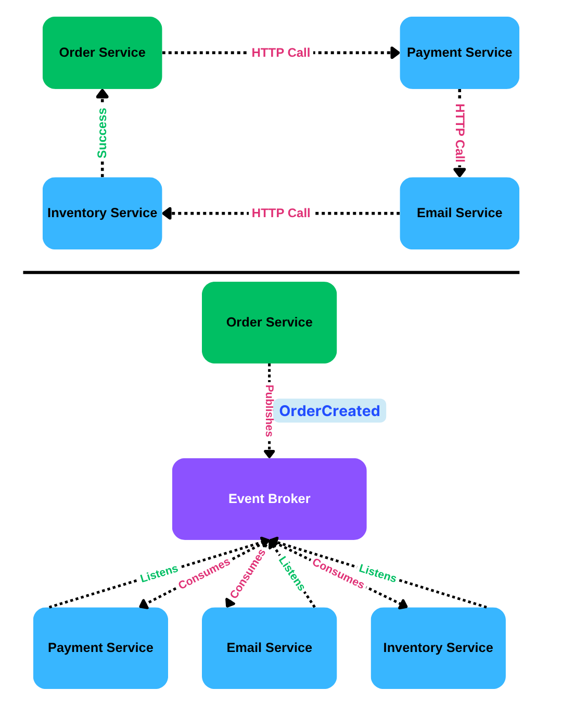

### Traditional (Synchronous):

**Problems:**

- Order Service waits for everything
- If Email Service down, order fails
- Tight coupling

### Event-Driven (Asynchronous):

**Benefits:**

- Order Service doesn't wait
- Services loosely coupled
- Easy to add new subscribers
- Failures isolated

---

# CampusPal Notification System Example

<div class="columns">

<div>

```javascript
// Event: Student RSVPs to event
const eventCreated = {
  type: "EVENT_RSVP_CREATED",
  data: {
    eventId: 123,
    studentId: 456,
    organizerId: 789,
    timestamp: "2025-11-11T10:00:00Z",
  },
};

// PUBLISHER (Event Service)
messageQueue.publish("events", eventCreated);
console.log("RSVP created, event published");
// Service continues immediately (doesn't wait)
```

</div>

<div>

```javascript
// SUBSCRIBERS listen for events:

// 1. Email Service
messageQueue.subscribe("events", (event) => {
  if (event.type === "EVENT_RSVP_CREATED") {
    sendEmailToOrganizer(event.data.organizerId, `New RSVP for your event!`);
  }
});

// 2. Notification Service
messageQueue.subscribe("events", (event) => {
  if (event.type === "EVENT_RSVP_CREATED") {
    sendPushNotification(event.data.organizerId, `Someone joined your event`);
  }
});

// 3. Analytics Service
messageQueue.subscribe("events", (event) => {
  if (event.type === "EVENT_RSVP_CREATED") {
    trackEventPopularity(event.data.eventId);
  }
});

// Easy to add more subscribers without changing Event Service!
```

</div>

</div>

---

# Question - Match the description to the pattern

**A)** UI components separated from business logic and data models

**B)** Services communicate by publishing and subscribing to events

**C)** Components are organized into horizontal tiers (UI, Business, Data)

**D)** Multiple services, each with own database, deployed independently

**Patterns:** Layered, MVC, Client-Server, Microservices, Event-Driven, Repository

---

# Answer - Match the description to the pattern

- **A)** MVC (Model-View-Controller)
- **B)** Event-Driven
- **C)** Layered (N-Tier)
- **D)** Microservices

---

# Practice

### Scenario: You're designing a hospital patient management system

**Given:**

- Doctors record patient information
- Nurses update vital signs
- Pharmacy needs prescription data
- Lab results integration required
- Must be available 24/7 (lives at stake!)
- Sensitive medical data (HIPAA compliance)

### Answer the key questions

1. What architectural pattern would you choose? Why?
2. How would you ensure 24/7 availability?
3. How would you handle security (sensitive data)?
4. How would components interact (sync/async)?
5. How would you document your decisions?

---

# Answer

<div class="columns">

<div>

**Pattern:** Layered + Microservices hybrid

- Core records: Monolith (consistency crucial)
- Lab integration: Separate service (external)
- Reporting: Separate service (different scale)

**Availability:**

- Multi-server deployment with failover
- Database replication (primary + standby)
- 24/7 monitoring and on-call

**Interaction:**

- Synchronous for critical operations (save patient data)
- Asynchronous for notifications and reports

</div>

<div>

**Security:**

- Encryption at rest and in transit
- Role-based access control
- Audit logging for all access
- Isolated network zones

**Documentation:**

- Security architecture document (for compliance)
- Component diagram showing data flow
- Deployment diagram showing redundancy
- ADRs for major decisions

</div>

</div>

---

<!-- _footer: "" -->
<!-- _header: "" -->
<!-- _paginate: false -->

<style scoped>
p { text-align: center}
h1 {text-align: center; font-size: 72px}
</style>

# Architectural Views

---

# What are Architectural Views 

It is impossible to represent all relevant information about a system’s architecture in a single architectural model, as each model only shows one view or perspective of the system. It might show how a system is decomposed into modules, how the run-time
processes interact, or the different ways in which system components are distributed across a network


### Key Questions

1. What views or perspectives are useful when designing and documenting a system’s architecture?
2. What notations should be used for describing architectural models?

---

# Architectural Views: The 4+1 Model

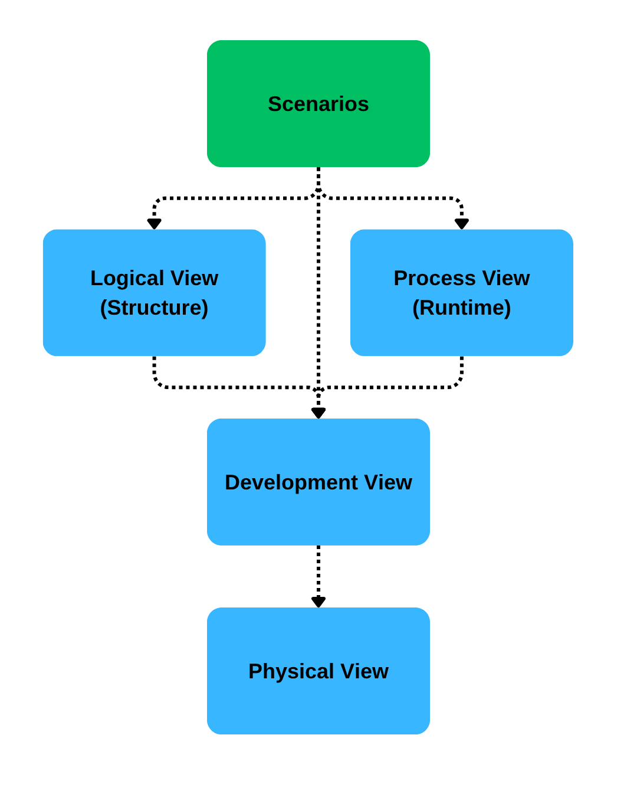

> Different stakeholders need different views of architecture
> Proposed by Philippe Kruchten (1995)


### Why Multiple Views?

**Different people care about different things:**

- **Developers:** Code organization
- **Architects:** System structure
- **Operations:** Deployment
- **Users:** Functionality
- **Testers:** Runtime behavior

**Each view answers different questions**

### The "+1" (Scenarios):

- Ties all views together
- Use cases show how views work together
- Validates architectural decisions


---

# Architectural Views: The 4+1 Model


<div class="columns">

<div>

### **Logical View** (Structure)

**"What does the system do?"**

- **Focus:** Functionality
- **Diagrams:** Class diagrams, object diagrams
- **Shows:** Classes, interfaces, relationships
- **Stakeholders:** Developers, architects

**CampusPal Example:**

```
User ←──── Student
           ├──── Registration
           └──── Event
```

---

# Architectural Views: The 4+1 Model


### **Process View** (Runtime)

**"How does it behave at runtime?"**

- **Focus:** Dynamic behavior, concurrency
- **Diagrams:** Sequence, activity diagrams
- **Shows:** Object interactions, message flow
- **Stakeholders:** Integrators, testers

**CampusPal Example:**

- RSVP sequence diagram
- User authentication flow

---

# Architectural Views: The 4+1 Model


### **Development View** (Code Organization)

**"How is the code organized?"**

- **Focus:** Module organization
- **Diagrams:** Component, package diagrams
- **Shows:** Components, dependencies
- **Stakeholders:** Developers, managers

**CampusPal Example:**

```
frontend/
  components/
  pages/
backend/
  controllers/
  services/
  models/
```

---

# Architectural Views: The 4+1 Model


### **Physical View** (Deployment)

**"Where does it run?"**

- **Focus:** Hardware, infrastructure
- **Diagrams:** Deployment diagrams
- **Shows:** Servers, networks, devices
- **Stakeholders:** System engineers, ops

**CampusPal Example:**

- Web Server (AWS EC2)
- Database Server (RDS)
- Load Balancer

</div>

</div>

---

# 4+1 Views: CampusPal Example

### How all views work together

**Scenarios (Use Case Diagram):**

```
Student → RSVP to Event (ties everything together)
```

<div class="columns">

<div>

**1. Logical View (Week 6 - Class Diagram):**

```
Event has title, date, capacity
Student can RSVP to Event
Registration links Student and Event
```

**2. Process View (Week 6 - Sequence Diagram):**

```
Student → UI → EventController → EventService → Database
Check capacity → Create registration → Send confirmation
```

</div>

<div>

**3. Development View (Component Diagram - Today):**

```
Frontend Component → Backend API Component → Database Component
React App → Express Server → PostgreSQL
```

**4. Physical View (Deployment Diagram - Today):**

```
User's Browser → AWS Load Balancer → EC2 Instance → RDS Database
```

</div>

</div>

---

# Component Diagrams

### Showing the major building blocks and their relationships

<div class="columns">

<div>

### What is a Component?

> **A modular, deployable, and replaceable part of a system that encapsulates implementation and exposes a set of interfaces**

**Think of it as:**

- A module or package
- A microservice
- A library
- A subsystem

</div>

<div>

### Component with Interfaces:

```
         ┌─────────────┐
         │   Client    │
         └──────┬──────┘
                │ uses
                ↓
         ┌─────────────┐
    ◄──○ │   Service   │
         │             │
         └──────┬──────┘
                │ requires
                ↓
         ┌─────────────┐
    ○──► │  Database   │
         └─────────────┘
```

**Lollipop (○──):** Provides interface (what it offers)
**Socket (──○):** Requires interface (what it needs)

</div>

</div>

---

# Component Diagram -CampusPal Architecture


<style scoped>
p {text-align: center; font-size: 24px; font-style: italic}
</style>

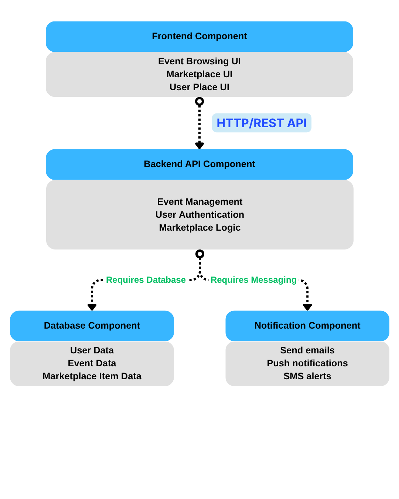

---

# Practice - Draw Component Diagram

### Scenario: Design components for an Online Learning Platform

**Features:**

- Video course catalog
- User enrollment & progress tracking
- Video streaming
- Quiz/assessment system
- Discussion forums
- Payment processing for courses
- Certificates generation

### Task:

1. Identify the major components (5-7 components)
2. What interfaces do they provide?
3. What are the dependencies between them?

---

<div class="columns">

<div>

### Components:

```
┌──────────────┐
│   Frontend   │
│     App      │
└──────┬───────┘
       │
       ↓
┌────────────────────────────────────┐
│        Backend API                 │
├─────┬────────┬──────────┬──────────┤
│Course│Enroll  │Quiz      │Forum    │
│Mgmt  │Service │Service   │Service  │
└──┬───┴────┬───┴────┬─────┴────┬────┘
   │        │        │          │
   ↓        ↓        ↓          ↓
┌────────────────────────────────────┐
│        Database                    │
└────────────────────────────────────┘

External Components:
┌──────────────┐  ┌──────────────┐  ┌──────────────┐
│Video         │  │Payment       │  │Certificate   │
│Streaming     │  │Gateway       │  │Generator     │
│(AWS S3/CDN)  │  │(Stripe)      │  │(PDF Service) │
└──────────────┘  └──────────────┘  └──────────────┘
```

</div>

<div>

### Dependencies:

- Frontend requires Backend API
- Backend requires Database
- Course Mgmt requires Video Streaming
- Enrollment requires Payment Gateway
- Quiz Service requires Certificate Generator

</div>

</div>

---

# Deployment Diagrams

> **Shows the hardware and software environment where the system is deployed**

### Key Elements:

**Nodes:**

- Physical devices (servers, computers, phones)
- Execution environments (containers, VMs)
- Shown as 3D boxes

**Artifacts:**

- Deployable units (JAR, WAR, EXE, Docker image)
- Files, databases, components

**Communication Paths:**

- How nodes connect (HTTP, TCP/IP, etc.)

---

# Deployment Diagram - Simple CampusPal


<style scoped>
p {text-align: center; font-size: 24px; font-style: italic}
</style>

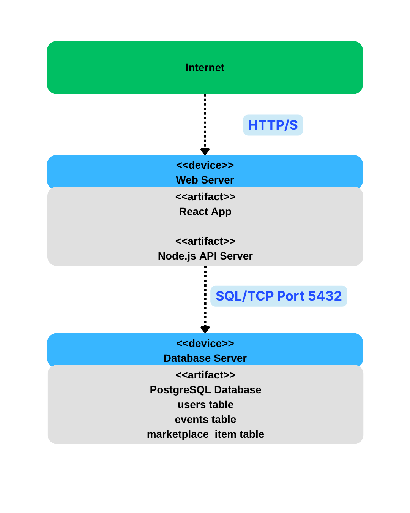

---

# Practice - Design a Deployment Diagram

### Scenario: E-commerce website with high traffic 

<div class="columns">

<div>

**Requirements:**

- Handle 100,000 concurrent users
- 99.99% uptime required
- Global customer base (US, Europe, Asia)
- Secure payment processing
- Fast page loads (< 2 seconds)

**Components:**

- Web frontend
- API backend
- Product database
- User session storage
- Image/video assets
- Payment gateway (external)

</div>

<div>

### Questions:

1. How many servers do you need?
2. Where should you deploy (single region vs multi-region)?
3. What about database redundancy?
4. How do you handle static assets (images)?

</div>
</div>

---

<div class="columns">

<div>

```
┌──────────────────────────────────────────────────────────────────┐
│                    GLOBAL CDN (CloudFlare/CloudFront)            │
│  - Static assets (images, CSS, JS)                               │
│  - Edge caching in multiple regions                              │
└────────────────────────────────┬──────────────────────────────── ┘
                                 ↓
┌────────────────────────────────────────────────────────────────── ┐
|                     LOAD BALANCER (Multi-Region)                  │
│  - Geographic routing                                             │
│  - Health checks                                                  │
└──────────┬────────────────────────┬───────────────────────────────┘
           │                        │
    ┌──────┴──────┐          ┌──────┴──────┐
    │  US Region  │          │  EU Region  │
    ├─────────────┤          ├─────────────┤
    │ 5x API      │          │ 3x API      │
    │ Servers     │          │ Servers     │
    │ (Auto-scale)│          │ (Auto-scale)│
    └──────┬──────┘          └──────┬──────┘
           │                        │
           └───────────┬────────────┘
                       ↓
         ┌──────────────────────────┐
         │  Primary Database (US)   │
         │  + Read Replicas         │
         │  + Automatic Failover    │
         └──────────────────────────┘

┌─────────────────┐        ┌──────────────────┐
│ Redis Cache     │        │ Payment Gateway  │
│ (Session Store) │        │ (Stripe/External)│
└─────────────────┘        └──────────────────┘
```

</div>

<div>

**Key Decisions:**

- **CDN:** Serve static assets from edge locations worldwide
- **Multi-region:** API servers in US and EU for low latency
- **Auto-scaling:** Add servers automatically during traffic spikes
- **Database:** Primary in US, read replicas in other regions
- **Redis:** Fast session storage and caching
- **External payment:** PCI compliance handled by Stripe

</div>

</div>

---

# Quality Attributes in Architecture

<div class="columns">

<div>

### What are Quality Attributes?

**From Week 5:** Non-functional requirements

- Performance
- Scalability
- Availability
- Security
- Maintainability
- Testability
- Usability

**Architecture significantly impacts these!**

</div>

<div>

### Example:

**NFR:** System should handle 10,000 concurrent users

**Architectural Decisions:**

- Use load balancer
- Horizontal scaling
- Caching layer
- Database read replicas

</div>

<div>

---

# Architecture Trade-offs

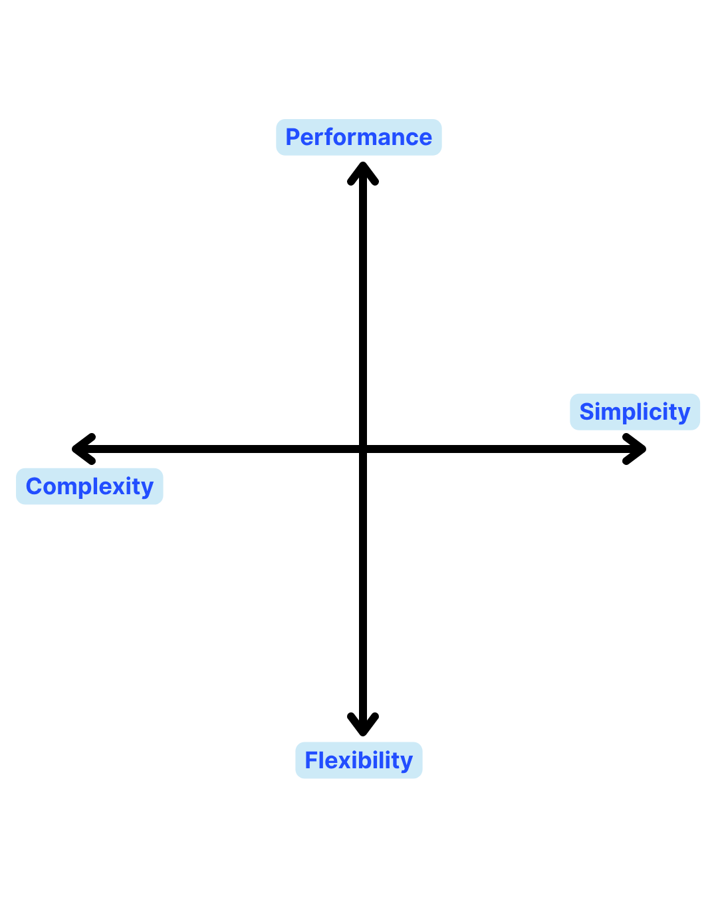

- **Performance vs Maintainability**
  - Highly optimized code often complex
- **Security vs Usability**
  - More authentication steps = more secure but less convenient
- **Cost vs Availability**
  - 99.99% uptime expensive (redundancy, monitoring)

Make conscious trade-offs based on priorities

---

# Architecture Trade-offs

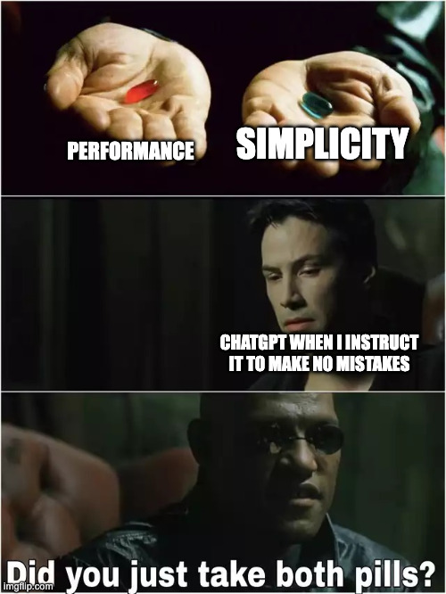

- **Performance vs Maintainability**
  - Highly optimized code often complex
- **Security vs Usability**
  - More authentication steps = more secure but less convenient
- **Cost vs Availability**
  - 99.99% uptime expensive (redundancy, monitoring)

Make conscious trade-offs based on priorities

---

# Question - Quality Attributes

### Match the architectural decision to the quality attribute it supports:

| Decision                                               | Quality Attribute |
| ------------------------------------------------------ | ----------------- |
| A) Adding a Redis caching layer                        | ?                 |
| B) Using HTTPS instead of HTTP                         | ?                 |
| C) Deploying to multiple AWS availability zones        | ?                 |
| D) Writing unit tests for all services                 | ?                 |
| E) Auto-scaling based on CPU usage                     | ?                 |
| F) Separating into microservices with clear interfaces | ?                 |

**Choices:** Performance, Security, Availability, Testability, Scalability, Maintainability

---

# Answer

| Decision                                               | Quality Attribute   | Why?                         |
| ------------------------------------------------------ | ------------------- | ---------------------------- |
| A) Adding a Redis caching layer                        | **Performance**     | Faster data retrieval        |
| B) Using HTTPS instead of HTTP                         | **Security**        | Encrypted communication      |
| C) Deploying to multiple AWS availability zones        | **Availability**    | Redundancy, failover         |
| D) Writing unit tests for all services                 | **Testability**     | Easier to verify correctness |
| E) Auto-scaling based on CPU usage                     | **Scalability**     | Handle increased load        |
| F) Separating into microservices with clear interfaces | **Maintainability** | Easier to understand, modify |

**Note:** Some decisions support multiple quality attributes!

- Microservices also improve **Scalability** (scale services independently)
- Caching also improves **Scalability** (reduces database load)

---

# Architectural Design Principles

<div class="columns">

<div>

### 1. Separation of Concerns

**Each component has ONE clear responsibility**

```
✅ :
- AuthService: handles authentication
- EventService: manages events
- EmailService: sends emails

❌ :
- EventService that also sends emails,
  handles authentication, processes payments
```

---

### 2. Single Responsibility Principle

**At architecture level:**

Each service/component should have one reason to change

```
✅ NotificationService changes when:
  - Notification requirements change

❌ UserService that sends emails changes when:
  - User requirements change, OR
  - Email requirements change  (two reasons!)
```

---

### 3. DRY (Don't Repeat Yourself)

**At architecture level:**

Share common functionality through libraries/services

```
✅ AuthenticationService used by all
❌ Each service implements own auth
```


### 4. Loose Coupling, High Cohesion

**Loose Coupling:** Components don't depend heavily on each other

```
✅ Services communicate via well-defined APIs
❌ Services directly access each other's databases
```

**High Cohesion:** Related functionality grouped together

```
✅ All event-related logic in EventService
❌ Event logic scattered across multiple services
```

---

### 5. API-First Design

**Design APIs before implementation**

```
1. Define API contract (OpenAPI/Swagger)
2. Frontend and Backend teams work in parallel
3. Mock APIs for testing
4. Implement actual logic
```

**Benefits:**

- Clear contracts
- Parallel development
- Better testing

---

### 6. Design for Failure

**Assume things will fail**

```
- Network timeouts: Retry with backoff
- Service down: Circuit breaker
- Database slow: Use cache/stale data
- Server crash: Auto-restart, failover
```

**"Hope for the best, plan for the worst"**

</div>

</div>

---

# Architectural Decision Records (ADRs)

<div class="columns">

<div>

### What is an ADR?

> **A document that captures an important architectural decision along with its context and consequences**

### Why Use ADRs?

**Remember context** - why did we choose X?
**Onboard new developers** - understand history
**Avoid revisiting** - "we tried that, here's why it didn't work"
**Track evolution** - how architecture changed over time

</div>

<div>

### ADR Template:

```markdown
# ADR-001: Use PostgreSQL for Database

## Status

Accepted

## Context

We need a database for CampusPal...
(describe situation, constraints, requirements)

## Decision

We will use PostgreSQL as our primary database

## Consequences

Positive: Rich query capabilities

Negative: Harder to scale horizontally than NoSQL
```

</div>

</div>

---

# Example - CampusPal ADR

<div class="columns">

<div>

```markdown
# ADR-002: Start with Monolith Architecture

## Status

Accepted (2025-11-01)

## Context

- Small team (4 developers)
- MVP stage, features changing rapidly
- Need to launch quickly
- Limited DevOps experience
- Unclear service boundaries

## Decision

We will build CampusPal as a monolithic
application initially, with clear module
separation to enable future splitting.

```

</div>

<div>

```markdown
## Consequences

**Positive:**

- Faster development (no distributed systems complexity)
- Easier debugging
- Simple deployment
- One codebase to manage

**Negative:**

- All features deployed together
- Can't scale parts independently
- Potential for tight coupling if not careful

**Mitigation:**

- Organize code into clear modules
- Use dependency injection
- Write tests for each module
- Plan migration to microservices if needed

## Notes

We will revisit this decision when clear performance bottlenecks emerge
```

</div>

</div>

---

# Key Takeaways

### What we learned today:

1. **Architecture** = High-level structure, different from design/implementation
2. **Architectural Patterns:**

   - Layered (N-Tier)
   - MVC (Model-View-Controller)
   - Client-Server
   - Microservices
   - Event-Driven

3. **4+1 Architectural Views:** Different stakeholders need different perspectives
4. **Component Diagrams:** Show major building blocks and dependencies
5. **Deployment Diagrams:** Show physical architecture and infrastructure
6. **Quality Attributes:** Architecture directly impacts performance, scalability, security, etc.
7. **Design Principles:** Separation of concerns, loose coupling, design for failure

---

# Prepare for Midterm

### Week 8 (Next Week): Midterm 1

**Topics Covered:**

- Week 1-2: Software Engineering Principles (DRY, KISS, SOLID, etc.)
- Week 3: Process Models (Waterfall, RUP, Incremental, Agile)
- Week 4: Agile Methodologies (Scrum, XP, Kanban)
- Week 5: Requirements Engineering (FR, NFR, Elicitation, SRS)
- Week 6: UML Diagrams (Use Case, Class, Sequence, Activity, State)
- **Week 7: Software Architecture (Today!)**

### Study Tips:

1. **Review all slides** - focus on key concepts
2. **Understand diagrams** - be able to read and draw them
3. **Practice problems** - use the in-class exercises
4. **Real-world examples** - understand when to use what
5. **Connect concepts** - how do requirements - design - architecture?

---


<!-- _class: lead -->
# Thank You!

## Contact Information

- **Email:** ekrem.cetinkaya@yildiz.edu.tr
- **Office Hours:** Tuesday 14:00-16:00 - Room F-B21
- **Book a slot before coming:** [Booking Link](https://calendar.app.google/aBKvBqNAqG12oD2B9)
- **Course Repository:** [GitHub](https://github.com/ekremcet/yzm2021-principles-of-software-engineering)

## Next Class

- **Date:** 18.11.2025
- **Topic:** Midterm 1 
