# Week 9: Detailed Design and Implementation

## YZM2021 - Software Engineering Principles

**Instructor:** Ekrem Çetinkaya
**Date:** 25.11.2025

---

# Where Are We?

### What We've Covered:

- **Week 1-2:** Software Engineering & Principles (SOLID, DRY, KISS)
- **Week 3:** Process Models (Waterfall, RUP, Incremental)
- **Week 4:** Agile Methodologies (Scrum, XP, Kanban)
- **Week 5:** Requirements Engineering (Functional/Non-Functional, Elicitation)
- **Week 6:** System Modeling & UML (Use Case, Class, Sequence Diagrams)
- **Week 7:** Software Architecture (Patterns, Views, Components, Deployment)
- **Week 8:** 📝 **Midterm 1** 

### Today:

- **Week 9: Detailed Design and Implementation**

---

# Midterm 1 Grades Are Out

### Average: 56,2
### Maximum: 93

### Average Points per Question
* Q1: 2.7 / 5
* Q2: 4.3 / 5
* Q3: 3.1 / 5
* Q4: 9.7 / 15
* Q5: 6.7 / 15
* Q6: 5.1 / 15
* Q7: 24.5 / 40

---

<!-- _footer: "" -->
<!-- _header: "" -->
<!-- _paginate: false -->
<style scoped>
p {text-align: center; font-size: 24px; font-style: italic}
</style>


---

<!-- _footer: "" -->
<!-- _header: "" -->
<!-- _paginate: false -->

<style scoped>
p {text-align: center; font-size: 24px; font-style: italic}
</style>


---

# Today's Learning Outcomes

By the end of this lecture, you will be able to:

1. **Distinguish** between architectural design and detailed design
2. **Identify** and **apply** the most common design patterns from the Gang of Four catalog
3. **Recognize** when a specific pattern solves a design problem
4. **Implement** design patterns in code (JavaScript/TypeScript, Python)
5. **Combine** multiple patterns to solve complex design challenges
6. **Evaluate** trade-offs and avoid over-engineering with patterns
7. **Refactor** existing code to use appropriate design patterns
8. **Document** pattern usage in Software Design Document

---


# Architecture vs Detailed Design

<div class="columns">

<div>

### Architectural Design

**Focus:** System structure and high-level organization

**Questions:**
- What are the major components?
- How do components communicate?
- Where does the system run? (deployment)
- What patterns organize the system?
- How do we achieve NFRs? (scalability, security)

**Artifacts:**
- Component diagrams
- Deployment diagrams
- Architecture decision records

**Scope:** Entire system

</div>

<div>

### Detailed Design

**Focus:** Internal structure of individual components

**Questions:**
- How are classes organized within a component?
- What design patterns solve specific problems?
- How do objects collaborate?
- What are the responsibilities of each class?
- How do we make code flexible and maintainable?

**Artifacts:**
- Detailed class diagrams
- Design pattern documentation
- Interface specifications

**Scope:** Individual components, classes, modules

</div>

</div>

---

# Architecture vs Detailed Design

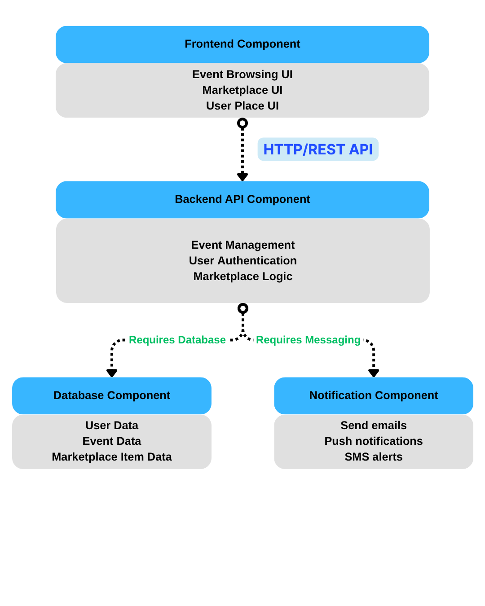

**Architecture** decides **what** components exist and **how** they interact.
Detailed Design decides how each component is implemented internally.

---

# Architecture vs Detailed Design

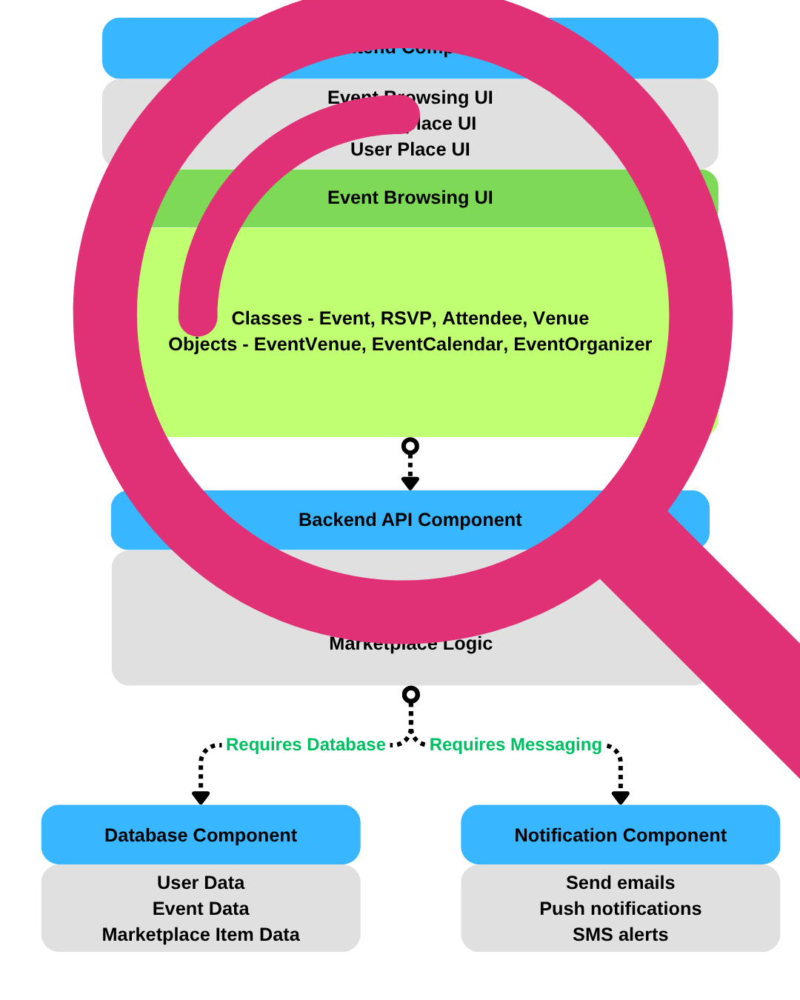

Architecture decides what components exist and how they interact.
**Detailed Design** decides **how** each component is implemented internally.

---

# Object-Oriented Design using the UML

An **object-oriented system** is made up of interacting objects that maintain their own **local state** and provide **operations** on that state.

- The representation of the state is **private** and cannot be accessed directly from outside the object.
- **Object-oriented design processes** involve designing object classes and the relationships between these classes.
- These classes define the objects in the system and their interactions.
- When the design is realized as an executing program, the objects are created dynamically from these class definitions.

---

# Why Object-Oriented Design?

**Object-oriented systems are easier to change** than systems developed using functional approaches.

- Objects include both data and operations to manipulate that data (stand-alone entities).
- Changing the implementation of an object or adding services should not affect other system objects.
- **Clear mapping** between real-world entities (such as hardware components) and their controlling objects.
- This improves the **understandability**, and hence the **maintainability**, of the design.

---

# The Object-Oriented Design Process

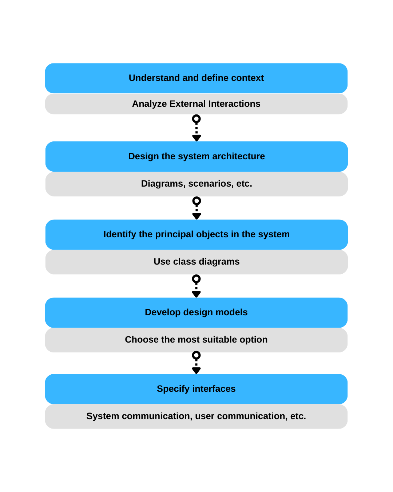

To develop a system design from concept to detailed, object-oriented design:

1. **Understand and define the context** and the external interactions with the system.
2. **Design the system architecture**.
3. **Identify the principal objects** in the system.
4. **Develop design models**.
5. **Specify interfaces**.

---

# The Object-Oriented Design Process

Design is **not** a clear-cut, sequential process.

- You develop a design by getting ideas, proposing solutions, and refining these solutions as information becomes available
- You inevitably have to **backtrack and retry** when problems arise
- Sometimes you explore options in detail; at other times you ignore details until late in the process
- All of the design activities are **interleaved** and influence each other

---

# Example: CampusPal Event Management

We will illustrate the need for detailed design using our class project, **CampusPal**.


- **CampusPal** is a campus community platform.
- It handles **Events**, **Marketplace**, and **Social Feeds**.
- Let's focus on the **Event Management** module.

**The Challenge:** How do we design the internal software objects to handle event creation, registration, and notifications reliably and flexibly?

---

# Step 1: System Context and Interactions

### Understanding the Boundaries

**Goal:** Understand relationships between the software and its external environment.

<div class="columns">

<div>

**Why it's important:**
- Decides how to provide required functionality.
- Structures communication with the environment.
- Establishes system boundaries (what's IN vs. what's OUT).

**Outcome:**
- **System Context Diagram:** Shows the system as a whole and its external interfaces.

</div>

<div>

<!-- TODO: VISUAL Context Diagram - CampusPal surrounded by Actors and External Systems -->

**CampusPal Context:**
- **Users:** Students, Faculty, Admins
- **External Systems:** Google Maps API, Payment Gateway, University Auth System

</div>

</div>

---

# Step 2: Architectural Design

### Structuring the System

**Goal:** Design the system architecture based on interactions and architectural principles.

<div class="columns">

<div>

**Process:**
- Use context interactions as a basis.
- Apply architectural patterns (e.g., Layered, MVC).
- Incorporate domain knowledge.

**Outcome:**
- **Component Diagram:** Shows main modules.
- **Deployment Diagram:** Shows physical hardware/nodes.

</div>

<div>

<!-- TODO: VISUAL Block Diagram - Layered Architecture of CampusPal -->

**CampusPal Architecture:**
- **Web/Mobile App:** Presentation Layer
- **API Server:** Business Logic Layer
- **Database:** Data Persistence Layer

</div>

</div>

---

# Step 3: Object Class Identification

### Finding the Objects

**Goal:** Identify essential objects/classes from requirements and use cases.

<div class="columns">

<div>

**Approaches:**
- **Grammatical Analysis:** Look for nouns (objects) and verbs (operations) in requirements.
- **Tangible Things:** Events, Venues, Users.
- **Events/Interactions:** Registration, Notification.

**Outcome:**
- **Use Case Diagram:** Identifies actors and major functions.
- **Initial Class List:** Nouns extracted from stories.

</div>

<div>

<!-- TODO: VISUAL Concept - Noun Extraction highlights from a User Story text -->

**CampusPal Objects:**
- `Event` (The core entity)
- `User` (Student/Faculty)
- `Registration` (Link between User and Event)
- `Venue` (Location)

</div>

</div>

---

# Step 4: Design Models

### The Bridge to Implementation

**Goal:** Show objects/classes and their relationships in detail.

<div class="columns">

<div>

**Types of Models:**
- **Structural:** Class diagrams (static relationships).
- **Dynamic:** Sequence/State diagrams (interactions/states).

**Outcome:**
- **Detailed Class Diagram:** Attributes, methods, relationships.
- **Sequence Diagram:** Time-ordered interactions.
- **State Diagram:** Lifecycle of objects.

</div>

<div>

**CampusPal Design Model:**
- **Structural:** `Event` has a One-to-Many relationship with `Registration`.
- **Dynamic:** Sequence of `User` -> `EventController.register()` -> `RegistrationService`.

<!-- TODO: VISUAL UML - Simple Class Diagram linking Event, User, and Registration -->

</div>

</div>

---

# Step 5: Interface Specification

### Defining Contracts

**Goal:** Specify interfaces between components to allow parallel development.

<div class="columns">

<div>

**Why specify interfaces?**
- Objects/Subsystems can be designed independently.
- Hides implementation details.
- Developers can code against the interface contract.

</div>

<div>

**CampusPal Example:**
`INotificationService` interface:
```typescript
interface INotificationService {
  send(userId: string, msg: string): Promise<void>;
}
```

*Team A builds the Event Logic using this interface.*
*Team B implements `EmailNotificationService` later.*

</div>

</div>

---

# From Concept to Code

We will apply **Design Patterns** to solve specific design challenges within **CampusPal**

### Why Design Patterns?
When moving from Architecture (High Level) to Detailed Design (Low Level), we encounter recurring problems:
- *"How do I create different types of events?"*
- *"How do I notify the UI when data changes?"*
- *"How do I support multiple payment methods?"*

**Design Patterns** provide the standard answers to these questions.

---


<!-- _footer: "" -->
<!-- _header: "" -->
<!-- _paginate: false -->

<style scoped>
p { text-align: center}
h1 {text-align: center; font-size: 72px}
</style>

# Design Patterns


---


# What Are Design Patterns?


> **A design pattern is a reusable solution to a commonly occurring problem in software design.**

Design patterns are **templates** - not finished code, but proven approaches you can adapt to your specific situation.

### Key Characteristics:

- **Proven:** Battle-tested in real-world projects
- **Reusable:** Apply to many different contexts
- **Language-independent:** Concepts work in any OOP language
- **Named:** Common vocabulary (e.g., "use Observer pattern")
- **Documented:** Structure, participants, consequences

### What Patterns Are NOT:

**Not** libraries or frameworks you import
**Not** finished code you copy-paste
**Not** algorithms (sorting, searching)
**Not** always the best solution

---

# A Brief History - The Gang of Four

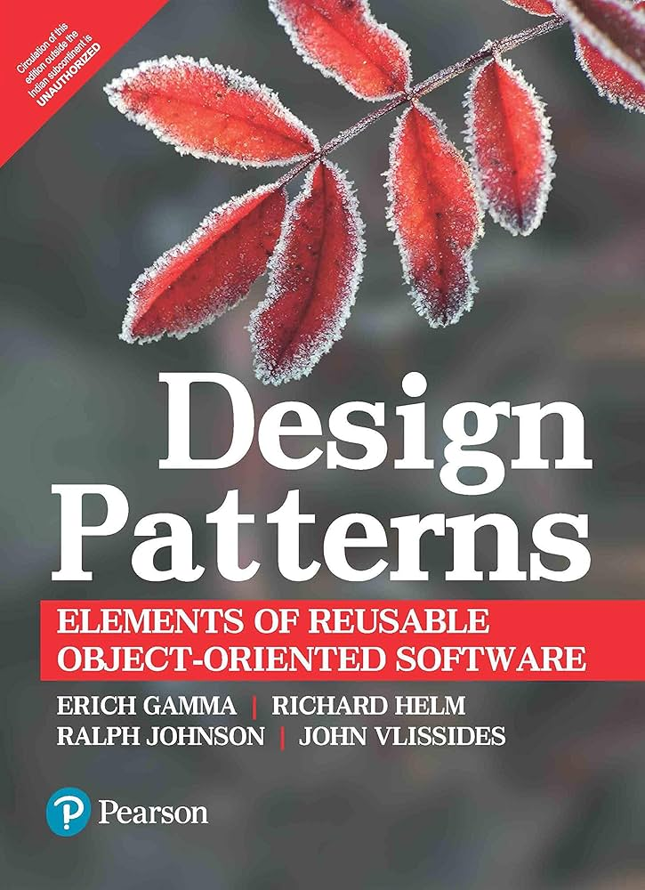

### The Book That Started It All

**"Design Patterns: Elements of Reusable Object-Oriented Software"**

**Authors / Gang of Four:**
- Erich Gamma
- Richard Helm
- Ralph Johnson
- John Vlissides

**Published:** 1994

Created a common language for software designers

Defined **23 classic patterns** and organized into three categories:
- **Creational** (5 patterns)
- **Structural** (7 patterns)
- **Behavioral** (11 patterns)

---

# Why Patterns Matter

**1. Common Communication**
- Better than explaining the entire approach

**2. Proven Solutions**
- Patterns solve real problems

**3. Best Practices**
- Patterns embody good OO design principles

**4. Flexibility**
- Patterns make code easier to change

**5. Career Skill**
- Industry standard knowledge

---

# The Three Categories of Patterns

<!-- TODO: VISUAL Taxonomy - Tree Diagram: Design Patterns > Creational, Structural, Behavioral > Specific Patterns -->

<div class="columns-3">

<div>

### Creational Patterns

**Problem:** How do we create objects?

**Focus:** Object instantiation mechanisms

**Patterns We'll Cover:**
1. **Singleton**
2. **Factory Method**
3. **Abstract Factory**
4. **Builder**
5. **Prototype**

**Goal:** Make object creation flexible and decoupled

</div>

<div>

### Structural Patterns

**Problem:** How do we compose objects?

**Focus:** Relationships between entities

**Patterns We'll Cover:**
1. **Adapter**
2. **Decorator**
3. **Facade**
4. **Proxy**

**Goal:** Ensure flexibility in how objects work together

</div>

<div>

### Behavioral Patterns

**Problem:** How do objects communicate?

**Focus:** Responsibilities and interactions

**Patterns We'll Cover:**
1. **Observer**
2. **Strategy**
3. **Template Method**
4. **Command**
5. **State**
6. **Iterator**
7. **Chain of Responsibility**

**Goal:** Make communication between objects flexible and maintainable

</div>

</div>

---

# Three Categories of Patterns: 1. Creational

### Creation Mechanisms

**Problem:** Direct object creation (using `new`) creates tight coupling between the creator and the created class.

**Focus:** How objects are instantiated.

**Goal:** Decouple the system from how its objects are created, composed, and represented.

<div class="columns">

<div>

**Core Idea:**
Encapsulate knowledge about which concrete classes the system uses.

</div>

<div>

**Patterns We'll Cover:**
1. **Singleton:** Ensure single instance
2. **Factory Method:** Subclasses decide instantiation
3. **Abstract Factory:** Families of related objects
4. **Builder:** Step-by-step construction
5. **Prototype:** Cloning existing objects

</div>

</div>

---

# Part 1: Creational Patterns

### How Do We Create Objects Flexibly?

**The Problem:**
- Using `new` directly creates tight coupling
- Hard to change which concrete class is instantiated
- Difficult to control object creation logic
- Can't easily swap implementations

**The Solution: Creational Patterns**

Control object creation to make systems more flexible and decoupled.

---

# 1. Singleton Pattern

**Ensure a class has only one instance and provide a global point of access to it**

<div class="columns">

<div>

### The Problem:

Some objects should exist only once:
- Database connection pool
- Configuration manager
- Logger
- Application state/cache

**What happens if we have multiple?**
- Resource conflicts
- Inconsistent state
- Wasted memory
- Race conditions

</div>

<div>

### The Solution:

Make the class responsible for ensuring only one instance exists.


### Structure:

1. **Private Constructor**: Prevents direct instantiation with `new`
2. **Static Instance**: Holds the single instance
3. **Static Accessor**: `getInstance()` creates if needed, returns existing
4. Lazy or eager initialization

</div>

</div>

---

# Singleton Pattern

<style scoped>
p {text-align: center; font-size: 24px; font-style: italic}
h1 {text-align: center}
</style>

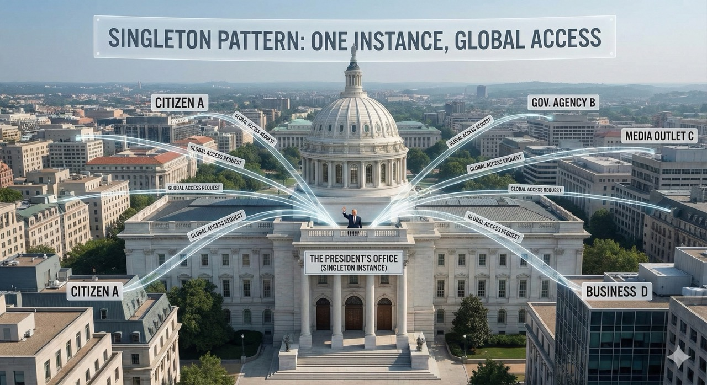

---

# Singleton - CampusPal Example

<div class="columns">

<div>

### AuthService Implementation

```typescript
class AuthService {
  private static instance: AuthService;
  private currentUser: User | null = null;
  private token: string | null = null;

  public static getInstance(): AuthService {
    if (!AuthService.instance) {
      AuthService.instance = new AuthService();
    }
    return AuthService.instance;
  }

  public async login(email: string, password: string) {
    // Login logic
    const user = await api.login(email, password);
    this.currentUser = user;
    this.token = user.token;
  }

  public isAuthenticated(): boolean {
    return this.token !== null;
  }
}
```

</div>

<div>

### Using the Singleton

```typescript
// Anywhere in the app:
const auth = AuthService.getInstance();

if (auth.isAuthenticated()) {
  // Show user dashboard
  console.log("User is logged in");
} else {
  // Redirect to login
  window.location.href = '/login';
}
```

</div>

</div>

---

# 2. Factory Method Pattern

**Define an interface for creating an object, but let subclasses decide which class to instantiate**

<div class="columns">

<div>

### The Problem:

You need to create objects but don't know the exact type until runtime:
- Different types of notifications (email, SMS, push)
- Different payment methods (credit card, PayPal, crypto)
- Different document formats (PDF, Word, HTML)

**Direct instantiation:**
```javascript
// ❌ Tight coupling
if (type === 'email') {
  notification = new EmailNotification();
} else if (type === 'sms') {
  notification = new SMSNotification();
}
```

</div>

<div>

### The Solution:

Let a factory method create the object:
1. Method gets the payload
2. It decides which type to generate/call
3. Others call Factory, not the sub methods

**Open/Closed:** Add new types without modifying existing code!

</div>

</div>

---

# Factory Pattern

<style scoped>
p {text-align: center; font-size: 24px; font-style: italic}
h1 {text-align: center}
</style>

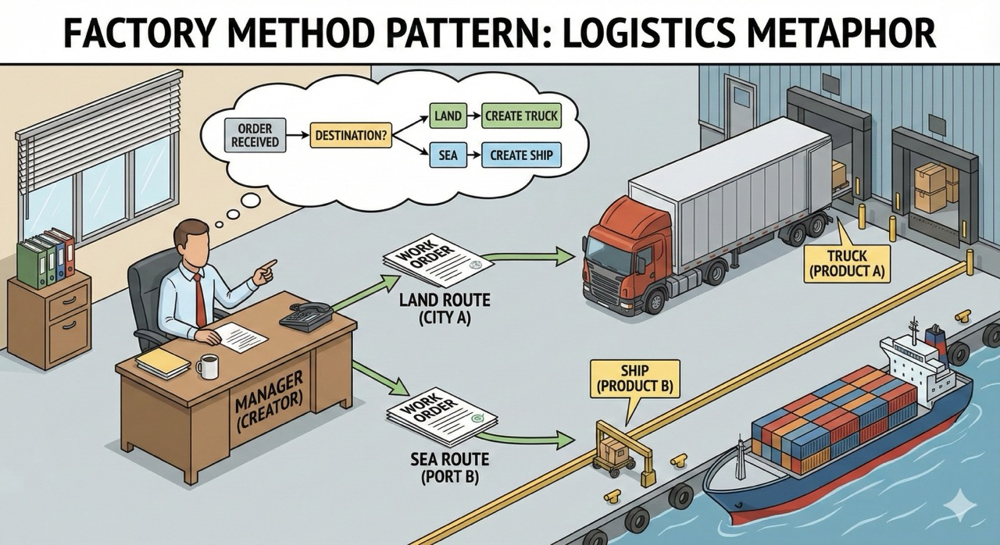

---

# Factory Method - CampusPal Example

### Notification System

<div class="columns">

<div>

**The Scenario:**

CampusPal sends notifications when:
- Event registration confirmed
- Event reminder (10 mins before)
- New marketplace item matching interests
- Someone comments on your post

**Different users prefer different channels:**
- Email (default)
- SMS 
- Push notifications (mobile app)
- In-app notifications

</div>

<div>

### Factory Code

```typescript
// Factory creates the right notification
class NotificationFactory {
  static createForUser(user: User): Notification {
    if (user.hasApp && user.preferences.push) {
      return new PushNotification(user.deviceToken);
    } else if (user.isPremium && user.preferences.sms) {
      return new SMSNotification(user.phone);
    } else {
      return new EmailNotification(user.email);
    }
  }
}

// Usage in event registration
async function registerForEvent(user: User, event: Event) {
  // Register user
  await db.registrations.create({ userId: user.id, eventId: event.id });
  
  // Send notification (don't care which type!)
  const notification = NotificationFactory.createForUser(user);
  notification.send(`You're registered for ${event.title}!`);
}
```

</div>

</div>

---

# 3. Abstract Factory Pattern

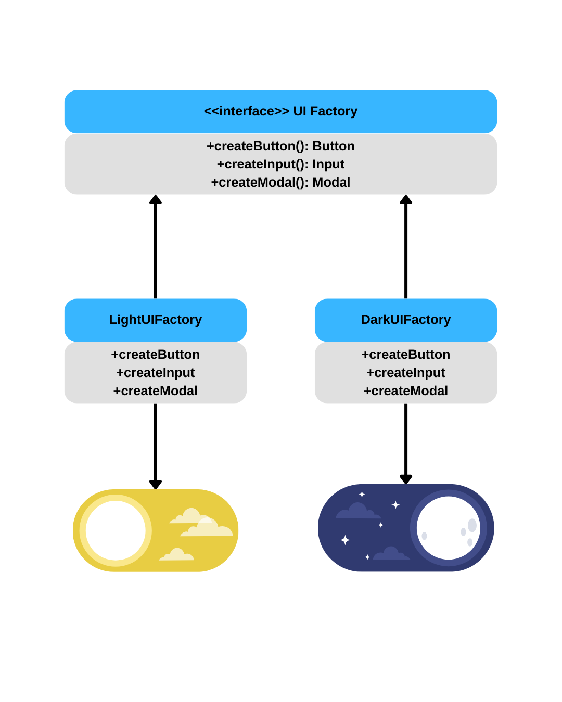

**Provide an interface for creating families of related or dependent objects without specifying their concrete classes.**

### The Problem:

You need to create **sets of related objects** that work together:
- UI components for different platforms (iOS, Android, Web)
- Database drivers (MySQL, PostgreSQL, MongoDB)
- Theme systems (Light theme, Dark theme)

**Example:** Light theme needs light buttons, light inputs, light modals.

### Factory Method vs Abstract Factory:

**Factory Method:** Creates one type of object
**Abstract Factory:** Creates families of related objects

---

# Abstract Factory Pattern

<style scoped>
p {text-align: center; font-size: 24px; font-style: italic}
h1 {text-align: center}
</style>

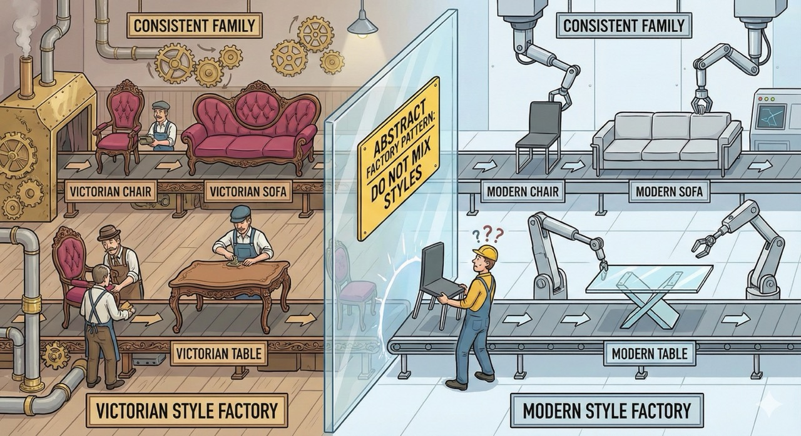

---

# Abstract Factory: Implementation (Products)

<div class="columns">

<div>

### Abstract Products

```typescript
interface Button {
  render(): void;
}

interface Input {
  render(): void;
}
```

</div>

<div>

### Concrete Products

```typescript
class LightButton implements Button {
  render() { console.log('Light Button'); }
}

class LightInput implements Input {
  render() { console.log('Light Input'); }
}

class DarkButton implements Button {
  render() { console.log('Dark Button'); }
}

class DarkInput implements Input {
  render() { console.log('Dark Input'); }
}
```

</div>

</div>

---

# Abstract Factory: Implementation (Factories)

<div class="columns">

<div>

```typescript
interface UIFactory {
  createButton(): Button;
  createInput(): Input;
}

class LightUIFactory implements UIFactory {
  createButton(): Button { return new LightButton(); }
  createInput(): Input { return new LightInput(); }
}

class DarkUIFactory implements UIFactory {
  createButton(): Button { return new DarkButton(); }
  createInput(): Input { return new DarkInput(); }
  }
```
  
</div>

<div>

```typescript
// Usage
function renderUI(factory: UIFactory) {
  const btn = factory.createButton();
  const inp = factory.createInput();
  btn.render();
  inp.render();
}

const theme = 'dark';
const factory = theme === 'dark' 
  ? new DarkUIFactory() 
  : new LightUIFactory();
  
renderUI(factory);
```

</div>

</div>

---

# 4. Builder Pattern

**Separate the construction of a complex object from its representation, allowing the same construction process to create different representations**

<div class="columns">

<div>

### The Problem

Creating complex objects with many optional parameters:
```javascript
new Event( 'title',  'description', '2024-12-10', '18:00', 
'location', 100, true,  ['tag1'],  null, false
);
// What does each parameter mean?
```

**Issues:**
- Hard to read
- Easy to make mistakes
- Can't skip optional parameters
- Order matters

</div>

<div>

### The Solution

```typescript
const event = new EventBuilder()
  .setTitle('Tech Talk: AI in Education')
  .setDescription('Learn about AI...')
  .setDate('2024-12-10')
  .setTime('18:00')
  .setLocation('Room 101')
  .setCapacity(100)
  .addTag('technology')
  .addTag('AI')
  .setRequiresRegistration(true)
  .build();
```

</div>

</div>

---

# Builder Pattern

<style scoped>
p {text-align: center; font-size: 24px; font-style: italic}
h1 {text-align: center}
</style>

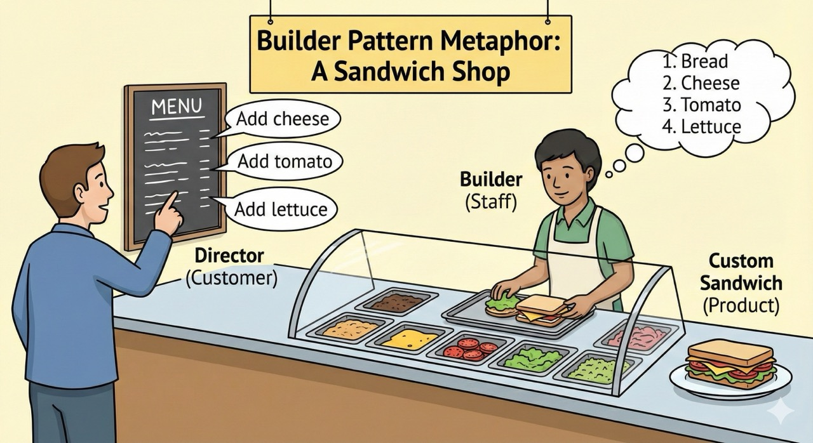

---

# Builder Pattern - Implementation

<div class="columns">

<div>

```typescript
class Event {
  constructor(
    public title: string,
    public description: string,
    public date: string,
    // ... other fields
  ) {}
}

class EventBuilder {
  private title: string = '';
  // ... other fields

  setTitle(title: string): EventBuilder {
    this.title = title;
    return this;
  }

  // ... other setters
```

</div>

<div>

```typescript
  setTime(time: string): EventBuilder {
    this.time = time;
    return this;
  }

  addTag(tag: string): EventBuilder {
    this.tags.push(tag);
    return this;
  }

  build(): Event {
    // Validation
    if (!this.title || !this.date || !this.time) {
      throw new Error('Title, date, and time are required');
    }
    
    return new Event(
      this.title,
      this.description,
      this.date,
      // ...
    );
  }
}
```

</div>

</div>

---


# 5. Prototype Pattern

**Create new objects by copying an existing object (the prototype) rather than creating from scratch**

<div class="columns">

<div>

### The Problem

- Creating an object is expensive (database query, API call)
- Object has complex initial state
- Need many similar objects with slight variations

**Example: Event Templates**
```javascript
// Creating from scratch each time
const event1 = {
  organizerId: 123,
  category: 'workshop',
  requiresRegistration: true,
  capacity: 50,
  tags: ['education', 'workshop'],
  settings: { emailReminder: true, ... }
};

const event2 = { /* copy all above */ };
```

</div>

<div>

### The Solution

```typescript
class Event {
  constructor(/* ... */) {}
  
  clone(): Event {
    return Object.assign(
      Object.create(Object.getPrototypeOf(this)),
      this
    );
  }
}

const workshopTemplate = new Event({
  category: 'workshop',
  capacity: 50,
  requiresRegistration: true,
  tags: ['education', 'workshop']
});

const aiWorkshop = workshopTemplate.clone();
aiWorkshop.title = 'AI Workshop';
aiWorkshop.date = '2024-12-10';
```

</div>

</div>

---

# Prototype Pattern

<style scoped>
p {text-align: center; font-size: 24px; font-style: italic}
h1 {text-align: center}
</style>

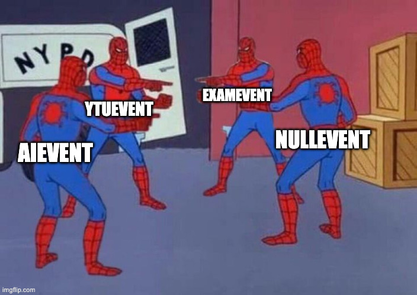

---


# Prototype Pattern - Implementation


<div class="columns">

<div>

### JavaScript/TypeScript

```typescript
interface Cloneable {
  clone(): this;
}

class Event implements Cloneable {
  constructor(
    public title: string = '',
    public category: string = '',
    public capacity: number = 0,
    public tags: string[] = [],
    public settings: EventSettings = new EventSettings()
  ) {}

  clone(): Event {
    // Shallow copy
    return new Event(
      this.title,
      this.category,
      this.capacity,
      [...this.tags],  // Copy array
      { ...this.settings }  // Copy object
    );
  }
}

// Usage
const workshopTemplate = new Event('', 'workshop', 50, ['education']);
const myWorkshop = workshopTemplate.clone();
myWorkshop.title = 'React Workshop';
```

</div>

<div>

### Key Concepts

1. **Clone Method**: Creates an exact copy of the object.
2. **Deep vs Shallow Copy**: 
   - **Shallow**: Copies values (references for objects).
   - **Deep**: Recursively copies all nested objects.
   
**Performance:** Cloning is often faster than running a complex constructor or database query again.

</div>

</div>

---

# Creational Patterns - Summary

### Quick Reference

| Pattern | Purpose | Use When |
|---------|---------|----------|
| **Singleton** | One instance only | Global state, shared resources |
| **Factory Method** | Create objects without specifying exact class | Type determined at runtime |
| **Abstract Factory** | Create families of related objects | Need consistent sets of objects |
| **Builder** | Construct complex objects step by step | Many optional parameters |
| **Prototype** | Clone existing objects | Object creation is expensive |

---

# Practice - CampusPal Pattern Usage

**Singleton:**


**Factory Method:**


**Abstract Factory:**


**Builder:**


**Prototype:**

---

# Answer - CampusPal Pattern Usage

**Singleton:**
- AuthService (current user)
 
**Factory Method:**
- NotificationFactory (email/SMS/push)

**Abstract Factory:**
- ThemeFactory (light/dark themes)

**Builder:**
- EventBuilder (complex event creation)

**Prototype:**
- EventTemplateManager (event templates)

---

# Three Categories of Patterns: 2. Structural

### Composition and Structure

**Problem:** Systems grow complex when objects are fixed in static relationships.

**Focus:** How classes and objects are composed to form larger structures.

**Goal:** Ensure flexibility in how objects are combined, allowing the structure to grow without collapsing.

<div class="columns">

<div>

**Core Idea:**
Use inheritance to compose interfaces and define ways to compose objects to obtain new functionality.

</div>

<div>

**Patterns We'll Cover:**
1. **Adapter:** Bridge incompatible interfaces
2. **Decorator:** Add behaviors dynamically
3. **Facade:** Simplify complex interfaces
4. **Proxy:** Control access to objects
5. **Composite:** Tree structures

</div>

</div>

---

# Part 2: Structural Patterns

### How Do We Compose Objects?

**The Problem:**
- Classes and objects need to work together
- Need to adapt incompatible interfaces
- Want to add functionality without changing existing code
- Need to hide complexity

**The Solution: Structural Patterns**

These patterns help you compose objects and classes into larger structures while keeping them flexible and efficient.

---

# 1. Adapter Pattern

**Convert the interface of a class into another interface that clients expect. Adapter lets classes work together that couldn't otherwise because of incompatible interfaces.**

<div class="columns">

<div>

### The Problem:

You have two incompatible interfaces:
- Legacy code with old interface
- Third-party library with different interface
- External API that doesn't match your system

**Example:**
```typescript
// Your system expects
interface PaymentProcessor {
  processPayment(amount: number): Promise<void>;
}

// But Stripe has
class StripeAPI {
  charge(amountInCents: number, currency: string): Promise<void> {}
}

```

</div>

<div>

### The Solution:

Create an adapter that translates translates calls

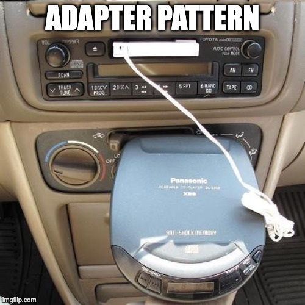

</div>

</div>

---

# Adapter Pattern - Implementation

<div class="columns">

<div>

```typescript
// Target interface (what client expects)
interface PaymentProcessor {
  processPayment(amount: number): Promise<void>;
}

// Adaptee (third-party with different interface)
class StripeAPI {
  charge(amountInCents: number, currency: string): Promise<void> {
    console.log(`Charging ${amountInCents} cents in ${currency}`);
    return Promise.resolve();
  }
}

// Adapter
class StripeAdapter implements PaymentProcessor {
  private stripe: StripeAPI;
  
  constructor() {
    this.stripe = new StripeAPI();
  }
  
  async processPayment(amount: number): Promise<void> {
    // Adapt the interface:
    // Convert dollars to cents
    const amountInCents = Math.round(amount * 100);
    // Add default currency
    await this.stripe.charge(amountInCents, 'USD');
  }
}
```

</div>

<div>

```typescript
// Client code doesn't know about Stripe
class CheckoutService {
  constructor(private paymentProcessor: PaymentProcessor) {}
  
  async checkout(cart: Cart) {
    const total = cart.getTotal();
    await this.paymentProcessor.processPayment(total);
  }
}

// Usage
const stripeAdapter = new StripeAdapter();
const checkout = new CheckoutService(stripeAdapter);
await checkout.checkout(myCart);

// Easy to swap payment providers
class PayPalAdapter implements PaymentProcessor {
  async processPayment(amount: number): Promise<void> {
    // Adapt PayPal API
  }
}

const paypalAdapter = new PayPalAdapter();
const checkout2 = new CheckoutService(paypalAdapter);
```

</div>

</div>

---

# 2. Decorator Pattern

**Attach additional responsibilities to an object dynamically. Decorators provide a flexible alternative to subclassing for extending functionality.**

<div class="columns">

<div>

### The Problem:

Need to add features but:
- Inheritance is too rigid
- Want to combine features flexibly
- Don't want to modify existing code

**Bad approach:**
```typescript
class Notification {}
class EmailNotification extends Notification {}
class SMSNotification extends Notification {}
class EmailSMSNotification extends Notification {}
class EmailWithAttachment extends Notification {}
class SMSWithAttachment extends Notification {}
// Explosion of classes
```

</div>

<div>

### The Solution:

Wrap objects with decorators and stack decorators like layers

</div>

</div>

---

# Decorator Pattern

<style scoped>
p {text-align: center; font-size: 24px; font-style: italic}
h1 {text-align: center}
</style>

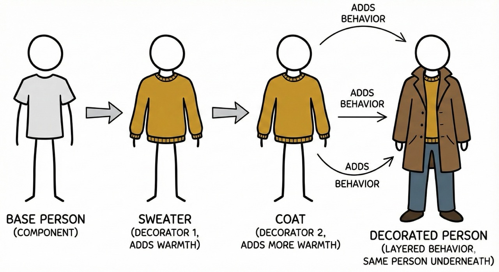

---


# Decorator Pattern - Implementation

<div class="columns">

<div>

```typescript
// Component interface
interface Notification {
  send(message: string): void;
  getCost(): number;
}

// Concrete component
class BasicNotification implements Notification {
  send(message: string) {
    console.log(`Basic notification: ${message}`);
  }
  
  getCost(): number {
    return 0; // Free
  }
}

// Base decorator
abstract class NotificationDecorator implements Notification {
  constructor(protected notification: Notification) {}
  
  send(message: string) {
    this.notification.send(message);
  }
  
  getCost(): number {
    return this.notification.getCost();
  }
}
```

</div>

<div>

```typescript
// Concrete decorators
class EmailDecorator extends NotificationDecorator {
  send(message: string) {
    super.send(message);
    console.log(`  + Sending email: ${message}`);
  }
  
  getCost(): number {
    return super.getCost() + 0.10; // $0.10 per emai
  }
}

class SMSDecorator extends NotificationDecorator {
  send(message: string) {
    super.send(message);
    console.log(`  + Sending SMS: ${message}`);
  }
  
  getCost(): number {
    return super.getCost() + 0.50; // $0.50 per SMS
  }
}

// Usage - Stack decorators!
let notification: Notification = new BasicNotification();
notification = new EmailDecorator(notification);
notification = new SMSDecorator(notification);

notification.send('Event reminder');
//   Basic notification: Event reminder
//   + Sending email: Event reminder
//   + Sending SMS: Event reminder

console.log(`Cost: $${notification.getCost()}`); // $0.60
```

</div>

</div>

---

# 3. Facade Pattern

**Provide a unified, simplified interface to a set of interfaces in a subsystem. Facade makes the subsystem easier to use.**

<div class="columns">

<div>

### The Problem:

Complex subsystems with many classes
- Hard to understand
- Many steps required
- Clients need to know internal details

### The Solution:

Hide complexity behind simple interface, simple on outside, complex inside.
* Provide simple endpoints
* Let complex logic stay hidden


</div>

<div>

### Example: Payment processing
```typescript
const validator = new CardValidator();
const processor = new PaymentProcessor();
const logger = new TransactionLogger();
const notifier = new EmailNotifier();
const inventory = new InventoryManager();

if (validator.validate(card)) {
  const result = await processor.process(payment);
  await logger.log(result);
  await notifier.notify(user, result);
  await inventory.update(order);
}
```

</div>

</div>

---

# Facade Pattern

<style scoped>
p {text-align: center; font-size: 24px; font-style: italic}
h1 {text-align: center}
</style>

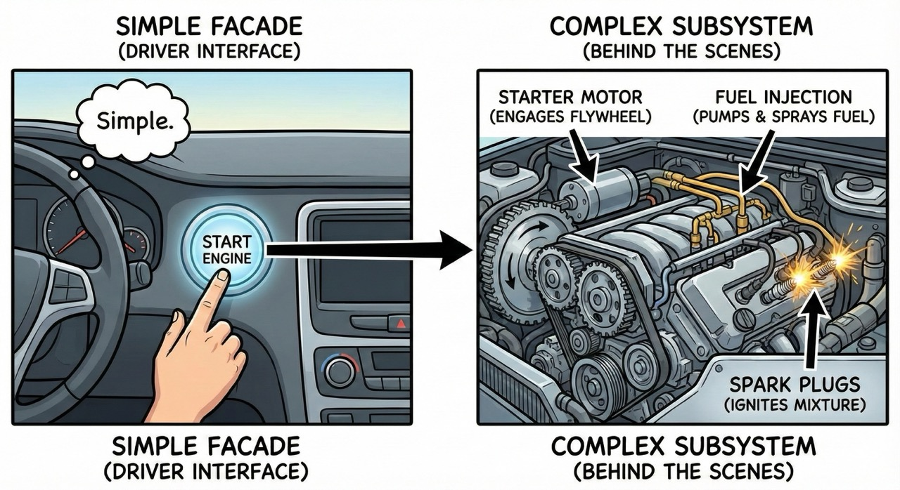

---


# Facade Pattern: Implementation (Subsystem)

<div class="columns">

<div>

### Complex Subsystem

```typescript
class InventoryService {
  checkStock(id: string): boolean { return true; }
  reserveItem(id: string): void { /*...*/ }
}

class PaymentService {
  process(amount: number): boolean { return true; }
}

class ShippingService {
  createShipment(order: Order): string { return 'TRACK-123'; }
}

class NotificationService {
  sendConfirmation(email: string): void { /*...*/ }
}
```

</div>

<div>

### The Facade Class

```typescript
class OrderFacade {
  private inventory = new InventoryService();
  private payment = new PaymentService();
  private shipping = new ShippingService();
  private notification = new NotificationService();
  
  async placeOrder(user: User, cart: Cart): Promise<boolean> {
    if (!this.inventory.checkStock(cart.itemId)) return false;
    
    this.inventory.reserveItem(cart.itemId);
    if (!this.payment.process(cart.total)) return false;
    
    const tracking = this.shipping.createShipment(cart);
    this.notification.sendConfirmation(user.email);
    
    return true;
  }
}
```

</div>

</div>

---

# Facade Pattern: Implementation (Usage)

```typescript
// Without Facade (Complex Client)
const inventory = new InventoryService();
const payment = new PaymentService();
// ... init others
if (inventory.checkStock(item)) {
  inventory.reserveItem(item);
  payment.process(amount);
  // ... maintain order of operations manually
}

// With Facade (Simple Client)
const orderFacade = new OrderFacade();
const success = await orderFacade.placeOrder(user, cart);

if (success) {
  console.log('Order placed successfully!');
}
```

---

# 4. Proxy Pattern

**Provide a surrogate or placeholder for another object to control access to it.**

### The Problem:

Want to control access to an object:
- Lazy loading (create only when needed)
- Access control (check permissions)
- Logging/caching (add behavior)
- Remote access (object in different process)

### Types of Proxies:

**Virtual Proxy:** Delay creation until needed
**Protection Proxy:** Control access
**Remote Proxy:** Represent object in different address space
**Caching Proxy:** Cache results

---

# Proxy Pattern

<style scoped>
p {text-align: center; font-size: 24px; font-style: italic}
h1 {text-align: center}
</style>

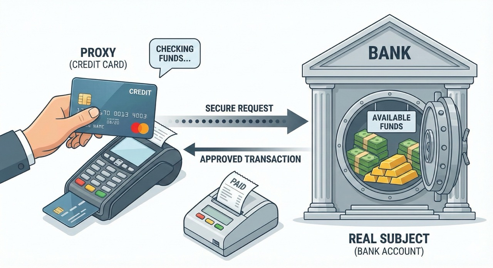

---

# Proxy - CampusPal Example (Proxy Class)

```typescript
// Interface
interface EventImage {
  load(): Promise<string>; // Returns image URL
}

class RealEventImage implements EventImage {
  constructor(private id: string) {}
  
  async load(): Promise<string> {
    // Expensive API call
    const res = await fetch(`/api/images/${this.id}`);
    return (await res.json()).url;
  }
}

// Caching Proxy
class CachedImageProxy implements EventImage {
  private cachedUrl: string | null = null;
  private realImage: RealEventImage;
  
  constructor(id: string) {
    this.realImage = new RealEventImage(id);
  }
  
  async load(): Promise<string> {
    if (this.cachedUrl) return this.cachedUrl;
    
    this.cachedUrl = await this.realImage.load();
    return this.cachedUrl;
  }
}
```

---

# Proxy - CampusPal Example (Usage)

```typescript
// Usage in event gallery component
class EventGallery {
  private images: EventImage[] = [];
  
  constructor(imageIds: string[]) {
    // Create proxies (cheap operations)
    this.images = imageIds.map(id => new CachedImageProxy(id));
  }
  
  async onUserClick(index: number) {
    // Load only when needed
    const url = await this.images[index].load();
    
    // Second click returns cached URL instantly
    this.display(url);
  }
  
  private display(url: string) { /*...*/ }
}
```

**Benefits:** Images load only when needed, cached after first load

---

# Structural Patterns - Summary

### Quick Reference

| Pattern | Purpose | Use When |
|---------|---------|----------|
| **Adapter** | Convert interface | Integrate incompatible interfaces |
| **Decorator** | Add responsibilities dynamically | Extend functionality without subclassing |
| **Facade** | Simplify complex system | Need simple interface to complex subsystem |
| **Proxy** | Control access | Need lazy loading, caching, access control |

---

# Practice - CampusPal Pattern Usage

**Adapter:**

**Decorator:**

**Facade:**

**Proxy:**

---

# Answer - CampusPal Pattern Usage

**Adapter:**
- GoogleCalendarAdapter (external APIs)
- StripeAdapter, PayPalAdapter (payment)

**Decorator:**
- Notification enhancements (logging, retry, priority)
- Image filters

**Facade:**
- EventRegistrationFacade (simplify complex flow)
- CheckoutFacade

**Proxy:**
- CachedImageProxy (lazy loading + caching)
- VirtualEventProxy (performance)

---

# Three Categories of Patterns: 3. Behavioral

### Communication and Responsibility

**Problem:** Tightly coupled communication makes it hard to change how objects interact.

**Focus:** Algorithms and the assignment of responsibilities between objects.

**Goal:** flexible and maintainable communication patterns.

<div class="columns">

<div>

**Core Idea:**
Characterize complex control flow that's difficult to follow at run-time. shifting your focus away from flow of control to let you concentrate just on the way objects are interconnected.

</div>

<div>

**Patterns We'll Cover:**
1. **Observer:** Event subscriptions
2. **Strategy:** Interchangeable algorithms
3. **Template Method:** Workflow skeletons
4. **Command:** Encapsulated requests
5. **State:** State-dependent behavior
6. **Iterator:** Sequential access
7. **Chain of Responsibility:** Request passing

</div>

</div>

---


# Part 3: Behavioral Patterns

### How Do Objects Communicate?

**The Problem:**
- Objects need to interact and collaborate
- Responsibilities need to be distributed
- Algorithms need to vary independently
- Need flexible communication patterns

**The Solution: Behavioral Patterns**

These patterns define how objects communicate, assign responsibilities, and vary algorithms independently of the clients that use them.

---

# 1. Observer Pattern

**Define a one-to-many dependency between objects so that when one object changes state, all its dependents are notified and updated automatically.**

<div class="columns">

<div>

### The Problem:

Need to notify multiple objects when something changes:
- User subscribes to event notifications
- UI components react to data changes
- Multiple listeners for system events

**Bad approach:**
```typescript
class Event {
  notifyUsers() {
    emailService.send(/*...*/);
    smsService.send(/*...*/);
    pushService.send(/*...*/);
    // Tight coupling!
  }
}
```

</div>

<div>

### The Solution:

Observers subscribe to subject (similar to event-driven architecture)


</div>

</div>

---

# Observer Pattern

<style scoped>
p {text-align: center; font-size: 24px; font-style: italic}
h1 {text-align: center}
</style>

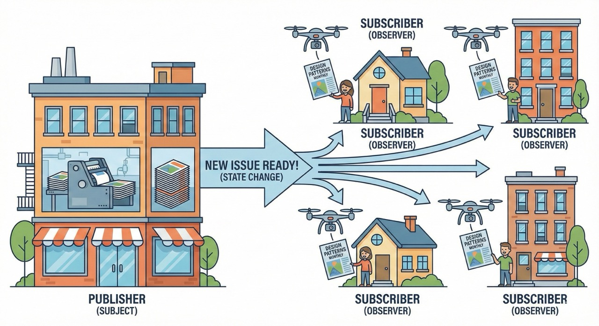

---


# Observer Pattern - Implementation (Subject)

<div class="columns">

<div>

```typescript
// Observer interface
interface Observer {
  update(data: any): void;
}

// Subject (Observable)
class EventPublisher {
  private observers: Observer[] = [];
  
  subscribe(observer: Observer): void {
    this.observers.push(observer);
  }
  
  unsubscribe(observer: Observer): void {
    const index = this.observers.indexOf(observer);
    if (index > -1) {
      this.observers.splice(index, 1);
    }
  }
  
  notify(data: any): void {
    this.observers.forEach(observer => 
      observer.update(data)
    );
  }
  
  publishEvent(event: Event): void {
    console.log(`Publishing event: ${event.title}`);
    this.notify(event);
  }
}
```

</div>

<div>

### Key Parts

1. **Subject**: Maintains list of observers.
2. **Observer Interface**: Defines update method.
3. **Notify Loop**: Iterates and calls update on all subscribers.

</div>

</div>

---

# Observer Pattern - Implementation (Usage)

<div class="columns">

<div>

```typescript
// Concrete observers
class EmailObserver implements Observer {
  update(event: Event): void {
    console.log(`Sending email about: ${event.title}`);
  }
}

class SMSObserver implements Observer {
  update(event: Event): void {
    console.log(`Sending SMS about: ${event.title}`);
  }
}

class LogObserver implements Observer {
  update(event: Event): void {
    console.log(`Logging event: ${event.title}`);
  }
}
```

</div>

<div>

```typescript
// Usage
const publisher = new EventPublisher();

const emailObs = new EmailObserver();
const smsObs = new SMSObserver();
const logObs = new LogObserver();

publisher.subscribe(emailObs);
publisher.subscribe(smsObs);
publisher.subscribe(logObs);

publisher.publishEvent({ 
  title: 'Tech Workshop',
  date: '2024-12-10'
});
// All observers notified!

// Can unsubscribe
publisher.unsubscribe(smsObs);
```

</div>

</div>

---

# 2. Strategy Pattern

**Define a family of algorithms, encapsulate each one, and make them interchangeable. Strategy lets the algorithm vary independently from clients that use it.**

<div class="columns">

<div>

### The Problem

Different ways to do the same thing:
- Multiple sorting algorithms
- Different payment methods
- Various compression algorithms

```typescript
class PaymentProcessor {
  process(method: string, amount: number) {
    if (method === 'credit') {
      // Credit card logic
    } else if (method === 'paypal') {
      // PayPal logic
    } else if (method === 'crypto') {
      // Crypto logic
    }
    // Violates Open/Closed! (How to add the new payment method?)
  }
}
```

</div>

<div>

### The Solution

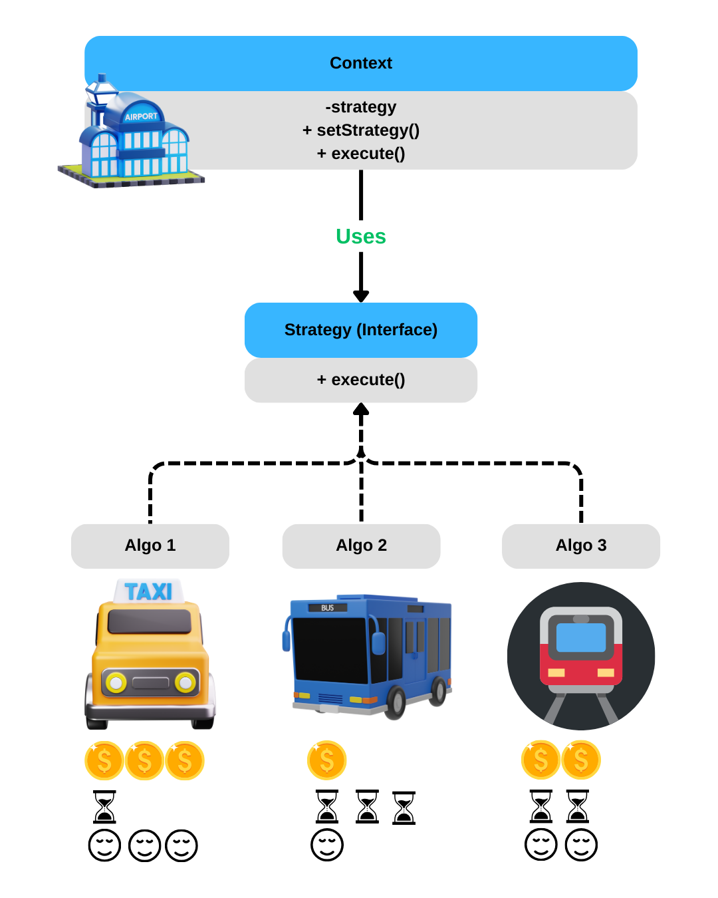

</div>

</div>

---

# Strategy - CampusPal Example (Strategies)

### Event Sorting Strategies

```typescript
interface SortStrategy {
  sort(events: Event[]): Event[];
}

class SortByDate implements SortStrategy {
  sort(events: Event[]): Event[] {
    return [...events].sort((a, b) => 
      new Date(a.date).getTime() - new Date(b.date).getTime()
    );
  }
}

class SortByPopularity implements SortStrategy {
  sort(events: Event[]): Event[] {
    return [...events].sort((a, b) => b.registrationCount - a.registrationCount);
  }
}

class SortByRelevance implements SortStrategy {
  constructor(private user: User) {}
  sort(events: Event[]): Event[] {
    return [...events].sort((a, b) => this.score(b) - this.score(a));
  }
  private score(e: Event) { return /* calculation */ 0; }
}
```

---

# Strategy - CampusPal Example (Context & Usage)

```typescript
// Context
class EventList {
  constructor(
    private events: Event[],
    private sortStrategy: SortStrategy
  ) {}
  
  setSortStrategy(strategy: SortStrategy): void {
    this.sortStrategy = strategy;
  }
  
  display(): Event[] {
    return this.sortStrategy.sort(this.events);
  }
}

// Usage
const eventList = new EventList(events, new SortByDate());

// User clicks "Sort by popularity"
eventList.setSortStrategy(new SortByPopularity());
console.log(eventList.display());

// User clicks "Recommended for you"
eventList.setSortStrategy(new SortByRelevance(currentUser));
console.log(eventList.display());
```

---

# 3. Template Method Pattern

**Define the skeleton of an algorithm in a method, leaving some steps to subclasses. Template Method lets subclasses redefine certain steps without changing the algorithm's structure.**

### The Problem:

Similar workflows with slight variations:
- Data processing pipeline (different sources)
- Report generation (different formats)
- ML training (similar steps, different logic)
- Game AI (different behaviors)

**Common structure, different details**

### The Solution:

- Break down algorithm into a series of steps
- Turn these steps into methods
- Put a series of calls to these methods inside a single _template method_

---

# Template Method Pattern

<style scoped>
p {text-align: center; font-size: 24px; font-style: italic}
h1 {text-align: center}
</style>

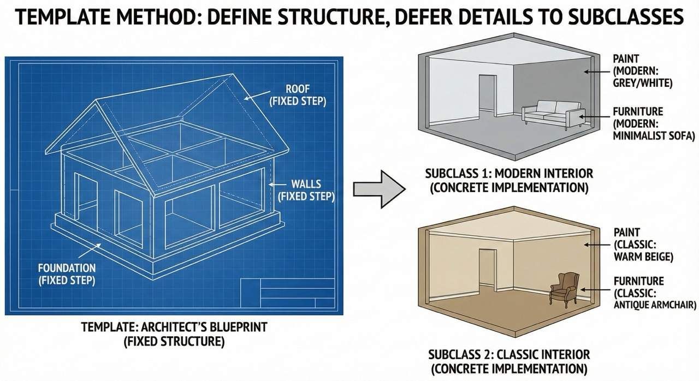


---

# Template Method - CampusPal Example (Abstract Class)

```typescript
abstract class EventRegistrationHandler {
  // Template method - defines the workflow
  async register(user: User, event: Event): Promise<RegistrationResult> {
    try {
      await this.checkEligibility(user, event);
      
      if (event.requiresPayment) {
        await this.processPayment(user, event d);
      }
      
      await this.createRegistration(user, event);
      await this.sendConfirmation(user, event);
      await this.afterRegistration(user, event);
      
      return { success: true };
    } catch (error) {
      return { success: false, error: error.message };
    }
  }
  
  // Abstract methods (Must implement)
  protected abstract checkEligibility(user: User, event: Event): Promise<void>;
  protected abstract sendConfirmation(user: User, event: Event): Promise<void>;
  
  // Common & Hook methods (Optional/Default)
  protected async createRegistration(user: User, event: Event): Promise<void> { /*...*/ }
  protected async processPayment(user: User, event: Event): Promise<void> { /*...*/ }
  protected async afterRegistration(user: User, event: Event): Promise<void> { /*...*/ }
}
```

---

# Template Method - CampusPal Example (Implementation)

```typescript
class WorkshopRegistrationHandler extends EventRegistrationHandler {
  protected async checkEligibility(user: User, event: Event): Promise<void> {
    if (event.prerequisites && !user.hasCompleted(event.prerequisites)) {
      throw new Error('Prerequisites not met');
    }
  }
  
  protected async sendConfirmation(user: User, event: Event): Promise<void> {
    await emailService.send(user.email, 'Workshop Confirmation', {
      materials: event.workshopMaterials
    });
  }
}

class SocialEventRegistrationHandler extends EventRegistrationHandler {
  protected async checkEligibility(user: User, event: Event): Promise<void> {
    if (event.isFull()) throw new Error('Event is full');
  }
  
  protected async sendConfirmation(user: User, event: Event): Promise<void> {
    await notificationService.send(user, `Registered for ${event.title}!`);
  }
}
```

---

# 4. State Pattern

**Allow an object to alter its behavior when its internal state changes. The object will appear to change its class.**

<div class="columns">

<div>

### The Problem:

Object behavior depends on state:
- Order status (pending, shipped, delivered)
- Document status (draft, review, published)
- Connection status (disconnected, connecting, connected)

</div>

<div>

### The Solution:

- Create new classes for all possible states of an object
- Extract all state-specific behaviors into these classes
- The original object stores a reference to state objects and delegates all the state-related work to that object.

**Similar to the Strategy pattern** 
- In the State pattern, states may be aware of each other and initiate transitions from one state to another
- Strategies never know about each other

</div>

</div>

---

# State Pattern

<style scoped>
p {text-align: center; font-size: 24px; font-style: italic}
h1 {text-align: center}
</style>


---

# State Pattern - CampusPal Example (States)

<div class="columns">

<div>

```typescript
// State interface
interface EventState {
  publish(event: Event): void;
  cancel(event: Event): void;
  register(event: Event, user: User): void;
}

// Concrete states
class DraftState implements EventState {
  publish(event: Event): void {
    console.log('Publishing event...');
    event.setState(new PublishedState());
  }
  
  cancel(event: Event): void {
    throw new Error('Cannot cancel draft event');
  }
  // ... register throws error
}
```

</div>

<div>

```typescript
class PublishedState implements EventState {
  publish(event: Event): void { throw new Error('Already published'); }
  
  cancel(event: Event): void {
    console.log('Cancelling event...');
    event.setState(new CancelledState());
  }
  
  register(event: Event, user: User): void {
    if (event.isFull()) {
      event.setState(new FullState());
      throw new Error('Event is full');
    }
    event.addRegistrant(user);
  }
}
```

</div>

</div>

---

# State Pattern - CampusPal Example (Context)

```typescript
// Context
class Event {
  private state: EventState = new DraftState();
  
  setState(state: EventState): void {
    this.state = state;
  }
  
  publish(): void {
    this.state.publish(this);
  }
  
  cancel(): void {
    this.state.cancel(this);
  }
  
  register(user: User): void {
    this.state.register(this, user);
  }
}

// Usage
const event = new Event();
event.publish(); // Draft → Published
event.register(user1); // OK

// ... event becomes full
event.register(user100); // → Added to waitlist (Full state)
event.cancel(); // Published → Cancelled
```

---

# 5. Command Pattern

**Encapsulate a request as an object, thereby letting you parameterize clients with different requests, queue or log requests, and support undoable operations.**

<div class="columns">

<div>

### The Problem

A GUI object calls a method of a business logic object, passing it some arguments. 
- Each method is another call (save, undo, redo, etc.)
- Coupling between GUI and business logic layers 

### The Solution
* Extract all of the request details into a separate command class with a single method that triggers this request
* Make your commands implement the same interface
* Commands become a convenient middle layer that reduces coupling between the GUI and business logic layers

</div>

<div>

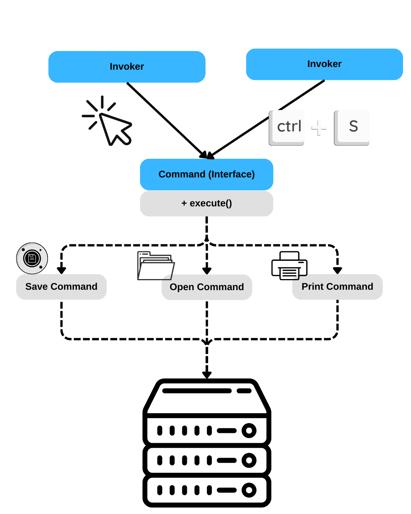

</div>

</div>

---

# Command Pattern - Implementation (Commands)

```typescript
// Command interface
interface Command {
  execute(): void;
  undo(): void;
}

// Concrete command
class EditDescriptionCommand implements Command {
  constructor(
    private editor: EventEditor,
    private textToAppend: string
  ) {}
  
  execute(): void {
    this.editor.append(this.textToAppend);
  }
  
  undo(): void {
    this.editor.delete(this.textToAppend.length);
  }
}
```

---

# Command Pattern - Implementation (Invoker & Usage)

<div class="columns">

<div>

```typescript
// Invoker
class CommandManager {
  private history: Command[] = [];
  
  execute(command: Command): void {
    command.execute();
    this.history.push(command);
  }
  
  undo(): void {
    const command = this.history.pop();
    if (command) {
      command.undo();
    }
  }
}
```

</div>

<div>

```typescript
// Usage
const editor = new EventEditor();
const manager = new CommandManager();

manager.execute(
  new EditDescriptionCommand(editor, 'Join us')
);
manager.execute(
  new EditDescriptionCommand(editor, ' today!')
);
// Description: "Join us today!"

manager.undo(); 
// Description: "Join us"
```

</div>

</div>


---


# Behavioral Patterns - Summary


| Pattern | Purpose | Use When |
|---------|---------|----------|
| **Observer** | 1-to-many dependency | Multiple objects need updates |
| **Strategy** | Interchangeable algorithms | Algorithm varies at runtime |
| **Template Method** | Workflow skeleton | Similar workflows, different details |
| **Command** | Encapsulate requests | Need undo/redo, queuing, logging |
| **State** | Behavior changes with state | Object behavior depends on state |

---

# Practice - CampusPal Pattern Usage

**Observer:**

**Strategy:**

**Template Method:**

**State:**

**Command:**

---

# Answer - CampusPal Pattern Usage

**Observer:**
- Event updates notify subscribers
- Real-time notifications

**Strategy:**
- Sorting algorithms (date, popularity, relevance)
- Search algorithms

**Template Method:**
- Registration workflows (workshop, social, academic)
- Data export (CSV, JSON, PDF)

**State:**
- Event lifecycle (draft → published → full → cancelled)
- User session states

**Command:**
- Undo/redo in event editor
- Request queuing

---

# Pattern Relationships and Combinations

**In real systems, you rarely use just one pattern.**

Patterns combine to solve complex problems:
- Factory + Singleton
- Decorator + Strategy
- Facade + Factory
- Observer + Command

Let's look at common combinations...

---

# Common Pattern Combinations 

### Factory + Singleton

Need to create objects of different types, but each type should have only one instance.

**Use case:** Resource-heavy objects that you want to reuse (e.g., Service classes).

### Factory + Strategy

Create the right strategy based on runtime conditions.

**Use case:** Dynamic strategy selection based on user input or config.

---

# CampusPal Architecture with Multiple Patterns

<div class="columns">

<div>

```typescript
// 1. Singleton Container
const container = AppContainer.getInstance();

// 2. Facade for complexity
const eventService = container.createEventService();

// 3. Observer for updates
eventService.subscribe(new NotificationSender());

// 4. Command for actions
const cmdManager = new CommandManager();
cmdManager.execute(new CreateEventCommand(eventData));

// 5. State for lifecycle
const event = new Event();
event.setState(new DraftState());
event.publish(); 
```

</div>

<div>

**Patterns working together:**
- **Singleton** manages global resources
- **Factory** creates services
- **Facade** simplifies API
- **Observer** handles reactivity
- **Command** enables undo/redo
- **State** manages lifecycle

</div>

</div>

---

# Patterns in Real Frameworks

<div class="columns">

<div>

### React

**Component Pattern:** Composite
- Components contain other components

**Hooks (useState, useEffect):** Observer
- State changes trigger re-renders

**Context API:** Singleton + Provider
- Global state management

**Higher-Order Components:** Decorator
- Add behavior to components

**Render Props:** Strategy
- Inject rendering logic

</div>

<div>

### Express.js

**Middleware:** Chain of Responsibility
- Request passes through handlers

**Router:** Facade
- Simplifies route management

**Error Handlers:** Template Method
- Standard error handling flow

### Other Frameworks

**Django/Rails:** MVC (obviously!)
**Redux:** Command (actions) + Observer (subscribers)
**Angular:** Dependency Injection built-in
**Vue:** Observer (reactivity system)

</div>

</div>

---

# Summary: All 23 Patterns

<div class="columns">

<div>

### Creational (5)
1. ✅ **Singleton** - One instance
2. ✅ **Factory Method** - Create without specifying class
3. ✅ **Abstract Factory** - Families of objects
4. ✅ **Builder** - Complex construction
5. ✅ **Prototype** - Clone objects

### Structural (7)
1. ✅ **Adapter** - Convert interfaces
2. ✅ **Decorator** - Add responsibilities
3. ✅ **Facade** - Simplify subsystem
4. ✅ **Proxy** - Control access
5. Composite - Tree structures
6. Bridge - Decouple abstraction
7. Flyweight - Share objects

</div>

<div>

### Behavioral (11)
1. ✅ **Observer** - 1-to-many notifications
2. ✅ **Strategy** - Interchangeable algorithms
3. ✅ **Template Method** - Workflow skeleton
4. ✅ **Command** - Encapsulate requests
5. ✅ **State** - Behavior changes with state
6. ✅ **Iterator** - Sequential access
7. ✅ **Chain of Responsibility** - Handler chain
8. Mediator - Centralize communication
9. Memento - Save/restore state
10. Visitor - Add operations to objects
11. Interpreter - Language grammar

**We covered the most important 16!**

</div>

</div>

---

<!-- _footer: "" -->
<!-- _header: "" -->
<!-- _paginate: false -->

<style scoped>
p { text-align: center}
h1 {text-align: center; font-size: 72px}
</style>

# Team Progress Reports 

---

<!-- _class: lead -->
# Thank You!

## Contact Information

- **Email:** ekrem.cetinkaya@yildiz.edu.tr
- **Office Hours:** Tuesday 14:00-16:00 - Room F-B21
- **Book a slot before coming:** [Booking Link](https://calendar.app.google/aBKvBqNAqG12oD2B9)
- **Course Repository:** [GitHub](https://github.com/ekremcet/yzm2021-principles-of-software-engineering)

## Recommended read
Design Patterns - https://refactoring.guru/design-patterns
